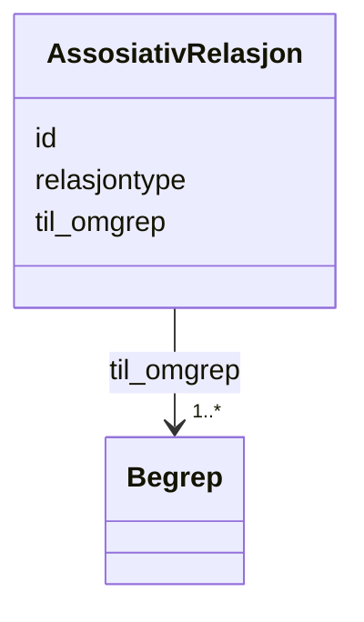

# Class: AssosiativRelasjon 


_Ein assosiativ relasjon mellom to omgrep._


URI: [skosno:AssociativeConceptRelation](https://data.norge.no/vocabulary/skosno#AssociativeConceptRelation)





<!-- no inheritance hierarchy -->

## Class Properties

| Property | Value |
| --- | --- |
| Class URI | [skosno:AssociativeConceptRelation](https://data.norge.no/vocabulary/skosno#AssociativeConceptRelation) |


## Eigenskapar


  
  

  
  
    
  

  
  
    
  


### Obligatorisk

| Namn | Kardinalitet og domene | Beskriving |
| --- | --- | --- |
| [til_omgrep](til_omgrep.md) | 1..* <br/> [Begrep](begrep.md) | Til-omgrepet i den assosiative relasjonen (skosno:hasToConcept) |
| [relasjontype](relasjontype.md) | 1 <br/> [LangString](langstring.md) | Rolle eller type av den assosiative relasjonen (skosno:relationRole) |


  
  

  
  

  
  


  
  

  
  

  
  


  
  
  
  
    
  

  
  
  
    
      
    
      
    
      
    
  
  

  
  
  
    
      
    
      
    
      
    
  
  


### Andre

| Namn | Kardinalitet og domene | Beskriving |
| --- | --- | --- |
| [id](id.md) | 1 <br/> [Uriorcurie](uriorcurie.md) | URI-identifikator for ressursen |


## Usages

| used by | used in | type | used |
| ---  | --- | --- | --- |
| [Begrep](begrep.md) | [er_fra_omgrep_i](er_fra_omgrep_i.md) | range | [AssosiativRelasjon](assosiativrelasjon.md) |


## Identifier and Mapping Information


### Schema Source


* from schema: https://data.norge.no/linkml/skos-ap-no


## Mappings

| Mapping Type | Mapped Value |
| ---  | ---  |
| self | skosno:AssociativeConceptRelation |
| native | https://data.norge.no/linkml/skos-ap-no/AssosiativRelasjon |


## LinkML Source

<!-- TODO: investigate https://stackoverflow.com/questions/37606292/how-to-create-tabbed-code-blocks-in-mkdocs-or-sphinx -->

### Direct

<details>
```yaml
name: AssosiativRelasjon
description: Ein assosiativ relasjon mellom to omgrep.
from_schema: https://data.norge.no/linkml/skos-ap-no
slots:
- id
- til_omgrep
- relasjontype
slot_usage:
  til_omgrep:
    name: til_omgrep
    in_subset:
    - Obligatorisk
    required: true
  relasjontype:
    name: relasjontype
    in_subset:
    - Obligatorisk
    required: true
class_uri: skosno:AssociativeConceptRelation

```
</details>

### Induced

<details>
```yaml
name: AssosiativRelasjon
description: Ein assosiativ relasjon mellom to omgrep.
from_schema: https://data.norge.no/linkml/skos-ap-no
slot_usage:
  til_omgrep:
    name: til_omgrep
    in_subset:
    - Obligatorisk
    required: true
  relasjontype:
    name: relasjontype
    in_subset:
    - Obligatorisk
    required: true
attributes:
  id:
    name: id
    description: URI-identifikator for ressursen.
    from_schema: https://data.norge.no/linkml/skos-ap-no
    rank: 1000
    identifier: true
    alias: id
    owner: AssosiativRelasjon
    domain_of:
    - Organisasjon
    - VCardKontakt
    - Begrep
    - Definisjon
    - AssosiativRelasjon
    - GeneriskRelasjon
    - PartitivRelasjon
    - Samling
    - Mediatype
    - Konsept
    - Begrepssamling
    range: uriorcurie
    required: true
  til_omgrep:
    name: til_omgrep
    description: Til-omgrepet i den assosiative relasjonen (skosno:hasToConcept).
    in_subset:
    - Obligatorisk
    from_schema: https://data.norge.no/linkml/skos-ap-no
    rank: 1000
    slot_uri: skosno:hasToConcept
    alias: til_omgrep
    owner: AssosiativRelasjon
    domain_of:
    - AssosiativRelasjon
    range: Begrep
    required: true
    multivalued: true
  relasjontype:
    name: relasjontype
    description: Rolle eller type av den assosiative relasjonen (skosno:relationRole).
    in_subset:
    - Obligatorisk
    from_schema: https://data.norge.no/linkml/skos-ap-no
    rank: 1000
    slot_uri: skosno:relationRole
    alias: relasjontype
    owner: AssosiativRelasjon
    domain_of:
    - AssosiativRelasjon
    range: LangString
    required: true
class_uri: skosno:AssociativeConceptRelation

```
</details>