# Class: Begrep 


_Eit omgrep med definisjon og tilhøyrande metadata (skos:Concept)._


URI: [skos:Concept](http://www.w3.org/2004/02/skos/core#Concept)

```mermaid
 classDiagram
    class Begrep
    click Begrep href "../Begrep/"
      Begrep : anbefalt_term
        
          
    
        
        
        Begrep --> "1..*" LangString : anbefalt_term
        click LangString href "../LangString/"
    

        
      Begrep : ansvarleg_verksemd
        
          
    
        
        
        Begrep --> "0..1" Organisasjon : ansvarleg_verksemd
        click Organisasjon href "../Organisasjon/"
    

        
      Begrep : assosiert_med
        
          
    
        
        
        Begrep --> "*" Begrep : assosiert_med
        click Begrep href "../Begrep/"
    

        
      Begrep : datastruktur_term
        
          
    
        
        
        Begrep --> "*" String : datastruktur_term
        click String href "../http://www.w3.org/2001/XMLSchema#string/"
    

        
      Begrep : definisjon
        
          
    
        
        
        Begrep --> "*" LangString : definisjon
        click LangString href "../LangString/"
    

        
      Begrep : eksempel
        
          
    
        
        
        Begrep --> "*" LangString : eksempel
        click LangString href "../LangString/"
    

        
      Begrep : endringsdato
        
          
    
        
        
        Begrep --> "0..1" Date : endringsdato
        click Date href "../http://www.w3.org/2001/XMLSchema#date/"
    

        
      Begrep : er_del_av_omgrep
        
          
    
        
        
        Begrep --> "*" Begrep : er_del_av_omgrep
        click Begrep href "../Begrep/"
    

        
      Begrep : er_erstatta_av
        
          
    
        
        
        Begrep --> "*" Begrep : er_erstatta_av
        click Begrep href "../Begrep/"
    

        
      Begrep : er_fra_omgrep_i
        
          
    
        
        
        Begrep --> "*" AssosiativRelasjon : er_fra_omgrep_i
        click AssosiativRelasjon href "../AssosiativRelasjon/"
    

        
      Begrep : er_medlem_av
        
          
    
        
        
        Begrep --> "*" Samling : er_medlem_av
        click Samling href "../Samling/"
    

        
      Begrep : erstattar
        
          
    
        
        
        Begrep --> "*" Begrep : erstattar
        click Begrep href "../Begrep/"
    

        
      Begrep : euvoc_status
        
          
    
        
        
        Begrep --> "0..1" Begrep : euvoc_status
        click Begrep href "../Begrep/"
    

        
      Begrep : fagomrade
        
          
    
        
        
        Begrep --> "*" Begrep : fagomrade
        click Begrep href "../Begrep/"
    

        
      Begrep : forkasta_term
        
          
    
        
        
        Begrep --> "*" LangString : forkasta_term
        click LangString href "../LangString/"
    

        
      Begrep : generaliserer
        
          
    
        
        
        Begrep --> "*" Begrep : generaliserer
        click Begrep href "../Begrep/"
    

        
      Begrep : gyldig_fra
        
          
    
        
        
        Begrep --> "0..1" Date : gyldig_fra
        click Date href "../http://www.w3.org/2001/XMLSchema#date/"
    

        
      Begrep : gyldig_til
        
          
    
        
        
        Begrep --> "0..1" Date : gyldig_til
        click Date href "../http://www.w3.org/2001/XMLSchema#date/"
    

        
      Begrep : har_definisjon
        
          
    
        
        
        Begrep --> "*" Definisjon : har_definisjon
        click Definisjon href "../Definisjon/"
    

        
      Begrep : har_del_omgrep
        
          
    
        
        
        Begrep --> "*" Begrep : har_del_omgrep
        click Begrep href "../Begrep/"
    

        
      Begrep : har_generisk_relasjon
        
          
    
        
        
        Begrep --> "*" GeneriskRelasjon : har_generisk_relasjon
        click GeneriskRelasjon href "../GeneriskRelasjon/"
    

        
      Begrep : har_partitiv_relasjon
        
          
    
        
        
        Begrep --> "*" PartitivRelasjon : har_partitiv_relasjon
        click PartitivRelasjon href "../PartitivRelasjon/"
    

        
      Begrep : har_versjonsnummer
        
          
    
        
        
        Begrep --> "0..1" String : har_versjonsnummer
        click String href "../http://www.w3.org/2001/XMLSchema#string/"
    

        
      Begrep : id
        
          
    
        
        
        Begrep --> "1" Uriorcurie : id
        click Uriorcurie href "../http://www.w3.org/2001/XMLSchema#anyURI/"
    

        
      Begrep : identifikator_literal
        
          
    
        
        
        Begrep --> "1" String : identifikator_literal
        click String href "../http://www.w3.org/2001/XMLSchema#string/"
    

        
      Begrep : kontaktpunkt_vcard
        
          
    
        
        
        Begrep --> "1..*" VCardKontakt : kontaktpunkt_vcard
        click VCardKontakt href "../VCardKontakt/"
    

        
      Begrep : merknad
        
          
    
        
        
        Begrep --> "*" LangString : merknad
        click LangString href "../LangString/"
    

        
      Begrep : naert_samsvar
        
          
    
        
        
        Begrep --> "*" Begrep : naert_samsvar
        click Begrep href "../Begrep/"
    

        
      Begrep : noyaktig_samsvar
        
          
    
        
        
        Begrep --> "*" Begrep : noyaktig_samsvar
        click Begrep href "../Begrep/"
    

        
      Begrep : opprettingsdato
        
          
    
        
        
        Begrep --> "0..1" Date : opprettingsdato
        click Date href "../http://www.w3.org/2001/XMLSchema#date/"
    

        
      Begrep : sja_ogsa_omgrep
        
          
    
        
        
        Begrep --> "*" Begrep : sja_ogsa_omgrep
        click Begrep href "../Begrep/"
    

        
      Begrep : spesifiserer
        
          
    
        
        
        Begrep --> "*" Begrep : spesifiserer
        click Begrep href "../Begrep/"
    

        
      Begrep : tillate_term
        
          
    
        
        
        Begrep --> "*" LangString : tillate_term
        click LangString href "../LangString/"
    

        
      Begrep : utgjevar
        
          
    
        
        
        Begrep --> "1" Organisasjon : utgjevar
        click Organisasjon href "../Organisasjon/"
    

        
      Begrep : verdiomrade
        
          
    
        
        
        Begrep --> "*" LangString : verdiomrade
        click LangString href "../LangString/"
    

        
      Begrep : versjonsmerknad
        
          
    
        
        
        Begrep --> "*" LangString : versjonsmerknad
        click LangString href "../LangString/"
    

        
      
```





<!-- no inheritance hierarchy -->

## Class Properties

| Property | Value |
| --- | --- |
| Class URI | [skos:Concept](http://www.w3.org/2004/02/skos/core#Concept) |


## Eigenskapar


  
  

  
  
    
  

  
  
    
  

  
  
    
  

  
  
    
  

  
  
    
  

  
  
    
  

  
  

  
  

  
  

  
  

  
  

  
  

  
  

  
  

  
  

  
  

  
  

  
  

  
  

  
  

  
  

  
  

  
  

  
  

  
  

  
  

  
  

  
  

  
  

  
  

  
  

  
  

  
  

  
  

  
  


### Obligatorisk

| Namn | Kardinalitet og domene | Beskriving |
| --- | --- | --- |
| [anbefalt_term](anbefalt_term.md) | 1..* <br/> [LangString](langstring.md) | Føretrukke term/namn for ressursen (skos:prefLabel) |
| [definisjon](definisjon.md) | * <br/> [LangString](langstring.md) | Direkte definisjon som fritekst (skos:definition) |
| [har_definisjon](har_definisjon.md) | * <br/> [Definisjon](definisjon.md) | Definisjon via eige objekt (euvoc:xlDefinition) |
| [identifikator_literal](identifikator_literal.md) | 1 <br/> [xsd:string](http://www.w3.org/2001/XMLSchema#string) | Tekstleg identifikator for ressursen (dct:identifier) |
| [kontaktpunkt_vcard](kontaktpunkt_vcard.md) | 1..* <br/> [VCardKontakt](vcardkontakt.md) | Kontaktpunkt (vCard) for omgrepet eller samlinga (dcat:contactPoint) |
| [utgjevar](utgjevar.md) | 1 <br/> [Organisasjon](organisasjon.md) | Organisasjon ansvarleg for å publisere omgrepet (dct:publisher) |


  
  

  
  

  
  

  
  

  
  

  
  

  
  

  
  
    
  

  
  
    
  

  
  
    
  

  
  
    
  

  
  
    
  

  
  
    
  

  
  
    
  

  
  
    
  

  
  

  
  

  
  

  
  

  
  

  
  

  
  

  
  

  
  

  
  

  
  

  
  

  
  

  
  

  
  

  
  

  
  

  
  

  
  

  
  

  
  


### Anbefalt

| Namn | Kardinalitet og domene | Beskriving |
| --- | --- | --- |
| [ansvarleg_verksemd](ansvarleg_verksemd.md) | 0..1 <br/> [Organisasjon](organisasjon.md) | Fagleg ansvarleg organisasjon for omgrepet (dct:creator) |
| [gyldig_fra](gyldig_fra.md) | 0..1 <br/> [xsd:date](http://www.w3.org/2001/XMLSchema#date) | Dato omgrepet er gyldig frå (euvoc:startDate) |
| [gyldig_til](gyldig_til.md) | 0..1 <br/> [xsd:date](http://www.w3.org/2001/XMLSchema#date) | Dato omgrepet er gyldig til (euvoc:endDate) |
| [opprettingsdato](opprettingsdato.md) | 0..1 <br/> [xsd:date](http://www.w3.org/2001/XMLSchema#date) | Dato omgrepet vart oppretta (dct:created) |
| [endringsdato](endringsdato.md) | 0..1 <br/> [xsd:date](http://www.w3.org/2001/XMLSchema#date) | Dato for siste endring av ressursen (dct:modified) |
| [fagomrade](fagomrade.md) | * <br/> [Begrep](begrep.md) | Fagområde omgrepet høyrer til (dct:subject) |
| [merknad](merknad.md) | * <br/> [LangString](langstring.md) | Merknad om bruksomfanget for omgrepet (skos:scopeNote) |
| [tillate_term](tillate_term.md) | * <br/> [LangString](langstring.md) | Tillaten alternativ term for omgrepet (skos:altLabel) |


  
  

  
  

  
  

  
  

  
  

  
  

  
  

  
  

  
  

  
  

  
  

  
  

  
  

  
  

  
  

  
  
    
  

  
  
    
  

  
  
    
  

  
  
    
  

  
  
    
  

  
  
    
  

  
  
    
  

  
  
    
  

  
  
    
  

  
  
    
  

  
  
    
  

  
  
    
  

  
  
    
  

  
  
    
  

  
  
    
  

  
  
    
  

  
  
    
  

  
  
    
  

  
  
    
  

  
  
    
  

  
  
    
  


### Valgfri

| Namn | Kardinalitet og domene | Beskriving |
| --- | --- | --- |
| [datastruktur_term](datastruktur_term.md) | * <br/> [xsd:string](http://www.w3.org/2001/XMLSchema#string) | Term brukt i datastrukturar (skosno:dataStructureLabel) |
| [eksempel](eksempel.md) | * <br/> [LangString](langstring.md) | Eksempel på bruk av omgrepet (skos:example) |
| [er_del_av_omgrep](er_del_av_omgrep.md) | * <br/> [Begrep](begrep.md) | Omgrep dette omgrepet er ein del av (xkos:isPartOf) |
| [er_erstatta_av](er_erstatta_av.md) | * <br/> [Begrep](begrep.md) | Omgrep som erstattar dette omgrepet (dct:isReplacedBy) |
| [er_fra_omgrep_i](er_fra_omgrep_i.md) | * <br/> [AssosiativRelasjon](assosiativrelasjon.md) | Assosiativ relasjon der dette omgrepet er frå-omgrepet (skosno:isFromConceptI... |
| [assosiert_med](assosiert_med.md) | * <br/> [Begrep](begrep.md) | Omgrep dette omgrepet er assosiert med (skos:related) |
| [erstattar](erstattar.md) | * <br/> [Begrep](begrep.md) | Omgrep dette omgrepet erstattar (dct:replaces) |
| [forkasta_term](forkasta_term.md) | * <br/> [LangString](langstring.md) | Tidlegare brukt, no forkasta term (skos:hiddenLabel) |
| [generaliserer](generaliserer.md) | * <br/> [Begrep](begrep.md) | Omgrep dette omgrepet generaliserer (xkos:generalizes) |
| [noyaktig_samsvar](noyaktig_samsvar.md) | * <br/> [Begrep](begrep.md) | Omgrep med nøyaktig same meining i anna vokabular (skos:exactMatch) |
| [har_generisk_relasjon](har_generisk_relasjon.md) | * <br/> [GeneriskRelasjon](generiskrelasjon.md) | Generisk relasjon dette omgrepet er del av (skosno:hasGenericConceptRelation) |
| [naert_samsvar](naert_samsvar.md) | * <br/> [Begrep](begrep.md) | Omgrep med nær, men ikkje nøyaktig same meining (skos:closeMatch) |
| [har_partitiv_relasjon](har_partitiv_relasjon.md) | * <br/> [PartitivRelasjon](partitivrelasjon.md) | Partitiv relasjon dette omgrepet er del av (skosno:hasPartitiveConceptRelatio... |
| [har_del_omgrep](har_del_omgrep.md) | * <br/> [Begrep](begrep.md) | Omgrep som er ein del av dette omgrepet (xkos:hasPart) |
| [er_medlem_av](er_medlem_av.md) | * <br/> [Samling](samling.md) | Samling dette omgrepet er medlem av (uneskos:memberOf) |
| [sja_ogsa_omgrep](sja_ogsa_omgrep.md) | * <br/> [Begrep](begrep.md) | Relatert omgrep (rdfs:seeAlso) |
| [spesifiserer](spesifiserer.md) | * <br/> [Begrep](begrep.md) | Omgrep dette omgrepet spesifiserer (xkos:specializes) |
| [euvoc_status](euvoc_status.md) | 0..1 <br/> [Begrep](begrep.md) | Status for omgrepet frå eit kontrollert vokabular (euvoc:status) |
| [verdiomrade](verdiomrade.md) | * <br/> [LangString](langstring.md) | Verdiområde for omgrepet (skosno:valueRange) |
| [har_versjonsnummer](har_versjonsnummer.md) | 0..1 <br/> [xsd:string](http://www.w3.org/2001/XMLSchema#string) | Versjonsnummer for ressursen (owl:versionInfo) |
| [versjonsmerknad](versjonsmerknad.md) | * <br/> [LangString](langstring.md) | Merknad om endringar i denne versjonen (adms:versionNotes) |


  
  
  
  
    
  

  
  
  
    
      
    
      
    
      
    
  
  

  
  
  
    
      
    
      
    
      
    
  
  

  
  
  
    
      
    
      
    
      
    
  
  

  
  
  
    
      
    
      
    
      
    
  
  

  
  
  
    
      
    
      
    
      
    
  
  

  
  
  
    
      
    
      
    
      
    
  
  

  
  
  
    
      
    
      
    
      
    
  
  

  
  
  
    
      
    
      
    
      
    
  
  

  
  
  
    
      
    
      
    
      
    
  
  

  
  
  
    
      
    
      
    
      
    
  
  

  
  
  
    
      
    
      
    
      
    
  
  

  
  
  
    
      
    
      
    
      
    
  
  

  
  
  
    
      
    
      
    
      
    
  
  

  
  
  
    
      
    
      
    
      
    
  
  

  
  
  
    
      
    
      
    
      
    
  
  

  
  
  
    
      
    
      
    
      
    
  
  

  
  
  
    
      
    
      
    
      
    
  
  

  
  
  
    
      
    
      
    
      
    
  
  

  
  
  
    
      
    
      
    
      
    
  
  

  
  
  
    
      
    
      
    
      
    
  
  

  
  
  
    
      
    
      
    
      
    
  
  

  
  
  
    
      
    
      
    
      
    
  
  

  
  
  
    
      
    
      
    
      
    
  
  

  
  
  
    
      
    
      
    
      
    
  
  

  
  
  
    
      
    
      
    
      
    
  
  

  
  
  
    
      
    
      
    
      
    
  
  

  
  
  
    
      
    
      
    
      
    
  
  

  
  
  
    
      
    
      
    
      
    
  
  

  
  
  
    
      
    
      
    
      
    
  
  

  
  
  
    
      
    
      
    
      
    
  
  

  
  
  
    
      
    
      
    
      
    
  
  

  
  
  
    
      
    
      
    
      
    
  
  

  
  
  
    
      
    
      
    
      
    
  
  

  
  
  
    
      
    
      
    
      
    
  
  

  
  
  
    
      
    
      
    
      
    
  
  


### Andre

| Namn | Kardinalitet og domene | Beskriving |
| --- | --- | --- |
| [id](id.md) | 1 <br/> [xsd:anyURI](http://www.w3.org/2001/XMLSchema#anyURI) | URI-identifikator for ressursen |


## Usages

| used by | used in | type | used |
| ---  | --- | --- | --- |
| [Begrep](begrep.md) | [fagomrade](fagomrade.md) | range | [Begrep](begrep.md) |
| [Begrep](begrep.md) | [er_del_av_omgrep](er_del_av_omgrep.md) | range | [Begrep](begrep.md) |
| [Begrep](begrep.md) | [er_erstatta_av](er_erstatta_av.md) | range | [Begrep](begrep.md) |
| [Begrep](begrep.md) | [assosiert_med](assosiert_med.md) | range | [Begrep](begrep.md) |
| [Begrep](begrep.md) | [erstattar](erstattar.md) | range | [Begrep](begrep.md) |
| [Begrep](begrep.md) | [generaliserer](generaliserer.md) | range | [Begrep](begrep.md) |
| [Begrep](begrep.md) | [noyaktig_samsvar](noyaktig_samsvar.md) | range | [Begrep](begrep.md) |
| [Begrep](begrep.md) | [naert_samsvar](naert_samsvar.md) | range | [Begrep](begrep.md) |
| [Begrep](begrep.md) | [har_del_omgrep](har_del_omgrep.md) | range | [Begrep](begrep.md) |
| [Begrep](begrep.md) | [sja_ogsa_omgrep](sja_ogsa_omgrep.md) | range | [Begrep](begrep.md) |
| [Begrep](begrep.md) | [spesifiserer](spesifiserer.md) | range | [Begrep](begrep.md) |
| [Begrep](begrep.md) | [euvoc_status](euvoc_status.md) | range | [Begrep](begrep.md) |
| [Definisjon](definisjon.md) | [kjelde_relasjon](kjelde_relasjon.md) | range | [Begrep](begrep.md) |
| [Definisjon](definisjon.md) | [malgruppe_def](malgruppe_def.md) | range | [Begrep](begrep.md) |
| [AssosiativRelasjon](assosiativrelasjon.md) | [til_omgrep](til_omgrep.md) | range | [Begrep](begrep.md) |
| [GeneriskRelasjon](generiskrelasjon.md) | [har_generisk_omgrep](har_generisk_omgrep.md) | range | [Begrep](begrep.md) |
| [GeneriskRelasjon](generiskrelasjon.md) | [har_spesifikt_omgrep](har_spesifikt_omgrep.md) | range | [Begrep](begrep.md) |
| [PartitivRelasjon](partitivrelasjon.md) | [har_partitivt_omgrep](har_partitivt_omgrep.md) | range | [Begrep](begrep.md) |
| [PartitivRelasjon](partitivrelasjon.md) | [har_heilskapleg_omgrep](har_heilskapleg_omgrep.md) | range | [Begrep](begrep.md) |
| [Samling](samling.md) | [medlem](medlem.md) | range | [Begrep](begrep.md) |


## Identifier and Mapping Information


### Schema Source


* from schema: https://data.norge.no/linkml/skos-ap-no


## Mappings

| Mapping Type | Mapped Value |
| ---  | ---  |
| self | skos:Concept |
| native | https://data.norge.no/linkml/skos-ap-no/Begrep |


## LinkML Source

<!-- TODO: investigate https://stackoverflow.com/questions/37606292/how-to-create-tabbed-code-blocks-in-mkdocs-or-sphinx -->

### Direct

<details>
```yaml
name: Begrep
description: Eit omgrep med definisjon og tilhøyrande metadata (skos:Concept).
from_schema: https://data.norge.no/linkml/skos-ap-no
rank: 1000
slots:
- id
- anbefalt_term
- definisjon
- har_definisjon
- identifikator_literal
- kontaktpunkt_vcard
- utgjevar
- ansvarleg_verksemd
- gyldig_fra
- gyldig_til
- opprettingsdato
- endringsdato
- fagomrade
- merknad
- tillate_term
- datastruktur_term
- eksempel
- er_del_av_omgrep
- er_erstatta_av
- er_fra_omgrep_i
- assosiert_med
- erstattar
- forkasta_term
- generaliserer
- noyaktig_samsvar
- har_generisk_relasjon
- naert_samsvar
- har_partitiv_relasjon
- har_del_omgrep
- er_medlem_av
- sja_ogsa_omgrep
- spesifiserer
- euvoc_status
- verdiomrade
- har_versjonsnummer
- versjonsmerknad
slot_usage:
  anbefalt_term:
    name: anbefalt_term
    in_subset:
    - Obligatorisk
    required: true
  identifikator_literal:
    name: identifikator_literal
    in_subset:
    - Obligatorisk
    required: true
  kontaktpunkt_vcard:
    name: kontaktpunkt_vcard
    in_subset:
    - Obligatorisk
    required: true
  utgjevar:
    name: utgjevar
    in_subset:
    - Obligatorisk
    required: true
  definisjon:
    name: definisjon
    in_subset:
    - Obligatorisk
  har_definisjon:
    name: har_definisjon
    in_subset:
    - Obligatorisk
  ansvarleg_verksemd:
    name: ansvarleg_verksemd
    in_subset:
    - Anbefalt
  gyldig_fra:
    name: gyldig_fra
    in_subset:
    - Anbefalt
  gyldig_til:
    name: gyldig_til
    in_subset:
    - Anbefalt
  opprettingsdato:
    name: opprettingsdato
    in_subset:
    - Anbefalt
  endringsdato:
    name: endringsdato
    in_subset:
    - Anbefalt
  fagomrade:
    name: fagomrade
    in_subset:
    - Anbefalt
  merknad:
    name: merknad
    in_subset:
    - Anbefalt
  tillate_term:
    name: tillate_term
    in_subset:
    - Anbefalt
  datastruktur_term:
    name: datastruktur_term
    in_subset:
    - Valgfri
  eksempel:
    name: eksempel
    in_subset:
    - Valgfri
  er_del_av_omgrep:
    name: er_del_av_omgrep
    in_subset:
    - Valgfri
  er_erstatta_av:
    name: er_erstatta_av
    in_subset:
    - Valgfri
  er_fra_omgrep_i:
    name: er_fra_omgrep_i
    in_subset:
    - Valgfri
  assosiert_med:
    name: assosiert_med
    in_subset:
    - Valgfri
  erstattar:
    name: erstattar
    in_subset:
    - Valgfri
  forkasta_term:
    name: forkasta_term
    in_subset:
    - Valgfri
  generaliserer:
    name: generaliserer
    in_subset:
    - Valgfri
  noyaktig_samsvar:
    name: noyaktig_samsvar
    in_subset:
    - Valgfri
  har_generisk_relasjon:
    name: har_generisk_relasjon
    in_subset:
    - Valgfri
  naert_samsvar:
    name: naert_samsvar
    in_subset:
    - Valgfri
  har_partitiv_relasjon:
    name: har_partitiv_relasjon
    in_subset:
    - Valgfri
  har_del_omgrep:
    name: har_del_omgrep
    in_subset:
    - Valgfri
  er_medlem_av:
    name: er_medlem_av
    in_subset:
    - Valgfri
  sja_ogsa_omgrep:
    name: sja_ogsa_omgrep
    in_subset:
    - Valgfri
  spesifiserer:
    name: spesifiserer
    in_subset:
    - Valgfri
  euvoc_status:
    name: euvoc_status
    in_subset:
    - Valgfri
  verdiomrade:
    name: verdiomrade
    in_subset:
    - Valgfri
  har_versjonsnummer:
    name: har_versjonsnummer
    in_subset:
    - Valgfri
  versjonsmerknad:
    name: versjonsmerknad
    in_subset:
    - Valgfri
class_uri: skos:Concept

```
</details>

### Induced

<details>
```yaml
name: Begrep
description: Eit omgrep med definisjon og tilhøyrande metadata (skos:Concept).
from_schema: https://data.norge.no/linkml/skos-ap-no
rank: 1000
slot_usage:
  anbefalt_term:
    name: anbefalt_term
    in_subset:
    - Obligatorisk
    required: true
  identifikator_literal:
    name: identifikator_literal
    in_subset:
    - Obligatorisk
    required: true
  kontaktpunkt_vcard:
    name: kontaktpunkt_vcard
    in_subset:
    - Obligatorisk
    required: true
  utgjevar:
    name: utgjevar
    in_subset:
    - Obligatorisk
    required: true
  definisjon:
    name: definisjon
    in_subset:
    - Obligatorisk
  har_definisjon:
    name: har_definisjon
    in_subset:
    - Obligatorisk
  ansvarleg_verksemd:
    name: ansvarleg_verksemd
    in_subset:
    - Anbefalt
  gyldig_fra:
    name: gyldig_fra
    in_subset:
    - Anbefalt
  gyldig_til:
    name: gyldig_til
    in_subset:
    - Anbefalt
  opprettingsdato:
    name: opprettingsdato
    in_subset:
    - Anbefalt
  endringsdato:
    name: endringsdato
    in_subset:
    - Anbefalt
  fagomrade:
    name: fagomrade
    in_subset:
    - Anbefalt
  merknad:
    name: merknad
    in_subset:
    - Anbefalt
  tillate_term:
    name: tillate_term
    in_subset:
    - Anbefalt
  datastruktur_term:
    name: datastruktur_term
    in_subset:
    - Valgfri
  eksempel:
    name: eksempel
    in_subset:
    - Valgfri
  er_del_av_omgrep:
    name: er_del_av_omgrep
    in_subset:
    - Valgfri
  er_erstatta_av:
    name: er_erstatta_av
    in_subset:
    - Valgfri
  er_fra_omgrep_i:
    name: er_fra_omgrep_i
    in_subset:
    - Valgfri
  assosiert_med:
    name: assosiert_med
    in_subset:
    - Valgfri
  erstattar:
    name: erstattar
    in_subset:
    - Valgfri
  forkasta_term:
    name: forkasta_term
    in_subset:
    - Valgfri
  generaliserer:
    name: generaliserer
    in_subset:
    - Valgfri
  noyaktig_samsvar:
    name: noyaktig_samsvar
    in_subset:
    - Valgfri
  har_generisk_relasjon:
    name: har_generisk_relasjon
    in_subset:
    - Valgfri
  naert_samsvar:
    name: naert_samsvar
    in_subset:
    - Valgfri
  har_partitiv_relasjon:
    name: har_partitiv_relasjon
    in_subset:
    - Valgfri
  har_del_omgrep:
    name: har_del_omgrep
    in_subset:
    - Valgfri
  er_medlem_av:
    name: er_medlem_av
    in_subset:
    - Valgfri
  sja_ogsa_omgrep:
    name: sja_ogsa_omgrep
    in_subset:
    - Valgfri
  spesifiserer:
    name: spesifiserer
    in_subset:
    - Valgfri
  euvoc_status:
    name: euvoc_status
    in_subset:
    - Valgfri
  verdiomrade:
    name: verdiomrade
    in_subset:
    - Valgfri
  har_versjonsnummer:
    name: har_versjonsnummer
    in_subset:
    - Valgfri
  versjonsmerknad:
    name: versjonsmerknad
    in_subset:
    - Valgfri
attributes:
  id:
    name: id
    description: URI-identifikator for ressursen.
    from_schema: https://data.norge.no/linkml/common-ap-no
    identifier: true
    alias: id
    owner: Begrep
    domain_of:
    - Mediatype
    - Konsept
    - Begrepssamling
    - Organisasjon
    - VCardKontakt
    - Begrep
    - Definisjon
    - AssosiativRelasjon
    - GeneriskRelasjon
    - PartitivRelasjon
    - Samling
    range: uriorcurie
    required: true
  anbefalt_term:
    name: anbefalt_term
    description: Føretrukke term/namn for ressursen (skos:prefLabel).
    in_subset:
    - Obligatorisk
    from_schema: https://data.norge.no/linkml/common-ap-no
    slot_uri: skos:prefLabel
    alias: anbefalt_term
    owner: Begrep
    domain_of:
    - Begrep
    range: LangString
    required: true
    multivalued: true
  definisjon:
    name: definisjon
    description: Direkte definisjon som fritekst (skos:definition).
    in_subset:
    - Obligatorisk
    from_schema: https://data.norge.no/linkml/skos-ap-no
    rank: 1000
    slot_uri: skos:definition
    alias: definisjon
    owner: Begrep
    domain_of:
    - Begrep
    range: LangString
    multivalued: true
  har_definisjon:
    name: har_definisjon
    description: Definisjon via eige objekt (euvoc:xlDefinition).
    in_subset:
    - Obligatorisk
    from_schema: https://data.norge.no/linkml/skos-ap-no
    rank: 1000
    slot_uri: euvoc:xlDefinition
    alias: har_definisjon
    owner: Begrep
    domain_of:
    - Begrep
    range: Definisjon
    multivalued: true
  identifikator_literal:
    name: identifikator_literal
    description: Tekstleg identifikator for ressursen (dct:identifier).
    in_subset:
    - Obligatorisk
    from_schema: https://data.norge.no/linkml/common-ap-no
    slot_uri: dct:identifier
    alias: identifikator_literal
    owner: Begrep
    domain_of:
    - Begrep
    - Samling
    range: string
    required: true
  kontaktpunkt_vcard:
    name: kontaktpunkt_vcard
    description: Kontaktpunkt (vCard) for omgrepet eller samlinga (dcat:contactPoint).
    in_subset:
    - Obligatorisk
    from_schema: https://data.norge.no/linkml/skos-ap-no
    rank: 1000
    slot_uri: dcat:contactPoint
    alias: kontaktpunkt_vcard
    owner: Begrep
    domain_of:
    - Begrep
    - Samling
    range: VCardKontakt
    required: true
    multivalued: true
  utgjevar:
    name: utgjevar
    description: Organisasjon ansvarleg for å publisere omgrepet (dct:publisher).
    in_subset:
    - Obligatorisk
    from_schema: https://data.norge.no/linkml/skos-ap-no
    rank: 1000
    slot_uri: dct:publisher
    alias: utgjevar
    owner: Begrep
    domain_of:
    - Begrep
    - Samling
    range: Organisasjon
    required: true
  ansvarleg_verksemd:
    name: ansvarleg_verksemd
    description: Fagleg ansvarleg organisasjon for omgrepet (dct:creator).
    in_subset:
    - Anbefalt
    from_schema: https://data.norge.no/linkml/skos-ap-no
    rank: 1000
    slot_uri: dct:creator
    alias: ansvarleg_verksemd
    owner: Begrep
    domain_of:
    - Begrep
    range: Organisasjon
  gyldig_fra:
    name: gyldig_fra
    description: Dato omgrepet er gyldig frå (euvoc:startDate).
    in_subset:
    - Anbefalt
    from_schema: https://data.norge.no/linkml/skos-ap-no
    rank: 1000
    slot_uri: euvoc:startDate
    alias: gyldig_fra
    owner: Begrep
    domain_of:
    - Begrep
    range: date
  gyldig_til:
    name: gyldig_til
    description: Dato omgrepet er gyldig til (euvoc:endDate).
    in_subset:
    - Anbefalt
    from_schema: https://data.norge.no/linkml/skos-ap-no
    rank: 1000
    slot_uri: euvoc:endDate
    alias: gyldig_til
    owner: Begrep
    domain_of:
    - Begrep
    range: date
  opprettingsdato:
    name: opprettingsdato
    description: Dato omgrepet vart oppretta (dct:created).
    in_subset:
    - Anbefalt
    from_schema: https://data.norge.no/linkml/skos-ap-no
    rank: 1000
    slot_uri: dct:created
    alias: opprettingsdato
    owner: Begrep
    domain_of:
    - Begrep
    range: date
  endringsdato:
    name: endringsdato
    description: Dato for siste endring av ressursen (dct:modified).
    in_subset:
    - Anbefalt
    from_schema: https://data.norge.no/linkml/common-ap-no
    slot_uri: dct:modified
    alias: endringsdato
    owner: Begrep
    domain_of:
    - Begrep
    range: date
  fagomrade:
    name: fagomrade
    description: Fagområde omgrepet høyrer til (dct:subject).
    in_subset:
    - Anbefalt
    from_schema: https://data.norge.no/linkml/skos-ap-no
    rank: 1000
    slot_uri: dct:subject
    alias: fagomrade
    owner: Begrep
    domain_of:
    - Begrep
    range: Begrep
    multivalued: true
  merknad:
    name: merknad
    description: Merknad om bruksomfanget for omgrepet (skos:scopeNote).
    in_subset:
    - Anbefalt
    from_schema: https://data.norge.no/linkml/skos-ap-no
    rank: 1000
    slot_uri: skos:scopeNote
    alias: merknad
    owner: Begrep
    domain_of:
    - Begrep
    range: LangString
    multivalued: true
  tillate_term:
    name: tillate_term
    description: Tillaten alternativ term for omgrepet (skos:altLabel).
    in_subset:
    - Anbefalt
    from_schema: https://data.norge.no/linkml/skos-ap-no
    rank: 1000
    slot_uri: skos:altLabel
    alias: tillate_term
    owner: Begrep
    domain_of:
    - Begrep
    range: LangString
    multivalued: true
  datastruktur_term:
    name: datastruktur_term
    description: Term brukt i datastrukturar (skosno:dataStructureLabel).
    in_subset:
    - Valgfri
    from_schema: https://data.norge.no/linkml/skos-ap-no
    rank: 1000
    slot_uri: skosno:dataStructureLabel
    alias: datastruktur_term
    owner: Begrep
    domain_of:
    - Begrep
    range: string
    multivalued: true
  eksempel:
    name: eksempel
    description: Eksempel på bruk av omgrepet (skos:example).
    in_subset:
    - Valgfri
    from_schema: https://data.norge.no/linkml/skos-ap-no
    rank: 1000
    slot_uri: skos:example
    alias: eksempel
    owner: Begrep
    domain_of:
    - Begrep
    range: LangString
    multivalued: true
  er_del_av_omgrep:
    name: er_del_av_omgrep
    description: Omgrep dette omgrepet er ein del av (xkos:isPartOf).
    in_subset:
    - Valgfri
    from_schema: https://data.norge.no/linkml/skos-ap-no
    rank: 1000
    slot_uri: xkos:isPartOf
    alias: er_del_av_omgrep
    owner: Begrep
    domain_of:
    - Begrep
    range: Begrep
    multivalued: true
  er_erstatta_av:
    name: er_erstatta_av
    description: Omgrep som erstattar dette omgrepet (dct:isReplacedBy).
    in_subset:
    - Valgfri
    from_schema: https://data.norge.no/linkml/skos-ap-no
    rank: 1000
    slot_uri: dct:isReplacedBy
    alias: er_erstatta_av
    owner: Begrep
    domain_of:
    - Begrep
    range: Begrep
    multivalued: true
  er_fra_omgrep_i:
    name: er_fra_omgrep_i
    description: Assosiativ relasjon der dette omgrepet er frå-omgrepet (skosno:isFromConceptIn).
    in_subset:
    - Valgfri
    from_schema: https://data.norge.no/linkml/skos-ap-no
    rank: 1000
    slot_uri: skosno:isFromConceptIn
    alias: er_fra_omgrep_i
    owner: Begrep
    domain_of:
    - Begrep
    range: AssosiativRelasjon
    multivalued: true
  assosiert_med:
    name: assosiert_med
    description: Omgrep dette omgrepet er assosiert med (skos:related).
    in_subset:
    - Valgfri
    from_schema: https://data.norge.no/linkml/skos-ap-no
    rank: 1000
    slot_uri: skos:related
    alias: assosiert_med
    owner: Begrep
    domain_of:
    - Begrep
    range: Begrep
    multivalued: true
  erstattar:
    name: erstattar
    description: Omgrep dette omgrepet erstattar (dct:replaces).
    in_subset:
    - Valgfri
    from_schema: https://data.norge.no/linkml/skos-ap-no
    rank: 1000
    slot_uri: dct:replaces
    alias: erstattar
    owner: Begrep
    domain_of:
    - Begrep
    range: Begrep
    multivalued: true
  forkasta_term:
    name: forkasta_term
    description: Tidlegare brukt, no forkasta term (skos:hiddenLabel).
    in_subset:
    - Valgfri
    from_schema: https://data.norge.no/linkml/skos-ap-no
    rank: 1000
    slot_uri: skos:hiddenLabel
    alias: forkasta_term
    owner: Begrep
    domain_of:
    - Begrep
    range: LangString
    multivalued: true
  generaliserer:
    name: generaliserer
    description: Omgrep dette omgrepet generaliserer (xkos:generalizes).
    in_subset:
    - Valgfri
    from_schema: https://data.norge.no/linkml/skos-ap-no
    rank: 1000
    slot_uri: xkos:generalizes
    alias: generaliserer
    owner: Begrep
    domain_of:
    - Begrep
    range: Begrep
    multivalued: true
  noyaktig_samsvar:
    name: noyaktig_samsvar
    description: Omgrep med nøyaktig same meining i anna vokabular (skos:exactMatch).
    in_subset:
    - Valgfri
    from_schema: https://data.norge.no/linkml/skos-ap-no
    rank: 1000
    slot_uri: skos:exactMatch
    alias: noyaktig_samsvar
    owner: Begrep
    domain_of:
    - Begrep
    range: Begrep
    multivalued: true
  har_generisk_relasjon:
    name: har_generisk_relasjon
    description: Generisk relasjon dette omgrepet er del av (skosno:hasGenericConceptRelation).
    in_subset:
    - Valgfri
    from_schema: https://data.norge.no/linkml/skos-ap-no
    rank: 1000
    slot_uri: skosno:hasGenericConceptRelation
    alias: har_generisk_relasjon
    owner: Begrep
    domain_of:
    - Begrep
    range: GeneriskRelasjon
    multivalued: true
  naert_samsvar:
    name: naert_samsvar
    description: Omgrep med nær, men ikkje nøyaktig same meining (skos:closeMatch).
    in_subset:
    - Valgfri
    from_schema: https://data.norge.no/linkml/skos-ap-no
    rank: 1000
    slot_uri: skos:closeMatch
    alias: naert_samsvar
    owner: Begrep
    domain_of:
    - Begrep
    range: Begrep
    multivalued: true
  har_partitiv_relasjon:
    name: har_partitiv_relasjon
    description: Partitiv relasjon dette omgrepet er del av (skosno:hasPartitiveConceptRelation).
    in_subset:
    - Valgfri
    from_schema: https://data.norge.no/linkml/skos-ap-no
    rank: 1000
    slot_uri: skosno:hasPartitiveConceptRelation
    alias: har_partitiv_relasjon
    owner: Begrep
    domain_of:
    - Begrep
    range: PartitivRelasjon
    multivalued: true
  har_del_omgrep:
    name: har_del_omgrep
    description: Omgrep som er ein del av dette omgrepet (xkos:hasPart).
    in_subset:
    - Valgfri
    from_schema: https://data.norge.no/linkml/skos-ap-no
    rank: 1000
    slot_uri: xkos:hasPart
    alias: har_del_omgrep
    owner: Begrep
    domain_of:
    - Begrep
    range: Begrep
    multivalued: true
  er_medlem_av:
    name: er_medlem_av
    description: Samling dette omgrepet er medlem av (uneskos:memberOf).
    in_subset:
    - Valgfri
    from_schema: https://data.norge.no/linkml/skos-ap-no
    rank: 1000
    slot_uri: uneskos:memberOf
    alias: er_medlem_av
    owner: Begrep
    domain_of:
    - Begrep
    range: Samling
    multivalued: true
  sja_ogsa_omgrep:
    name: sja_ogsa_omgrep
    description: Relatert omgrep (rdfs:seeAlso).
    in_subset:
    - Valgfri
    from_schema: https://data.norge.no/linkml/skos-ap-no
    rank: 1000
    slot_uri: rdfs:seeAlso
    alias: sja_ogsa_omgrep
    owner: Begrep
    domain_of:
    - Begrep
    range: Begrep
    multivalued: true
  spesifiserer:
    name: spesifiserer
    description: Omgrep dette omgrepet spesifiserer (xkos:specializes).
    in_subset:
    - Valgfri
    from_schema: https://data.norge.no/linkml/skos-ap-no
    rank: 1000
    slot_uri: xkos:specializes
    alias: spesifiserer
    owner: Begrep
    domain_of:
    - Begrep
    range: Begrep
    multivalued: true
  euvoc_status:
    name: euvoc_status
    description: Status for omgrepet frå eit kontrollert vokabular (euvoc:status).
    in_subset:
    - Valgfri
    from_schema: https://data.norge.no/linkml/skos-ap-no
    rank: 1000
    slot_uri: euvoc:status
    alias: euvoc_status
    owner: Begrep
    domain_of:
    - Begrep
    range: Begrep
  verdiomrade:
    name: verdiomrade
    description: Verdiområde for omgrepet (skosno:valueRange).
    in_subset:
    - Valgfri
    from_schema: https://data.norge.no/linkml/skos-ap-no
    rank: 1000
    slot_uri: skosno:valueRange
    alias: verdiomrade
    owner: Begrep
    domain_of:
    - Begrep
    range: LangString
    multivalued: true
  har_versjonsnummer:
    name: har_versjonsnummer
    description: Versjonsnummer for ressursen (owl:versionInfo).
    in_subset:
    - Valgfri
    from_schema: https://data.norge.no/linkml/common-ap-no
    slot_uri: owl:versionInfo
    alias: har_versjonsnummer
    owner: Begrep
    domain_of:
    - Begrep
    range: string
  versjonsmerknad:
    name: versjonsmerknad
    description: Merknad om endringar i denne versjonen (adms:versionNotes).
    in_subset:
    - Valgfri
    from_schema: https://data.norge.no/linkml/common-ap-no
    slot_uri: adms:versionNotes
    alias: versjonsmerknad
    owner: Begrep
    domain_of:
    - Begrep
    range: LangString
    multivalued: true
class_uri: skos:Concept

```
</details>