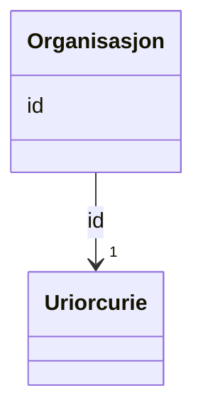

# Class: Organisasjon 


_Ein organisasjon som er utgjevar eller ansvarleg for eit omgrep._


URI: [org:Organization](http://www.w3.org/ns/org#Organization)





<!-- no inheritance hierarchy -->

## Class Properties

| Property | Value |
| --- | --- |
| Class URI | [org:Organization](http://www.w3.org/ns/org#Organization) |


## Eigenskapar


  
  


  
  


  
  


  
  
  
  
    
  


### Andre

| Namn | Kardinalitet og domene | Beskriving |
| --- | --- | --- |
| [id](id.md) | 1 <br/> [xsd:anyURI](http://www.w3.org/2001/XMLSchema#anyURI) | URI-identifikator for ressursen |


## Usages

| used by | used in | type | used |
| ---  | --- | --- | --- |
| [Begrep](begrep.md) | [utgjevar](utgjevar.md) | range | [Organisasjon](organisasjon.md) |
| [Begrep](begrep.md) | [ansvarleg_verksemd](ansvarleg_verksemd.md) | range | [Organisasjon](organisasjon.md) |
| [Samling](samling.md) | [utgjevar](utgjevar.md) | range | [Organisasjon](organisasjon.md) |


## Identifier and Mapping Information


### Schema Source


* from schema: https://data.norge.no/linkml/skos-ap-no


## Mappings

| Mapping Type | Mapped Value |
| ---  | ---  |
| self | org:Organization |
| native | https://data.norge.no/linkml/skos-ap-no/Organisasjon |


## LinkML Source

<!-- TODO: investigate https://stackoverflow.com/questions/37606292/how-to-create-tabbed-code-blocks-in-mkdocs-or-sphinx -->

### Direct

<details>
```yaml
name: Organisasjon
description: Ein organisasjon som er utgjevar eller ansvarleg for eit omgrep.
from_schema: https://data.norge.no/linkml/skos-ap-no
rank: 1000
slots:
- id
class_uri: org:Organization

```
</details>

### Induced

<details>
```yaml
name: Organisasjon
description: Ein organisasjon som er utgjevar eller ansvarleg for eit omgrep.
from_schema: https://data.norge.no/linkml/skos-ap-no
rank: 1000
attributes:
  id:
    name: id
    description: URI-identifikator for ressursen.
    from_schema: https://data.norge.no/linkml/common-ap-no
    identifier: true
    alias: id
    owner: Organisasjon
    domain_of:
    - Mediatype
    - Konsept
    - Begrepssamling
    - Organisasjon
    - VCardKontakt
    - Begrep
    - Definisjon
    - AssosiativRelasjon
    - GeneriskRelasjon
    - PartitivRelasjon
    - Samling
    range: uriorcurie
    required: true
class_uri: org:Organization

```
</details>