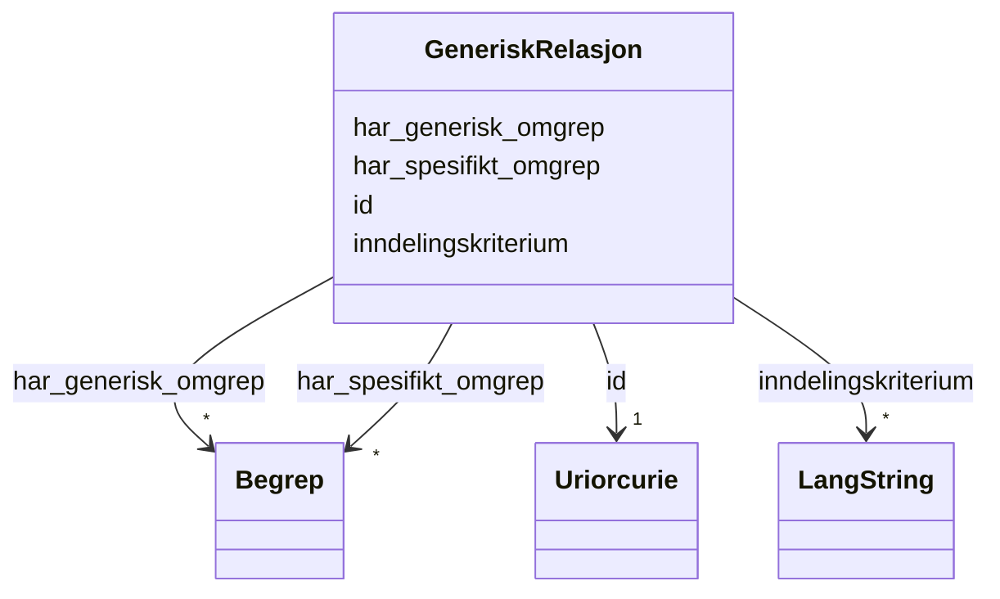

# Class: GeneriskRelasjon 


_Ein generisk relasjon mellom eit overomgrep og eit underomgrep._


URI: [skosno:GenericConceptRelation](https://data.norge.no/vocabulary/skosno#GenericConceptRelation)





<!-- no inheritance hierarchy -->

## Class Properties

| Property | Value |
| --- | --- |
| Class URI | [skosno:GenericConceptRelation](https://data.norge.no/vocabulary/skosno#GenericConceptRelation) |


## Eigenskapar


  
  

  
  
    
  

  
  
    
  

  
  


### Obligatorisk

| Namn | Kardinalitet og domene | Beskriving |
| --- | --- | --- |
| [har_generisk_omgrep](har_generisk_omgrep.md) | * <br/> [Begrep](begrep.md) | Overomgrepet i ein generisk relasjon (skosno:hasGenericConcept) |
| [har_spesifikt_omgrep](har_spesifikt_omgrep.md) | * <br/> [Begrep](begrep.md) | Underomgrepet i ein generisk relasjon (skosno:hasSpecificConcept) |


  
  

  
  

  
  

  
  
    
  


### Anbefalt

| Namn | Kardinalitet og domene | Beskriving |
| --- | --- | --- |
| [inndelingskriterium](inndelingskriterium.md) | * <br/> [LangString](langstring.md) | Inndelingskriterium for ein generisk eller partitiv relasjon (dct:description... |


  
  

  
  

  
  

  
  


  
  
  
  
    
  

  
  
  
    
      
    
      
    
      
    
  
  

  
  
  
    
      
    
      
    
      
    
  
  

  
  
  
    
      
    
      
    
      
    
  
  


### Andre

| Namn | Kardinalitet og domene | Beskriving |
| --- | --- | --- |
| [id](id.md) | 1 <br/> [xsd:anyURI](http://www.w3.org/2001/XMLSchema#anyURI) | URI-identifikator for ressursen |


## Usages

| used by | used in | type | used |
| ---  | --- | --- | --- |
| [Begrep](begrep.md) | [har_generisk_relasjon](har_generisk_relasjon.md) | range | [GeneriskRelasjon](generiskrelasjon.md) |


## Identifier and Mapping Information


### Schema Source


* from schema: https://data.norge.no/ap-no/skos-ap-no


## Mappings

| Mapping Type | Mapped Value |
| ---  | ---  |
| self | skosno:GenericConceptRelation |
| native | https://data.norge.no/ap-no/skos-ap-no/GeneriskRelasjon |


## LinkML Source

<!-- TODO: investigate https://stackoverflow.com/questions/37606292/how-to-create-tabbed-code-blocks-in-mkdocs-or-sphinx -->

### Direct

<details>
```yaml
name: GeneriskRelasjon
description: Ein generisk relasjon mellom eit overomgrep og eit underomgrep.
from_schema: https://data.norge.no/ap-no/skos-ap-no
rank: 1000
slots:
- id
- har_generisk_omgrep
- har_spesifikt_omgrep
- inndelingskriterium
slot_usage:
  har_generisk_omgrep:
    name: har_generisk_omgrep
    in_subset:
    - Obligatorisk
  har_spesifikt_omgrep:
    name: har_spesifikt_omgrep
    in_subset:
    - Obligatorisk
  inndelingskriterium:
    name: inndelingskriterium
    in_subset:
    - Anbefalt
class_uri: skosno:GenericConceptRelation

```
</details>

### Induced

<details>
```yaml
name: GeneriskRelasjon
description: Ein generisk relasjon mellom eit overomgrep og eit underomgrep.
from_schema: https://data.norge.no/ap-no/skos-ap-no
rank: 1000
slot_usage:
  har_generisk_omgrep:
    name: har_generisk_omgrep
    in_subset:
    - Obligatorisk
  har_spesifikt_omgrep:
    name: har_spesifikt_omgrep
    in_subset:
    - Obligatorisk
  inndelingskriterium:
    name: inndelingskriterium
    in_subset:
    - Anbefalt
attributes:
  id:
    name: id
    description: URI-identifikator for ressursen.
    from_schema: https://data.norge.no/ap-no/common-ap-no
    identifier: true
    owner: GeneriskRelasjon
    domain_of:
    - Mediatype
    - Konsept
    - Begrepssamling
    - Organisasjon
    - VCardKontakt
    - Begrep
    - Definisjon
    - AssosiativRelasjon
    - GeneriskRelasjon
    - PartitivRelasjon
    - Samling
    range: uriorcurie
    required: true
  har_generisk_omgrep:
    name: har_generisk_omgrep
    description: Overomgrepet i ein generisk relasjon (skosno:hasGenericConcept).
    in_subset:
    - Obligatorisk
    from_schema: https://data.norge.no/ap-no/skos-ap-no
    rank: 1000
    slot_uri: skosno:hasGenericConcept
    owner: GeneriskRelasjon
    domain_of:
    - GeneriskRelasjon
    range: Begrep
    multivalued: true
  har_spesifikt_omgrep:
    name: har_spesifikt_omgrep
    description: Underomgrepet i ein generisk relasjon (skosno:hasSpecificConcept).
    in_subset:
    - Obligatorisk
    from_schema: https://data.norge.no/ap-no/skos-ap-no
    rank: 1000
    slot_uri: skosno:hasSpecificConcept
    owner: GeneriskRelasjon
    domain_of:
    - GeneriskRelasjon
    range: Begrep
    multivalued: true
  inndelingskriterium:
    name: inndelingskriterium
    description: Inndelingskriterium for ein generisk eller partitiv relasjon (dct:description).
    in_subset:
    - Anbefalt
    from_schema: https://data.norge.no/ap-no/skos-ap-no
    rank: 1000
    slot_uri: dct:description
    owner: GeneriskRelasjon
    domain_of:
    - GeneriskRelasjon
    - PartitivRelasjon
    range: LangString
    multivalued: true
class_uri: skosno:GenericConceptRelation

```
</details>