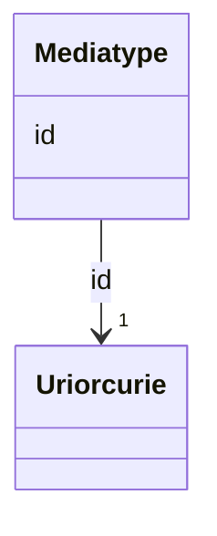

# Class: Mediatype 


_Ein medietype eller filformat (dct:MediaTypeOrExtent)._


URI: [dct:MediaTypeOrExtent](http://purl.org/dc/terms/MediaTypeOrExtent)





<!-- no inheritance hierarchy -->

## Class Properties

| Property | Value |
| --- | --- |
| Class URI | [dct:MediaTypeOrExtent](http://purl.org/dc/terms/MediaTypeOrExtent) |


## Eigenskapar


  
  


  
  


  
  


  
  
  
  
    
  


### Andre

| Namn | Kardinalitet og domene | Beskriving |
| --- | --- | --- |
| [id](id.md) | 1 <br/> [xsd:anyURI](http://www.w3.org/2001/XMLSchema#anyURI) | URI-identifikator for ressursen |


## Identifier and Mapping Information


### Schema Source


* from schema: https://data.norge.no/ap-no/common-ap-no


## Mappings

| Mapping Type | Mapped Value |
| ---  | ---  |
| self | dct:MediaTypeOrExtent |
| native | https://data.norge.no/ap-no/common-ap-no/Mediatype |


## LinkML Source

<!-- TODO: investigate https://stackoverflow.com/questions/37606292/how-to-create-tabbed-code-blocks-in-mkdocs-or-sphinx -->

### Direct

<details>
```yaml
name: Mediatype
description: Ein medietype eller filformat (dct:MediaTypeOrExtent).
from_schema: https://data.norge.no/ap-no/common-ap-no
slots:
- id
class_uri: dct:MediaTypeOrExtent

```
</details>

### Induced

<details>
```yaml
name: Mediatype
description: Ein medietype eller filformat (dct:MediaTypeOrExtent).
from_schema: https://data.norge.no/ap-no/common-ap-no
attributes:
  id:
    name: id
    description: URI-identifikator for ressursen.
    from_schema: https://data.norge.no/ap-no/common-ap-no
    identifier: true
    owner: Mediatype
    domain_of:
    - Mediatype
    - Konsept
    - Begrepssamling
    - Organisasjon
    - VCardKontakt
    - Begrep
    - Definisjon
    - AssosiativRelasjon
    - GeneriskRelasjon
    - PartitivRelasjon
    - Samling
    range: uriorcurie
    required: true
class_uri: dct:MediaTypeOrExtent

```
</details>