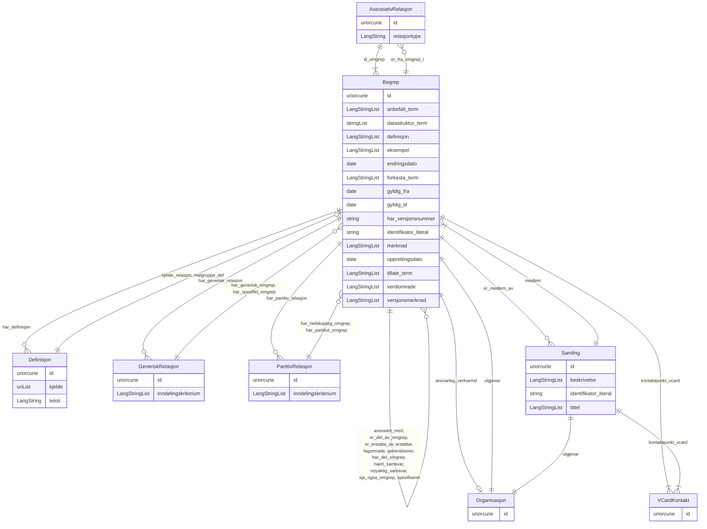

```mermaid
erDiagram
AssosiativRelasjon {
    uriorcurie id  
    LangString relasjontype  
}
Begrep {
    uriorcurie id  
    LangStringList anbefalt_term  
    stringList datastruktur_term  
    LangStringList definisjon  
    LangStringList eksempel  
    date endringsdato  
    LangStringList forkasta_term  
    date gyldig_fra  
    date gyldig_til  
    string har_versjonsnummer  
    string identifikator_literal  
    LangStringList merknad  
    date opprettingsdato  
    LangStringList tillate_term  
    LangStringList verdiomrade  
    LangStringList versjonsmerknad  
}
Definisjon {
    uriorcurie id  
    uriList kjelde  
    LangString tekst  
}
GeneriskRelasjon {
    uriorcurie id  
    LangStringList inndelingskriterium  
}
Organisasjon {
    uriorcurie id  
}
PartitivRelasjon {
    uriorcurie id  
    LangStringList inndelingskriterium  
}
Samling {
    uriorcurie id  
    LangStringList beskrivelse  
    string identifikator_literal  
    LangStringList tittel  
}
VCardKontakt {
    uriorcurie id  
}

AssosiativRelasjon ||--}| Begrep : "til_omgrep"
Begrep ||--|o Begrep : "euvoc_status"
Begrep ||--|o Organisasjon : "ansvarleg_verksemd"
Begrep ||--|| Organisasjon : "utgjevar"
Begrep ||--}o AssosiativRelasjon : "er_fra_omgrep_i"
Begrep ||--}o Begrep : "assosiert_med, er_del_av_omgrep, er_erstatta_av, erstattar, fagomrade, generaliserer, har_del_omgrep, naert_samsvar, noyaktig_samsvar, sja_ogsa_omgrep, spesifiserer"
Begrep ||--}o Definisjon : "har_definisjon"
Begrep ||--}o GeneriskRelasjon : "har_generisk_relasjon"
Begrep ||--}o PartitivRelasjon : "har_partitiv_relasjon"
Begrep ||--}o Samling : "er_medlem_av"
Begrep ||--}| VCardKontakt : "kontaktpunkt_vcard"
Definisjon ||--|o Begrep : "kjelde_relasjon, malgruppe_def"
GeneriskRelasjon ||--}o Begrep : "har_generisk_omgrep, har_spesifikt_omgrep"
PartitivRelasjon ||--}o Begrep : "har_heilskapleg_omgrep, har_partitivt_omgrep"
Samling ||--|| Organisasjon : "utgjevar"
Samling ||--}| Begrep : "medlem"
Samling ||--}| VCardKontakt : "kontaktpunkt_vcard"


```
