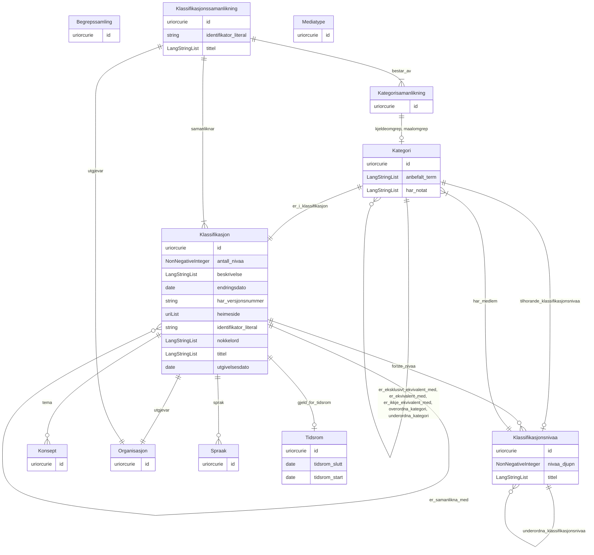

# xkos-ap-no

LinkML-modell for XKOS-AP-NO – norsk applikasjonsprofil for utvida SKOS-klassifikasjonar. Basert på https://data.norge.no/specification/xkos-ap-no

URI: https://data.norge.no/linkml/xkos-ap-no

Name: xkos-ap-no

## Classes

| Class | Description |
| --- | --- |
| [Begrepssamling](klasser/begrepssamling.md) | Ei SKOS-omgrepssamling (temavokabular) |
| [Kategori](klasser/kategori.md) | Ein kategori i ein klassifikasjon (skos:Concept) |
| [Kategorisamanlikning](klasser/kategorisamanlikning.md) | Ein samanlikning mellom to kategoriar på tvers av klassifikasjonar (xkos:Conc... |
| [Klassifikasjon](klasser/klassifikasjon.md) | Ei klassifikasjon – ein systematisk struktur av kategoriar brukt til å klassi... |
| [Klassifikasjonsnivaa](klasser/klassifikasjonsnivaa.md) | Eit nivå i ein klassifikasjon (xkos:ClassificationLevel) |
| [Klassifikasjonssamanlikning](klasser/klassifikasjonssamanlikning.md) | Ein samanlikning mellom to klassifikasjonar (xkos:Correspondence) |
| [Konsept](klasser/konsept.md) | Referanse til eit SKOS-omgrep frå eit kontrollert vokabular |
| [Mediatype](klasser/mediatype.md) | Ein medietype eller filformat (dct:MediaTypeOrExtent) |
| [Organisasjon](klasser/organisasjon.md) | Ein organisasjon eller aktør (foaf:Agent) |
| [Spraak](klasser/spraak.md) | Ein språkreferanse (dct:LinguisticSystem) |
| [Tidsrom](klasser/tidsrom.md) | Eit tidsrom med start- og/eller sluttdato (dct:PeriodOfTime) |

## Slots

| Slot | Description |
| --- | --- |
| [anbefalt_term](klasser/anbefalt_term.md) | Føretrukke term/namn for ressursen (skos:prefLabel) |
| [antall_nivaa](klasser/antall_nivaa.md) | Antal nivå i klassifikasjonen (xkos:numberOfLevels) |
| [beskrivelse](klasser/beskrivelse.md) | Fritekstbeskrivelse av ressursen (dct:description) |
| [bestar_av](klasser/bestar_av.md) | Kategorisamanlikningar som inngår i klassifikasjonssamanlikninga (xkos:madeOf... |
| [dekningsomrade](klasser/dekningsomrade.md) | Geografisk dekningsområde (dct:spatial) |
| [endringsdato](klasser/endringsdato.md) | Dato for siste endring av ressursen (dct:modified) |
| [er_eksklusivt_ekvivalent_med](klasser/er_eksklusivt_ekvivalent_med.md) | Eksklusiv breid ekvivalens (xkos:exclusivelyBroadMatch) |
| [er_ekvivalent_med](klasser/er_ekvivalent_med.md) | Breid ekvivalens til kategori i annan klassifikasjon (uneskos:broadMatch) |
| [er_i_klassifikasjon](klasser/er_i_klassifikasjon.md) | Klassifikasjonen kategorien tilhøyrer (skos:inScheme) |
| [er_ikkje_ekvivalent_med](klasser/er_ikkje_ekvivalent_med.md) | Klar ikkje-ekvivalens til kategori i annan klassifikasjon (xkos:disjointMatch... |
| [er_samanlikna_med](klasser/er_samanlikna_med.md) | Klassifikasjonar som er samanlikna (xkos:compares) |
| [format](klasser/format.md) | Filformat eller medietype (dct:format) |
| [forste_nivaa](klasser/forste_nivaa.md) | Toppnivå i klassifikasjonen (xkos:levels) |
| [gjeld_for_tidsrom](klasser/gjeld_for_tidsrom.md) | Tidsrom klassifikasjonen er gyldig for (dct:temporal) |
| [har_medlem](klasser/har_medlem.md) | Kategoriar som høyrer til dette nivået (skos:member) |
| [har_merknad](klasser/har_merknad.md) | Fritekstmerknad (rdfs:comment) |
| [har_notat](klasser/har_notat.md) | Fritekstnotat om kategorien (skos:note) |
| [har_referanse](klasser/har_referanse.md) | Referanse til ekstern ressurs (rdfs:seeAlso) |
| [har_versjonsnummer](klasser/har_versjonsnummer.md) | Versjonsnummer for ressursen (owl:versionInfo) |
| [heimeside](klasser/heimeside.md) | Heimeside for ressursen eller organisasjonen (foaf:homepage) |
| [id](klasser/id.md) | URI-identifikator for ressursen |
| [identifikator_literal](klasser/identifikator_literal.md) | Tekstleg identifikator for ressursen (dct:identifier) |
| [kjeldeomgrep](klasser/kjeldeomgrep.md) | Kjeldeomgrep i ein kategorisamanlikning (xkos:sourceConcept) |
| [maalomgrep](klasser/maalomgrep.md) | Måleomgrep i ein kategorisamanlikning (xkos:targetConcept) |
| [nivaa_djupn](klasser/nivaa_djupn.md) | Djupna (nivånummer) i klassifikasjonsstrukturen (xkos:depth) |
| [nokkelord](klasser/nokkelord.md) | Nøkkelord som beskriv ressursen (dcat:keyword) |
| [overordna_kategori](klasser/overordna_kategori.md) | Overordna kategori (skos:broader) |
| [samanliknar](klasser/samanliknar.md) | Klassifikasjonar som er samanlikna i korrespondansen (xkos:compares) |
| [sprak](klasser/sprak.md) | Språk brukt i ressursen (dct:language) |
| [status](klasser/status.md) | Status for ressursen frå eit kontrollert vokabular (adms:status) |
| [tema](klasser/tema.md) | Fagleg tema klassifikasjonen dekkjer (dct:subject) |
| [tidsrom_slutt](klasser/tidsrom_slutt.md) | Sluttdato for tidsromet (dct:endDate) |
| [tidsrom_start](klasser/tidsrom_start.md) | Startdato for tidsromet (dct:startDate) |
| [tilhorande_klassifikasjonsnivaa](klasser/tilhorande_klassifikasjonsnivaa.md) | Klassifikasjonsnivå kategorien høyrer til (xkos:belongsTo) |
| [tittel](klasser/tittel.md) | Namn/tittel på ressursen (dct:title) |
| [type_concept](klasser/type_concept.md) | Type ressurs frå eit kontrollert vokabular (dct:type) |
| [underordna_kategori](klasser/underordna_kategori.md) | Underordna kategori (skos:narrower) |
| [underordna_klassifikasjonsnivaa](klasser/underordna_klassifikasjonsnivaa.md) | Underordna klassifikasjonsnivå (xkos:nextLevel) |
| [utgivelsesdato](klasser/utgivelsesdato.md) | Dato ressursen vart første gong publisert (dct:issued) |
| [utgjevar](klasser/utgjevar.md) | Organisasjon som er ansvarleg utgjevar (dct:publisher) |
| [valuta](klasser/valuta.md) | Valuta (cv:currency) |
| [versjonsmerknad](klasser/versjonsmerknad.md) | Merknad om endringar i denne versjonen (adms:versionNotes) |

## Enumerations

| Enumeration | Description |
| --- | --- |

## Types

| Type | Description |
| --- | --- |
| [Boolean](klasser/boolean.md) | A binary (true or false) value |
| [Curie](klasser/curie.md) | a compact URI |
| [Date](klasser/date.md) | a date (year, month and day) in an idealized calendar |
| [DateOrDatetime](klasser/dateordatetime.md) | Either a date or a datetime |
| [Datetime](klasser/datetime.md) | The combination of a date and time |
| [Decimal](klasser/decimal.md) | A real number with arbitrary precision that conforms to the xsd:decimal speci... |
| [Double](klasser/double.md) | A real number that conforms to the xsd:double specification |
| [Duration](klasser/duration.md) | ISO 8601-varigheit (xsd:duration), t |
| [Float](klasser/float.md) | A real number that conforms to the xsd:float specification |
| [GYear](klasser/gyear.md) | Gregorisk årstal (xsd:gYear), t |
| [Integer](klasser/integer.md) | An integer |
| [Jsonpath](klasser/jsonpath.md) | A string encoding a JSON Path |
| [Jsonpointer](klasser/jsonpointer.md) | A string encoding a JSON Pointer |
| [LangString](klasser/langstring.md) | Språktagget streng (rdf:langString) |
| [Ncname](klasser/ncname.md) | Prefix part of CURIE |
| [Nodeidentifier](klasser/nodeidentifier.md) | A URI, CURIE or BNODE that represents a node in a model |
| [NonNegativeInteger](klasser/nonnegativeinteger.md) | Ikkje-negativ heltalsverdi (xsd:nonNegativeInteger) |
| [Objectidentifier](klasser/objectidentifier.md) | A URI or CURIE that represents an object in the model |
| [Sparqlpath](klasser/sparqlpath.md) | A string encoding a SPARQL Property Path |
| [String](klasser/string.md) | A character string |
| [Time](klasser/time.md) | A time object represents a (local) time of day, independent of any particular... |
| [Uri](klasser/uri.md) | a complete URI |
| [Uriorcurie](klasser/uriorcurie.md) | a URI or a CURIE |

## Subsets

| Subset | Description |
| --- | --- |
| [Anbefalt](klasser/anbefalt.md) | Anbefalte eigenskapar i ein AP-NO-profil |
| [Obligatorisk](klasser/obligatorisk.md) | Obligatoriske eigenskapar i ein AP-NO-profil |
| [Valgfri](klasser/valgfri.md) | Valfrie eigenskapar i ein AP-NO-profil |

## Artifacts

| Artefakt | Fil |
|----------|-----|
| SHACL shapes | [xkos-ap-no-shapes.ttl](xkos-ap-no-shapes.ttl) |
| JSON-LD kontekst | [xkos-ap-no-context.jsonld](xkos-ap-no-context.jsonld) |
| JSON Schema | [xkos-ap-no-schema.json](xkos-ap-no-schema.json) |
| OWL ontologi | [xkos-ap-no-ontology.ttl](xkos-ap-no-ontology.ttl) |
| RDF/Turtle skjema | [xkos-ap-no-schema.ttl](xkos-ap-no-schema.ttl) |
| Python-klasser | [xkos-ap-no-model.py](xkos-ap-no-model.py) |
| ER-diagram (Mermaid) | [xkos-ap-no-erdiagram.md](xkos-ap-no-erdiagram.md) |
| Eksempeldata (Turtle) | [xkos-ap-no-eksempel.ttl](xkos-ap-no-eksempel.ttl) |
