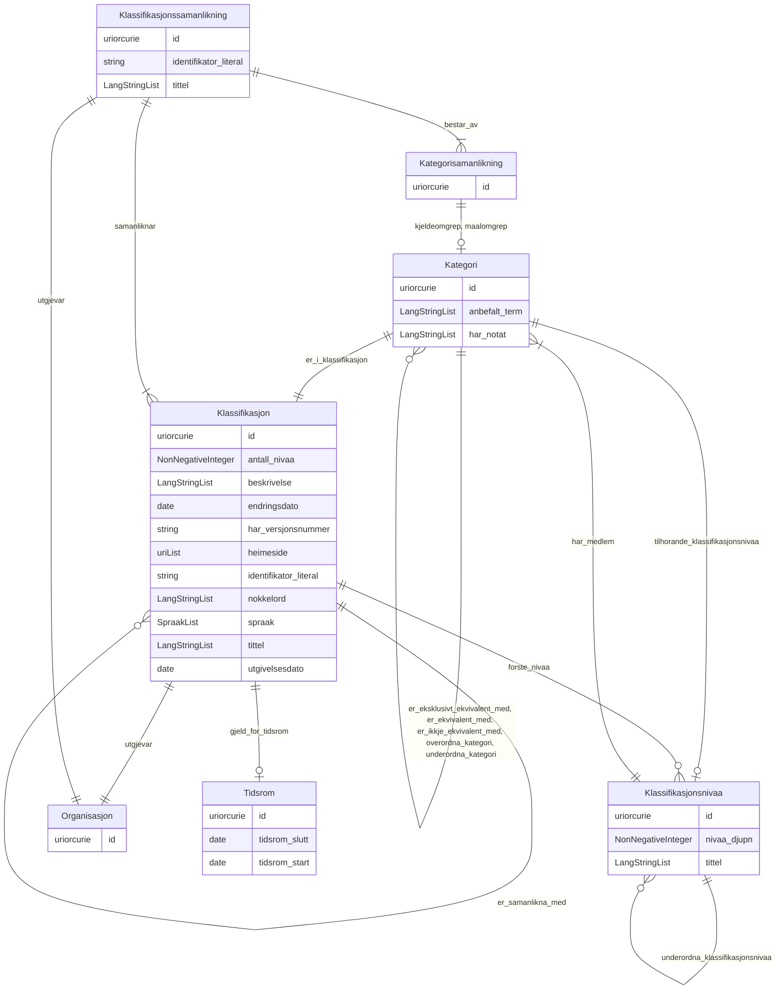

# xkos-ap-no

LinkML-modell for XKOS-AP-NO – norsk applikasjonsprofil for utvida SKOS-klassifikasjonar. Basert på https://data.norge.no/specification/xkos-ap-no

URI: https://data.norge.no/linkml/xkos-ap-no

Name: xkos-ap-no

## Classes

### Obligatorisk

| Class | Description |
| --- | --- |
| [Kategori](klasser/kategori.md) | Ein kategori i ein klassifikasjon (skos:Concept) |
| [Klassifikasjon](klasser/klassifikasjon.md) | Ei klassifikasjon – ein systematisk struktur av kategoriar brukt til å klassi... |
| [Klassifikasjonsnivaa](klasser/klassifikasjonsnivaa.md) | Eit nivå i ein klassifikasjon (xkos:ClassificationLevel) |
| [Klassifikasjonssamanlikning](klasser/klassifikasjonssamanlikning.md) | Ein samanlikning mellom to klassifikasjonar (xkos:Correspondence) |

### Anbefalt

| Class | Description |
| --- | --- |
| [Kategorisamanlikning](klasser/kategorisamanlikning.md) | Ein samanlikning mellom to kategoriar på tvers av klassifikasjonar (xkos:Conc... |

### Andre

| Class | Description |
| --- | --- |
| [Organisasjon](klasser/organisasjon.md) | Ein organisasjon eller aktør (foaf:Agent) |
| [Tidsrom](klasser/tidsrom.md) | Eit tidsrom med start- og/eller sluttdato (dct:PeriodOfTime) |

## Slots

| Slot | Description |
| --- | --- |
| [antall_nivaa](klasser/antall_nivaa.md) | Antal nivå i klassifikasjonen (xkos:numberOfLevels) |
| [bestar_av](klasser/bestar_av.md) | Kategorisamanlikningar som inngår i klassifikasjonssamanlikninga (xkos:madeOf... |
| [er_eksklusivt_ekvivalent_med](klasser/er_eksklusivt_ekvivalent_med.md) | Eksklusiv breid ekvivalens (xkos:exclusivelyBroadMatch) |
| [er_ekvivalent_med](klasser/er_ekvivalent_med.md) | Breid ekvivalens til kategori i annan klassifikasjon (uneskos:broadMatch) |
| [er_i_klassifikasjon](klasser/er_i_klassifikasjon.md) | Klassifikasjonen kategorien tilhøyrer (skos:inScheme) |
| [er_ikkje_ekvivalent_med](klasser/er_ikkje_ekvivalent_med.md) | Klar ikkje-ekvivalens til kategori i annan klassifikasjon (xkos:disjointMatch... |
| [er_samanlikna_med](klasser/er_samanlikna_med.md) | Klassifikasjonar som er samanlikna (xkos:compares) |
| [forste_nivaa](klasser/forste_nivaa.md) | Toppnivå i klassifikasjonen (xkos:levels) |
| [gjeld_for_tidsrom](klasser/gjeld_for_tidsrom.md) | Tidsrom klassifikasjonen er gyldig for (dct:temporal) |
| [har_medlem](klasser/har_medlem.md) | Kategoriar som høyrer til dette nivået (skos:member) |
| [har_notat](klasser/har_notat.md) | Fritekstnotat om kategorien (skos:note) |
| [kjeldeomgrep](klasser/kjeldeomgrep.md) | Kjeldeomgrep i ein kategorisamanlikning (xkos:sourceConcept) |
| [maalomgrep](klasser/maalomgrep.md) | Måleomgrep i ein kategorisamanlikning (xkos:targetConcept) |
| [nivaa_djupn](klasser/nivaa_djupn.md) | Djupna (nivånummer) i klassifikasjonsstrukturen (xkos:depth) |
| [overordna_kategori](klasser/overordna_kategori.md) | Overordna kategori (skos:broader) |
| [samanliknar](klasser/samanliknar.md) | Klassifikasjonar som er samanlikna i korrespondansen (xkos:compares) |
| [tema](klasser/tema.md) | Fagleg tema klassifikasjonen dekkjer (dct:subject) |
| [tidsrom_slutt](klasser/tidsrom_slutt.md) | Sluttdato for tidsromet (dct:endDate) |
| [tidsrom_start](klasser/tidsrom_start.md) | Startdato for tidsromet (dct:startDate) |
| [tilhorande_klassifikasjonsnivaa](klasser/tilhorande_klassifikasjonsnivaa.md) | Klassifikasjonsnivå kategorien høyrer til (xkos:belongsTo) |
| [underordna_kategori](klasser/underordna_kategori.md) | Underordna kategori (skos:narrower) |
| [underordna_klassifikasjonsnivaa](klasser/underordna_klassifikasjonsnivaa.md) | Underordna klassifikasjonsnivå (xkos:nextLevel) |
| [utgjevar](klasser/utgjevar.md) | Organisasjon som er ansvarleg utgjevar (dct:publisher) |

## Enumerations

| Enumeration | Description |
| --- | --- |

## Types

| Type | Description |
| --- | --- |

## Subsets

| Subset | Description |
| --- | --- |
| [Anbefalt](klasser/anbefalt.md) | Anbefalte eigenskapar i ein AP-NO-profil |
| [Obligatorisk](klasser/obligatorisk.md) | Obligatoriske eigenskapar i ein AP-NO-profil |
| [Valgfri](klasser/valgfri.md) | Valfrie eigenskapar i ein AP-NO-profil |

## Generated artifacts

| Artefakt | Fil |
|----------|-----|
| SHACL shapes | [xkos-ap-no-shapes.ttl](xkos-ap-no-shapes.ttl) |
| JSON-LD kontekst | [xkos-ap-no-context.jsonld](xkos-ap-no-context.jsonld) |
| JSON Schema | [xkos-ap-no-schema.json](xkos-ap-no-schema.json) |
| OWL ontologi | [xkos-ap-no-ontology.ttl](xkos-ap-no-ontology.ttl) |
| RDF/Turtle skjema | [xkos-ap-no-schema.ttl](xkos-ap-no-schema.ttl) |
| Python-klasser | [xkos-ap-no-model.py](xkos-ap-no-model.py) |
| ER-diagram (Mermaid) | [xkos-ap-no-erdiagram.md](xkos-ap-no-erdiagram.md) |
| Eksempeldata (Turtle) | [xkos-ap-no-eksempel.ttl](xkos-ap-no-eksempel.ttl) |
