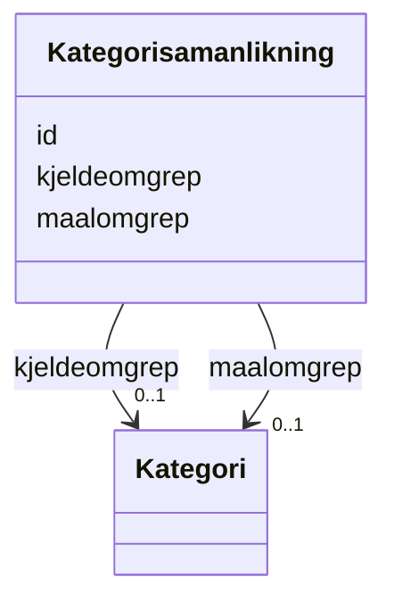

# Class: Kategorisamanlikning 


_Ein samanlikning mellom to kategoriar på tvers av klassifikasjonar (xkos:ConceptAssociation)._


URI: [xkos:ConceptAssociation](http://rdf-vocabulary.ddialliance.org/xkos#ConceptAssociation)





<!-- no inheritance hierarchy -->

## Class Properties

| Property | Value |
| --- | --- |
| Class URI | [xkos:ConceptAssociation](http://rdf-vocabulary.ddialliance.org/xkos#ConceptAssociation) |


## Eigenskapar


  
  

  
  

  
  


  
  

  
  
    
  

  
  
    
  


### Anbefalt

| Namn | Kardinalitet og domene | Beskriving |
| --- | --- | --- |
| [kjeldeomgrep](kjeldeomgrep.md) | 0..1 <br/> [Kategori](kategori.md) | Kjeldeomgrep i ein kategorisamanlikning (xkos:sourceConcept) |
| [maalomgrep](maalomgrep.md) | 0..1 <br/> [Kategori](kategori.md) | Måleomgrep i ein kategorisamanlikning (xkos:targetConcept) |


  
  

  
  

  
  


  
  
  
  
    
  

  
  
  
    
      
    
      
    
      
    
  
  

  
  
  
    
      
    
      
    
      
    
  
  


### Andre

| Namn | Kardinalitet og domene | Beskriving |
| --- | --- | --- |
| [id](id.md) | 1 <br/> [Uriorcurie](uriorcurie.md) | URI-identifikator for ressursen |


## Usages

| used by | used in | type | used |
| ---  | --- | --- | --- |
| [Klassifikasjonssamanlikning](klassifikasjonssamanlikning.md) | [bestar_av](bestar_av.md) | range | [Kategorisamanlikning](kategorisamanlikning.md) |


## Identifier and Mapping Information


### Schema Source


* from schema: https://data.norge.no/linkml/xkos-ap-no


## Mappings

| Mapping Type | Mapped Value |
| ---  | ---  |
| self | xkos:ConceptAssociation |
| native | https://data.norge.no/linkml/xkos-ap-no/Kategorisamanlikning |


## LinkML Source

<!-- TODO: investigate https://stackoverflow.com/questions/37606292/how-to-create-tabbed-code-blocks-in-mkdocs-or-sphinx -->

### Direct

<details>
```yaml
name: Kategorisamanlikning
description: Ein samanlikning mellom to kategoriar på tvers av klassifikasjonar (xkos:ConceptAssociation).
from_schema: https://data.norge.no/linkml/xkos-ap-no
slots:
- id
- kjeldeomgrep
- maalomgrep
slot_usage:
  kjeldeomgrep:
    name: kjeldeomgrep
    in_subset:
    - Anbefalt
  maalomgrep:
    name: maalomgrep
    in_subset:
    - Anbefalt
class_uri: xkos:ConceptAssociation

```
</details>

### Induced

<details>
```yaml
name: Kategorisamanlikning
description: Ein samanlikning mellom to kategoriar på tvers av klassifikasjonar (xkos:ConceptAssociation).
from_schema: https://data.norge.no/linkml/xkos-ap-no
slot_usage:
  kjeldeomgrep:
    name: kjeldeomgrep
    in_subset:
    - Anbefalt
  maalomgrep:
    name: maalomgrep
    in_subset:
    - Anbefalt
attributes:
  id:
    name: id
    description: URI-identifikator for ressursen.
    from_schema: https://data.norge.no/linkml/xkos-ap-no
    rank: 1000
    identifier: true
    alias: id
    owner: Kategorisamanlikning
    domain_of:
    - Klassifikasjon
    - Klassifikasjonsnivaa
    - Kategori
    - Klassifikasjonssamanlikning
    - Kategorisamanlikning
    - Organisasjon
    - Tidsrom
    - Mediatype
    - Konsept
    - Begrepssamling
    range: uriorcurie
    required: true
  kjeldeomgrep:
    name: kjeldeomgrep
    description: Kjeldeomgrep i ein kategorisamanlikning (xkos:sourceConcept).
    in_subset:
    - Anbefalt
    from_schema: https://data.norge.no/linkml/xkos-ap-no
    rank: 1000
    slot_uri: xkos:sourceConcept
    alias: kjeldeomgrep
    owner: Kategorisamanlikning
    domain_of:
    - Kategorisamanlikning
    range: Kategori
  maalomgrep:
    name: maalomgrep
    description: Måleomgrep i ein kategorisamanlikning (xkos:targetConcept).
    in_subset:
    - Anbefalt
    from_schema: https://data.norge.no/linkml/xkos-ap-no
    rank: 1000
    slot_uri: xkos:targetConcept
    alias: maalomgrep
    owner: Kategorisamanlikning
    domain_of:
    - Kategorisamanlikning
    range: Kategori
class_uri: xkos:ConceptAssociation

```
</details>