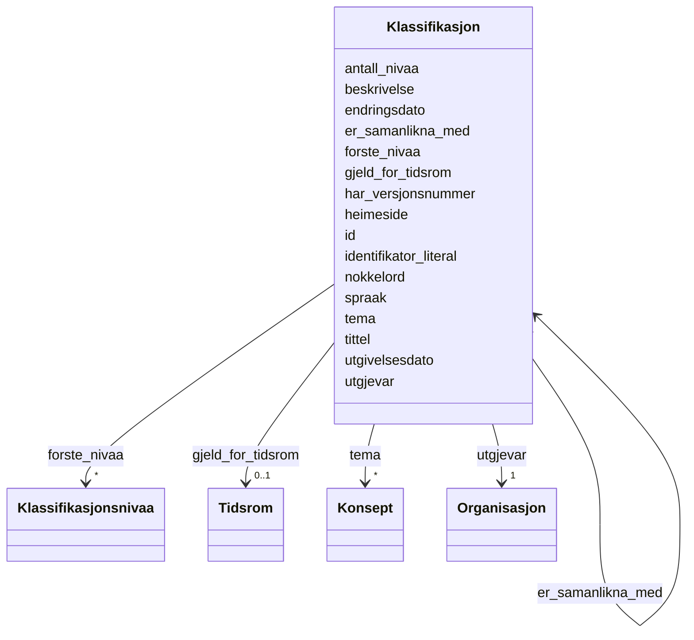

# Class: Klassifikasjon 


_Ei klassifikasjon – ein systematisk struktur av kategoriar brukt til å klassifisere data (skos:ConceptScheme)._


URI: [skos:ConceptScheme](http://www.w3.org/2004/02/skos/core#ConceptScheme)





<!-- no inheritance hierarchy -->

## Class Properties

| Property | Value |
| --- | --- |
| Class URI | [skos:ConceptScheme](http://www.w3.org/2004/02/skos/core#ConceptScheme) |


## Eigenskapar


  
  

  
  
    
  

  
  
    
  

  
  

  
  
    
  

  
  

  
  

  
  

  
  

  
  

  
  

  
  

  
  

  
  

  
  

  
  


### Obligatorisk

| Namn | Kardinalitet og domene | Beskriving |
| --- | --- | --- |
| [identifikator_literal](identifikator_literal.md) | 1 <br/> [String](string.md) | Tekstleg identifikator for ressursen (dct:identifier) |
| [tittel](tittel.md) | 1..* <br/> [LangString](langstring.md) | Namn/tittel på ressursen (dct:title) |
| [utgjevar](utgjevar.md) | 1 <br/> [Organisasjon](organisasjon.md) | Organisasjon som er ansvarleg utgjevar (dct:publisher) |


  
  

  
  

  
  

  
  

  
  

  
  
    
  

  
  
    
  

  
  
    
  

  
  
    
  

  
  
    
  

  
  
    
  

  
  
    
  

  
  
    
  

  
  
    
  

  
  

  
  


### Anbefalt

| Namn | Kardinalitet og domene | Beskriving |
| --- | --- | --- |
| [tema](tema.md) | * <br/> [Konsept](konsept.md) | Fagleg tema klassifikasjonen dekkjer (dct:subject) |
| [nokkelord](nokkelord.md) | * <br/> [LangString](langstring.md) | Nøkkelord som beskriv ressursen (dcat:keyword) |
| [spraak](spraak.md) | * <br/> [Spraak](spraak.md) | Språk brukt i ressursen (dct:language) |
| [har_versjonsnummer](har_versjonsnummer.md) | 0..1 <br/> [String](string.md) | Versjonsnummer for ressursen (owl:versionInfo) |
| [endringsdato](endringsdato.md) | 0..1 <br/> [Date](date.md) | Dato for siste endring av ressursen (dct:modified) |
| [utgivelsesdato](utgivelsesdato.md) | 0..1 <br/> [Date](date.md) | Dato ressursen vart første gong publisert (dct:issued) |
| [heimeside](heimeside.md) | * <br/> [Uri](uri.md) | Heimeside for ressursen eller organisasjonen (foaf:homepage) |
| [gjeld_for_tidsrom](gjeld_for_tidsrom.md) | 0..1 <br/> [Tidsrom](tidsrom.md) | Tidsrom klassifikasjonen er gyldig for (dct:temporal) |
| [antall_nivaa](antall_nivaa.md) | 0..1 <br/> [NonNegativeInteger](nonnegativeinteger.md) | Antal nivå i klassifikasjonen (xkos:numberOfLevels) |


  
  

  
  

  
  

  
  

  
  

  
  

  
  

  
  

  
  

  
  

  
  

  
  

  
  

  
  

  
  
    
  

  
  
    
  


### Valgfri

| Namn | Kardinalitet og domene | Beskriving |
| --- | --- | --- |
| [er_samanlikna_med](er_samanlikna_med.md) | * <br/> [Klassifikasjon](klassifikasjon.md) | Klassifikasjonar som er samanlikna (xkos:compares) |
| [forste_nivaa](forste_nivaa.md) | * <br/> [Klassifikasjonsnivaa](klassifikasjonsnivaa.md) | Toppnivå i klassifikasjonen (xkos:levels) |


  
  
  
  
    
  

  
  
  
    
      
    
      
    
      
    
  
  

  
  
  
    
      
    
      
    
      
    
  
  

  
  
  
  
    
  

  
  
  
    
      
    
      
    
      
    
  
  

  
  
  
    
      
    
      
    
      
    
  
  

  
  
  
    
      
    
      
    
      
    
  
  

  
  
  
    
      
    
      
    
      
    
  
  

  
  
  
    
      
    
      
    
      
    
  
  

  
  
  
    
      
    
      
    
      
    
  
  

  
  
  
    
      
    
      
    
      
    
  
  

  
  
  
    
      
    
      
    
      
    
  
  

  
  
  
    
      
    
      
    
      
    
  
  

  
  
  
    
      
    
      
    
      
    
  
  

  
  
  
    
      
    
      
    
      
    
  
  

  
  
  
    
      
    
      
    
      
    
  
  


### Andre

| Namn | Kardinalitet og domene | Beskriving |
| --- | --- | --- |
| [id](id.md) | 1 <br/> [Uriorcurie](uriorcurie.md) | URI-identifikator for ressursen |
| [beskrivelse](beskrivelse.md) | * <br/> [LangString](langstring.md) | Fritekstbeskrivelse av ressursen (dct:description) |


## Usages

| used by | used in | type | used |
| ---  | --- | --- | --- |
| [Klassifikasjon](klassifikasjon.md) | [er_samanlikna_med](er_samanlikna_med.md) | range | [Klassifikasjon](klassifikasjon.md) |
| [Kategori](kategori.md) | [er_i_klassifikasjon](er_i_klassifikasjon.md) | range | [Klassifikasjon](klassifikasjon.md) |
| [Klassifikasjonssamanlikning](klassifikasjonssamanlikning.md) | [samanliknar](samanliknar.md) | range | [Klassifikasjon](klassifikasjon.md) |


## Identifier and Mapping Information


### Schema Source


* from schema: https://data.norge.no/linkml/xkos-ap-no


## Mappings

| Mapping Type | Mapped Value |
| ---  | ---  |
| self | skos:ConceptScheme |
| native | https://data.norge.no/linkml/xkos-ap-no/Klassifikasjon |


## LinkML Source

<!-- TODO: investigate https://stackoverflow.com/questions/37606292/how-to-create-tabbed-code-blocks-in-mkdocs-or-sphinx -->

### Direct

<details>
```yaml
name: Klassifikasjon
description: Ei klassifikasjon – ein systematisk struktur av kategoriar brukt til
  å klassifisere data (skos:ConceptScheme).
from_schema: https://data.norge.no/linkml/xkos-ap-no
slots:
- id
- identifikator_literal
- tittel
- beskrivelse
- utgjevar
- tema
- nokkelord
- spraak
- har_versjonsnummer
- endringsdato
- utgivelsesdato
- heimeside
- gjeld_for_tidsrom
- antall_nivaa
- er_samanlikna_med
- forste_nivaa
slot_usage:
  identifikator_literal:
    name: identifikator_literal
    in_subset:
    - Obligatorisk
    required: true
  tittel:
    name: tittel
    in_subset:
    - Obligatorisk
    required: true
  utgjevar:
    name: utgjevar
    in_subset:
    - Obligatorisk
    required: true
  tema:
    name: tema
    in_subset:
    - Anbefalt
  nokkelord:
    name: nokkelord
    in_subset:
    - Anbefalt
  spraak:
    name: spraak
    in_subset:
    - Anbefalt
  har_versjonsnummer:
    name: har_versjonsnummer
    in_subset:
    - Anbefalt
  endringsdato:
    name: endringsdato
    in_subset:
    - Anbefalt
  utgivelsesdato:
    name: utgivelsesdato
    in_subset:
    - Anbefalt
  heimeside:
    name: heimeside
    in_subset:
    - Anbefalt
  gjeld_for_tidsrom:
    name: gjeld_for_tidsrom
    in_subset:
    - Anbefalt
  antall_nivaa:
    name: antall_nivaa
    in_subset:
    - Anbefalt
  er_samanlikna_med:
    name: er_samanlikna_med
    in_subset:
    - Valgfri
  forste_nivaa:
    name: forste_nivaa
    in_subset:
    - Valgfri
class_uri: skos:ConceptScheme

```
</details>

### Induced

<details>
```yaml
name: Klassifikasjon
description: Ei klassifikasjon – ein systematisk struktur av kategoriar brukt til
  å klassifisere data (skos:ConceptScheme).
from_schema: https://data.norge.no/linkml/xkos-ap-no
slot_usage:
  identifikator_literal:
    name: identifikator_literal
    in_subset:
    - Obligatorisk
    required: true
  tittel:
    name: tittel
    in_subset:
    - Obligatorisk
    required: true
  utgjevar:
    name: utgjevar
    in_subset:
    - Obligatorisk
    required: true
  tema:
    name: tema
    in_subset:
    - Anbefalt
  nokkelord:
    name: nokkelord
    in_subset:
    - Anbefalt
  spraak:
    name: spraak
    in_subset:
    - Anbefalt
  har_versjonsnummer:
    name: har_versjonsnummer
    in_subset:
    - Anbefalt
  endringsdato:
    name: endringsdato
    in_subset:
    - Anbefalt
  utgivelsesdato:
    name: utgivelsesdato
    in_subset:
    - Anbefalt
  heimeside:
    name: heimeside
    in_subset:
    - Anbefalt
  gjeld_for_tidsrom:
    name: gjeld_for_tidsrom
    in_subset:
    - Anbefalt
  antall_nivaa:
    name: antall_nivaa
    in_subset:
    - Anbefalt
  er_samanlikna_med:
    name: er_samanlikna_med
    in_subset:
    - Valgfri
  forste_nivaa:
    name: forste_nivaa
    in_subset:
    - Valgfri
attributes:
  id:
    name: id
    description: URI-identifikator for ressursen.
    from_schema: https://data.norge.no/linkml/xkos-ap-no
    rank: 1000
    identifier: true
    alias: id
    owner: Klassifikasjon
    domain_of:
    - Klassifikasjon
    - Klassifikasjonsnivaa
    - Kategori
    - Klassifikasjonssamanlikning
    - Kategorisamanlikning
    - Organisasjon
    - Tidsrom
    - Mediatype
    - Konsept
    - Begrepssamling
    range: uriorcurie
  identifikator_literal:
    name: identifikator_literal
    description: Tekstleg identifikator for ressursen (dct:identifier).
    in_subset:
    - Obligatorisk
    from_schema: https://data.norge.no/linkml/xkos-ap-no
    rank: 1000
    slot_uri: dct:identifier
    alias: identifikator_literal
    owner: Klassifikasjon
    domain_of:
    - Klassifikasjon
    - Klassifikasjonssamanlikning
    range: string
    required: true
  tittel:
    name: tittel
    description: Namn/tittel på ressursen (dct:title).
    in_subset:
    - Obligatorisk
    from_schema: https://data.norge.no/linkml/xkos-ap-no
    rank: 1000
    slot_uri: dct:title
    alias: tittel
    owner: Klassifikasjon
    domain_of:
    - Klassifikasjon
    - Klassifikasjonsnivaa
    - Klassifikasjonssamanlikning
    range: LangString
    required: true
    multivalued: true
  beskrivelse:
    name: beskrivelse
    description: Fritekstbeskrivelse av ressursen (dct:description).
    from_schema: https://data.norge.no/linkml/xkos-ap-no
    rank: 1000
    slot_uri: dct:description
    alias: beskrivelse
    owner: Klassifikasjon
    domain_of:
    - Klassifikasjon
    range: LangString
    multivalued: true
  utgjevar:
    name: utgjevar
    description: Organisasjon som er ansvarleg utgjevar (dct:publisher).
    in_subset:
    - Obligatorisk
    from_schema: https://data.norge.no/linkml/xkos-ap-no
    rank: 1000
    slot_uri: dct:publisher
    alias: utgjevar
    owner: Klassifikasjon
    domain_of:
    - Klassifikasjon
    - Klassifikasjonssamanlikning
    range: Organisasjon
    required: true
  tema:
    name: tema
    description: Fagleg tema klassifikasjonen dekkjer (dct:subject).
    in_subset:
    - Anbefalt
    from_schema: https://data.norge.no/linkml/xkos-ap-no
    rank: 1000
    slot_uri: dct:subject
    alias: tema
    owner: Klassifikasjon
    domain_of:
    - Klassifikasjon
    range: Konsept
    multivalued: true
  nokkelord:
    name: nokkelord
    description: Nøkkelord som beskriv ressursen (dcat:keyword).
    in_subset:
    - Anbefalt
    from_schema: https://data.norge.no/linkml/xkos-ap-no
    rank: 1000
    slot_uri: dcat:keyword
    alias: nokkelord
    owner: Klassifikasjon
    domain_of:
    - Klassifikasjon
    range: LangString
    multivalued: true
  spraak:
    name: spraak
    description: Språk brukt i ressursen (dct:language).
    in_subset:
    - Anbefalt
    from_schema: https://data.norge.no/linkml/xkos-ap-no
    rank: 1000
    slot_uri: dct:language
    alias: spraak
    owner: Klassifikasjon
    domain_of:
    - Klassifikasjon
    range: Spraak
    multivalued: true
  har_versjonsnummer:
    name: har_versjonsnummer
    description: Versjonsnummer for ressursen (owl:versionInfo).
    in_subset:
    - Anbefalt
    from_schema: https://data.norge.no/linkml/xkos-ap-no
    rank: 1000
    slot_uri: owl:versionInfo
    alias: har_versjonsnummer
    owner: Klassifikasjon
    domain_of:
    - Klassifikasjon
    range: string
  endringsdato:
    name: endringsdato
    description: Dato for siste endring av ressursen (dct:modified).
    in_subset:
    - Anbefalt
    from_schema: https://data.norge.no/linkml/xkos-ap-no
    rank: 1000
    slot_uri: dct:modified
    alias: endringsdato
    owner: Klassifikasjon
    domain_of:
    - Klassifikasjon
    range: date
  utgivelsesdato:
    name: utgivelsesdato
    description: Dato ressursen vart første gong publisert (dct:issued).
    in_subset:
    - Anbefalt
    from_schema: https://data.norge.no/linkml/xkos-ap-no
    rank: 1000
    slot_uri: dct:issued
    alias: utgivelsesdato
    owner: Klassifikasjon
    domain_of:
    - Klassifikasjon
    range: date
  heimeside:
    name: heimeside
    description: Heimeside for ressursen eller organisasjonen (foaf:homepage).
    in_subset:
    - Anbefalt
    from_schema: https://data.norge.no/linkml/xkos-ap-no
    rank: 1000
    slot_uri: foaf:homepage
    alias: heimeside
    owner: Klassifikasjon
    domain_of:
    - Klassifikasjon
    range: uri
    multivalued: true
  gjeld_for_tidsrom:
    name: gjeld_for_tidsrom
    description: Tidsrom klassifikasjonen er gyldig for (dct:temporal).
    in_subset:
    - Anbefalt
    from_schema: https://data.norge.no/linkml/xkos-ap-no
    rank: 1000
    slot_uri: dct:temporal
    alias: gjeld_for_tidsrom
    owner: Klassifikasjon
    domain_of:
    - Klassifikasjon
    range: Tidsrom
  antall_nivaa:
    name: antall_nivaa
    description: Antal nivå i klassifikasjonen (xkos:numberOfLevels).
    in_subset:
    - Anbefalt
    from_schema: https://data.norge.no/linkml/xkos-ap-no
    rank: 1000
    slot_uri: xkos:numberOfLevels
    alias: antall_nivaa
    owner: Klassifikasjon
    domain_of:
    - Klassifikasjon
    range: NonNegativeInteger
  er_samanlikna_med:
    name: er_samanlikna_med
    description: Klassifikasjonar som er samanlikna (xkos:compares).
    in_subset:
    - Valgfri
    from_schema: https://data.norge.no/linkml/xkos-ap-no
    rank: 1000
    slot_uri: xkos:compares
    alias: er_samanlikna_med
    owner: Klassifikasjon
    domain_of:
    - Klassifikasjon
    range: Klassifikasjon
    multivalued: true
  forste_nivaa:
    name: forste_nivaa
    description: Toppnivå i klassifikasjonen (xkos:levels).
    in_subset:
    - Valgfri
    from_schema: https://data.norge.no/linkml/xkos-ap-no
    rank: 1000
    slot_uri: xkos:levels
    alias: forste_nivaa
    owner: Klassifikasjon
    domain_of:
    - Klassifikasjon
    range: Klassifikasjonsnivaa
    multivalued: true
class_uri: skos:ConceptScheme

```
</details>