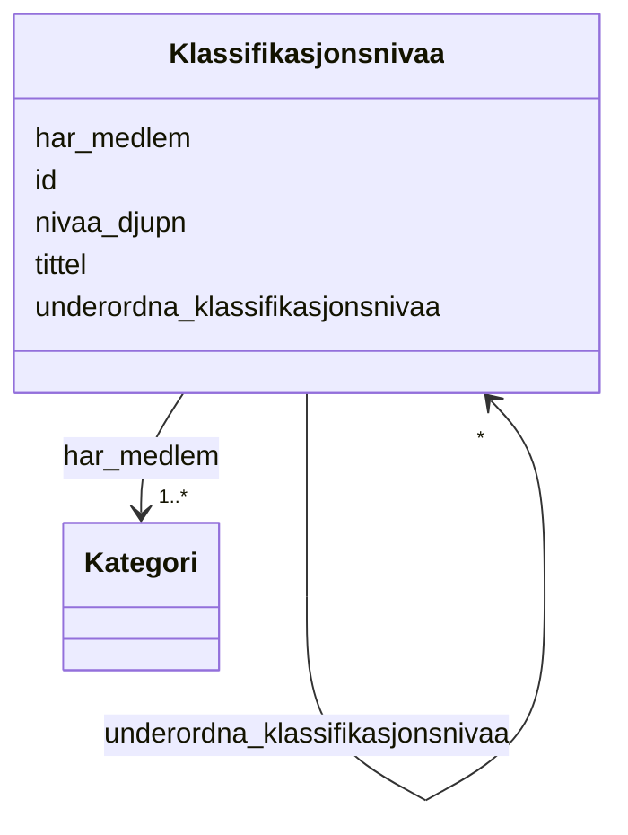

# Class: Klassifikasjonsnivaa 


_Eit nivå i ein klassifikasjon (xkos:ClassificationLevel)._


URI: [xkos:ClassificationLevel](http://rdf-vocabulary.ddialliance.org/xkos#ClassificationLevel)





<!-- no inheritance hierarchy -->

## Class Properties

| Property | Value |
| --- | --- |
| Class URI | [xkos:ClassificationLevel](http://rdf-vocabulary.ddialliance.org/xkos#ClassificationLevel) |


## Eigenskapar


  
  

  
  

  
  
    
  

  
  
    
  

  
  


### Obligatorisk

| Namn | Kardinalitet og domene | Beskriving |
| --- | --- | --- |
| [nivaa_djupn](nivaa_djupn.md) | 1 <br/> [NonNegativeInteger](nonnegativeinteger.md) | Djupna (nivånummer) i klassifikasjonsstrukturen (xkos:depth) |
| [har_medlem](har_medlem.md) | 1..* <br/> [Kategori](kategori.md) | Kategoriar som høyrer til dette nivået (skos:member) |


  
  

  
  
    
  

  
  

  
  

  
  


### Anbefalt

| Namn | Kardinalitet og domene | Beskriving |
| --- | --- | --- |
| [tittel](tittel.md) | * <br/> [LangString](langstring.md) | Namn/tittel på ressursen (dct:title) |


  
  

  
  

  
  

  
  

  
  
    
  


### Valgfri

| Namn | Kardinalitet og domene | Beskriving |
| --- | --- | --- |
| [underordna_klassifikasjonsnivaa](underordna_klassifikasjonsnivaa.md) | * <br/> [Klassifikasjonsnivaa](klassifikasjonsnivaa.md) | Underordna klassifikasjonsnivå (xkos:nextLevel) |


  
  
  
  
    
  

  
  
  
    
      
    
      
    
      
    
  
  

  
  
  
    
      
    
      
    
      
    
  
  

  
  
  
    
      
    
      
    
      
    
  
  

  
  
  
    
      
    
      
    
      
    
  
  


### Andre

| Namn | Kardinalitet og domene | Beskriving |
| --- | --- | --- |
| [id](id.md) | 1 <br/> [Uriorcurie](uriorcurie.md) | URI-identifikator for ressursen |


## Usages

| used by | used in | type | used |
| ---  | --- | --- | --- |
| [Klassifikasjon](klassifikasjon.md) | [forste_nivaa](forste_nivaa.md) | range | [Klassifikasjonsnivaa](klassifikasjonsnivaa.md) |
| [Klassifikasjonsnivaa](klassifikasjonsnivaa.md) | [underordna_klassifikasjonsnivaa](underordna_klassifikasjonsnivaa.md) | range | [Klassifikasjonsnivaa](klassifikasjonsnivaa.md) |
| [Kategori](kategori.md) | [tilhorande_klassifikasjonsnivaa](tilhorande_klassifikasjonsnivaa.md) | range | [Klassifikasjonsnivaa](klassifikasjonsnivaa.md) |


## Identifier and Mapping Information


### Schema Source


* from schema: https://data.norge.no/linkml/xkos-ap-no


## Mappings

| Mapping Type | Mapped Value |
| ---  | ---  |
| self | xkos:ClassificationLevel |
| native | https://data.norge.no/linkml/xkos-ap-no/Klassifikasjonsnivaa |


## LinkML Source

<!-- TODO: investigate https://stackoverflow.com/questions/37606292/how-to-create-tabbed-code-blocks-in-mkdocs-or-sphinx -->

### Direct

<details>
```yaml
name: Klassifikasjonsnivaa
description: Eit nivå i ein klassifikasjon (xkos:ClassificationLevel).
from_schema: https://data.norge.no/linkml/xkos-ap-no
slots:
- id
- tittel
- nivaa_djupn
- har_medlem
- underordna_klassifikasjonsnivaa
slot_usage:
  tittel:
    name: tittel
    in_subset:
    - Anbefalt
  nivaa_djupn:
    name: nivaa_djupn
    in_subset:
    - Obligatorisk
    required: true
  har_medlem:
    name: har_medlem
    in_subset:
    - Obligatorisk
    required: true
  underordna_klassifikasjonsnivaa:
    name: underordna_klassifikasjonsnivaa
    in_subset:
    - Valgfri
class_uri: xkos:ClassificationLevel

```
</details>

### Induced

<details>
```yaml
name: Klassifikasjonsnivaa
description: Eit nivå i ein klassifikasjon (xkos:ClassificationLevel).
from_schema: https://data.norge.no/linkml/xkos-ap-no
slot_usage:
  tittel:
    name: tittel
    in_subset:
    - Anbefalt
  nivaa_djupn:
    name: nivaa_djupn
    in_subset:
    - Obligatorisk
    required: true
  har_medlem:
    name: har_medlem
    in_subset:
    - Obligatorisk
    required: true
  underordna_klassifikasjonsnivaa:
    name: underordna_klassifikasjonsnivaa
    in_subset:
    - Valgfri
attributes:
  id:
    name: id
    description: URI-identifikator for ressursen.
    from_schema: https://data.norge.no/linkml/xkos-ap-no
    rank: 1000
    identifier: true
    alias: id
    owner: Klassifikasjonsnivaa
    domain_of:
    - Klassifikasjon
    - Klassifikasjonsnivaa
    - Kategori
    - Klassifikasjonssamanlikning
    - Kategorisamanlikning
    - Organisasjon
    - Tidsrom
    - Mediatype
    - Konsept
    - Begrepssamling
    range: uriorcurie
    required: true
  tittel:
    name: tittel
    description: Namn/tittel på ressursen (dct:title).
    in_subset:
    - Anbefalt
    from_schema: https://data.norge.no/linkml/xkos-ap-no
    rank: 1000
    slot_uri: dct:title
    alias: tittel
    owner: Klassifikasjonsnivaa
    domain_of:
    - Klassifikasjon
    - Klassifikasjonsnivaa
    - Klassifikasjonssamanlikning
    range: LangString
    multivalued: true
  nivaa_djupn:
    name: nivaa_djupn
    description: Djupna (nivånummer) i klassifikasjonsstrukturen (xkos:depth).
    in_subset:
    - Obligatorisk
    from_schema: https://data.norge.no/linkml/xkos-ap-no
    rank: 1000
    slot_uri: xkos:depth
    alias: nivaa_djupn
    owner: Klassifikasjonsnivaa
    domain_of:
    - Klassifikasjonsnivaa
    range: NonNegativeInteger
    required: true
  har_medlem:
    name: har_medlem
    description: Kategoriar som høyrer til dette nivået (skos:member).
    in_subset:
    - Obligatorisk
    from_schema: https://data.norge.no/linkml/xkos-ap-no
    rank: 1000
    slot_uri: skos:member
    alias: har_medlem
    owner: Klassifikasjonsnivaa
    domain_of:
    - Klassifikasjonsnivaa
    range: Kategori
    required: true
    multivalued: true
  underordna_klassifikasjonsnivaa:
    name: underordna_klassifikasjonsnivaa
    description: Underordna klassifikasjonsnivå (xkos:nextLevel).
    in_subset:
    - Valgfri
    from_schema: https://data.norge.no/linkml/xkos-ap-no
    rank: 1000
    slot_uri: xkos:nextLevel
    alias: underordna_klassifikasjonsnivaa
    owner: Klassifikasjonsnivaa
    domain_of:
    - Klassifikasjonsnivaa
    range: Klassifikasjonsnivaa
    multivalued: true
class_uri: xkos:ClassificationLevel

```
</details>