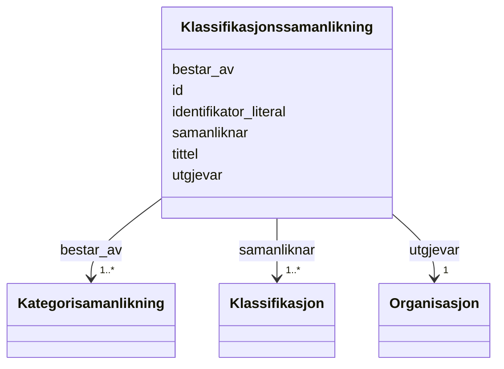

# Class: Klassifikasjonssamanlikning 


_Ein samanlikning mellom to klassifikasjonar (xkos:Correspondence)._


URI: [xkos:Correspondence](http://rdf-vocabulary.ddialliance.org/xkos#Correspondence)





<!-- no inheritance hierarchy -->

## Class Properties

| Property | Value |
| --- | --- |
| Class URI | [xkos:Correspondence](http://rdf-vocabulary.ddialliance.org/xkos#Correspondence) |


## Eigenskapar


  
  

  
  
    
  

  
  
    
  

  
  
    
  

  
  
    
  

  
  
    
  


### Obligatorisk

| Namn | Kardinalitet og domene | Beskriving |
| --- | --- | --- |
| [identifikator_literal](identifikator_literal.md) | 1 <br/> [String](string.md) | Tekstleg identifikator for ressursen (dct:identifier) |
| [tittel](tittel.md) | 1..* <br/> [LangString](langstring.md) | Namn/tittel på ressursen (dct:title) |
| [utgjevar](utgjevar.md) | 1 <br/> [Organisasjon](organisasjon.md) | Organisasjon som er ansvarleg utgjevar (dct:publisher) |
| [samanliknar](samanliknar.md) | 1..* <br/> [Klassifikasjon](klassifikasjon.md) | Klassifikasjonar som er samanlikna i korrespondansen (xkos:compares) |
| [bestar_av](bestar_av.md) | 1..* <br/> [Kategorisamanlikning](kategorisamanlikning.md) | Kategorisamanlikningar som inngår i klassifikasjonssamanlikninga (xkos:madeOf... |


  
  

  
  

  
  

  
  

  
  

  
  


  
  

  
  

  
  

  
  

  
  

  
  


  
  
  
  
    
  

  
  
  
    
      
    
      
    
      
    
  
  

  
  
  
    
      
    
      
    
      
    
  
  

  
  
  
    
      
    
      
    
      
    
  
  

  
  
  
    
      
    
      
    
      
    
  
  

  
  
  
    
      
    
      
    
      
    
  
  


### Andre

| Namn | Kardinalitet og domene | Beskriving |
| --- | --- | --- |
| [id](id.md) | 1 <br/> [Uriorcurie](uriorcurie.md) | URI-identifikator for ressursen |


## Identifier and Mapping Information


### Schema Source


* from schema: https://data.norge.no/linkml/xkos-ap-no


## Mappings

| Mapping Type | Mapped Value |
| ---  | ---  |
| self | xkos:Correspondence |
| native | https://data.norge.no/linkml/xkos-ap-no/Klassifikasjonssamanlikning |


## LinkML Source

<!-- TODO: investigate https://stackoverflow.com/questions/37606292/how-to-create-tabbed-code-blocks-in-mkdocs-or-sphinx -->

### Direct

<details>
```yaml
name: Klassifikasjonssamanlikning
description: Ein samanlikning mellom to klassifikasjonar (xkos:Correspondence).
from_schema: https://data.norge.no/linkml/xkos-ap-no
slots:
- id
- identifikator_literal
- tittel
- utgjevar
- samanliknar
- bestar_av
slot_usage:
  identifikator_literal:
    name: identifikator_literal
    in_subset:
    - Obligatorisk
    required: true
  tittel:
    name: tittel
    in_subset:
    - Obligatorisk
    required: true
  utgjevar:
    name: utgjevar
    in_subset:
    - Obligatorisk
    required: true
  samanliknar:
    name: samanliknar
    in_subset:
    - Obligatorisk
    required: true
  bestar_av:
    name: bestar_av
    in_subset:
    - Obligatorisk
    required: true
class_uri: xkos:Correspondence

```
</details>

### Induced

<details>
```yaml
name: Klassifikasjonssamanlikning
description: Ein samanlikning mellom to klassifikasjonar (xkos:Correspondence).
from_schema: https://data.norge.no/linkml/xkos-ap-no
slot_usage:
  identifikator_literal:
    name: identifikator_literal
    in_subset:
    - Obligatorisk
    required: true
  tittel:
    name: tittel
    in_subset:
    - Obligatorisk
    required: true
  utgjevar:
    name: utgjevar
    in_subset:
    - Obligatorisk
    required: true
  samanliknar:
    name: samanliknar
    in_subset:
    - Obligatorisk
    required: true
  bestar_av:
    name: bestar_av
    in_subset:
    - Obligatorisk
    required: true
attributes:
  id:
    name: id
    description: URI-identifikator for ressursen.
    from_schema: https://data.norge.no/linkml/xkos-ap-no
    rank: 1000
    identifier: true
    alias: id
    owner: Klassifikasjonssamanlikning
    domain_of:
    - Klassifikasjon
    - Klassifikasjonsnivaa
    - Kategori
    - Klassifikasjonssamanlikning
    - Kategorisamanlikning
    - Organisasjon
    - Tidsrom
    - Mediatype
    - Konsept
    - Begrepssamling
    range: uriorcurie
    required: true
  identifikator_literal:
    name: identifikator_literal
    description: Tekstleg identifikator for ressursen (dct:identifier).
    in_subset:
    - Obligatorisk
    from_schema: https://data.norge.no/linkml/xkos-ap-no
    rank: 1000
    slot_uri: dct:identifier
    alias: identifikator_literal
    owner: Klassifikasjonssamanlikning
    domain_of:
    - Klassifikasjon
    - Klassifikasjonssamanlikning
    range: string
    required: true
  tittel:
    name: tittel
    description: Namn/tittel på ressursen (dct:title).
    in_subset:
    - Obligatorisk
    from_schema: https://data.norge.no/linkml/xkos-ap-no
    rank: 1000
    slot_uri: dct:title
    alias: tittel
    owner: Klassifikasjonssamanlikning
    domain_of:
    - Klassifikasjon
    - Klassifikasjonsnivaa
    - Klassifikasjonssamanlikning
    range: LangString
    required: true
    multivalued: true
  utgjevar:
    name: utgjevar
    description: Organisasjon som er ansvarleg utgjevar (dct:publisher).
    in_subset:
    - Obligatorisk
    from_schema: https://data.norge.no/linkml/xkos-ap-no
    rank: 1000
    slot_uri: dct:publisher
    alias: utgjevar
    owner: Klassifikasjonssamanlikning
    domain_of:
    - Klassifikasjon
    - Klassifikasjonssamanlikning
    range: Organisasjon
    required: true
  samanliknar:
    name: samanliknar
    description: Klassifikasjonar som er samanlikna i korrespondansen (xkos:compares).
    in_subset:
    - Obligatorisk
    from_schema: https://data.norge.no/linkml/xkos-ap-no
    rank: 1000
    slot_uri: xkos:compares
    alias: samanliknar
    owner: Klassifikasjonssamanlikning
    domain_of:
    - Klassifikasjonssamanlikning
    range: Klassifikasjon
    required: true
    multivalued: true
  bestar_av:
    name: bestar_av
    description: Kategorisamanlikningar som inngår i klassifikasjonssamanlikninga
      (xkos:madeOf).
    in_subset:
    - Obligatorisk
    from_schema: https://data.norge.no/linkml/xkos-ap-no
    rank: 1000
    slot_uri: xkos:madeOf
    alias: bestar_av
    owner: Klassifikasjonssamanlikning
    domain_of:
    - Klassifikasjonssamanlikning
    range: Kategorisamanlikning
    required: true
    multivalued: true
class_uri: xkos:Correspondence

```
</details>