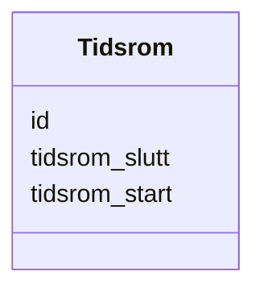

# Class: Tidsrom 


_Eit tidsrom med start- og/eller sluttdato (dct:PeriodOfTime)._


URI: [dct:PeriodOfTime](http://purl.org/dc/terms/PeriodOfTime)





<!-- no inheritance hierarchy -->

## Class Properties

| Property | Value |
| --- | --- |
| Class URI | [dct:PeriodOfTime](http://purl.org/dc/terms/PeriodOfTime) |


## Eigenskapar


  
  

  
  

  
  


  
  

  
  

  
  


  
  

  
  

  
  


  
  
  
  
    
  

  
  
  
  
    
  

  
  
  
  
    
  


### Andre

| Namn | Kardinalitet og domene | Beskriving |
| --- | --- | --- |
| [id](id.md) | 1 <br/> [Uriorcurie](uriorcurie.md) | URI-identifikator for ressursen |
| [tidsrom_start](tidsrom_start.md) | 0..1 <br/> [Date](date.md) | Startdato for tidsromet (dct:startDate) |
| [tidsrom_slutt](tidsrom_slutt.md) | 0..1 <br/> [Date](date.md) | Sluttdato for tidsromet (dct:endDate) |


## Usages

| used by | used in | type | used |
| ---  | --- | --- | --- |
| [Klassifikasjon](klassifikasjon.md) | [gjeld_for_tidsrom](gjeld_for_tidsrom.md) | range | [Tidsrom](tidsrom.md) |


## Identifier and Mapping Information


### Schema Source


* from schema: https://data.norge.no/linkml/xkos-ap-no


## Mappings

| Mapping Type | Mapped Value |
| ---  | ---  |
| self | dct:PeriodOfTime |
| native | https://data.norge.no/linkml/xkos-ap-no/Tidsrom |


## LinkML Source

<!-- TODO: investigate https://stackoverflow.com/questions/37606292/how-to-create-tabbed-code-blocks-in-mkdocs-or-sphinx -->

### Direct

<details>
```yaml
name: Tidsrom
description: Eit tidsrom med start- og/eller sluttdato (dct:PeriodOfTime).
from_schema: https://data.norge.no/linkml/xkos-ap-no
slots:
- id
- tidsrom_start
- tidsrom_slutt
class_uri: dct:PeriodOfTime

```
</details>

### Induced

<details>
```yaml
name: Tidsrom
description: Eit tidsrom med start- og/eller sluttdato (dct:PeriodOfTime).
from_schema: https://data.norge.no/linkml/xkos-ap-no
attributes:
  id:
    name: id
    description: URI-identifikator for ressursen.
    from_schema: https://data.norge.no/linkml/xkos-ap-no
    rank: 1000
    identifier: true
    alias: id
    owner: Tidsrom
    domain_of:
    - Klassifikasjon
    - Klassifikasjonsnivaa
    - Kategori
    - Klassifikasjonssamanlikning
    - Kategorisamanlikning
    - Organisasjon
    - Tidsrom
    - Mediatype
    - Konsept
    - Begrepssamling
    range: uriorcurie
    required: true
  tidsrom_start:
    name: tidsrom_start
    description: Startdato for tidsromet (dct:startDate).
    from_schema: https://data.norge.no/linkml/xkos-ap-no
    rank: 1000
    slot_uri: dct:startDate
    alias: tidsrom_start
    owner: Tidsrom
    domain_of:
    - Tidsrom
    range: date
  tidsrom_slutt:
    name: tidsrom_slutt
    description: Sluttdato for tidsromet (dct:endDate).
    from_schema: https://data.norge.no/linkml/xkos-ap-no
    rank: 1000
    slot_uri: dct:endDate
    alias: tidsrom_slutt
    owner: Tidsrom
    domain_of:
    - Tidsrom
    range: date
class_uri: dct:PeriodOfTime

```
</details>