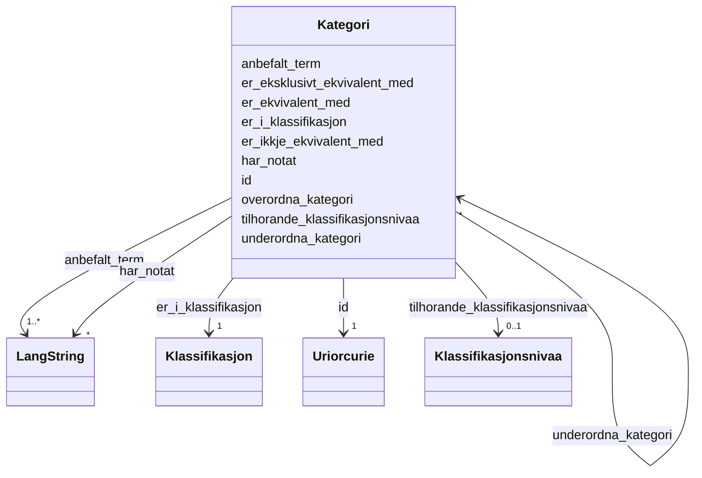

# Class: Kategori 


_Ein kategori i ein klassifikasjon (skos:Concept)._


URI: [skos:Concept](http://www.w3.org/2004/02/skos/core#Concept)





<!-- no inheritance hierarchy -->

## Class Properties

| Property | Value |
| --- | --- |
| Class URI | [skos:Concept](http://www.w3.org/2004/02/skos/core#Concept) |


## Eigenskapar


  
  

  
  
    
  

  
  
    
  

  
  

  
  

  
  

  
  

  
  

  
  

  
  


### Obligatorisk

| Namn | Kardinalitet og domene | Beskriving |
| --- | --- | --- |
| [anbefalt_term](anbefalt_term.md) | 1..* <br/> [LangString](langstring.md) | Føretrukke term/namn for ressursen (skos:prefLabel) |
| [er_i_klassifikasjon](er_i_klassifikasjon.md) | 1 <br/> [Klassifikasjon](klassifikasjon.md) | Klassifikasjonen kategorien tilhøyrer (skos:inScheme) |


  
  

  
  

  
  

  
  
    
  

  
  
    
  

  
  
    
  

  
  

  
  

  
  

  
  


### Anbefalt

| Namn | Kardinalitet og domene | Beskriving |
| --- | --- | --- |
| [tilhorande_klassifikasjonsnivaa](tilhorande_klassifikasjonsnivaa.md) | 0..1 <br/> [Klassifikasjonsnivaa](klassifikasjonsnivaa.md) | Klassifikasjonsnivå kategorien høyrer til (xkos:belongsTo) |
| [overordna_kategori](overordna_kategori.md) | * <br/> [Kategori](kategori.md) | Overordna kategori (skos:broader) |
| [underordna_kategori](underordna_kategori.md) | * <br/> [Kategori](kategori.md) | Underordna kategori (skos:narrower) |


  
  

  
  

  
  

  
  

  
  

  
  

  
  
    
  

  
  
    
  

  
  
    
  

  
  
    
  


### Valgfri

| Namn | Kardinalitet og domene | Beskriving |
| --- | --- | --- |
| [har_notat](har_notat.md) | * <br/> [LangString](langstring.md) | Fritekstnotat om kategorien (skos:note) |
| [er_ekvivalent_med](er_ekvivalent_med.md) | * <br/> [Kategori](kategori.md) | Breid ekvivalens til kategori i annan klassifikasjon (uneskos:broadMatch) |
| [er_eksklusivt_ekvivalent_med](er_eksklusivt_ekvivalent_med.md) | * <br/> [Kategori](kategori.md) | Eksklusiv breid ekvivalens (xkos:exclusivelyBroadMatch) |
| [er_ikkje_ekvivalent_med](er_ikkje_ekvivalent_med.md) | * <br/> [Kategori](kategori.md) | Klar ikkje-ekvivalens til kategori i annan klassifikasjon (xkos:disjointMatch... |


  
  
  
  
    
  

  
  
  
    
      
    
      
    
      
    
  
  

  
  
  
    
      
    
      
    
      
    
  
  

  
  
  
    
      
    
      
    
      
    
  
  

  
  
  
    
      
    
      
    
      
    
  
  

  
  
  
    
      
    
      
    
      
    
  
  

  
  
  
    
      
    
      
    
      
    
  
  

  
  
  
    
      
    
      
    
      
    
  
  

  
  
  
    
      
    
      
    
      
    
  
  

  
  
  
    
      
    
      
    
      
    
  
  


### Andre

| Namn | Kardinalitet og domene | Beskriving |
| --- | --- | --- |
| [id](id.md) | 1 <br/> [xsd:anyURI](http://www.w3.org/2001/XMLSchema#anyURI) | URI-identifikator for ressursen |


## Usages

| used by | used in | type | used |
| ---  | --- | --- | --- |
| [Klassifikasjonsnivaa](klassifikasjonsnivaa.md) | [har_medlem](har_medlem.md) | range | [Kategori](kategori.md) |
| [Kategori](kategori.md) | [overordna_kategori](overordna_kategori.md) | range | [Kategori](kategori.md) |
| [Kategori](kategori.md) | [underordna_kategori](underordna_kategori.md) | range | [Kategori](kategori.md) |
| [Kategori](kategori.md) | [er_ekvivalent_med](er_ekvivalent_med.md) | range | [Kategori](kategori.md) |
| [Kategori](kategori.md) | [er_eksklusivt_ekvivalent_med](er_eksklusivt_ekvivalent_med.md) | range | [Kategori](kategori.md) |
| [Kategori](kategori.md) | [er_ikkje_ekvivalent_med](er_ikkje_ekvivalent_med.md) | range | [Kategori](kategori.md) |
| [Kategorisamanlikning](kategorisamanlikning.md) | [kjeldeomgrep](kjeldeomgrep.md) | range | [Kategori](kategori.md) |
| [Kategorisamanlikning](kategorisamanlikning.md) | [maalomgrep](maalomgrep.md) | range | [Kategori](kategori.md) |


## Identifier and Mapping Information


### Schema Source


* from schema: https://data.norge.no/ap-no/xkos-ap-no


## Mappings

| Mapping Type | Mapped Value |
| ---  | ---  |
| self | skos:Concept |
| native | https://data.norge.no/ap-no/xkos-ap-no/Kategori |


## LinkML Source

<!-- TODO: investigate https://stackoverflow.com/questions/37606292/how-to-create-tabbed-code-blocks-in-mkdocs-or-sphinx -->

### Direct

<details>
```yaml
name: Kategori
description: Ein kategori i ein klassifikasjon (skos:Concept).
from_schema: https://data.norge.no/ap-no/xkos-ap-no
rank: 1000
slots:
- id
- anbefalt_term
- er_i_klassifikasjon
- tilhorande_klassifikasjonsnivaa
- overordna_kategori
- underordna_kategori
- har_notat
- er_ekvivalent_med
- er_eksklusivt_ekvivalent_med
- er_ikkje_ekvivalent_med
slot_usage:
  anbefalt_term:
    name: anbefalt_term
    in_subset:
    - Obligatorisk
    required: true
  er_i_klassifikasjon:
    name: er_i_klassifikasjon
    in_subset:
    - Obligatorisk
    required: true
  tilhorande_klassifikasjonsnivaa:
    name: tilhorande_klassifikasjonsnivaa
    in_subset:
    - Anbefalt
  overordna_kategori:
    name: overordna_kategori
    in_subset:
    - Anbefalt
  underordna_kategori:
    name: underordna_kategori
    in_subset:
    - Anbefalt
  har_notat:
    name: har_notat
    in_subset:
    - Valgfri
  er_ekvivalent_med:
    name: er_ekvivalent_med
    in_subset:
    - Valgfri
  er_eksklusivt_ekvivalent_med:
    name: er_eksklusivt_ekvivalent_med
    in_subset:
    - Valgfri
  er_ikkje_ekvivalent_med:
    name: er_ikkje_ekvivalent_med
    in_subset:
    - Valgfri
class_uri: skos:Concept

```
</details>

### Induced

<details>
```yaml
name: Kategori
description: Ein kategori i ein klassifikasjon (skos:Concept).
from_schema: https://data.norge.no/ap-no/xkos-ap-no
rank: 1000
slot_usage:
  anbefalt_term:
    name: anbefalt_term
    in_subset:
    - Obligatorisk
    required: true
  er_i_klassifikasjon:
    name: er_i_klassifikasjon
    in_subset:
    - Obligatorisk
    required: true
  tilhorande_klassifikasjonsnivaa:
    name: tilhorande_klassifikasjonsnivaa
    in_subset:
    - Anbefalt
  overordna_kategori:
    name: overordna_kategori
    in_subset:
    - Anbefalt
  underordna_kategori:
    name: underordna_kategori
    in_subset:
    - Anbefalt
  har_notat:
    name: har_notat
    in_subset:
    - Valgfri
  er_ekvivalent_med:
    name: er_ekvivalent_med
    in_subset:
    - Valgfri
  er_eksklusivt_ekvivalent_med:
    name: er_eksklusivt_ekvivalent_med
    in_subset:
    - Valgfri
  er_ikkje_ekvivalent_med:
    name: er_ikkje_ekvivalent_med
    in_subset:
    - Valgfri
attributes:
  id:
    name: id
    description: URI-identifikator for ressursen.
    from_schema: https://data.norge.no/ap-no/common-ap-no
    identifier: true
    owner: Kategori
    domain_of:
    - Mediatype
    - Konsept
    - Begrepssamling
    - Klassifikasjon
    - Klassifikasjonsnivaa
    - Kategori
    - Klassifikasjonssamanlikning
    - Kategorisamanlikning
    - Organisasjon
    - Tidsrom
    range: uriorcurie
    required: true
  anbefalt_term:
    name: anbefalt_term
    description: Føretrukke term/namn for ressursen (skos:prefLabel).
    in_subset:
    - Obligatorisk
    from_schema: https://data.norge.no/ap-no/common-ap-no
    slot_uri: skos:prefLabel
    owner: Kategori
    domain_of:
    - Kategori
    range: LangString
    required: true
    multivalued: true
  er_i_klassifikasjon:
    name: er_i_klassifikasjon
    description: Klassifikasjonen kategorien tilhøyrer (skos:inScheme).
    in_subset:
    - Obligatorisk
    from_schema: https://data.norge.no/ap-no/xkos-ap-no
    rank: 1000
    slot_uri: skos:inScheme
    owner: Kategori
    domain_of:
    - Kategori
    range: Klassifikasjon
    required: true
  tilhorande_klassifikasjonsnivaa:
    name: tilhorande_klassifikasjonsnivaa
    description: Klassifikasjonsnivå kategorien høyrer til (xkos:belongsTo).
    in_subset:
    - Anbefalt
    from_schema: https://data.norge.no/ap-no/xkos-ap-no
    rank: 1000
    slot_uri: xkos:belongsTo
    owner: Kategori
    domain_of:
    - Kategori
    range: Klassifikasjonsnivaa
  overordna_kategori:
    name: overordna_kategori
    description: Overordna kategori (skos:broader).
    in_subset:
    - Anbefalt
    from_schema: https://data.norge.no/ap-no/xkos-ap-no
    rank: 1000
    slot_uri: skos:broader
    owner: Kategori
    domain_of:
    - Kategori
    range: Kategori
    multivalued: true
  underordna_kategori:
    name: underordna_kategori
    description: Underordna kategori (skos:narrower).
    in_subset:
    - Anbefalt
    from_schema: https://data.norge.no/ap-no/xkos-ap-no
    rank: 1000
    slot_uri: skos:narrower
    owner: Kategori
    domain_of:
    - Kategori
    range: Kategori
    multivalued: true
  har_notat:
    name: har_notat
    description: Fritekstnotat om kategorien (skos:note).
    in_subset:
    - Valgfri
    from_schema: https://data.norge.no/ap-no/xkos-ap-no
    rank: 1000
    slot_uri: skos:note
    owner: Kategori
    domain_of:
    - Kategori
    range: LangString
    multivalued: true
  er_ekvivalent_med:
    name: er_ekvivalent_med
    description: Breid ekvivalens til kategori i annan klassifikasjon (uneskos:broadMatch).
    in_subset:
    - Valgfri
    from_schema: https://data.norge.no/ap-no/xkos-ap-no
    rank: 1000
    slot_uri: uneskos:broadMatch
    owner: Kategori
    domain_of:
    - Kategori
    range: Kategori
    multivalued: true
  er_eksklusivt_ekvivalent_med:
    name: er_eksklusivt_ekvivalent_med
    description: Eksklusiv breid ekvivalens (xkos:exclusivelyBroadMatch).
    in_subset:
    - Valgfri
    from_schema: https://data.norge.no/ap-no/xkos-ap-no
    rank: 1000
    slot_uri: xkos:exclusivelyBroadMatch
    owner: Kategori
    domain_of:
    - Kategori
    range: Kategori
    multivalued: true
  er_ikkje_ekvivalent_med:
    name: er_ikkje_ekvivalent_med
    description: Klar ikkje-ekvivalens til kategori i annan klassifikasjon (xkos:disjointMatch).
    in_subset:
    - Valgfri
    from_schema: https://data.norge.no/ap-no/xkos-ap-no
    rank: 1000
    slot_uri: xkos:disjointMatch
    owner: Kategori
    domain_of:
    - Kategori
    range: Kategori
    multivalued: true
class_uri: skos:Concept

```
</details>