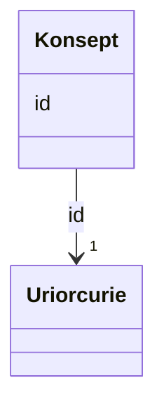

# Class: Konsept 


_Referanse til eit SKOS-omgrep frå eit kontrollert vokabular._


URI: [skos:Concept](http://www.w3.org/2004/02/skos/core#Concept)





<!-- no inheritance hierarchy -->

## Class Properties

| Property | Value |
| --- | --- |
| Class URI | [skos:Concept](http://www.w3.org/2004/02/skos/core#Concept) |


## Eigenskapar


  
  


  
  


  
  


  
  
  
  
    
  


### Andre

| Namn | Kardinalitet og domene | Beskriving |
| --- | --- | --- |
| [id](id.md) | 1 <br/> [xsd:anyURI](http://www.w3.org/2001/XMLSchema#anyURI) | URI-identifikator for ressursen |


## Usages

| used by | used in | type | used |
| ---  | --- | --- | --- |
| [Klassifikasjon](klassifikasjon.md) | [tema](tema.md) | range | [Konsept](konsept.md) |


## See Also

* [https://data.norge.no/concepts/02131737-bb20-3204-93e0-46678b7d57be](https://data.norge.no/concepts/02131737-bb20-3204-93e0-46678b7d57be)


## Identifier and Mapping Information


### Schema Source


* from schema: https://data.norge.no/ap-no/common-ap-no


## Mappings

| Mapping Type | Mapped Value |
| ---  | ---  |
| self | skos:Concept |
| native | https://data.norge.no/ap-no/common-ap-no/Konsept |


## LinkML Source

<!-- TODO: investigate https://stackoverflow.com/questions/37606292/how-to-create-tabbed-code-blocks-in-mkdocs-or-sphinx -->

### Direct

<details>
```yaml
name: Konsept
description: Referanse til eit SKOS-omgrep frå eit kontrollert vokabular.
from_schema: https://data.norge.no/ap-no/common-ap-no
see_also:
- https://data.norge.no/concepts/02131737-bb20-3204-93e0-46678b7d57be
slots:
- id
class_uri: skos:Concept

```
</details>

### Induced

<details>
```yaml
name: Konsept
description: Referanse til eit SKOS-omgrep frå eit kontrollert vokabular.
from_schema: https://data.norge.no/ap-no/common-ap-no
see_also:
- https://data.norge.no/concepts/02131737-bb20-3204-93e0-46678b7d57be
attributes:
  id:
    name: id
    description: URI-identifikator for ressursen.
    from_schema: https://data.norge.no/ap-no/common-ap-no
    identifier: true
    owner: Konsept
    domain_of:
    - Mediatype
    - Konsept
    - Begrepssamling
    - Klassifikasjon
    - Klassifikasjonsnivaa
    - Kategori
    - Klassifikasjonssamanlikning
    - Kategorisamanlikning
    - Organisasjon
    - Tidsrom
    range: uriorcurie
    required: true
class_uri: skos:Concept

```
</details>