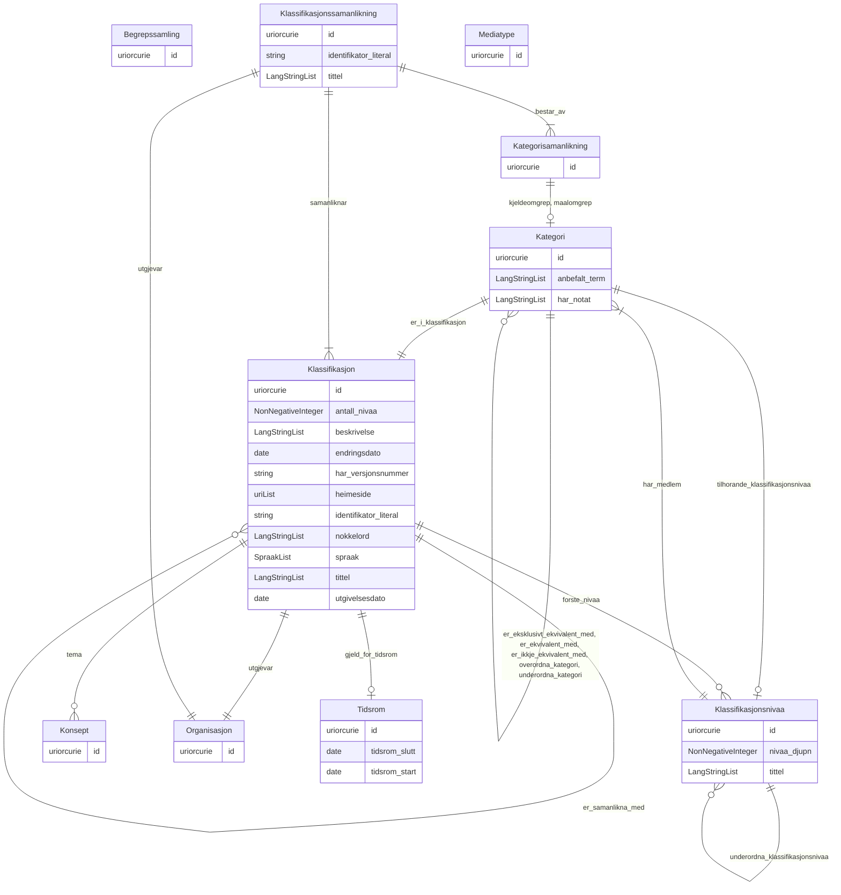

```mermaid
erDiagram
Begrepssamling {
    uriorcurie id  
}
Kategori {
    uriorcurie id  
    LangStringList anbefalt_term  
    LangStringList har_notat  
}
Kategorisamanlikning {
    uriorcurie id  
}
Klassifikasjon {
    uriorcurie id  
    NonNegativeInteger antall_nivaa  
    LangStringList beskrivelse  
    date endringsdato  
    string har_versjonsnummer  
    uriList heimeside  
    string identifikator_literal  
    LangStringList nokkelord  
    SpraakList spraak  
    LangStringList tittel  
    date utgivelsesdato  
}
Klassifikasjonsnivaa {
    uriorcurie id  
    NonNegativeInteger nivaa_djupn  
    LangStringList tittel  
}
Klassifikasjonssamanlikning {
    uriorcurie id  
    string identifikator_literal  
    LangStringList tittel  
}
Konsept {
    uriorcurie id  
}
Mediatype {
    uriorcurie id  
}
Organisasjon {
    uriorcurie id  
}
Tidsrom {
    uriorcurie id  
    date tidsrom_slutt  
    date tidsrom_start  
}

Kategori ||--|o Klassifikasjonsnivaa : "tilhorande_klassifikasjonsnivaa"
Kategori ||--|| Klassifikasjon : "er_i_klassifikasjon"
Kategori ||--}o Kategori : "er_eksklusivt_ekvivalent_med, er_ekvivalent_med, er_ikkje_ekvivalent_med, overordna_kategori, underordna_kategori"
Kategorisamanlikning ||--|o Kategori : "kjeldeomgrep, maalomgrep"
Klassifikasjon ||--|o Tidsrom : "gjeld_for_tidsrom"
Klassifikasjon ||--|| Organisasjon : "utgjevar"
Klassifikasjon ||--}o Klassifikasjon : "er_samanlikna_med"
Klassifikasjon ||--}o Klassifikasjonsnivaa : "forste_nivaa"
Klassifikasjon ||--}o Konsept : "tema"
Klassifikasjonsnivaa ||--}o Klassifikasjonsnivaa : "underordna_klassifikasjonsnivaa"
Klassifikasjonsnivaa ||--}| Kategori : "har_medlem"
Klassifikasjonssamanlikning ||--|| Organisasjon : "utgjevar"
Klassifikasjonssamanlikning ||--}| Kategorisamanlikning : "bestar_av"
Klassifikasjonssamanlikning ||--}| Klassifikasjon : "samanliknar"

```

