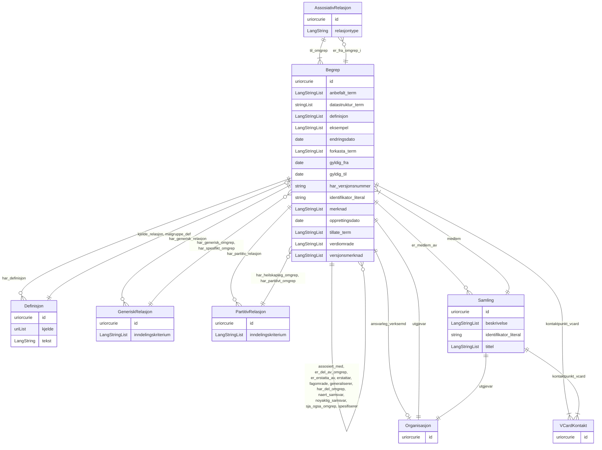

# brreg-begrep

Begrepskatalog for Registerenheten i Brønnøysund. Begreper modellert lokalt med midlertidige URI-ar, klare for validering og eksport til Felles Begrepskatalog.

URI: https://data.norge.no/linkml/brreg-begrep

Name: brreg-begrep

## Classes

### Andre

| Class | Description |
| --- | --- |

## Slots

| Slot | Description |
| --- | --- |
| [assosiative_relasjonar](klasser/assosiative_relasjonar.md) |  |
| [begrep](klasser/begrep.md) |  |
| [definisjoner](klasser/definisjoner.md) |  |
| [generiske_relasjonar](klasser/generiske_relasjonar.md) |  |
| [kontaktpunkt](klasser/kontaktpunkt.md) |  |
| [organisasjonar](klasser/organisasjonar.md) |  |
| [partitive_relasjonar](klasser/partitive_relasjonar.md) |  |
| [samlingar](klasser/samlingar.md) |  |

## Enumerations

| Enumeration | Description |
| --- | --- |

## Types

| Type | Description |
| --- | --- |

## Subsets

| Subset | Description |
| --- | --- |
| [Anbefalt](klasser/anbefalt.md) | Anbefalte eigenskapar i ein AP-NO-profil |
| [Obligatorisk](klasser/obligatorisk.md) | Obligatoriske eigenskapar i ein AP-NO-profil |
| [Valgfri](klasser/valgfri.md) | Valfrie eigenskapar i ein AP-NO-profil |

## Generated artifacts

| Artefakt | Fil |
|----------|-----|
| SHACL shapes | [brreg-begrep-shapes.ttl](brreg-begrep-shapes.ttl) |
| JSON-LD kontekst | [brreg-begrep-context.jsonld](brreg-begrep-context.jsonld) |
| JSON Schema | [brreg-begrep-schema.json](brreg-begrep-schema.json) |
| OWL ontologi | [brreg-begrep-ontology.ttl](brreg-begrep-ontology.ttl) |
| RDF/Turtle skjema | [brreg-begrep-schema.ttl](brreg-begrep-schema.ttl) |
| Python-klasser | [brreg-begrep-model.py](brreg-begrep-model.py) |
| Protobuf-skjema | [brreg-begrep-schema.proto](brreg-begrep-schema.proto) |
| ER-diagram (Mermaid) | [brreg-begrep-erdiagram.md](brreg-begrep-erdiagram.md) |
| Eksempeldata (Turtle) | [brreg-begrep-eksempel.ttl](brreg-begrep-eksempel.ttl) |
| PlantUML-diagram | [brreg-begrep.svg](diagrams/brreg-begrep.svg) · [brreg-begrep.puml](diagrams/brreg-begrep.puml) |
