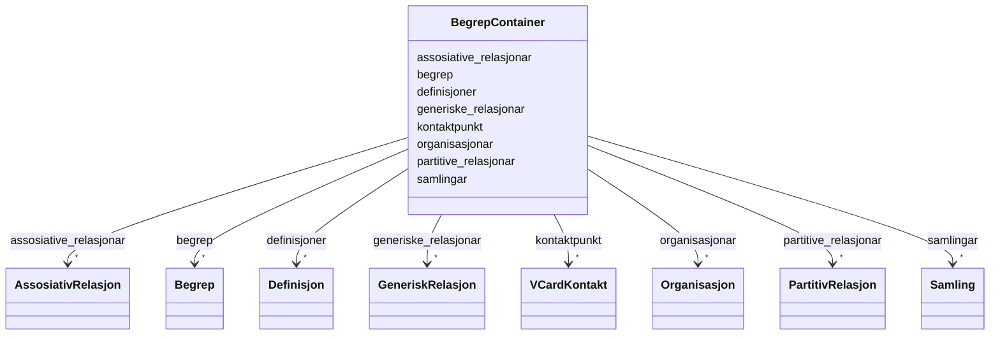

# Class: BegrepContainer 


URI: [https://data.norge.no/linkml/brreg-begrep/BegrepContainer](https://data.norge.no/linkml/brreg-begrep/BegrepContainer)





<!-- no inheritance hierarchy -->

## Class Properties

| Property | Value |
| --- | --- |
| Tree Root | Yes |


## Eigenskapar


  
  

  
  

  
  

  
  

  
  

  
  

  
  

  
  


  
  

  
  

  
  

  
  

  
  

  
  

  
  

  
  


  
  

  
  

  
  

  
  

  
  

  
  

  
  

  
  


  
  
  
  
    
  

  
  
  
  
    
  

  
  
  
  
    
  

  
  
  
  
    
  

  
  
  
  
    
  

  
  
  
  
    
  

  
  
  
  
    
  

  
  
  
  
    
  


### Andre

| Namn | Kardinalitet og domene | Beskriving |
| --- | --- | --- |
| [begrep](begrep.md) | * <br/> [Begrep](begrep.md) |  |
| [samlingar](samlingar.md) | * <br/> [Samling](samling.md) |  |
| [definisjoner](definisjoner.md) | * <br/> [Definisjon](definisjon.md) |  |
| [generiske_relasjonar](generiske_relasjonar.md) | * <br/> [GeneriskRelasjon](generiskrelasjon.md) |  |
| [partitive_relasjonar](partitive_relasjonar.md) | * <br/> [PartitivRelasjon](partitivrelasjon.md) |  |
| [assosiative_relasjonar](assosiative_relasjonar.md) | * <br/> [AssosiativRelasjon](assosiativrelasjon.md) |  |
| [organisasjonar](organisasjonar.md) | * <br/> [Organisasjon](organisasjon.md) |  |
| [kontaktpunkt](kontaktpunkt.md) | * <br/> [VCardKontakt](vcardkontakt.md) |  |


## Identifier and Mapping Information


### Schema Source


* from schema: https://data.norge.no/linkml/brreg-begrep


## Mappings

| Mapping Type | Mapped Value |
| ---  | ---  |
| self | https://data.norge.no/linkml/brreg-begrep/BegrepContainer |
| native | https://data.norge.no/linkml/brreg-begrep/BegrepContainer |


## LinkML Source

<!-- TODO: investigate https://stackoverflow.com/questions/37606292/how-to-create-tabbed-code-blocks-in-mkdocs-or-sphinx -->

### Direct

<details>
```yaml
name: BegrepContainer
from_schema: https://data.norge.no/linkml/brreg-begrep
rank: 1000
attributes:
  begrep:
    name: begrep
    from_schema: https://data.norge.no/linkml/brreg-begrep
    rank: 1000
    domain_of:
    - BegrepContainer
    range: Begrep
    multivalued: true
    inlined: true
    inlined_as_list: true
  samlingar:
    name: samlingar
    from_schema: https://data.norge.no/linkml/brreg-begrep
    rank: 1000
    domain_of:
    - BegrepContainer
    range: Samling
    multivalued: true
    inlined: true
    inlined_as_list: true
  definisjoner:
    name: definisjoner
    from_schema: https://data.norge.no/linkml/brreg-begrep
    rank: 1000
    domain_of:
    - BegrepContainer
    range: Definisjon
    multivalued: true
    inlined: true
    inlined_as_list: true
  generiske_relasjonar:
    name: generiske_relasjonar
    from_schema: https://data.norge.no/linkml/brreg-begrep
    rank: 1000
    domain_of:
    - BegrepContainer
    range: GeneriskRelasjon
    multivalued: true
    inlined: true
    inlined_as_list: true
  partitive_relasjonar:
    name: partitive_relasjonar
    from_schema: https://data.norge.no/linkml/brreg-begrep
    rank: 1000
    domain_of:
    - BegrepContainer
    range: PartitivRelasjon
    multivalued: true
    inlined: true
    inlined_as_list: true
  assosiative_relasjonar:
    name: assosiative_relasjonar
    from_schema: https://data.norge.no/linkml/brreg-begrep
    rank: 1000
    domain_of:
    - BegrepContainer
    range: AssosiativRelasjon
    multivalued: true
    inlined: true
    inlined_as_list: true
  organisasjonar:
    name: organisasjonar
    from_schema: https://data.norge.no/linkml/brreg-begrep
    rank: 1000
    domain_of:
    - BegrepContainer
    range: Organisasjon
    multivalued: true
    inlined: true
    inlined_as_list: true
  kontaktpunkt:
    name: kontaktpunkt
    from_schema: https://data.norge.no/linkml/brreg-begrep
    rank: 1000
    domain_of:
    - BegrepContainer
    range: VCardKontakt
    multivalued: true
    inlined: true
    inlined_as_list: true
tree_root: true

```
</details>

### Induced

<details>
```yaml
name: BegrepContainer
from_schema: https://data.norge.no/linkml/brreg-begrep
rank: 1000
attributes:
  begrep:
    name: begrep
    from_schema: https://data.norge.no/linkml/brreg-begrep
    rank: 1000
    owner: BegrepContainer
    domain_of:
    - BegrepContainer
    range: Begrep
    multivalued: true
    inlined: true
    inlined_as_list: true
  samlingar:
    name: samlingar
    from_schema: https://data.norge.no/linkml/brreg-begrep
    rank: 1000
    owner: BegrepContainer
    domain_of:
    - BegrepContainer
    range: Samling
    multivalued: true
    inlined: true
    inlined_as_list: true
  definisjoner:
    name: definisjoner
    from_schema: https://data.norge.no/linkml/brreg-begrep
    rank: 1000
    owner: BegrepContainer
    domain_of:
    - BegrepContainer
    range: Definisjon
    multivalued: true
    inlined: true
    inlined_as_list: true
  generiske_relasjonar:
    name: generiske_relasjonar
    from_schema: https://data.norge.no/linkml/brreg-begrep
    rank: 1000
    owner: BegrepContainer
    domain_of:
    - BegrepContainer
    range: GeneriskRelasjon
    multivalued: true
    inlined: true
    inlined_as_list: true
  partitive_relasjonar:
    name: partitive_relasjonar
    from_schema: https://data.norge.no/linkml/brreg-begrep
    rank: 1000
    owner: BegrepContainer
    domain_of:
    - BegrepContainer
    range: PartitivRelasjon
    multivalued: true
    inlined: true
    inlined_as_list: true
  assosiative_relasjonar:
    name: assosiative_relasjonar
    from_schema: https://data.norge.no/linkml/brreg-begrep
    rank: 1000
    owner: BegrepContainer
    domain_of:
    - BegrepContainer
    range: AssosiativRelasjon
    multivalued: true
    inlined: true
    inlined_as_list: true
  organisasjonar:
    name: organisasjonar
    from_schema: https://data.norge.no/linkml/brreg-begrep
    rank: 1000
    owner: BegrepContainer
    domain_of:
    - BegrepContainer
    range: Organisasjon
    multivalued: true
    inlined: true
    inlined_as_list: true
  kontaktpunkt:
    name: kontaktpunkt
    from_schema: https://data.norge.no/linkml/brreg-begrep
    rank: 1000
    owner: BegrepContainer
    domain_of:
    - BegrepContainer
    range: VCardKontakt
    multivalued: true
    inlined: true
    inlined_as_list: true
tree_root: true

```
</details>