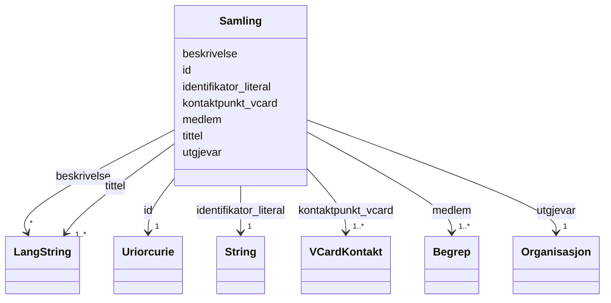

# Class: Samling 


_Ei namngitt samling av omgrep (skos:Collection)._


URI: [skos:Collection](http://www.w3.org/2004/02/skos/core#Collection)





<!-- no inheritance hierarchy -->

## Class Properties

| Property | Value |
| --- | --- |
| Class URI | [skos:Collection](http://www.w3.org/2004/02/skos/core#Collection) |


## Eigenskapar


  
  

  
  
    
  

  
  
    
  

  
  
    
  

  
  
    
  

  
  
    
  

  
  


### Obligatorisk

| Namn | Kardinalitet og domene | Beskriving |
| --- | --- | --- |
| [identifikator_literal](identifikator_literal.md) | 1 <br/> [xsd:string](http://www.w3.org/2001/XMLSchema#string) | Tekstleg identifikator for ressursen (dct:identifier) |
| [medlem](medlem.md) | 1..* <br/> [Begrep](begrep.md) | Omgrep som er medlem av samlinga (skos:member) |
| [kontaktpunkt_vcard](kontaktpunkt_vcard.md) | 1..* <br/> [VCardKontakt](vcardkontakt.md) | Kontaktpunkt (vCard) for omgrepet eller samlinga (dcat:contactPoint) |
| [tittel](tittel.md) | 1..* <br/> [LangString](langstring.md) | Namn/tittel på ressursen (dct:title) |
| [utgjevar](utgjevar.md) | 1 <br/> [Organisasjon](organisasjon.md) | Organisasjon ansvarleg for å publisere omgrepet (dct:publisher) |


  
  

  
  

  
  

  
  

  
  

  
  

  
  
    
  


### Anbefalt

| Namn | Kardinalitet og domene | Beskriving |
| --- | --- | --- |
| [beskrivelse](beskrivelse.md) | * <br/> [LangString](langstring.md) | Fritekstbeskrivelse av ressursen (dct:description) |


  
  

  
  

  
  

  
  

  
  

  
  

  
  


  
  
  
  
    
  

  
  
  
    
      
    
      
    
      
    
  
  

  
  
  
    
      
    
      
    
      
    
  
  

  
  
  
    
      
    
      
    
      
    
  
  

  
  
  
    
      
    
      
    
      
    
  
  

  
  
  
    
      
    
      
    
      
    
  
  

  
  
  
    
      
    
      
    
      
    
  
  


### Andre

| Namn | Kardinalitet og domene | Beskriving |
| --- | --- | --- |
| [id](id.md) | 1 <br/> [xsd:anyURI](http://www.w3.org/2001/XMLSchema#anyURI) | URI-identifikator for ressursen |


## Usages

| used by | used in | type | used |
| ---  | --- | --- | --- |
| [Begrep](begrep.md) | [er_medlem_av](er_medlem_av.md) | range | [Samling](samling.md) |
| [BegrepContainer](begrepcontainer.md) | [samlingar](samlingar.md) | range | [Samling](samling.md) |


## Identifier and Mapping Information


### Schema Source


* from schema: https://data.norge.no/linkml/skos-ap-no


## Mappings

| Mapping Type | Mapped Value |
| ---  | ---  |
| self | skos:Collection |
| native | https://data.norge.no/linkml/skos-ap-no/Samling |


## LinkML Source

<!-- TODO: investigate https://stackoverflow.com/questions/37606292/how-to-create-tabbed-code-blocks-in-mkdocs-or-sphinx -->

### Direct

<details>
```yaml
name: Samling
description: Ei namngitt samling av omgrep (skos:Collection).
from_schema: https://data.norge.no/linkml/skos-ap-no
slots:
- id
- identifikator_literal
- medlem
- kontaktpunkt_vcard
- tittel
- utgjevar
- beskrivelse
slot_usage:
  identifikator_literal:
    name: identifikator_literal
    in_subset:
    - Obligatorisk
    required: true
  medlem:
    name: medlem
    in_subset:
    - Obligatorisk
    required: true
  kontaktpunkt_vcard:
    name: kontaktpunkt_vcard
    in_subset:
    - Obligatorisk
    required: true
  tittel:
    name: tittel
    in_subset:
    - Obligatorisk
    required: true
  utgjevar:
    name: utgjevar
    in_subset:
    - Obligatorisk
    required: true
  beskrivelse:
    name: beskrivelse
    in_subset:
    - Anbefalt
class_uri: skos:Collection

```
</details>

### Induced

<details>
```yaml
name: Samling
description: Ei namngitt samling av omgrep (skos:Collection).
from_schema: https://data.norge.no/linkml/skos-ap-no
slot_usage:
  identifikator_literal:
    name: identifikator_literal
    in_subset:
    - Obligatorisk
    required: true
  medlem:
    name: medlem
    in_subset:
    - Obligatorisk
    required: true
  kontaktpunkt_vcard:
    name: kontaktpunkt_vcard
    in_subset:
    - Obligatorisk
    required: true
  tittel:
    name: tittel
    in_subset:
    - Obligatorisk
    required: true
  utgjevar:
    name: utgjevar
    in_subset:
    - Obligatorisk
    required: true
  beskrivelse:
    name: beskrivelse
    in_subset:
    - Anbefalt
attributes:
  id:
    name: id
    description: URI-identifikator for ressursen.
    from_schema: https://data.norge.no/linkml/common-ap-no
    identifier: true
    owner: Samling
    domain_of:
    - Mediatype
    - Konsept
    - Begrepssamling
    - Organisasjon
    - VCardKontakt
    - Begrep
    - Definisjon
    - AssosiativRelasjon
    - GeneriskRelasjon
    - PartitivRelasjon
    - Samling
    range: uriorcurie
    required: true
  identifikator_literal:
    name: identifikator_literal
    description: Tekstleg identifikator for ressursen (dct:identifier).
    in_subset:
    - Obligatorisk
    from_schema: https://data.norge.no/linkml/common-ap-no
    slot_uri: dct:identifier
    owner: Samling
    domain_of:
    - Begrep
    - Samling
    range: string
    required: true
  medlem:
    name: medlem
    description: Omgrep som er medlem av samlinga (skos:member).
    in_subset:
    - Obligatorisk
    from_schema: https://data.norge.no/linkml/skos-ap-no
    slot_uri: skos:member
    owner: Samling
    domain_of:
    - Samling
    range: Begrep
    required: true
    multivalued: true
  kontaktpunkt_vcard:
    name: kontaktpunkt_vcard
    description: Kontaktpunkt (vCard) for omgrepet eller samlinga (dcat:contactPoint).
    in_subset:
    - Obligatorisk
    from_schema: https://data.norge.no/linkml/skos-ap-no
    slot_uri: dcat:contactPoint
    owner: Samling
    domain_of:
    - Begrep
    - Samling
    range: VCardKontakt
    required: true
    multivalued: true
  tittel:
    name: tittel
    description: Namn/tittel på ressursen (dct:title).
    in_subset:
    - Obligatorisk
    from_schema: https://data.norge.no/linkml/common-ap-no
    slot_uri: dct:title
    owner: Samling
    domain_of:
    - Samling
    range: LangString
    required: true
    multivalued: true
  utgjevar:
    name: utgjevar
    description: Organisasjon ansvarleg for å publisere omgrepet (dct:publisher).
    in_subset:
    - Obligatorisk
    from_schema: https://data.norge.no/linkml/skos-ap-no
    slot_uri: dct:publisher
    owner: Samling
    domain_of:
    - Begrep
    - Samling
    range: Organisasjon
    required: true
  beskrivelse:
    name: beskrivelse
    description: Fritekstbeskrivelse av ressursen (dct:description).
    in_subset:
    - Anbefalt
    from_schema: https://data.norge.no/linkml/common-ap-no
    slot_uri: dct:description
    owner: Samling
    domain_of:
    - Samling
    range: LangString
    multivalued: true
class_uri: skos:Collection

```
</details>