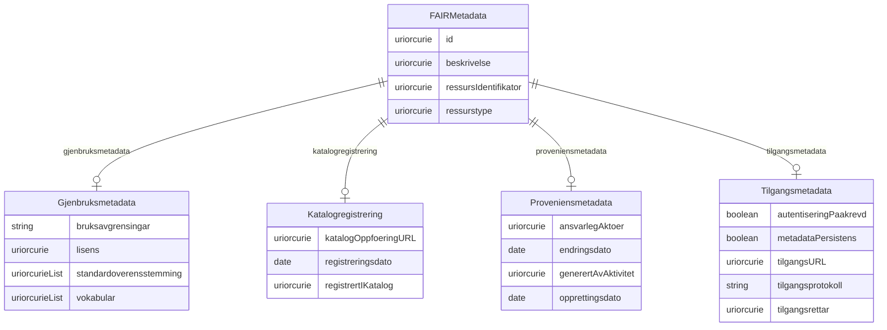

```mermaid
erDiagram
FAIRMetadata {
    uriorcurie id  
    uriorcurie beskrivelse  
    uriorcurie ressursIdentifikator  
    uriorcurie ressurstype  
}
Gjenbruksmetadata {
    string bruksavgrensingar  
    uriorcurie lisens  
    uriorcurieList standardoverensstemming  
    uriorcurieList vokabular  
}
Katalogregistrering {
    uriorcurie katalogOppfoeringURL  
    date registreringsdato  
    uriorcurie registrertIKatalog  
}
Proveniensmetadata {
    uriorcurie ansvarlegAktoer  
    date endringsdato  
    uriorcurie generertAvAktivitet  
    date opprettingsdato  
}
Tilgangsmetadata {
    boolean autentiseringPaakrevd  
    boolean metadataPersistens  
    uriorcurie tilgangsURL  
    string tilgangsprotokoll  
    uriorcurie tilgangsrettar  
}

FAIRMetadata ||--|o Gjenbruksmetadata : "gjenbruksmetadata"
FAIRMetadata ||--|o Katalogregistrering : "katalogregistrering"
FAIRMetadata ||--|o Proveniensmetadata : "proveniensmetadata"
FAIRMetadata ||--|o Tilgangsmetadata : "tilgangsmetadata"


```
