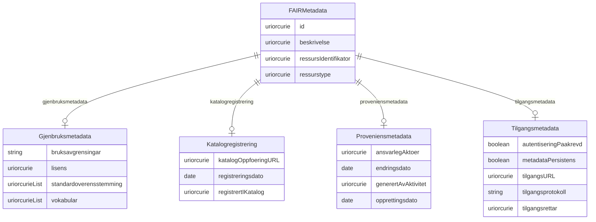

# fair-metadata

FAIR metadata-overbygning som utfyllar norske applikasjonsprofilar for å sikre maskin-aksjonerbar FAIR-konformitet i tråd med FAIR-prinsippa (Findable, Accessible, Interoperable, Reusable).

URI: https://data.norge.no/linkml/fair-metadata

Name: fair-metadata

## Classes

| Class | Description |
| --- | --- |
| [FAIRMetadata](klasser/fairmetadata.md) | Maskin-aksjonerbar metadata som beskriver ein digital ressurs i tråd med FAIR... |
| [Gjenbruksmetadata](klasser/gjenbruksmetadata.md) | Metadata som støttar gjenbruk av ressursen (FAIR R1 |
| [Katalogregistrering](klasser/katalogregistrering.md) | Dokumenterer registrering i søkbar katalog (FAIR F4) |
| [Proveniensmetadata](klasser/proveniensmetadata.md) | Metadata om opphav og endringshistorie (FAIR R1 |
| [Tilgangsmetadata](klasser/tilgangsmetadata.md) | Metadata for tilgang, autentisering og tilgjengelegheit (FAIR A1/A2) |

## Slots

| Slot | Description |
| --- | --- |
| [ansvarlegAktoer](klasser/ansvarlegaktoer.md) | Organisasjon eller aktør som er ansvarleg for ressursen, som URI (FAIR R1 |
| [autentiseringPaakrevd](klasser/autentiseringpaakrevd.md) | Om autentisering eller autorisasjon er nødvendig (FAIR A1 |
| [beskrivelse](klasser/beskrivelse.md) | URI til ressursen som denne metadata-posten beskriver (FAIR F3) |
| [bruksavgrensingar](klasser/bruksavgrensingar.md) | Eventuelle juridiske eller praktiske bruksavgrensingar (FAIR R1 |
| [endringsdato](klasser/endringsdato.md) | Sist endra dato (FAIR R1 |
| [generertAvAktivitet](klasser/generertavaktivitet.md) | Aktivitet som har generert ressursen (FAIR R1 |
| [gjenbruksmetadata](klasser/gjenbruksmetadata.md) | Metadata som støttar gjenbruk av ressursen (FAIR R1 |
| [id](klasser/id.md) | Persistent URI-identifikator for metadata-posten (FAIR F1) |
| [katalogOppfoeringURL](klasser/katalogoppfoeringurl.md) | Direkte URL til oppføringa i katalogen (FAIR F4) |
| [katalogregistrering](klasser/katalogregistrering.md) | Dokumenterer registrering i søkbar katalog (FAIR F4) |
| [lisens](klasser/lisens.md) | Brukslisens for ressursen som URI (FAIR R1 |
| [metadataPersistens](klasser/metadatapersistens.md) | Metadata er tilgjengeleg sjølv om sjølve ressursen ikkje lenger er tilgjengel... |
| [opprettingsdato](klasser/opprettingsdato.md) | Dato ressursen blei oppretta (FAIR R1 |
| [proveniensmetadata](klasser/proveniensmetadata.md) | Metadata om opphav og endringshistorie (FAIR R1 |
| [registreringsdato](klasser/registreringsdato.md) | Dato for katalogregistrering (FAIR F4) |
| [registrertIKatalog](klasser/registrertikatalog.md) | URI til katalogen der metadata er registrert (FAIR F4) |
| [ressursIdentifikator](klasser/ressursidentifikator.md) | Global og persistent identifikator for ressursen (FAIR F1) |
| [ressurstype](klasser/ressurstype.md) | Type digital ressurs, t |
| [standardoverensstemming](klasser/standardoverensstemming.md) | Standardar eller profilar ressursen følgjer, t |
| [tilgangsmetadata](klasser/tilgangsmetadata.md) | Metadata for tilgang og tilgjengelegheit (FAIR A1/A2) |
| [tilgangsprotokoll](klasser/tilgangsprotokoll.md) | Kommunikasjonsprotokoll, t |
| [tilgangsrettar](klasser/tilgangsrettar.md) | Tilgangsnivå som URI, t |
| [tilgangsURL](klasser/tilgangsurl.md) | URL for maskinell tilgang til ressurs eller metadata (FAIR A1) |
| [vokabular](klasser/vokabular.md) | Kontrollerte vokabular eller ontologiar som ressursen brukar (FAIR I2) |

## Enumerations

| Enumeration | Description |
| --- | --- |

## Types

| Type | Description |
| --- | --- |
| [Boolean](klasser/boolean.md) | A binary (true or false) value |
| [Curie](klasser/curie.md) | a compact URI |
| [Date](klasser/date.md) | a date (year, month and day) in an idealized calendar |
| [DateOrDatetime](klasser/dateordatetime.md) | Either a date or a datetime |
| [Datetime](klasser/datetime.md) | The combination of a date and time |
| [Decimal](klasser/decimal.md) | A real number with arbitrary precision that conforms to the xsd:decimal speci... |
| [Double](klasser/double.md) | A real number that conforms to the xsd:double specification |
| [Float](klasser/float.md) | A real number that conforms to the xsd:float specification |
| [Integer](klasser/integer.md) | An integer |
| [Jsonpath](klasser/jsonpath.md) | A string encoding a JSON Path |
| [Jsonpointer](klasser/jsonpointer.md) | A string encoding a JSON Pointer |
| [Ncname](klasser/ncname.md) | Prefix part of CURIE |
| [Nodeidentifier](klasser/nodeidentifier.md) | A URI, CURIE or BNODE that represents a node in a model |
| [Objectidentifier](klasser/objectidentifier.md) | A URI or CURIE that represents an object in the model |
| [Sparqlpath](klasser/sparqlpath.md) | A string encoding a SPARQL Property Path |
| [String](klasser/string.md) | A character string |
| [Time](klasser/time.md) | A time object represents a (local) time of day, independent of any particular... |
| [Uri](klasser/uri.md) | a complete URI |
| [Uriorcurie](klasser/uriorcurie.md) | a URI or a CURIE |

## Subsets

| Subset | Description |
| --- | --- |
| [Accessible](klasser/accessible.md) | Eigenskapar knytt til FAIR A-prinsippa (Accessible) |
| [Findable](klasser/findable.md) | Eigenskapar knytt til FAIR F-prinsippa (Findable) |
| [Interoperable](klasser/interoperable.md) | Eigenskapar knytt til FAIR I-prinsippa (Interoperable) |
| [Reusable](klasser/reusable.md) | Eigenskapar knytt til FAIR R-prinsippa (Reusable) |

## Artifacts

| Artefakt | Fil |
|----------|-----|
| SHACL shapes | [fair-metadata-shapes.ttl](fair-metadata-shapes.ttl) |
| JSON-LD kontekst | [fair-metadata-context.jsonld](fair-metadata-context.jsonld) |
| JSON Schema | [fair-metadata-schema.json](fair-metadata-schema.json) |
| OWL ontologi | [fair-metadata-ontology.ttl](fair-metadata-ontology.ttl) |
| RDF/Turtle skjema | [fair-metadata-schema.ttl](fair-metadata-schema.ttl) |
| Python-klasser | [fair-metadata-model.py](fair-metadata-model.py) |
| ER-diagram (Mermaid) | [fair-metadata-erdiagram.md](fair-metadata-erdiagram.md) |
| Eksempeldata (Turtle) | [fair-metadata-eksempel.ttl](fair-metadata-eksempel.ttl) |
