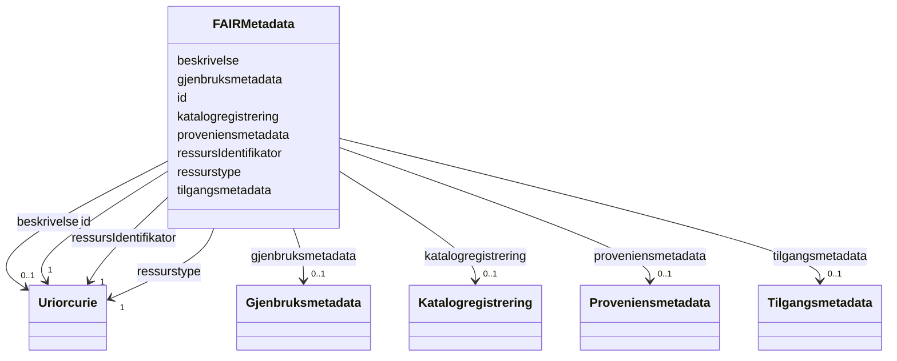

# Class: FAIRMetadata 


_Maskin-aksjonerbar metadata som beskriver ein digital ressurs i tråd med FAIR-prinsippa._

__


URI: [fair:FAIRMetadata](https://data.norge.no/fair#FAIRMetadata)





<!-- no inheritance hierarchy -->

## Class Properties

| Property | Value |
| --- | --- |
| Class URI | [fair:FAIRMetadata](https://data.norge.no/fair#FAIRMetadata) |


## Eigenskapar


  
  

  
  

  
  

  
  

  
  

  
  

  
  

  
  


  
  

  
  

  
  

  
  

  
  

  
  

  
  

  
  


  
  

  
  

  
  

  
  

  
  

  
  

  
  

  
  


  
  
  
  
    
  

  
  
  
    
      
    
      
    
      
    
  
  
    
  

  
  
  
    
      
    
      
    
      
    
  
  
    
  

  
  
  
    
      
    
      
    
      
    
  
  
    
  

  
  
  
    
      
    
      
    
      
    
  
  
    
  

  
  
  
    
      
    
      
    
      
    
  
  
    
  

  
  
  
    
      
    
      
    
      
    
  
  
    
  

  
  
  
    
      
    
      
    
      
    
  
  
    
  


### Andre

| Namn | Kardinalitet og domene | Beskriving |
| --- | --- | --- |
| [id](id.md) | 1 <br/> [xsd:anyURI](http://www.w3.org/2001/XMLSchema#anyURI) | Persistent URI-identifikator for metadata-posten (FAIR F1) |
| [ressursIdentifikator](ressursidentifikator.md) | 1 <br/> [xsd:anyURI](http://www.w3.org/2001/XMLSchema#anyURI) | Global og persistent identifikator for ressursen (FAIR F1) |
| [ressurstype](ressurstype.md) | 1 <br/> [xsd:anyURI](http://www.w3.org/2001/XMLSchema#anyURI) | Type digital ressurs, t |
| [beskrivelse](beskrivelse.md) | 0..1 <br/> [xsd:anyURI](http://www.w3.org/2001/XMLSchema#anyURI) | URI til ressursen som denne metadata-posten beskriver (FAIR F3) |
| [tilgangsmetadata](tilgangsmetadata.md) | 0..1 <br/> [Tilgangsmetadata](tilgangsmetadata.md) | Metadata for tilgang og tilgjengelegheit (FAIR A1/A2) |
| [gjenbruksmetadata](gjenbruksmetadata.md) | 0..1 <br/> [Gjenbruksmetadata](gjenbruksmetadata.md) | Metadata som støttar gjenbruk av ressursen (FAIR R1 |
| [proveniensmetadata](proveniensmetadata.md) | 0..1 <br/> [Proveniensmetadata](proveniensmetadata.md) | Metadata om opphav og endringshistorie (FAIR R1 |
| [katalogregistrering](katalogregistrering.md) | 0..1 <br/> [Katalogregistrering](katalogregistrering.md) | Dokumenterer registrering i søkbar katalog (FAIR F4) |


## Identifier and Mapping Information


### Schema Source


* from schema: https://data.norge.no/linkml/fair-metadata


## Mappings

| Mapping Type | Mapped Value |
| ---  | ---  |
| self | fair:FAIRMetadata |
| native | https://data.norge.no/fair#:FAIRMetadata |


## LinkML Source

<!-- TODO: investigate https://stackoverflow.com/questions/37606292/how-to-create-tabbed-code-blocks-in-mkdocs-or-sphinx -->

### Direct

<details>
```yaml
name: FAIRMetadata
description: 'Maskin-aksjonerbar metadata som beskriver ein digital ressurs i tråd
  med FAIR-prinsippa.

  '
from_schema: https://data.norge.no/linkml/fair-metadata
rank: 1000
slots:
- id
- ressursIdentifikator
- ressurstype
- beskrivelse
- tilgangsmetadata
- gjenbruksmetadata
- proveniensmetadata
- katalogregistrering
slot_usage:
  ressursIdentifikator:
    name: ressursIdentifikator
    in_subset:
    - Findable
    required: true
  ressurstype:
    name: ressurstype
    in_subset:
    - Findable
    required: true
  beskrivelse:
    name: beskrivelse
    in_subset:
    - Findable
  tilgangsmetadata:
    name: tilgangsmetadata
    in_subset:
    - Accessible
  gjenbruksmetadata:
    name: gjenbruksmetadata
    in_subset:
    - Reusable
  proveniensmetadata:
    name: proveniensmetadata
    in_subset:
    - Reusable
  katalogregistrering:
    name: katalogregistrering
    in_subset:
    - Findable
class_uri: fair:FAIRMetadata

```
</details>

### Induced

<details>
```yaml
name: FAIRMetadata
description: 'Maskin-aksjonerbar metadata som beskriver ein digital ressurs i tråd
  med FAIR-prinsippa.

  '
from_schema: https://data.norge.no/linkml/fair-metadata
rank: 1000
slot_usage:
  ressursIdentifikator:
    name: ressursIdentifikator
    in_subset:
    - Findable
    required: true
  ressurstype:
    name: ressurstype
    in_subset:
    - Findable
    required: true
  beskrivelse:
    name: beskrivelse
    in_subset:
    - Findable
  tilgangsmetadata:
    name: tilgangsmetadata
    in_subset:
    - Accessible
  gjenbruksmetadata:
    name: gjenbruksmetadata
    in_subset:
    - Reusable
  proveniensmetadata:
    name: proveniensmetadata
    in_subset:
    - Reusable
  katalogregistrering:
    name: katalogregistrering
    in_subset:
    - Findable
attributes:
  id:
    name: id
    description: Persistent URI-identifikator for metadata-posten (FAIR F1).
    from_schema: https://data.norge.no/linkml/fair-metadata
    rank: 1000
    slot_uri: dct:identifier
    identifier: true
    alias: id
    owner: FAIRMetadata
    domain_of:
    - FAIRMetadata
    range: uriorcurie
  ressursIdentifikator:
    name: ressursIdentifikator
    description: 'Global og persistent identifikator for ressursen (FAIR F1). Skal
      vere ein PID (t.d. DOI, Handle, eller stabil URI).

      '
    in_subset:
    - Findable
    from_schema: https://data.norge.no/linkml/fair-metadata
    rank: 1000
    slot_uri: dct:identifier
    alias: ressursIdentifikator
    owner: FAIRMetadata
    domain_of:
    - FAIRMetadata
    range: uriorcurie
    required: true
  ressurstype:
    name: ressurstype
    description: 'Type digital ressurs, t.d. dcat:Dataset, dcat:DataService eller
      ein URI frå eit kontrollert vokabular (FAIR F2).

      '
    in_subset:
    - Findable
    from_schema: https://data.norge.no/linkml/fair-metadata
    rank: 1000
    slot_uri: dct:type
    alias: ressurstype
    owner: FAIRMetadata
    domain_of:
    - FAIRMetadata
    range: uriorcurie
    required: true
  beskrivelse:
    name: beskrivelse
    description: URI til ressursen som denne metadata-posten beskriver (FAIR F3).
    in_subset:
    - Findable
    from_schema: https://data.norge.no/linkml/fair-metadata
    rank: 1000
    slot_uri: dct:subject
    alias: beskrivelse
    owner: FAIRMetadata
    domain_of:
    - FAIRMetadata
    range: uriorcurie
  tilgangsmetadata:
    name: tilgangsmetadata
    description: Metadata for tilgang og tilgjengelegheit (FAIR A1/A2).
    in_subset:
    - Accessible
    from_schema: https://data.norge.no/linkml/fair-metadata
    rank: 1000
    slot_uri: fair:tilgangsmetadata
    alias: tilgangsmetadata
    owner: FAIRMetadata
    domain_of:
    - FAIRMetadata
    range: Tilgangsmetadata
    inlined: true
  gjenbruksmetadata:
    name: gjenbruksmetadata
    description: Metadata som støttar gjenbruk av ressursen (FAIR R1.1/R1.3).
    in_subset:
    - Reusable
    from_schema: https://data.norge.no/linkml/fair-metadata
    rank: 1000
    slot_uri: fair:gjenbruksmetadata
    alias: gjenbruksmetadata
    owner: FAIRMetadata
    domain_of:
    - FAIRMetadata
    range: Gjenbruksmetadata
    inlined: true
  proveniensmetadata:
    name: proveniensmetadata
    description: Metadata om opphav og endringshistorie (FAIR R1.2).
    in_subset:
    - Reusable
    from_schema: https://data.norge.no/linkml/fair-metadata
    rank: 1000
    slot_uri: fair:proveniensmetadata
    alias: proveniensmetadata
    owner: FAIRMetadata
    domain_of:
    - FAIRMetadata
    range: Proveniensmetadata
    inlined: true
  katalogregistrering:
    name: katalogregistrering
    description: Dokumenterer registrering i søkbar katalog (FAIR F4).
    in_subset:
    - Findable
    from_schema: https://data.norge.no/linkml/fair-metadata
    rank: 1000
    slot_uri: fair:katalogregistrering
    alias: katalogregistrering
    owner: FAIRMetadata
    domain_of:
    - FAIRMetadata
    range: Katalogregistrering
    inlined: true
class_uri: fair:FAIRMetadata

```
</details>