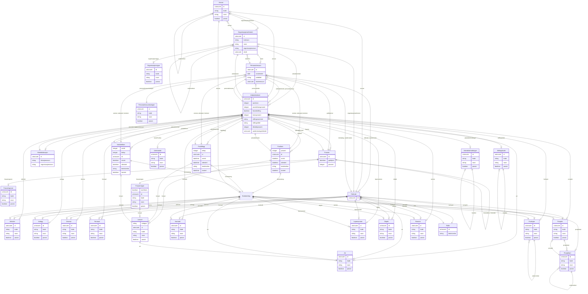

```mermaid
erDiagram
Aktivitet {
    uriorcurie id  
    string kode  
    string navn  
    boolean passiv  
}
Anlegg {
    uriorcurie id  
    string kode  
    string navn  
    boolean passiv  
}
Ansvar {
    uriorcurie id  
    string kode  
    string navn  
    boolean passiv  
}
Arbeidsforhold {
    uriorcurie id  
    integer aarslonn  
    integer ansettelsesprosent  
    boolean hovedstilling  
    integer lonnsprosent  
    string stillingsnummer  
    string stillingstittel  
    integer tilstedeprosent  
    uriorcurie undervisningsforhold  
}
Arbeidsforholdstype {
    uriorcurie id  
    string kode  
    string navn  
    boolean passiv  
}
Arbeidslokasjon {
    uriorcurie id  
    string lokasjonsnavn  
    string organisasjonsnavn  
}
Art {
    uriorcurie id  
    string kode  
    string navn  
    boolean passiv  
}
Diverse {
    uriorcurie id  
    string kode  
    string navn  
    boolean passiv  
}
Fastlonn {
    integer prosent  
    uriorcurie id  
    datetime anvist  
    datetime attestert  
    string beskrivelse  
    datetime kontert  
}
Fasttillegg {
    integer belop  
    uriorcurie id  
    datetime anvist  
    datetime attestert  
    string beskrivelse  
    datetime kontert  
}
Formaal {
    uriorcurie id  
    string kode  
    string navn  
    boolean passiv  
}
Fravaer {
    uriorcurie id  
    datetime godkjent  
    integer prosent  
}
Fravaersgrunn {
    uriorcurie id  
    string kode  
    string navn  
    boolean passiv  
}
Fravaerstype {
    boolean overfores  
    uriorcurie id  
    string kode  
    string navn  
    boolean passiv  
}
Fullmakt {
    uriorcurie id  
}
Funksjon {
    uriorcurie id  
    string kode  
    string navn  
    boolean passiv  
}
Kontostreng {

}
Kontrakt {
    uriorcurie id  
    string kode  
    string navn  
    boolean passiv  
}
Lonsart {
    string kategori  
    uriorcurie id  
    string kode  
    string navn  
    boolean passiv  
}
Lopenummer {
    uriorcurie id  
    string kode  
    string navn  
    boolean passiv  
}
Objekt {
    uriorcurie id  
    string kode  
    string navn  
    boolean passiv  
}
Organisasjonselement {
    uriorcurie id  
    string kortnavn  
    string navn  
    string organisasjonsnavn  
    uriorcurie skole  
}
Organisasjonstype {
    uriorcurie id  
    string kode  
    string navn  
    boolean passiv  
}
Personalressurs {
    uriorcurie id  
    date ansiennitet  
    string jobbtittel  
    uriorcurie skoleressurs  
}
Personalressurskategori {
    uriorcurie id  
    string kode  
    string navn  
    boolean passiv  
}
Prosjekt {
    uriorcurie id  
    string kode  
    string navn  
    boolean passiv  
}
Prosjektart {
    uriorcurie id  
    string kode  
    string navn  
    boolean passiv  
}
Ramme {
    uriorcurie id  
    string kode  
    string navn  
    boolean passiv  
}
Rolle {
    uriorcurie id  
    string beskrivelse  
}
Stillingskode {
    uriorcurie id  
    string kode  
    string navn  
    boolean passiv  
}
Uketimetall {
    uriorcurie id  
    string kode  
    string navn  
    boolean passiv  
}
Variabellonn {
    integer antall  
    integer belop  
    uriorcurie id  
    datetime anvist  
    datetime attestert  
    string beskrivelse  
    datetime kontert  
}

Ansvar ||--|o Ansvar : "overordnet"
Ansvar ||--}o Ansvar : "underordnet"
Ansvar ||--}o Organisasjonselement : "organisasjonselement"
Arbeidsforhold ||--|o Aktivitet : "aktivitet"
Arbeidsforhold ||--|o Anlegg : "anlegg"
Arbeidsforhold ||--|o Ansvar : "ansvar"
Arbeidsforhold ||--|o Arbeidsforholdstype : "arbeidsforholdstype"
Arbeidsforhold ||--|o Arbeidslokasjon : "arbeidslokasjon"
Arbeidsforhold ||--|o Art : "art"
Arbeidsforhold ||--|o Diverse : "diverse"
Arbeidsforhold ||--|o Formaal : "formaal"
Arbeidsforhold ||--|o Funksjon : "funksjon"
Arbeidsforhold ||--|o Kontrakt : "kontrakt"
Arbeidsforhold ||--|o Lopenummer : "lopenummer"
Arbeidsforhold ||--|o Objekt : "objekt"
Arbeidsforhold ||--|o Personalressurs : "personalleder"
Arbeidsforhold ||--|o Prosjekt : "prosjekt"
Arbeidsforhold ||--|o Ramme : "ramme"
Arbeidsforhold ||--|o Stillingskode : "stillingskode"
Arbeidsforhold ||--|o Uketimetall : "timerPerUke"
Arbeidsforhold ||--|| Organisasjonselement : "arbeidssted"
Arbeidsforhold ||--|| Personalressurs : "personalressurs"
Arbeidsforhold ||--}o Fastlonn : "fastlonn"
Arbeidsforhold ||--}o Fasttillegg : "fasttillegg"
Arbeidsforhold ||--}o Fravaer : "fravaer"
Arbeidsforhold ||--}o Variabellonn : "variabellonn"
Arbeidsforholdstype ||--|o Arbeidsforholdstype : "forelder"
Arbeidslokasjon ||--}o Arbeidsforhold : "arbeidsforhold"
Fastlonn ||--|o Lonsart : "lonsart"
Fastlonn ||--|o Personalressurs : "anviser, attestant, konterer"
Fastlonn ||--|| Arbeidsforhold : "arbeidsforhold"
Fastlonn ||--|| Kontostreng : "kontostreng"
Fasttillegg ||--|o Personalressurs : "anviser, attestant, konterer"
Fasttillegg ||--|| Arbeidsforhold : "arbeidsforhold"
Fasttillegg ||--|| Kontostreng : "kontostreng"
Fasttillegg ||--|| Lonsart : "lonsart"
Fravaer ||--|o Fravaer : "fortsettelse, fortsetter"
Fravaer ||--|o Fravaersgrunn : "fravaersgrunn"
Fravaer ||--|o Personalressurs : "godkjenner"
Fravaer ||--|| Fravaerstype : "fravaerstype"
Fravaer ||--}| Arbeidsforhold : "arbeidsforhold"
Fravaerstype ||--|o Lonsart : "lonsart"
Fullmakt ||--|o Aktivitet : "aktivitet"
Fullmakt ||--|o Anlegg : "anlegg"
Fullmakt ||--|o Ansvar : "ansvar"
Fullmakt ||--|o Art : "art"
Fullmakt ||--|o Diverse : "diverse"
Fullmakt ||--|o Formaal : "formaal"
Fullmakt ||--|o Funksjon : "funksjon"
Fullmakt ||--|o Kontrakt : "kontrakt"
Fullmakt ||--|o Lopenummer : "lopenummer"
Fullmakt ||--|o Objekt : "objekt"
Fullmakt ||--|o Organisasjonselement : "organisasjonselement"
Fullmakt ||--|o Personalressurs : "fullmektig, stedfortreder"
Fullmakt ||--|o Prosjekt : "prosjekt"
Fullmakt ||--|o Ramme : "ramme"
Fullmakt ||--|| Rolle : "rolle"
Funksjon ||--|o Funksjon : "overordnet"
Funksjon ||--}o Funksjon : "underordnet"
Kontostreng ||--|o Aktivitet : "aktivitet"
Kontostreng ||--|o Anlegg : "anlegg"
Kontostreng ||--|o Diverse : "diverse"
Kontostreng ||--|o Formaal : "formaal"
Kontostreng ||--|o Kontrakt : "kontrakt"
Kontostreng ||--|o Lopenummer : "lopenummer"
Kontostreng ||--|o Objekt : "objekt"
Kontostreng ||--|o Prosjekt : "prosjekt"
Kontostreng ||--|o Prosjektart : "prosjektart"
Kontostreng ||--|o Ramme : "ramme"
Kontostreng ||--|| Ansvar : "ansvar"
Kontostreng ||--|| Art : "art"
Kontostreng ||--|| Funksjon : "funksjon"
Lonsart ||--|o Art : "art"
Organisasjonselement ||--|o Organisasjonstype : "organisasjonstype"
Organisasjonselement ||--|o Personalressurs : "leder"
Organisasjonselement ||--|| Organisasjonselement : "overordnet"
Organisasjonselement ||--}o Ansvar : "ansvar"
Organisasjonselement ||--}o Arbeidsforhold : "arbeidsforhold"
Organisasjonselement ||--}o Organisasjonselement : "underordnet"
Personalressurs ||--|| Personalressurskategori : "personalressurskategori"
Personalressurs ||--}o Arbeidsforhold : "arbeidsforhold, personalansvar"
Personalressurs ||--}o Fullmakt : "fullmakt, stedfortreder"
Personalressurs ||--}o Organisasjonselement : "lederFor"
Prosjekt ||--}o Prosjektart : "prosjektart"
Prosjektart ||--|o Prosjekt : "prosjekt"
Prosjektart ||--|o Prosjektart : "overordnet"
Prosjektart ||--}o Prosjektart : "underordnet"
Rolle ||--}| Fullmakt : "fullmakt"
Stillingskode ||--|o Stillingskode : "forelder"
Variabellonn ||--|o Personalressurs : "anviser, attestant, konterer"
Variabellonn ||--|| Arbeidsforhold : "arbeidsforhold"
Variabellonn ||--|| Kontostreng : "kontostreng"
Variabellonn ||--|| Lonsart : "lonsart"


```
