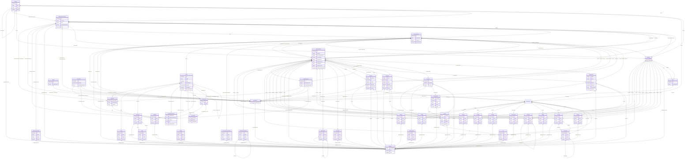

```mermaid
erDiagram
Adresse {
    stringList adresselinje  
    string postnummer  
    string poststed  
}
Aktivitet {
    uriorcurie id  
    string kode  
    string naam  
    boolean passiv  
}
Anlegg {
    uriorcurie id  
    string kode  
    string naam  
    boolean passiv  
}
Ansvar {
    uriorcurie id  
    string kode  
    string naam  
    boolean passiv  
}
Arbeidsforhold {
    uriorcurie id  
    integer aarslonn  
    integer ansettelsesprosent  
    boolean hovedstilling  
    integer lonnsprosent  
    string stillingsnummer  
    string stillingstittel  
    integer tilstedeprosent  
    uriorcurie undervisningsforhold  
}
Arbeidsforholdstype {
    uriorcurie id  
    string kode  
    string naam  
    boolean passiv  
}
Arbeidslokasjon {
    uriorcurie id  
    string lokasjonsnavn  
    string organisasjonsnavn  
}
Art {
    uriorcurie id  
    string kode  
    string naam  
    boolean passiv  
}
Diverse {
    uriorcurie id  
    string kode  
    string naam  
    boolean passiv  
}
Fastlonn {
    integer prosent  
    uriorcurie id  
    datetime anvist  
    datetime attestert  
    string beskrivelse  
    datetime kontert  
}
Fasttillegg {
    integer belop  
    uriorcurie id  
    datetime anvist  
    datetime attestert  
    string beskrivelse  
    datetime kontert  
}
Formaal {
    uriorcurie id  
    string kode  
    string naam  
    boolean passiv  
}
Fravaer {
    uriorcurie id  
    datetime godkjent  
    integer prosent  
}
Fravaersgrunn {
    uriorcurie id  
    string kode  
    string naam  
    boolean passiv  
}
Fravaerstype {
    boolean overfores  
    uriorcurie id  
    string kode  
    string naam  
    boolean passiv  
}
Fullmakt {
    uriorcurie id  
}
Funksjon {
    uriorcurie id  
    string kode  
    string naam  
    boolean passiv  
}
Fylke {
    uriorcurie id  
    string kode  
    string naam  
    boolean passiv  
}
Identifikator {
    string identifikatorverdi  
}
Kjonn {
    uriorcurie id  
    string kode  
    string naam  
    boolean passiv  
}
Kommune {
    uriorcurie id  
    string kode  
    string naam  
    boolean passiv  
}
Kontaktinformasjon {
    string epostadresse  
    string mobiltelefonnummer  
    string nettsted  
    string sip  
    string telefonnummer  
}
Kontaktperson {
    uriorcurie id  
    string type  
}
Kontostreng {

}
Kontrakt {
    uriorcurie id  
    string kode  
    string naam  
    boolean passiv  
}
Landkode {
    uriorcurie id  
    string kode  
    string naam  
    boolean passiv  
}
Lonsart {
    string kategori  
    uriorcurie id  
    string kode  
    string naam  
    boolean passiv  
}
Lopenummer {
    uriorcurie id  
    string kode  
    string naam  
    boolean passiv  
}
Objekt {
    uriorcurie id  
    string kode  
    string naam  
    boolean passiv  
}
Organisasjonselement {
    uriorcurie id  
    string kortnavn  
    string navn  
    string organisasjonsnavn  
    uriorcurie skole  
}
Organisasjonstype {
    uriorcurie id  
    string kode  
    string naam  
    boolean passiv  
}
Periode {
    string beskrivelse  
    datetime slutt  
    datetime start  
}
Person {
    uriorcurie id  
    string bilde  
    uriorcurie elev  
    date fodselsdato  
    uriorcurieList laerling  
    uriorcurie otungdom  
    uriorcurie personalressurs  
}
Personalressurs {
    uriorcurie id  
    date ansiennitet  
    string jobbtittel  
    uriorcurie skoleressurs  
}
Personalressurskategori {
    uriorcurie id  
    string kode  
    string naam  
    boolean passiv  
}
Personnavn {
    string etternavn  
    string fornavn  
    string mellomnavn  
}
Prosjekt {
    uriorcurie id  
    string kode  
    string naam  
    boolean passiv  
}
Prosjektart {
    uriorcurie id  
    string kode  
    string naam  
    boolean passiv  
}
Ramme {
    uriorcurie id  
    string kode  
    string naam  
    boolean passiv  
}
Rolle {
    uriorcurie id  
    string beskrivelse  
}
Spraak {
    uriorcurie id  
    string kode  
    string naam  
    boolean passiv  
}
Stillingskode {
    uriorcurie id  
    string kode  
    string naam  
    boolean passiv  
}
Uketimetall {
    uriorcurie id  
    string kode  
    string naam  
    boolean passiv  
}
Valuta {
    uriorcurie id  
    string valuta_naam  
}
Variabellonn {
    integer antall  
    integer belop  
    uriorcurie id  
    datetime anvist  
    datetime attestert  
    string beskrivelse  
    datetime kontert  
}
Virksomhet {
    uriorcurie id  
    uriorcurieList laerling  
    string organisasjonsnavn  
}

Adresse ||--|o Landkode : "land"
Aktivitet ||--|o Periode : "gyldighetsperiode"
Anlegg ||--|o Periode : "gyldighetsperiode"
Ansvar ||--|o Ansvar : "overordnet"
Ansvar ||--|o Periode : "gyldighetsperiode"
Ansvar ||--}o Ansvar : "underordnet"
Ansvar ||--}o Organisasjonselement : "organisasjonselement"
Arbeidsforhold ||--|o Aktivitet : "aktivitet"
Arbeidsforhold ||--|o Anlegg : "anlegg"
Arbeidsforhold ||--|o Ansvar : "ansvar"
Arbeidsforhold ||--|o Arbeidsforholdstype : "arbeidsforholdstype"
Arbeidsforhold ||--|o Arbeidslokasjon : "arbeidslokasjon"
Arbeidsforhold ||--|o Art : "art"
Arbeidsforhold ||--|o Diverse : "diverse"
Arbeidsforhold ||--|o Formaal : "formaal"
Arbeidsforhold ||--|o Funksjon : "funksjon"
Arbeidsforhold ||--|o Kontrakt : "kontrakt"
Arbeidsforhold ||--|o Lopenummer : "lopenummer"
Arbeidsforhold ||--|o Objekt : "objekt"
Arbeidsforhold ||--|o Periode : "arbeidsforholdsperiode"
Arbeidsforhold ||--|o Personalressurs : "personalleder"
Arbeidsforhold ||--|o Prosjekt : "prosjekt"
Arbeidsforhold ||--|o Ramme : "ramme"
Arbeidsforhold ||--|o Stillingskode : "stillingskode"
Arbeidsforhold ||--|o Uketimetall : "timerPerUke"
Arbeidsforhold ||--|| Organisasjonselement : "arbeidssted"
Arbeidsforhold ||--|| Periode : "gyldighetsperiode"
Arbeidsforhold ||--|| Personalressurs : "personalressurs"
Arbeidsforhold ||--}o Fastlonn : "fastlonn"
Arbeidsforhold ||--}o Fasttillegg : "fasttillegg"
Arbeidsforhold ||--}o Fravaer : "fravaer"
Arbeidsforhold ||--}o Variabellonn : "variabellonn"
Arbeidsforholdstype ||--|o Arbeidsforholdstype : "forelder"
Arbeidsforholdstype ||--|o Periode : "gyldighetsperiode"
Arbeidslokasjon ||--|o Adresse : "forretningsadresse, postadresse"
Arbeidslokasjon ||--|o Identifikator : "organisasjonsnummer"
Arbeidslokasjon ||--|o Kontaktinformasjon : "kontaktinformasjon"
Arbeidslokasjon ||--|| Identifikator : "lokasjonskode"
Arbeidslokasjon ||--}o Arbeidsforhold : "arbeidsforhold"
Art ||--|o Periode : "gyldighetsperiode"
Diverse ||--|o Periode : "gyldighetsperiode"
Fastlonn ||--|o Identifikator : "kildesystemId"
Fastlonn ||--|o Lonsart : "lonsart"
Fastlonn ||--|o Periode : "opptjent"
Fastlonn ||--|o Personalressurs : "anviser, attestant, konterer"
Fastlonn ||--|| Arbeidsforhold : "arbeidsforhold"
Fastlonn ||--|| Kontostreng : "kontostreng"
Fastlonn ||--|| Periode : "periode"
Fasttillegg ||--|o Identifikator : "kildesystemId"
Fasttillegg ||--|o Periode : "opptjent"
Fasttillegg ||--|o Personalressurs : "anviser, attestant, konterer"
Fasttillegg ||--|| Arbeidsforhold : "arbeidsforhold"
Fasttillegg ||--|| Kontostreng : "kontostreng"
Fasttillegg ||--|| Lonsart : "lonsart"
Fasttillegg ||--|| Periode : "periode"
Formaal ||--|o Periode : "gyldighetsperiode"
Fravaer ||--|o Fravaer : "fortsettelse, fortsetter"
Fravaer ||--|o Fravaersgrunn : "fravaersgrunn"
Fravaer ||--|o Identifikator : "kildesystemId"
Fravaer ||--|o Personalressurs : "godkjenner"
Fravaer ||--|| Fravaerstype : "fravaerstype"
Fravaer ||--|| Periode : "periode"
Fravaer ||--}| Arbeidsforhold : "arbeidsforhold"
Fravaersgrunn ||--|o Periode : "gyldighetsperiode"
Fravaerstype ||--|o Lonsart : "lonsart"
Fravaerstype ||--|o Periode : "gyldighetsperiode"
Fullmakt ||--|o Aktivitet : "aktivitet"
Fullmakt ||--|o Anlegg : "anlegg"
Fullmakt ||--|o Ansvar : "ansvar"
Fullmakt ||--|o Art : "art"
Fullmakt ||--|o Diverse : "diverse"
Fullmakt ||--|o Formaal : "formaal"
Fullmakt ||--|o Funksjon : "funksjon"
Fullmakt ||--|o Kontrakt : "kontrakt"
Fullmakt ||--|o Lopenummer : "lopenummer"
Fullmakt ||--|o Objekt : "objekt"
Fullmakt ||--|o Organisasjonselement : "organisasjonselement"
Fullmakt ||--|o Personalressurs : "fullmektig, stedfortreder"
Fullmakt ||--|o Prosjekt : "prosjekt"
Fullmakt ||--|o Ramme : "ramme"
Fullmakt ||--|| Periode : "gyldighetsperiode"
Fullmakt ||--|| Rolle : "rolle"
Funksjon ||--|o Funksjon : "overordnet"
Funksjon ||--|o Periode : "gyldighetsperiode"
Funksjon ||--}o Funksjon : "underordnet"
Fylke ||--|o Periode : "gyldighetsperiode"
Fylke ||--}o Kommune : "kommune"
Identifikator ||--|o Periode : "gyldighetsperiode"
Kjonn ||--|o Periode : "gyldighetsperiode"
Kommune ||--|o Periode : "gyldighetsperiode"
Kommune ||--|| Fylke : "fylke"
Kontaktperson ||--|o Kontaktinformasjon : "kontaktinformasjon"
Kontaktperson ||--|o Personnavn : "kontaktperson_naam"
Kontaktperson ||--}o Person : "kontaktperson"
Kontostreng ||--|o Aktivitet : "aktivitet"
Kontostreng ||--|o Anlegg : "anlegg"
Kontostreng ||--|o Diverse : "diverse"
Kontostreng ||--|o Formaal : "formaal"
Kontostreng ||--|o Kontrakt : "kontrakt"
Kontostreng ||--|o Lopenummer : "lopenummer"
Kontostreng ||--|o Objekt : "objekt"
Kontostreng ||--|o Prosjekt : "prosjekt"
Kontostreng ||--|o Prosjektart : "prosjektart"
Kontostreng ||--|o Ramme : "ramme"
Kontostreng ||--|| Ansvar : "ansvar"
Kontostreng ||--|| Art : "art"
Kontostreng ||--|| Funksjon : "funksjon"
Kontrakt ||--|o Periode : "gyldighetsperiode"
Landkode ||--|o Periode : "gyldighetsperiode"
Lonsart ||--|o Art : "art"
Lonsart ||--|o Periode : "gyldighetsperiode"
Lopenummer ||--|o Periode : "gyldighetsperiode"
Objekt ||--|o Periode : "gyldighetsperiode"
Organisasjonselement ||--|o Adresse : "forretningsadresse, postadresse"
Organisasjonselement ||--|o Identifikator : "organisasjonsnummer"
Organisasjonselement ||--|o Kontaktinformasjon : "kontaktinformasjon"
Organisasjonselement ||--|o Organisasjonstype : "organisasjonstype"
Organisasjonselement ||--|o Periode : "gyldighetsperiode"
Organisasjonselement ||--|o Personalressurs : "leder"
Organisasjonselement ||--|| Identifikator : "organisasjonsId, organisasjonsKode"
Organisasjonselement ||--|| Organisasjonselement : "overordnet"
Organisasjonselement ||--}o Ansvar : "ansvar"
Organisasjonselement ||--}o Arbeidsforhold : "arbeidsforhold"
Organisasjonselement ||--}o Organisasjonselement : "underordnet"
Organisasjonstype ||--|o Periode : "gyldighetsperiode"
Person ||--|o Adresse : "bostedsadresse, postadresse"
Person ||--|o Kjonn : "kjonn"
Person ||--|o Kommune : "kommune"
Person ||--|o Kontaktinformasjon : "kontaktinformasjon"
Person ||--|o Spraak : "maalform, morsmaal"
Person ||--|| Identifikator : "fodselsnummer"
Person ||--|| Personnavn : "person_naam"
Person ||--}o Kontaktperson : "parorende"
Person ||--}o Landkode : "statsborgerskap"
Person ||--}o Person : "foreldre, foreldreansvar"
Personalressurs ||--|o Identifikator : "brukernavn"
Personalressurs ||--|o Kontaktinformasjon : "kontaktinformasjon"
Personalressurs ||--|| Identifikator : "ansattnummer"
Personalressurs ||--|| Periode : "ansettelsesperiode"
Personalressurs ||--|| Person : "person"
Personalressurs ||--|| Personalressurskategori : "personalressurskategori"
Personalressurs ||--}o Arbeidsforhold : "arbeidsforhold, personalansvar"
Personalressurs ||--}o Fullmakt : "fullmakt, stedfortreder"
Personalressurs ||--}o Organisasjonselement : "lederFor"
Personalressurskategori ||--|o Periode : "gyldighetsperiode"
Prosjekt ||--|o Periode : "gyldighetsperiode"
Prosjekt ||--}o Prosjektart : "prosjektart"
Prosjektart ||--|o Periode : "gyldighetsperiode"
Prosjektart ||--|o Prosjekt : "prosjekt"
Prosjektart ||--|o Prosjektart : "overordnet"
Prosjektart ||--}o Prosjektart : "underordnet"
Ramme ||--|o Periode : "gyldighetsperiode"
Rolle ||--|| Identifikator : "rolleNavn"
Rolle ||--}| Fullmakt : "fullmakt"
Spraak ||--|o Periode : "gyldighetsperiode"
Stillingskode ||--|o Periode : "gyldighetsperiode"
Stillingskode ||--|o Stillingskode : "forelder"
Uketimetall ||--|o Periode : "gyldighetsperiode"
Valuta ||--|| Identifikator : "bokstavkode, nummerkode"
Variabellonn ||--|o Identifikator : "kildesystemId"
Variabellonn ||--|o Periode : "opptjent"
Variabellonn ||--|o Personalressurs : "anviser, attestant, konterer"
Variabellonn ||--|| Arbeidsforhold : "arbeidsforhold"
Variabellonn ||--|| Kontostreng : "kontostreng"
Variabellonn ||--|| Lonsart : "lonsart"
Variabellonn ||--|| Periode : "periode"
Virksomhet ||--|o Adresse : "forretningsadresse, postadresse"
Virksomhet ||--|o Identifikator : "organisasjonsnummer"
Virksomhet ||--|o Kontaktinformasjon : "kontaktinformasjon"
Virksomhet ||--|| Identifikator : "virksomhetsId"

```

