# fint-administrasjon

```mermaid
erDiagram
Aktivitet {
    uriorcurie id  
    string kode  
    string navn  
    boolean passiv  
}
Anlegg {
    uriorcurie id  
    string kode  
    string navn  
    boolean passiv  
}
Ansvar {
    uriorcurie id  
    string kode  
    string navn  
    boolean passiv  
}
Arbeidsforhold {
    uriorcurie id  
    integer aarslonn  
    integer ansettelsesprosent  
    boolean hovedstilling  
    integer lonnsprosent  
    string stillingsnummer  
    string stillingstittel  
    integer tilstedeprosent  
    uriorcurie undervisningsforhold  
}
Arbeidsforholdstype {
    uriorcurie id  
    string kode  
    string navn  
    boolean passiv  
}
Arbeidslokasjon {
    uriorcurie id  
    string lokasjonsnavn  
    string organisasjonsnavn  
}
Art {
    uriorcurie id  
    string kode  
    string navn  
    boolean passiv  
}
Diverse {
    uriorcurie id  
    string kode  
    string navn  
    boolean passiv  
}
Fastlonn {
    integer prosent  
    uriorcurie id  
    datetime anvist  
    datetime attestert  
    string beskrivelse  
    datetime kontert  
}
Fasttillegg {
    integer belop  
    uriorcurie id  
    datetime anvist  
    datetime attestert  
    string beskrivelse  
    datetime kontert  
}
Formaal {
    uriorcurie id  
    string kode  
    string navn  
    boolean passiv  
}
Fravaer {
    uriorcurie id  
    datetime godkjent  
    integer prosent  
}
Fravaersgrunn {
    uriorcurie id  
    string kode  
    string navn  
    boolean passiv  
}
Fravaerstype {
    boolean overfores  
    uriorcurie id  
    string kode  
    string navn  
    boolean passiv  
}
Fullmakt {
    uriorcurie id  
}
Funksjon {
    uriorcurie id  
    string kode  
    string navn  
    boolean passiv  
}
Kontostreng {

}
Kontrakt {
    uriorcurie id  
    string kode  
    string navn  
    boolean passiv  
}
Lonsart {
    string kategori  
    uriorcurie id  
    string kode  
    string navn  
    boolean passiv  
}
Lopenummer {
    uriorcurie id  
    string kode  
    string navn  
    boolean passiv  
}
Objekt {
    uriorcurie id  
    string kode  
    string navn  
    boolean passiv  
}
Organisasjonselement {
    uriorcurie id  
    string kortnavn  
    string navn  
    string organisasjonsnavn  
    uriorcurie skole  
}
Organisasjonstype {
    uriorcurie id  
    string kode  
    string navn  
    boolean passiv  
}
Personalressurs {
    uriorcurie id  
    date ansiennitet  
    string jobbtittel  
    uriorcurie skoleressurs  
}
Personalressurskategori {
    uriorcurie id  
    string kode  
    string navn  
    boolean passiv  
}
Prosjekt {
    uriorcurie id  
    string kode  
    string navn  
    boolean passiv  
}
Prosjektart {
    uriorcurie id  
    string kode  
    string navn  
    boolean passiv  
}
Ramme {
    uriorcurie id  
    string kode  
    string navn  
    boolean passiv  
}
Rolle {
    uriorcurie id  
    string beskrivelse  
}
Stillingskode {
    uriorcurie id  
    string kode  
    string navn  
    boolean passiv  
}
Uketimetall {
    uriorcurie id  
    string kode  
    string navn  
    boolean passiv  
}
Variabellonn {
    integer antall  
    integer belop  
    uriorcurie id  
    datetime anvist  
    datetime attestert  
    string beskrivelse  
    datetime kontert  
}

Ansvar ||--|o Ansvar : "overordnet"
Ansvar ||--}o Ansvar : "underordnet"
Ansvar ||--}o Organisasjonselement : "organisasjonselement"
Arbeidsforhold ||--|o Aktivitet : "aktivitet"
Arbeidsforhold ||--|o Anlegg : "anlegg"
Arbeidsforhold ||--|o Ansvar : "ansvar"
Arbeidsforhold ||--|o Arbeidsforholdstype : "arbeidsforholdstype"
Arbeidsforhold ||--|o Arbeidslokasjon : "arbeidslokasjon"
Arbeidsforhold ||--|o Art : "art"
Arbeidsforhold ||--|o Diverse : "diverse"
Arbeidsforhold ||--|o Formaal : "formaal"
Arbeidsforhold ||--|o Funksjon : "funksjon"
Arbeidsforhold ||--|o Kontrakt : "kontrakt"
Arbeidsforhold ||--|o Lopenummer : "lopenummer"
Arbeidsforhold ||--|o Objekt : "objekt"
Arbeidsforhold ||--|o Personalressurs : "personalleder"
Arbeidsforhold ||--|o Prosjekt : "prosjekt"
Arbeidsforhold ||--|o Ramme : "ramme"
Arbeidsforhold ||--|o Stillingskode : "stillingskode"
Arbeidsforhold ||--|o Uketimetall : "timerPerUke"
Arbeidsforhold ||--|| Organisasjonselement : "arbeidssted"
Arbeidsforhold ||--|| Personalressurs : "personalressurs"
Arbeidsforhold ||--}o Fastlonn : "fastlonn"
Arbeidsforhold ||--}o Fasttillegg : "fasttillegg"
Arbeidsforhold ||--}o Fravaer : "fravaer"
Arbeidsforhold ||--}o Variabellonn : "variabellonn"
Arbeidsforholdstype ||--|o Arbeidsforholdstype : "forelder"
Arbeidslokasjon ||--}o Arbeidsforhold : "arbeidsforhold"
Fastlonn ||--|o Lonsart : "lonsart"
Fastlonn ||--|o Personalressurs : "anviser, attestant, konterer"
Fastlonn ||--|| Arbeidsforhold : "arbeidsforhold"
Fastlonn ||--|| Kontostreng : "kontostreng"
Fasttillegg ||--|o Personalressurs : "anviser, attestant, konterer"
Fasttillegg ||--|| Arbeidsforhold : "arbeidsforhold"
Fasttillegg ||--|| Kontostreng : "kontostreng"
Fasttillegg ||--|| Lonsart : "lonsart"
Fravaer ||--|o Fravaer : "fortsettelse, fortsetter"
Fravaer ||--|o Fravaersgrunn : "fravaersgrunn"
Fravaer ||--|o Personalressurs : "godkjenner"
Fravaer ||--|| Fravaerstype : "fravaerstype"
Fravaer ||--}| Arbeidsforhold : "arbeidsforhold"
Fravaerstype ||--|o Lonsart : "lonsart"
Fullmakt ||--|o Aktivitet : "aktivitet"
Fullmakt ||--|o Anlegg : "anlegg"
Fullmakt ||--|o Ansvar : "ansvar"
Fullmakt ||--|o Art : "art"
Fullmakt ||--|o Diverse : "diverse"
Fullmakt ||--|o Formaal : "formaal"
Fullmakt ||--|o Funksjon : "funksjon"
Fullmakt ||--|o Kontrakt : "kontrakt"
Fullmakt ||--|o Lopenummer : "lopenummer"
Fullmakt ||--|o Objekt : "objekt"
Fullmakt ||--|o Organisasjonselement : "organisasjonselement"
Fullmakt ||--|o Personalressurs : "fullmektig, stedfortreder"
Fullmakt ||--|o Prosjekt : "prosjekt"
Fullmakt ||--|o Ramme : "ramme"
Fullmakt ||--|| Rolle : "rolle"
Funksjon ||--|o Funksjon : "overordnet"
Funksjon ||--}o Funksjon : "underordnet"
Kontostreng ||--|o Aktivitet : "aktivitet"
Kontostreng ||--|o Anlegg : "anlegg"
Kontostreng ||--|o Diverse : "diverse"
Kontostreng ||--|o Formaal : "formaal"
Kontostreng ||--|o Kontrakt : "kontrakt"
Kontostreng ||--|o Lopenummer : "lopenummer"
Kontostreng ||--|o Objekt : "objekt"
Kontostreng ||--|o Prosjekt : "prosjekt"
Kontostreng ||--|o Prosjektart : "prosjektart"
Kontostreng ||--|o Ramme : "ramme"
Kontostreng ||--|| Ansvar : "ansvar"
Kontostreng ||--|| Art : "art"
Kontostreng ||--|| Funksjon : "funksjon"
Lonsart ||--|o Art : "art"
Organisasjonselement ||--|o Organisasjonstype : "organisasjonstype"
Organisasjonselement ||--|o Personalressurs : "leder"
Organisasjonselement ||--|| Organisasjonselement : "overordnet"
Organisasjonselement ||--}o Ansvar : "ansvar"
Organisasjonselement ||--}o Arbeidsforhold : "arbeidsforhold"
Organisasjonselement ||--}o Organisasjonselement : "underordnet"
Personalressurs ||--|| Personalressurskategori : "personalressurskategori"
Personalressurs ||--}o Arbeidsforhold : "arbeidsforhold, personalansvar"
Personalressurs ||--}o Fullmakt : "fullmakt, stedfortreder"
Personalressurs ||--}o Organisasjonselement : "lederFor"
Prosjekt ||--}o Prosjektart : "prosjektart"
Prosjektart ||--|o Prosjekt : "prosjekt"
Prosjektart ||--|o Prosjektart : "overordnet"
Prosjektart ||--}o Prosjektart : "underordnet"
Rolle ||--}| Fullmakt : "fullmakt"
Stillingskode ||--|o Stillingskode : "forelder"
Variabellonn ||--|o Personalressurs : "anviser, attestant, konterer"
Variabellonn ||--|| Arbeidsforhold : "arbeidsforhold"
Variabellonn ||--|| Kontostreng : "kontostreng"
Variabellonn ||--|| Lonsart : "lonsart"


```

FINT-domenemodell for administrasjon og HR. Dekkjer personalressursar, arbeidsforhold, fullmakter og organisasjonsstruktur.

URI: https://data.norge.no/linkml/fint-administrasjon

Name: fint-administrasjon

## Classes

### Obligatorisk

| Class | Description |
| --- | --- |
| [Arbeidsforhold](klasser/arbeidsforhold.md) | Eit avtaleforhold mellom personalressurs og arbeidsgjevar |
| [Arbeidslokasjon](klasser/arbeidslokasjon.md) | Fysisk lokasjon der ein tilsett har sitt arbeidsstad |
| [Fastlonn](klasser/fastlonn.md) | Informasjon om fast lønnsbeordring |
| [Fasttillegg](klasser/fasttillegg.md) | Faste tillegg til utbetaling |
| [Fravaer](klasser/fravaer.md) | Fråvær frå eit arbeidsforhold |
| [Fullmakt](klasser/fullmakt.md) | Fullmakt til å gjere handlingar i høve til ei gjeven Rolle |
| [Kontostreng](klasser/kontostreng.md) | Sammensetning av kontodimensjonar for bokføring |
| [Lonn](klasser/lonn.md) | Informasjon om lønn for eit arbeidsforhold (abstrakt base) |
| [Organisasjonselement](klasser/organisasjonselement.md) | Eit element i organisasjonsstrukturen |
| [Personalressurs](klasser/personalressurs.md) | Arbeidstakar eller oppdragstakar i organisasjonen |
| [Rolle](klasser/rolle.md) | Rettighet eller type fullmakt |
| [Variabellonn](klasser/variabellonn.md) | Informasjon om variabel lønn |

### Valgfri

| Class | Description |
| --- | --- |
| [Ansvar](klasser/ansvar.md) | Del av kontostrengen som beskriv kven som har ansvaret for ei utgift eller in... |
| [Arbeidsforholdstype](klasser/arbeidsforholdstype.md) | Viser kva behov hos arbeidsgjevar arbeidsforholdet dekkjer |
| [Fravaerstype](klasser/fravaerstype.md) | Type fråvær |
| [Funksjon](klasser/funksjon.md) | Del av kontostrengen som beskriv kva som vert produsert |
| [Lonsart](klasser/lonsart.md) | Type ytelse |
| [Prosjekt](klasser/prosjekt.md) | Del av kontostrengen som peikar på løpande prosjekt |
| [Prosjektart](klasser/prosjektart.md) | Element i ei prosjektnedbrytningsstruktur eller arbeidsnedbrytningsstruktur |
| [Stillingskode](klasser/stillingskode.md) | Felles kodeverk for stillingar |

### Andre

| Class | Description |
| --- | --- |
| [Aktivitet](klasser/aktivitet.md) | Del av kontostrengen og detaljering av funksjon |
| [Anlegg](klasser/anlegg.md) | Del av kontostrengen; objekt som skal aktiverast eller avskrivast |
| [Art](klasser/art.md) | Del av kontostrengen som beskriv kva slags inntekter og utgifter det gjeld |
| [Diverse](klasser/diverse.md) | Del av kontostrengen; supplement til øvrige dimensjonar |
| [Formaal](klasser/formaal.md) | Del av kontostrengen som detaljerer inntekter og utgifter ved drift |
| [Fravaersgrunn](klasser/fravaersgrunn.md) | Grunn til fråvær |
| [Kontrakt](klasser/kontrakt.md) | Kontrakt transaksjonen er knytt til |
| [Lopenummer](klasser/lopenummer.md) | Løpenummer i ei nummerserie |
| [Objekt](klasser/objekt.md) | Eit bygg, ein veg eller ein mottakar av ei teneste eller eit tilskott |
| [Organisasjonstype](klasser/organisasjonstype.md) | Typen til eit organisasjonselement |
| [Personalressurskategori](klasser/personalressurskategori.md) | Ansettelsesform til eit arbeidsforhold |
| [Ramme](klasser/ramme.md) | Del av kontostrengen som viser kva budsjettramme som skal bere kostnadane |
| [Uketimetall](klasser/uketimetall.md) | Timer per veke i 100 % stilling |

## Slots

| Slot | Description |
| --- | --- |
| [aarslonn](klasser/aarslonn.md) | Årslønn/grunnlønn i 100 % stilling |
| [aktivitet](klasser/aktivitet.md) | Detaljering av funksjon |
| [aktivitetar](klasser/aktivitetar.md) | Alle aktivitetar i containeren |
| [anlegg](klasser/anlegg.md) | Objekt som skal aktiverast eller avskrivast |
| [ansattnummer](klasser/ansattnummer.md) | Unik identifikator for den tilsette i HR-systemet |
| [ansettelsesperiode](klasser/ansettelsesperiode.md) | Perioden personalressursen er i eit tilhøve til organisasjonen |
| [ansettelsesprosent](klasser/ansettelsesprosent.md) | Prosenten personalressursen eig i høve til arbeidsavtalen |
| [ansiennitet](klasser/ansiennitet.md) | Ansiennitet for personalressurs hos arbeidsgjevar |
| [ansvar](klasser/ansvar.md) | Ansvarleg for ei utgift eller inntekt |
| [antall](klasser/antall.md) | Mengde som vert beskriven av tillegget, i hundredeler |
| [anviser](klasser/anviser.md) | Personalressurs som har anvist lønsmeldinga etter fullmakt |
| [anvist](klasser/anvist.md) | Tidspunkt då lønn vart anvist |
| [arbeidsforhold](klasser/arbeidsforhold.md) | Arbeidsforhold ressursen er knytt til |
| [arbeidsforholdsperiode](klasser/arbeidsforholdsperiode.md) | Periode for ei gjeven stilling |
| [arbeidsforholdstypar](klasser/arbeidsforholdstypar.md) | Alle arbeidsforholdstypar i containeren |
| [arbeidsforholdstype](klasser/arbeidsforholdstype.md) | Beskriven kode som kategoriserer kva funksjon stillinga er gruppert til |
| [arbeidslokasjon](klasser/arbeidslokasjon.md) | Fysisk lokasjon der den tilsette har sitt arbeidsstad |
| [arbeidslokasjoner](klasser/arbeidslokasjoner.md) | Alle arbeidslokasjoner i containeren |
| [arbeidssted](klasser/arbeidssted.md) | Tilhøyrsle til organisasjonsstrukturen |
| [art](klasser/art.md) | Type inntekt eller utgift |
| [artar](klasser/artar.md) | Alle artar i containeren |
| [attestant](klasser/attestant.md) | Personalressurs som har attestert lønsmeldinga etter fullmakt |
| [attestert](klasser/attestert.md) | Tidspunkt då lønn vart attestert |
| [belop](klasser/belop.md) | Beløp i øre |
| [brukernavn](klasser/brukernavn.md) | Brukarnamn til den tilsette |
| [diverse](klasser/diverse.md) | Spesifikasjon som ikkje kjem fram i øvrige dimensjonar |
| [fastlonn](klasser/fastlonn.md) | Fastlønn for arbeidsforholdet |
| [fasttillegg](klasser/fasttillegg.md) | Faste tillegg for arbeidsforholdet |
| [forelder](klasser/forelder.md) | Foreldreelement i hierarki |
| [formaal](klasser/formaal.md) | Formål viser aktivitet og tenesteproduksjon |
| [fortsettelse](klasser/fortsettelse.md) | Fortsetjande fråvær |
| [fortsetter](klasser/fortsetter.md) | Fråværet dette fråværet er fortsetjing av |
| [fravaer](klasser/fravaer.md) | Fråvær knytt til ressursen |
| [fravaersgrunn](klasser/fravaersgrunn.md) | Grunn til fråværet |
| [fravaersgrunnar](klasser/fravaersgrunnar.md) | Alle fråværsgrunnar i containeren |
| [fravaerstypar](klasser/fravaerstypar.md) | Alle fråværstypar i containeren |
| [fravaerstype](klasser/fravaerstype.md) | Type fråvær |
| [fullmakt](klasser/fullmakt.md) | Fullmakt ressursen er knytt til |
| [fullmakter](klasser/fullmakter.md) | Alle fullmakter i containeren |
| [fullmektig](klasser/fullmektig.md) | Personalressurs som har fått fullmakt til ei gjeven rolle |
| [funksjon](klasser/funksjon.md) | Det som vert produsert eller tenesta som vert levert |
| [funksjonar](klasser/funksjonar.md) | Alle funksjonar i containeren |
| [godkjenner](klasser/godkjenner.md) | Personalressurs som har godkjent fråværsmeldinga |
| [godkjent](klasser/godkjent.md) | Tidspunkt då fråværet vart godkjent |
| [hovedstilling](klasser/hovedstilling.md) | Angir kva arbeidsforhold som er hovudarbeidsforhold |
| [jobbtittel](klasser/jobbtittel.md) | Namn som beskriv jobben eller stillinga |
| [kategori](klasser/kategori.md) | Kategori lønnsart |
| [kildesystemId](klasser/kildesystemid.md) | Kjeldesystemets unike identifikator |
| [kommunar](klasser/kommunar.md) | Alle kommuneverdiar i containeren |
| [kontaktpersonar](klasser/kontaktpersonar.md) | Alle kontaktpersonar i containeren |
| [konterer](klasser/konterer.md) | Personalressurs som har kontert lønsmeldinga etter fullmakt |
| [kontert](klasser/kontert.md) | Tidspunkt då lønn vart kontert |
| [kontostreng](klasser/kontostreng.md) | Kontering av lønn |
| [kontrakt](klasser/kontrakt.md) | Kontrakt ressursen er knytt til |
| [kontrakter](klasser/kontrakter.md) | Alle kontrakter i containeren |
| [kortnavn](klasser/kortnavn.md) | Forkorta namn som beskriv organisasjonselementet |
| [landkodar](klasser/landkodar.md) | Alle landkodar i containeren |
| [leder](klasser/leder.md) | Ansvarleg leiar for organisasjonselementet |
| [lederFor](klasser/lederfor.md) | Organisasjonselement personalressursen er leiar for |
| [lokasjonskode](klasser/lokasjonskode.md) | Kode som identifiserer ein arbeidslokasjon |
| [lokasjonsnavn](klasser/lokasjonsnavn.md) | Namn som beskriv ein arbeidslokasjon |
| [lonnsprosent](klasser/lonnsprosent.md) | Prosent av årslønn den tilsette skal ha utbetalt |
| [lonsart](klasser/lonsart.md) | Lønnsart |
| [lonsartar](klasser/lonsartar.md) | Alle lønnsartar i containeren |
| [lopenummer](klasser/lopenummer.md) | Løpenummer i ei nummerserie |
| [objekt](klasser/objekt.md) | Objekt ressursen er knytt til |
| [opptjent](klasser/opptjent.md) | Periode der lønn vart opptent |
| [organisasjonselement](klasser/organisasjonselement.md) | Organisasjonselement ressursen er knytt til |
| [organisasjonsId](klasser/organisasjonsid.md) | Unikt internnummer for organisasjonselementet |
| [organisasjonsKode](klasser/organisasjonskode.md) | Beskriven kode for organisasjonselementet |
| [organisasjonstypar](klasser/organisasjonstypar.md) | Alle organisasjonstypar i containeren |
| [organisasjonstype](klasser/organisasjonstype.md) | Kva type organisasjonselement dette er |
| [overfores](klasser/overfores.md) | Angir om fråvær av denne typen skal overførast til HR |
| [overordnet](klasser/overordnet.md) | Overordna element i hierarkiet |
| [periode](klasser/periode.md) | Periode for ressursen |
| [personalansvar](klasser/personalansvar.md) | Arbeidsforhold der personalressursen har personalansvar |
| [personalleder](klasser/personalleder.md) | Personalleiar til arbeidsforholdet |
| [personalressurs](klasser/personalressurs.md) | Personalressurs til arbeidsforholdet |
| [personalressursar](klasser/personalressursar.md) | Alle personalressursar i containeren |
| [personalressurskategori](klasser/personalressurskategori.md) | Kategori for personalressursen |
| [personalressurskategoriar](klasser/personalressurskategoriar.md) | Alle personalressurskategoriar i containeren |
| [personar](klasser/personar.md) | Alle personar i containeren |
| [prosent](klasser/prosent.md) | Prosent |
| [prosjekt](klasser/prosjekt.md) | Prosjekt ressursen er knytt til |
| [prosjektart](klasser/prosjektart.md) | Deloppgåve eller delprosjekt |
| [prosjektartar](klasser/prosjektartar.md) | Alle prosjektartar i containeren |
| [ramme](klasser/ramme.md) | Budsjettramme som skal bere kostnadane |
| [rammer](klasser/rammer.md) | Alle rammer i containeren |
| [rollar](klasser/rollar.md) | Alle rollar i containeren |
| [rolle](klasser/rolle.md) | Kva type fullmakt |
| [rolleNavn](klasser/rollenavn.md) | Namn på rolla; unik identifikator |
| [skole](klasser/skole.md) | Referanse til Skole (Utdanning) |
| [skoleressurs](klasser/skoleressurs.md) | Referanse til Skoleressurs (Utdanning) |
| [spraak](klasser/spraak.md) | Alle språkverdiar i containeren |
| [stedfortreder](klasser/stedfortreder.md) | Stedfortredar i fullmaktssamanheng |
| [stillingskode](klasser/stillingskode.md) | Firesifra stillingskode frå KS, eventuelt utvida med to siffer |
| [stillingskoder](klasser/stillingskoder.md) | Alle stillingskoder i containeren |
| [stillingsnummer](klasser/stillingsnummer.md) | Løpenummer for stillinga |
| [stillingstittel](klasser/stillingstittel.md) | Arbeidstakarens stillingstittel i gjeldande stilling |
| [tilstedeprosent](klasser/tilstedeprosent.md) | Det personalressursen faktisk jobbar |
| [timerPerUke](klasser/timerperuke.md) | Timer per veke i 100 % stilling |
| [uketimetall](klasser/uketimetall.md) | Alle uketimetallverdiar i containeren |
| [underordnet](klasser/underordnet.md) | Underordna element i hierarkiet |
| [undervisningsforhold](klasser/undervisningsforhold.md) | Referanse til Undervisningsforhold (Utdanning) |
| [valuta](klasser/valuta.md) | Alle valutaverdiar i containeren |
| [variabellonn](klasser/variabellonn.md) | Variabel lønn for arbeidsforholdet |
| [virksomhetar](klasser/virksomhetar.md) | Alle verksemder i containeren |

## Enumerations

| Enumeration | Description |
| --- | --- |

## Types

| Type | Description |
| --- | --- |

## Subsets

| Subset | Description |
| --- | --- |
| [Anbefalt](klasser/anbefalt.md) | Anbefalt eigensskap |
| [Obligatorisk](klasser/obligatorisk.md) | Obligatorisk eigensskap |
| [Valgfri](klasser/valgfri.md) | Valfri eigensskap |

## Generated artifacts

| Artefakt | Fil |
|----------|-----|
| SHACL shapes | [fint-administrasjon-shapes.ttl](fint-administrasjon-shapes.ttl) |
| JSON-LD kontekst | [fint-administrasjon-context.jsonld](fint-administrasjon-context.jsonld) |
| JSON Schema | [fint-administrasjon-schema.json](fint-administrasjon-schema.json) |
| OWL ontologi | [fint-administrasjon-ontology.ttl](fint-administrasjon-ontology.ttl) |
| RDF/Turtle skjema | [fint-administrasjon-schema.ttl](fint-administrasjon-schema.ttl) |
| Python-klasser | [fint-administrasjon-model.py](fint-administrasjon-model.py) |
| ER-diagram (Mermaid) | [fint-administrasjon-erdiagram.md](fint-administrasjon-erdiagram.md) |
| Eksempeldata (Turtle) | [fint-administrasjon-eksempel.ttl](fint-administrasjon-eksempel.ttl) |
