# Class: Begrep 


_Abstrakt fellesbase for alle FINT-kodeverk._


* __NOTE__: this is an abstract class and should not be instantiated directly


URI: [fint:Begrep](https://schema.fintlabs.no/Begrep)

```mermaid
 classDiagram
    class Begrep
    click Begrep href "../Begrep/"
      Begrep <|-- Landkode
        click Landkode href "../Landkode/"
      Begrep <|-- Kjonn
        click Kjonn href "../Kjonn/"
      Begrep <|-- Fylke
        click Fylke href "../Fylke/"
      Begrep <|-- Kommune
        click Kommune href "../Kommune/"
      Begrep <|-- Spraak
        click Spraak href "../Spraak/"
      Begrep <|-- Aktivitet
        click Aktivitet href "../Aktivitet/"
      Begrep <|-- Anlegg
        click Anlegg href "../Anlegg/"
      Begrep <|-- Ansvar
        click Ansvar href "../Ansvar/"
      Begrep <|-- Art
        click Art href "../Art/"
      Begrep <|-- Arbeidsforholdstype
        click Arbeidsforholdstype href "../Arbeidsforholdstype/"
      Begrep <|-- Diverse
        click Diverse href "../Diverse/"
      Begrep <|-- Formaal
        click Formaal href "../Formaal/"
      Begrep <|-- Fravaersgrunn
        click Fravaersgrunn href "../Fravaersgrunn/"
      Begrep <|-- Fravaerstype
        click Fravaerstype href "../Fravaerstype/"
      Begrep <|-- Funksjon
        click Funksjon href "../Funksjon/"
      Begrep <|-- Kontrakt
        click Kontrakt href "../Kontrakt/"
      Begrep <|-- Lonsart
        click Lonsart href "../Lonsart/"
      Begrep <|-- Lopenummer
        click Lopenummer href "../Lopenummer/"
      Begrep <|-- Objekt
        click Objekt href "../Objekt/"
      Begrep <|-- Organisasjonstype
        click Organisasjonstype href "../Organisasjonstype/"
      Begrep <|-- Personalressurskategori
        click Personalressurskategori href "../Personalressurskategori/"
      Begrep <|-- Prosjekt
        click Prosjekt href "../Prosjekt/"
      Begrep <|-- Prosjektart
        click Prosjektart href "../Prosjektart/"
      Begrep <|-- Ramme
        click Ramme href "../Ramme/"
      Begrep <|-- Stillingskode
        click Stillingskode href "../Stillingskode/"
      Begrep <|-- Uketimetall
        click Uketimetall href "../Uketimetall/"
      
      Begrep : gyldighetsperiode
        
          
    
        
        
        Begrep --> "0..1" Periode : gyldighetsperiode
        click Periode href "../Periode/"
    

        
      Begrep : id
        
          
    
        
        
        Begrep --> "1" Uriorcurie : id
        click Uriorcurie href "../http://www.w3.org/2001/XMLSchema#anyURI/"
    

        
      Begrep : kode
        
          
    
        
        
        Begrep --> "1" String : kode
        click String href "../http://www.w3.org/2001/XMLSchema#string/"
    

        
      Begrep : navn
        
          
    
        
        
        Begrep --> "1" String : navn
        click String href "../http://www.w3.org/2001/XMLSchema#string/"
    

        
      Begrep : passiv
        
          
    
        
        
        Begrep --> "0..1" Boolean : passiv
        click Boolean href "../http://www.w3.org/2001/XMLSchema#boolean/"
    

        
      
```





## Inheritance
* **Begrep**
    * [Landkode](landkode.md)
    * [Kjonn](kjonn.md)
    * [Fylke](fylke.md)
    * [Kommune](kommune.md)
    * [Spraak](spraak.md)
    * [Aktivitet](aktivitet.md)
    * [Anlegg](anlegg.md)
    * [Ansvar](ansvar.md)
    * [Art](art.md)
    * [Arbeidsforholdstype](arbeidsforholdstype.md)
    * [Diverse](diverse.md)
    * [Formaal](formaal.md)
    * [Fravaersgrunn](fravaersgrunn.md)
    * [Fravaerstype](fravaerstype.md)
    * [Funksjon](funksjon.md)
    * [Kontrakt](kontrakt.md)
    * [Lonsart](lonsart.md)
    * [Lopenummer](lopenummer.md)
    * [Objekt](objekt.md)
    * [Organisasjonstype](organisasjonstype.md)
    * [Personalressurskategori](personalressurskategori.md)
    * [Prosjekt](prosjekt.md)
    * [Prosjektart](prosjektart.md)
    * [Ramme](ramme.md)
    * [Stillingskode](stillingskode.md)
    * [Uketimetall](uketimetall.md)


## Class Properties

| Property | Value |
| --- | --- |
| Class URI | [fint:Begrep](https://schema.fintlabs.no/Begrep) |


## Eigenskapar


  
  

  
  
    
  

  
  
    
  

  
  

  
  


### Obligatorisk

| Namn | Kardinalitet og domene | Beskriving |
| --- | --- | --- |
| [kode](kode.md) | 1 <br/> [xsd:string](http://www.w3.org/2001/XMLSchema#string) | Verdi som identifiserer omgrepet |
| [navn](navn.md) | 1 <br/> [xsd:string](http://www.w3.org/2001/XMLSchema#string) | Hovudnamn for ressursen |


  
  

  
  

  
  

  
  

  
  


  
  

  
  

  
  

  
  
    
  

  
  
    
  


### Valgfri

| Namn | Kardinalitet og domene | Beskriving |
| --- | --- | --- |
| [gyldighetsperiode](gyldighetsperiode.md) | 0..1 <br/> [Periode](periode.md) | Periode ressursen er gyldig for |
| [passiv](passiv.md) | 0..1 <br/> [xsd:boolean](http://www.w3.org/2001/XMLSchema#boolean) | Angir at koden er passiv og ikkje kan veljast |


  
  
  
  
    
  

  
  
  
    
      
    
      
    
      
    
  
  

  
  
  
    
      
    
      
    
      
    
  
  

  
  
  
    
      
    
      
    
      
    
  
  

  
  
  
    
      
    
      
    
      
    
  
  


### Andre

| Namn | Kardinalitet og domene | Beskriving |
| --- | --- | --- |
| [id](id.md) | 1 <br/> [xsd:anyURI](http://www.w3.org/2001/XMLSchema#anyURI) | URI-identifikator for ressursen |


## Identifier and Mapping Information


### Schema Source


* from schema: https://data.norge.no/fint/fint-common


## Mappings

| Mapping Type | Mapped Value |
| ---  | ---  |
| self | fint:Begrep |
| native | https://schema.fintlabs.no/:Begrep |


## LinkML Source

<!-- TODO: investigate https://stackoverflow.com/questions/37606292/how-to-create-tabbed-code-blocks-in-mkdocs-or-sphinx -->

### Direct

<details>
```yaml
name: Begrep
description: Abstrakt fellesbase for alle FINT-kodeverk.
from_schema: https://data.norge.no/fint/fint-common
abstract: true
slots:
- id
- kode
- navn
- gyldighetsperiode
- passiv
slot_usage:
  kode:
    name: kode
    in_subset:
    - Obligatorisk
    required: true
  navn:
    name: navn
    in_subset:
    - Obligatorisk
    required: true
  gyldighetsperiode:
    name: gyldighetsperiode
    in_subset:
    - Valgfri
  passiv:
    name: passiv
    in_subset:
    - Valgfri
class_uri: fint:Begrep

```
</details>

### Induced

<details>
```yaml
name: Begrep
description: Abstrakt fellesbase for alle FINT-kodeverk.
from_schema: https://data.norge.no/fint/fint-common
abstract: true
slot_usage:
  kode:
    name: kode
    in_subset:
    - Obligatorisk
    required: true
  navn:
    name: navn
    in_subset:
    - Obligatorisk
    required: true
  gyldighetsperiode:
    name: gyldighetsperiode
    in_subset:
    - Valgfri
  passiv:
    name: passiv
    in_subset:
    - Valgfri
attributes:
  id:
    name: id
    description: URI-identifikator for ressursen.
    from_schema: https://data.norge.no/fint/fint-common
    identifier: true
    owner: Begrep
    domain_of:
    - Begrep
    - Elev
    - Valuta
    - Person
    - Kontaktperson
    - Virksomhet
    - Lonn
    - Fravaer
    - Fullmakt
    - Rolle
    - Arbeidslokasjon
    - Organisasjonselement
    - Personalressurs
    - Arbeidsforhold
    range: uriorcurie
    required: true
  kode:
    name: kode
    description: Verdi som identifiserer omgrepet.
    in_subset:
    - Obligatorisk
    from_schema: https://data.norge.no/fint/fint-common
    slot_uri: fint:kode
    owner: Begrep
    domain_of:
    - Begrep
    range: string
    required: true
  navn:
    name: navn
    description: Hovudnamn for ressursen.
    in_subset:
    - Obligatorisk
    from_schema: https://data.norge.no/fint/fint-common
    slot_uri: fint:navn
    owner: Begrep
    domain_of:
    - Begrep
    - Organisasjonselement
    range: string
    required: true
  gyldighetsperiode:
    name: gyldighetsperiode
    description: Periode ressursen er gyldig for.
    in_subset:
    - Valgfri
    from_schema: https://data.norge.no/fint/fint-common
    slot_uri: fint:gyldighetsperiode
    owner: Begrep
    domain_of:
    - Begrep
    - Identifikator
    - Fullmakt
    - Organisasjonselement
    - Arbeidsforhold
    range: Periode
    inlined: true
  passiv:
    name: passiv
    description: Angir at koden er passiv og ikkje kan veljast.
    in_subset:
    - Valgfri
    from_schema: https://data.norge.no/fint/fint-common
    slot_uri: fint:passiv
    owner: Begrep
    domain_of:
    - Begrep
    range: boolean
class_uri: fint:Begrep

```
</details>