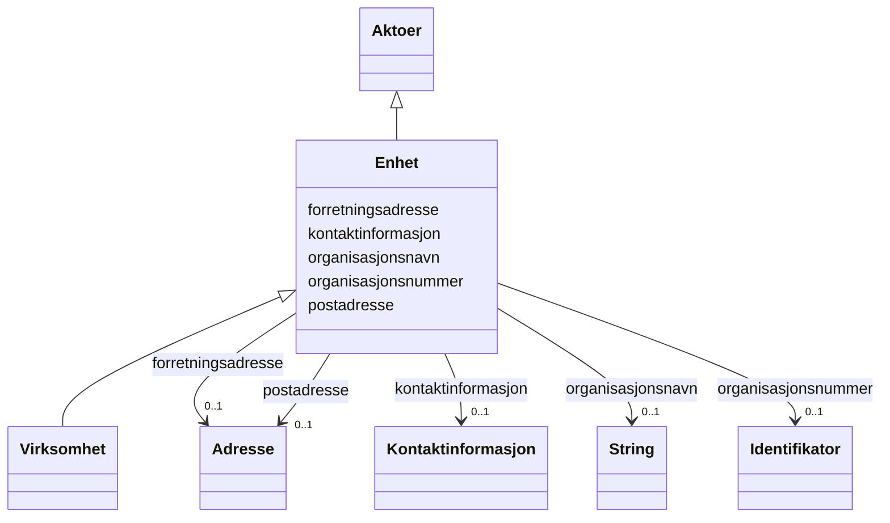

# Class: Enhet 


_Abstrakt base for alle hovudeiningar, undereiningar og organisasjonsledd identifisert med organisasjonsnummer._


* __NOTE__: this is an abstract class and should not be instantiated directly


URI: [fint:Enhet](https://schema.fintlabs.no/Enhet)





## Inheritance
* [Aktoer](aktoer.md)
    * **Enhet**
        * [Virksomhet](virksomhet.md)


## Class Properties

| Property | Value |
| --- | --- |
| Class URI | [fint:Enhet](https://schema.fintlabs.no/Enhet) |


## Eigenskapar


  
  

  
  

  
  


  
  

  
  

  
  


  
  
    
  

  
  
    
  

  
  
    
  


### Valgfri

| Namn | Kardinalitet og domene | Beskriving |
| --- | --- | --- |
| [forretningsadresse](forretningsadresse.md) | 0..1 <br/> [Adresse](adresse.md) | Besøksadresse til ein organisasjonseining |
| [organisasjonsnavn](organisasjonsnavn.md) | 0..1 <br/> [xsd:string](http://www.w3.org/2001/XMLSchema#string) | Namn på eining registrert i Einingsregisteret |
| [organisasjonsnummer](organisasjonsnummer.md) | 0..1 <br/> [Identifikator](identifikator.md) | Niisifra nummer som eintydleg identifiserer einingar i Einingsregisteret |


  
  
  
    
      
    
      
    
      
    
  
  

  
  
  
    
      
    
      
    
      
    
  
  

  
  
  
    
      
    
      
    
      
    
  
  


### Arva

| Namn | Kardinalitet og domene | Beskriving | Frå |
| --- | --- | --- | --- || [kontaktinformasjon](kontaktinformasjon.md) | 0..1 <br/> [Kontaktinformasjon](kontaktinformasjon.md) | Den føretrekte måten å kome i kontakt med ein aktør | [Aktoer](aktoer.md) |
| [postadresse](postadresse.md) | 0..1 <br/> [Adresse](adresse.md) | Informasjon om postadresse til ein aktør | [Aktoer](aktoer.md) |


## Identifier and Mapping Information


### Schema Source


* from schema: https://data.norge.no/fint/fint-common


## Mappings

| Mapping Type | Mapped Value |
| ---  | ---  |
| self | fint:Enhet |
| native | https://schema.fintlabs.no/:Enhet |


## LinkML Source

<!-- TODO: investigate https://stackoverflow.com/questions/37606292/how-to-create-tabbed-code-blocks-in-mkdocs-or-sphinx -->

### Direct

<details>
```yaml
name: Enhet
description: Abstrakt base for alle hovudeiningar, undereiningar og organisasjonsledd
  identifisert med organisasjonsnummer.
from_schema: https://data.norge.no/fint/fint-common
is_a: Aktoer
abstract: true
slots:
- forretningsadresse
- organisasjonsnavn
- organisasjonsnummer
slot_usage:
  forretningsadresse:
    name: forretningsadresse
    in_subset:
    - Valgfri
  organisasjonsnavn:
    name: organisasjonsnavn
    in_subset:
    - Valgfri
  organisasjonsnummer:
    name: organisasjonsnummer
    in_subset:
    - Valgfri
class_uri: fint:Enhet

```
</details>

### Induced

<details>
```yaml
name: Enhet
description: Abstrakt base for alle hovudeiningar, undereiningar og organisasjonsledd
  identifisert med organisasjonsnummer.
from_schema: https://data.norge.no/fint/fint-common
is_a: Aktoer
abstract: true
slot_usage:
  forretningsadresse:
    name: forretningsadresse
    in_subset:
    - Valgfri
  organisasjonsnavn:
    name: organisasjonsnavn
    in_subset:
    - Valgfri
  organisasjonsnummer:
    name: organisasjonsnummer
    in_subset:
    - Valgfri
attributes:
  forretningsadresse:
    name: forretningsadresse
    description: Besøksadresse til ein organisasjonseining.
    in_subset:
    - Valgfri
    from_schema: https://data.norge.no/fint/fint-common
    slot_uri: fint:forretningsadresse
    owner: Enhet
    domain_of:
    - Enhet
    - Arbeidslokasjon
    - Organisasjonselement
    range: Adresse
    inlined: true
  organisasjonsnavn:
    name: organisasjonsnavn
    description: Namn på eining registrert i Einingsregisteret.
    in_subset:
    - Valgfri
    from_schema: https://data.norge.no/fint/fint-common
    slot_uri: fint:organisasjonsnavn
    owner: Enhet
    domain_of:
    - Enhet
    - Arbeidslokasjon
    - Organisasjonselement
    range: string
  organisasjonsnummer:
    name: organisasjonsnummer
    description: Niisifra nummer som eintydleg identifiserer einingar i Einingsregisteret.
    in_subset:
    - Valgfri
    from_schema: https://data.norge.no/fint/fint-common
    slot_uri: fint:organisasjonsnummer
    owner: Enhet
    domain_of:
    - Enhet
    - Arbeidslokasjon
    - Organisasjonselement
    range: Identifikator
    inlined: true
  kontaktinformasjon:
    name: kontaktinformasjon
    description: Den føretrekte måten å kome i kontakt med ein aktør.
    in_subset:
    - Valgfri
    from_schema: https://data.norge.no/fint/fint-common
    slot_uri: fint:kontaktinformasjon
    owner: Enhet
    domain_of:
    - Aktoer
    - Kontaktperson
    - Arbeidslokasjon
    - Organisasjonselement
    - Personalressurs
    range: Kontaktinformasjon
    inlined: true
  postadresse:
    name: postadresse
    description: Informasjon om postadresse til ein aktør.
    in_subset:
    - Valgfri
    from_schema: https://data.norge.no/fint/fint-common
    slot_uri: fint:postadresse
    owner: Enhet
    domain_of:
    - Aktoer
    - Arbeidslokasjon
    - Organisasjonselement
    range: Adresse
    inlined: true
class_uri: fint:Enhet

```
</details>