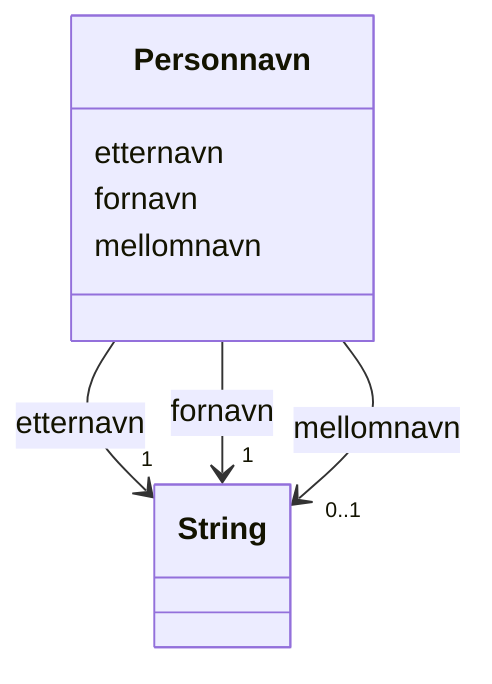

# Class: Personnavn 


_Namn på ein person._


URI: [fint:Personnavn](https://schema.fintlabs.no/Personnavn)





<!-- no inheritance hierarchy -->

## Class Properties

| Property | Value |
| --- | --- |
| Class URI | [fint:Personnavn](https://schema.fintlabs.no/Personnavn) |


## Eigenskapar


  
  

  
  

  
  


  
  

  
  

  
  


  
  

  
  

  
  


  
  
  
    
      
    
      
    
      
    
  
  
    
  

  
  
  
  
    
  

  
  
  
    
      
    
      
    
      
    
  
  
    
  


### Andre

| Namn | Kardinalitet og domene | Beskriving |
| --- | --- | --- |
| [fornavn](fornavn.md) | 1 <br/> [xsd:string](http://www.w3.org/2001/XMLSchema#string) | Fornamn til personen |
| [mellomnavn](mellomnavn.md) | 0..1 <br/> [xsd:string](http://www.w3.org/2001/XMLSchema#string) | Mellomnamn |
| [etternavn](etternavn.md) | 1 <br/> [xsd:string](http://www.w3.org/2001/XMLSchema#string) | Etternamn til personen |


## Usages

| used by | used in | type | used |
| ---  | --- | --- | --- |
| [Person](person.md) | [person_navn](person_navn.md) | range | [Personnavn](personnavn.md) |
| [Kontaktperson](kontaktperson.md) | [kontaktperson_navn](kontaktperson_navn.md) | range | [Personnavn](personnavn.md) |


## Identifier and Mapping Information


### Schema Source


* from schema: https://data.norge.no/fint/fint-common


## Mappings

| Mapping Type | Mapped Value |
| ---  | ---  |
| self | fint:Personnavn |
| native | https://schema.fintlabs.no/:Personnavn |


## LinkML Source

<!-- TODO: investigate https://stackoverflow.com/questions/37606292/how-to-create-tabbed-code-blocks-in-mkdocs-or-sphinx -->

### Direct

<details>
```yaml
name: Personnavn
description: Namn på ein person.
from_schema: https://data.norge.no/fint/fint-common
slots:
- fornavn
- mellomnavn
- etternavn
slot_usage:
  fornavn:
    name: fornavn
    required: true
  etternavn:
    name: etternavn
    required: true
class_uri: fint:Personnavn

```
</details>

### Induced

<details>
```yaml
name: Personnavn
description: Namn på ein person.
from_schema: https://data.norge.no/fint/fint-common
slot_usage:
  fornavn:
    name: fornavn
    required: true
  etternavn:
    name: etternavn
    required: true
attributes:
  fornavn:
    name: fornavn
    description: Fornamn til personen.
    from_schema: https://data.norge.no/fint/fint-common
    slot_uri: fint:fornavn
    owner: Personnavn
    domain_of:
    - Personnavn
    range: string
    required: true
  mellomnavn:
    name: mellomnavn
    description: Mellomnamn.
    from_schema: https://data.norge.no/fint/fint-common
    slot_uri: fint:mellomnavn
    owner: Personnavn
    domain_of:
    - Personnavn
    range: string
  etternavn:
    name: etternavn
    description: Etternamn til personen.
    from_schema: https://data.norge.no/fint/fint-common
    slot_uri: fint:etternavn
    owner: Personnavn
    domain_of:
    - Personnavn
    range: string
    required: true
class_uri: fint:Personnavn

```
</details>