# fint-arkiv

```mermaid
erDiagram
AdministrativEnhet {
    uriorcurie id  
    string navn  
    uriorcurie organisasjonselement  
}
Arkivdel {
    uriorcurie id  
    string tittel  
}
Arkivressurs {
    uriorcurie id  
    uriorcurie personalressurs  
}
Autorisasjon {
    uriorcurie id  
}
Avskrivning {
    string avskrevetAv  
    datetime avskrivningsdato  
    string avskrivningsmate  
}
DispensasjonAutomatiskFredaKulturminne {
    string kulturminneId  
    string tiltak  
    uriorcurie id  
    datetime avsluttetDato  
    string beskrivelse  
    stringList noekkelord  
    string offentligTittel  
    datetime opprettetDato  
    string saksaar  
    datetime saksdato  
    string sakssekvensnummer  
    string tittel  
    datetime utlaantDato  
}
DokumentStatus {
    uriorcurie id  
    string kode  
    string navn  
    boolean passiv  
}
DokumentType {
    uriorcurie id  
    string kode  
    string navn  
    boolean passiv  
}
Dokumentbeskrivelse {
    uriorcurie id  
    string beskrivelse  
    integer dokumentnummer  
    stringList forfatter  
    datetime opprettetDato  
    stringList referanseArkivdel  
    datetime tilknyttetDato  
    string tittel  
}
Dokumentfil {
    uriorcurie id  
    string data  
    string filnavn  
    string format  
}
Dokumentobjekt {
    string filstorrelse  
    string formatDetaljer  
    string sjekksum  
    string sjekksumAlgoritme  
    integer versjonsnummer  
}
Format {
    uriorcurie id  
    string kode  
    string navn  
    boolean passiv  
}
JournalStatus {
    uriorcurie id  
    string kode  
    string navn  
    boolean passiv  
}
Journalpost {
    integer antallVedlegg  
    datetime dokumentetsDato  
    datetime forfallsDato  
    string journalAr  
    datetime journalDato  
    integer journalPostnummer  
    integer journalSekvensnummer  
    datetime mottattDato  
    datetime offentlighetsvurdertDato  
    datetime sendtDato  
    uriorcurie id  
    datetime arkivertDato  
    string beskrivelse  
    stringList forfatter  
    stringList nokkelord  
    string offentligTittel  
    datetime opprettetDato  
    stringList referanseArkivDel  
    string registreringsId  
    string tittel  
}
JournalpostType {
    uriorcurie id  
    string kode  
    string navn  
    boolean passiv  
}
Klasse {
    string klasseId  
    integer rekkefoelge  
    string tittel  
}
Klassifikasjonssystem {
    uriorcurie id  
    string avsluttetAvNavn  
    datetime avsluttetDato  
    string beskrivelse  
    string opprettetAvNavn  
    datetime opprettetDato  
    string tittel  
}
Klassifikasjonstype {
    uriorcurie id  
    string kode  
    string navn  
    boolean passiv  
}
Korrespondansepart {
    string foedselsnummer  
    string kontaktperson_str  
    string korrespondansepartNavn  
    string orgnummer  
}
KorrespondansepartType {
    uriorcurie id  
    string kode  
    string navn  
    boolean passiv  
}
Merknad {
    datetime merknadsdato  
    string merknadstekst  
}
Merknadstype {
    uriorcurie id  
    string kode  
    string navn  
    boolean passiv  
}
Part {
    string foedselsnummer  
    string kontaktperson_str  
    string orgnummer  
    string partNavn  
}
PartRolle {
    uriorcurie id  
    string kode  
    string navn  
    boolean passiv  
}
Personalmappe {
    uriorcurie arbeidssted  
    uriorcurie leder  
    uriorcurie personalressurs  
    uriorcurie id  
    datetime avsluttetDato  
    string beskrivelse  
    stringList noekkelord  
    string offentligTittel  
    datetime opprettetDato  
    string saksaar  
    datetime saksdato  
    string sakssekvensnummer  
    string tittel  
    datetime utlaantDato  
}
Rolle {
    uriorcurie id  
    string kode  
    string navn  
    boolean passiv  
}
Sak {
    uriorcurie id  
    datetime avsluttetDato  
    string beskrivelse  
    stringList noekkelord  
    string offentligTittel  
    datetime opprettetDato  
    string saksaar  
    datetime saksdato  
    string sakssekvensnummer  
    string tittel  
    datetime utlaantDato  
}
Saksmappetype {
    uriorcurie id  
    string kode  
    string navn  
    boolean passiv  
}
Saksstatus {
    uriorcurie id  
    string kode  
    string navn  
    boolean passiv  
}
Skjerming {

}
Skjermingshjemmel {
    uriorcurie id  
    string kode  
    string navn  
    boolean passiv  
}
SoeknadDrosjeloeyve {
    string organisasjonsnavn  
    string orgnummer  
    uriorcurie id  
    datetime avsluttetDato  
    string beskrivelse  
    stringList noekkelord  
    string offentligTittel  
    datetime opprettetDato  
    string saksaar  
    datetime saksdato  
    string sakssekvensnummer  
    string tittel  
    datetime utlaantDato  
}
Tilgang {
    uriorcurie id  
    string tittel  
}
Tilgangsgruppe {
    uriorcurie id  
    string kode  
    string navn  
    boolean passiv  
}
Tilgangsrestriksjon {
    uriorcurie id  
    string kode  
    string navn  
    boolean passiv  
}
TilknyttetRegistreringSom {
    uriorcurie id  
    string kode  
    string navn  
    boolean passiv  
}
TilskuddFartoy {
    string fartoyNavn  
    string kallesignal  
    string kulturminneId  
    uriorcurie id  
    datetime avsluttetDato  
    string beskrivelse  
    stringList noekkelord  
    string offentligTittel  
    datetime opprettetDato  
    string saksaar  
    datetime saksdato  
    string sakssekvensnummer  
    string tittel  
    datetime utlaantDato  
}
TilskuddFredaBygningPrivatEie {
    string bygningsnavn  
    string kulturminneId  
    uriorcurie id  
    datetime avsluttetDato  
    string beskrivelse  
    stringList noekkelord  
    string offentligTittel  
    datetime opprettetDato  
    string saksaar  
    datetime saksdato  
    string sakssekvensnummer  
    string tittel  
    datetime utlaantDato  
}
Variantformat {
    uriorcurie id  
    string kode  
    string navn  
    boolean passiv  
}

Arkivdel ||--}o Klassifikasjonssystem : "klassifikasjonssystem"
Arkivressurs ||--}o Autorisasjon : "autorisasjon"
Arkivressurs ||--}o Tilgang : "tilgang"
Autorisasjon ||--}o AdministrativEnhet : "administrativenhet"
Autorisasjon ||--}o Arkivressurs : "arkivressurs"
Autorisasjon ||--}| Tilgangsrestriksjon : "tilgangsrestriksjon"
DispensasjonAutomatiskFredaKulturminne ||--|o AdministrativEnhet : "journalenhet"
DispensasjonAutomatiskFredaKulturminne ||--|o Arkivdel : "arkivdel"
DispensasjonAutomatiskFredaKulturminne ||--|o Arkivressurs : "avsluttetAv"
DispensasjonAutomatiskFredaKulturminne ||--|o Saksmappetype : "saksmappetype"
DispensasjonAutomatiskFredaKulturminne ||--|o Skjerming : "skjerming"
DispensasjonAutomatiskFredaKulturminne ||--|o Tilgangsgruppe : "tilgangsgruppe"
DispensasjonAutomatiskFredaKulturminne ||--|| AdministrativEnhet : "administrativEnhet"
DispensasjonAutomatiskFredaKulturminne ||--|| Arkivressurs : "opprettetAv, saksansvarlig"
DispensasjonAutomatiskFredaKulturminne ||--|| Saksstatus : "saksstatus"
DispensasjonAutomatiskFredaKulturminne ||--}o Journalpost : "journalpost"
DispensasjonAutomatiskFredaKulturminne ||--}o Klasse : "klasse"
DispensasjonAutomatiskFredaKulturminne ||--}o Merknad : "merknad"
DispensasjonAutomatiskFredaKulturminne ||--}o Part : "part"
Dokumentbeskrivelse ||--|o Skjerming : "skjerming"
Dokumentbeskrivelse ||--|| Arkivressurs : "opprettetAv, tilknyttetAv"
Dokumentbeskrivelse ||--|| DokumentStatus : "dokumentstatus"
Dokumentbeskrivelse ||--|| DokumentType : "dokumentType"
Dokumentbeskrivelse ||--}o Dokumentobjekt : "dokumentobjekt"
Dokumentbeskrivelse ||--}o Part : "part"
Dokumentbeskrivelse ||--}| TilknyttetRegistreringSom : "tilknyttetRegistreringSom"
Dokumentobjekt ||--|o Dokumentfil : "referanseDokumentfil"
Dokumentobjekt ||--|o Format : "filformat"
Dokumentobjekt ||--|| Arkivressurs : "opprettetAv"
Dokumentobjekt ||--|| Variantformat : "variantFormat"
Journalpost ||--|o AdministrativEnhet : "administrativEnhet, journalenhet"
Journalpost ||--|o Arkivdel : "arkivdel"
Journalpost ||--|o Arkivressurs : "saksbehandler"
Journalpost ||--|o Avskrivning : "avskrivning"
Journalpost ||--|o Klasse : "klasse"
Journalpost ||--|o Skjerming : "skjerming"
Journalpost ||--|o Tilgangsgruppe : "tilgangsgruppe"
Journalpost ||--|| Arkivressurs : "arkivertAv, opprettetAv"
Journalpost ||--|| JournalStatus : "journalstatus"
Journalpost ||--|| JournalpostType : "journalposttype"
Journalpost ||--}o Dokumentbeskrivelse : "dokumentbeskrivelse"
Journalpost ||--}o Korrespondansepart : "korrespondansepart"
Journalpost ||--}o Merknad : "merknad"
Journalpost ||--}o Part : "part"
Klasse ||--|o Skjerming : "skjerming"
Klasse ||--|| Klassifikasjonssystem : "klassifikasjonssystem"
Klassifikasjonssystem ||--|o Klassifikasjonstype : "klassifikasjonstype"
Klassifikasjonssystem ||--}| Arkivdel : "arkivdel"
Klassifikasjonssystem ||--}| Klasse : "klasse"
Korrespondansepart ||--|o Skjerming : "skjerming"
Korrespondansepart ||--|| KorrespondansepartType : "korrespondanseparttype"
Merknad ||--|| Arkivressurs : "merknadRegistrertAv"
Merknad ||--|| Merknadstype : "merknadstype"
Part ||--|o PartRolle : "partRolle"
Personalmappe ||--|o AdministrativEnhet : "journalenhet"
Personalmappe ||--|o Arkivdel : "arkivdel"
Personalmappe ||--|o Arkivressurs : "avsluttetAv"
Personalmappe ||--|o Saksmappetype : "saksmappetype"
Personalmappe ||--|o Skjerming : "skjerming"
Personalmappe ||--|o Tilgangsgruppe : "tilgangsgruppe"
Personalmappe ||--|| AdministrativEnhet : "administrativEnhet"
Personalmappe ||--|| Arkivressurs : "opprettetAv, saksansvarlig"
Personalmappe ||--|| Saksstatus : "saksstatus"
Personalmappe ||--}o Journalpost : "journalpost"
Personalmappe ||--}o Klasse : "klasse"
Personalmappe ||--}o Merknad : "merknad"
Personalmappe ||--}o Part : "part"
Sak ||--|o AdministrativEnhet : "journalenhet"
Sak ||--|o Arkivdel : "arkivdel"
Sak ||--|o Arkivressurs : "avsluttetAv"
Sak ||--|o Saksmappetype : "saksmappetype"
Sak ||--|o Skjerming : "skjerming"
Sak ||--|o Tilgangsgruppe : "tilgangsgruppe"
Sak ||--|| AdministrativEnhet : "administrativEnhet"
Sak ||--|| Arkivressurs : "opprettetAv, saksansvarlig"
Sak ||--|| Saksstatus : "saksstatus"
Sak ||--}o Journalpost : "journalpost"
Sak ||--}o Klasse : "klasse"
Sak ||--}o Merknad : "merknad"
Sak ||--}o Part : "part"
Skjerming ||--|| Skjermingshjemmel : "skjermingshjemmel"
Skjerming ||--|| Tilgangsrestriksjon : "tilgangsrestriksjon"
SoeknadDrosjeloeyve ||--|o AdministrativEnhet : "journalenhet"
SoeknadDrosjeloeyve ||--|o Arkivdel : "arkivdel"
SoeknadDrosjeloeyve ||--|o Arkivressurs : "avsluttetAv"
SoeknadDrosjeloeyve ||--|o Saksmappetype : "saksmappetype"
SoeknadDrosjeloeyve ||--|o Skjerming : "skjerming"
SoeknadDrosjeloeyve ||--|o Tilgangsgruppe : "tilgangsgruppe"
SoeknadDrosjeloeyve ||--|| AdministrativEnhet : "administrativEnhet"
SoeknadDrosjeloeyve ||--|| Arkivressurs : "opprettetAv, saksansvarlig"
SoeknadDrosjeloeyve ||--|| Saksstatus : "saksstatus"
SoeknadDrosjeloeyve ||--}o Journalpost : "journalpost"
SoeknadDrosjeloeyve ||--}o Klasse : "klasse"
SoeknadDrosjeloeyve ||--}o Merknad : "merknad"
SoeknadDrosjeloeyve ||--}o Part : "part"
Tilgang ||--|o AdministrativEnhet : "administrativEnhet"
Tilgang ||--|o Arkivdel : "arkivdel"
Tilgang ||--|| Rolle : "rolle"
Tilgang ||--}o Arkivressurs : "arkivressurs"
TilskuddFartoy ||--|o AdministrativEnhet : "journalenhet"
TilskuddFartoy ||--|o Arkivdel : "arkivdel"
TilskuddFartoy ||--|o Arkivressurs : "avsluttetAv"
TilskuddFartoy ||--|o Saksmappetype : "saksmappetype"
TilskuddFartoy ||--|o Skjerming : "skjerming"
TilskuddFartoy ||--|o Tilgangsgruppe : "tilgangsgruppe"
TilskuddFartoy ||--|| AdministrativEnhet : "administrativEnhet"
TilskuddFartoy ||--|| Arkivressurs : "opprettetAv, saksansvarlig"
TilskuddFartoy ||--|| Saksstatus : "saksstatus"
TilskuddFartoy ||--}o Journalpost : "journalpost"
TilskuddFartoy ||--}o Klasse : "klasse"
TilskuddFartoy ||--}o Merknad : "merknad"
TilskuddFartoy ||--}o Part : "part"
TilskuddFredaBygningPrivatEie ||--|o AdministrativEnhet : "journalenhet"
TilskuddFredaBygningPrivatEie ||--|o Arkivdel : "arkivdel"
TilskuddFredaBygningPrivatEie ||--|o Arkivressurs : "avsluttetAv"
TilskuddFredaBygningPrivatEie ||--|o Saksmappetype : "saksmappetype"
TilskuddFredaBygningPrivatEie ||--|o Skjerming : "skjerming"
TilskuddFredaBygningPrivatEie ||--|o Tilgangsgruppe : "tilgangsgruppe"
TilskuddFredaBygningPrivatEie ||--|| AdministrativEnhet : "administrativEnhet"
TilskuddFredaBygningPrivatEie ||--|| Arkivressurs : "opprettetAv, saksansvarlig"
TilskuddFredaBygningPrivatEie ||--|| Saksstatus : "saksstatus"
TilskuddFredaBygningPrivatEie ||--}o Journalpost : "journalpost"
TilskuddFredaBygningPrivatEie ||--}o Klasse : "klasse"
TilskuddFredaBygningPrivatEie ||--}o Merknad : "merknad"
TilskuddFredaBygningPrivatEie ||--}o Part : "part"


```

FINT-domenemodell for arkiv basert på Noark 5-standarden. Dekkjer sakshandtering, journalpostar, dokumenthandsaming, tilgangsstyring og spesialiserte saksmappe-typar.

URI: https://data.norge.no/linkml/fint-arkiv

Name: fint-arkiv

## Classes

### Obligatorisk

| Class | Description |
| --- | --- |
| [AdministrativEnhet](klasser/administrativenhet.md) | Administrativ eining med ansvar for saksbehandling |
| [Arkivdel](klasser/arkivdel.md) | Ein vilkårleg definert del av eit arkiv |
| [Arkivressurs](klasser/arkivressurs.md) | Ansatt med rolle og rettar innanfor arkiv |
| [Autorisasjon](klasser/autorisasjon.md) | Siling av kva ein innlogga brukar får lov til å gjere i løysinga |
| [Avskrivning](klasser/avskrivning.md) | Avskriving av ein journalpost (markering som ferdigbehandla) |
| [DispensasjonAutomatiskFredaKulturminne](klasser/dispensasjonautomatiskfredakulturminne.md) | Sak om søknad om dispensasjon for tiltak på automatisk freda kulturminne |
| [Dokumentbeskrivelse](klasser/dokumentbeskrivelse.md) | Skildring av eit dokument tilknytt ein journalpost |
| [Dokumentfil](klasser/dokumentfil.md) | Sjølve dokumentfila med data og metadata |
| [Dokumentobjekt](klasser/dokumentobjekt.md) | Referanse til éin og berre éin dokumentfil |
| [DokumentStatus](klasser/dokumentstatus.md) | Status til eit dokument |
| [DokumentType](klasser/dokumenttype.md) | Type dokument |
| [Format](klasser/format.md) | Dokumentets filformat |
| [Journalpost](klasser/journalpost.md) | Ein journalpost (inn- eller utgåande dokument, notat o |
| [JournalpostType](klasser/journalposttype.md) | Namn på type journalpost |
| [JournalStatus](klasser/journalstatus.md) | Status til journalposten |
| [Klasse](klasser/klasse.md) | Ein klasse i eit klassifikasjonssystem |
| [Klassifikasjonssystem](klasser/klassifikasjonssystem.md) | Overordna struktur for mappene i ein eller fleire arkivdelar |
| [Klassifikasjonstype](klasser/klassifikasjonstype.md) | Type klassifikasjonssystem |
| [Korrespondansepart](klasser/korrespondansepart.md) | Verksemd eller person som arkivskapar mottek eller sender arkivdokument til |
| [KorrespondansepartType](klasser/korrespondanseparttype.md) | Type korrespondansepart |
| [Mappe](klasser/mappe.md) | Abstrakt basisklasse for alle mappetypar |
| [Merknad](klasser/merknad.md) | Merknad knytt til mappe, registrering eller dokumentbeskrivelse |
| [Merknadstype](klasser/merknadstype.md) | Namn på type merknad |
| [Part](klasser/part.md) | Part til Mappe, Registrering eller Dokumentbeskrivelse |
| [PartRolle](klasser/partrolle.md) | Rolla til ein part |
| [Personalmappe](klasser/personalmappe.md) | Saksmappe med opplysningar om ein arbeidstakars arbeidsforhold |
| [Registrering](klasser/registrering.md) | Abstrakt basisklasse — arkivets primære byggeklossar |
| [Rolle](klasser/rolle.md) | Rolla til ein arkivressurs |
| [Saksmappe](klasser/saksmappe.md) | Abstrakt spesialisering av Mappe som svarar til ei "sak" i Noark |
| [Saksmappetype](klasser/saksmappetype.md) | Type saksmappe — differensierer innhald og behandlingsrutine |
| [Saksstatus](klasser/saksstatus.md) | Status til saksmappa |
| [Skjerming](klasser/skjerming.md) | Skjerming av mappe, registrering eller dokument etter offentleglova |
| [Skjermingshjemmel](klasser/skjermingshjemmel.md) | Tilvising til heimel i offentleglova, tryggingslova eller tryggingsinstruksen |
| [SoeknadDrosjeloeyve](klasser/soeknaddrosjeloeyve.md) | Sak om søknad om løyve til å køyre drosje |
| [Tilgang](klasser/tilgang.md) | Styring av kven som har tilgang til kva opplysningar |
| [Tilgangsgruppe](klasser/tilgangsgruppe.md) | Tilgangsgruppe for intern skjerming av innhald |
| [Tilgangsrestriksjon](klasser/tilgangsrestriksjon.md) | Angiving av at dokumenta ikkje er offentleg tilgjengelege |
| [TilknyttetRegistreringSom](klasser/tilknyttetregistreringsom.md) | Kva rolle dokumentet har i høve registreringa (t |
| [TilskuddFartoy](klasser/tilskuddfartoy.md) | Sak om søknad om tilskudd til freda fartøy |
| [TilskuddFredaBygningPrivatEie](klasser/tilskuddfredabygningprivateie.md) | Sak om søknad om tilskudd til freda bygningar i privat eige (FRIP) |
| [Variantformat](klasser/variantformat.md) | Angiving av kva variant eit dokument førekjem i |

### Andre

| Class | Description |
| --- | --- |
| [Sak](klasser/sak.md) | Generisk saksmappe (konkret Sak i Noark) |

## Slots

| Slot | Description |
| --- | --- |
| [administrativeEiningar](klasser/administrativeeiningar.md) |  |
| [administrativEnhet](klasser/administrativenhet.md) | Administrativ eining som har ansvar for saksbehandlinga |
| [administrativenhet](klasser/administrativenhet.md) | Administrative einingar autorisasjonen er gyldig for |
| [antallVedlegg](klasser/antallvedlegg.md) | Antal fysiske vedlegg til eit fysisk hoveddokument |
| [arbeidssted](klasser/arbeidssted.md) | Referanse til Organisasjonselement som er arbeidstakarens arbeidsstad |
| [arkivdel](klasser/arkivdel.md) | Arkivdel arkivenheten tilhøyrer |
| [arkivdelar](klasser/arkivdelar.md) |  |
| [arkivertAv](klasser/arkivertav.md) | Person som arkiverte arkivenheten |
| [arkivertDato](klasser/arkivertdato.md) | Dato og klokkeslett alle dokument knytt til registreringa vart arkivert |
| [arkivressurs](klasser/arkivressurs.md) | Arkivressursar |
| [arkivressursar](klasser/arkivressursar.md) |  |
| [autorisasjon](klasser/autorisasjon.md) | Autorisasjonar gjevne til arkivressursen |
| [autorisasjonar](klasser/autorisasjonar.md) |  |
| [avskrevetAv](klasser/avskrevetav.md) | Person som avskriva journalposten |
| [avskrivning](klasser/avskrivning.md) | Avskriving av journalposten |
| [avskrivningsdato](klasser/avskrivningsdato.md) | Dato og klokkeslett for avskrivinga |
| [avskrivningsmate](klasser/avskrivningsmate.md) | Korleis journalposten er avskriven |
| [avsluttetAv](klasser/avsluttetav.md) | Person som avslutta/lukka arkivenheten |
| [avsluttetAvNavn](klasser/avsluttetavnavn.md) | Namn på person som avslutta/lukka arkivenheten |
| [avsluttetDato](klasser/avsluttetdato.md) | Dato og klokkeslett når arkivenheten vart avslutta/lukka |
| [bygningsnavn](klasser/bygningsnavn.md) | Bygningens namn |
| [data](klasser/data.md) | Dokumentfilens data, koda som Base64 |
| [dispensasjonAutomatiskFredaKulturminne_liste](klasser/dispensasjonautomatiskfredakulturminne_liste.md) |  |
| [dokumentbeskrivelsar](klasser/dokumentbeskrivelsar.md) |  |
| [dokumentbeskrivelse](klasser/dokumentbeskrivelse.md) | Dokumentbeskrivelsar til ei registrering |
| [dokumentetsDato](klasser/dokumentetsdato.md) | Dato påført sjølve dokumentet |
| [dokumentfiler](klasser/dokumentfiler.md) |  |
| [dokumentnummer](klasser/dokumentnummer.md) | Identifikasjon av dokumenta innanfor ei registrering |
| [dokumentobjekt](klasser/dokumentobjekt.md) | Dokumentobjekt tilhøyrande dokumentbeskrivelsa |
| [dokumentstatus](klasser/dokumentstatus.md) | Status til dokumentet |
| [dokumentstatuskodar](klasser/dokumentstatuskodar.md) |  |
| [dokumenttypar](klasser/dokumenttypar.md) |  |
| [dokumentType](klasser/dokumenttype.md) | Namn på type dokument |
| [fartoyNavn](klasser/fartoynavn.md) | Fartøyets namn |
| [filformat](klasser/filformat.md) | Dokumentets format |
| [filnavn](klasser/filnavn.md) | Dokumentfilens namn |
| [filstorrelse](klasser/filstorrelse.md) | Storleiken på fila i antal bytes |
| [foedselsnummer](klasser/foedselsnummer.md) | Fødselsnummer |
| [forfallsDato](klasser/forfallsdato.md) | Frist for å svare på eit inngåande dokument |
| [forfatter](klasser/forfatter.md) | Namn på person eller organisasjon som skapte dokumentet |
| [format](klasser/format.md) | Format på dokumentfil, som IANA Media Type |
| [formatar](klasser/formatar.md) |  |
| [formatDetaljer](klasser/formatdetaljer.md) | Nærare spesifikasjon av dokumentets format |
| [journalAr](klasser/journalar.md) | Året journalposten vart oppretta |
| [journalDato](klasser/journaldato.md) | Datoen journalposten er oppretta/arkivert |
| [journalenhet](klasser/journalenhet.md) | Eining med arkivmessig ansvar |
| [journalpost](klasser/journalpost.md) | Journalpostar knytt til saksmappa |
| [journalpostar](klasser/journalpostar.md) |  |
| [journalPostnummer](klasser/journalpostnummer.md) | Rekkjefølgja journalpostane vart oppretta innanfor saksmappa |
| [journalposttypar](klasser/journalposttypar.md) |  |
| [journalposttype](klasser/journalposttype.md) | Namn på type journalpost |
| [journalSekvensnummer](klasser/journalsekvensnummer.md) | Rekkjefølgja journalposten vart oppretta under året |
| [journalstatus](klasser/journalstatus.md) | Status til journalposten |
| [journalstatuskodar](klasser/journalstatuskodar.md) |  |
| [kallesignal](klasser/kallesignal.md) | Fartøyets kallesignal |
| [kildesystemId](klasser/kildesystemid.md) | Kildesystemets identifikator for arkivressursen |
| [klasse](klasser/klasse.md) | Klassifisering av arkivenhet |
| [klasseId](klasser/klasseid.md) | Eintydig identifikasjon av klassen innanfor klassifikasjonssystemet |
| [klassifikasjonssystem](klasser/klassifikasjonssystem.md) | Klassifikasjonssystem |
| [klassifikasjonstypar](klasser/klassifikasjonstypar.md) |  |
| [klassifikasjonstype](klasser/klassifikasjonstype.md) | Type klassifikasjonssystem |
| [kontaktperson_str](klasser/kontaktperson_str.md) | Kontaktperson hos ein organisasjon som er avsender, mottakar eller sakspart |
| [korrespondansepart](klasser/korrespondansepart.md) | Mottakar eller sendar av arkivdokument |
| [korrespondansepartNavn](klasser/korrespondansepartnavn.md) | Namn på person eller organisasjon som er avsender eller mottakar |
| [korrespondanseparttypar](klasser/korrespondanseparttypar.md) |  |
| [korrespondanseparttype](klasser/korrespondanseparttype.md) | Type korrespondansepart |
| [kulturminneId](klasser/kulturminneid.md) | Kulturminnets ID i Askeladden |
| [leder](klasser/leder.md) | Referanse til Personalressurs som er arbeidstakarens leiar |
| [mappeId](klasser/mappeid.md) | Eintydig identifikasjon av mappa innanfor arkivet |
| [matrikkelnummer](klasser/matrikkelnummer.md) | Kulturminnets/bygningens identifikator i Matrikkelen |
| [merknad](klasser/merknad.md) | Merknader knytt til arkivenhet |
| [merknadRegistrertAv](klasser/merknadregistrertav.md) | Person som registrerte merknaden |
| [merknadsdato](klasser/merknadsdato.md) | Dato og klokkeslett merknaden vart registrert |
| [merknadstekst](klasser/merknadstekst.md) | Merknad frå saksbehandlar, leiar eller arkivpersonale |
| [merknadstypar](klasser/merknadstypar.md) |  |
| [merknadstype](klasser/merknadstype.md) | Type merknad |
| [mottattDato](klasser/mottattdato.md) | Dato eit eksternt dokument vart motteke |
| [noekkelord](klasser/noekkelord.md) | Nøkkelord som skildrar innhaldet (Mappe) |
| [nokkelord](klasser/nokkelord.md) | Nøkkelord som skildrar innhaldet (Registrering) |
| [offentlighetsvurdertDato](klasser/offentlighetsvurdertdato.md) | Datoen offentlegheitsvurdering vart gjennomført |
| [offentligTittel](klasser/offentligtittel.md) | Offentleg tittel der skjerma ord er fjerna |
| [opprettetAv](klasser/opprettetav.md) | Person som oppretta/registrerte arkivenheten |
| [opprettetAvNavn](klasser/opprettetavnavn.md) | Namn på person som oppretta/registrerte arkivenheten |
| [opprettetDato](klasser/opprettetdato.md) | Dato og klokkeslett arkivenheten vart oppretta/registrert |
| [organisasjonselement](klasser/organisasjonselement.md) | Referanse til Organisasjonselement i Administrasjon-domenet |
| [orgnummer](klasser/orgnummer.md) | Organisasjonsnummer |
| [part](klasser/part.md) | Partar til arkivenhet |
| [partNavn](klasser/partnavn.md) | Namn på verksemd eller person som er part |
| [partRollar](klasser/partrollar.md) |  |
| [partRolle](klasser/partrolle.md) | Rolla til parten |
| [personalmappe_liste](klasser/personalmappe_liste.md) |  |
| [personalressurs](klasser/personalressurs.md) | Referanse til Personalressurs i Administrasjon-domenet |
| [personnavn](klasser/personnavn.md) | Namn på person (Personnavn-objekt) |
| [referanseArkivDel](klasser/referansearkivdel.md) | Referanse til arkivdelen denne arkivenheten er tilknytt |
| [referanseArkivdel](klasser/referansearkivdel.md) | Referanse til arkivdelen denne arkivenheten er tilknytt |
| [referanseDokumentfil](klasser/referansedokumentfil.md) | Referanse til fila som inneheld det elektroniske dokumentet |
| [registreringsId](klasser/registreringsid.md) | Inngår i M004 journalpostID |
| [rekkefoelge](klasser/rekkefoelge.md) | Rekkjefølgje for klassifiseringar |
| [rollar](klasser/rollar.md) |  |
| [rolle](klasser/rolle.md) | Rolle tilknytt tilgangen |
| [sakar](klasser/sakar.md) |  |
| [saksaar](klasser/saksaar.md) | Inngår i M003 mappeID — viser året saksmappa vart oppretta |
| [saksansvarlig](klasser/saksansvarlig.md) | Person som er saksansvarleg |
| [saksbehandler](klasser/saksbehandler.md) | Person som er saksbehandlar |
| [saksdato](klasser/saksdato.md) | Datoen saka er oppretta |
| [saksmappetypar](klasser/saksmappetypar.md) |  |
| [saksmappetype](klasser/saksmappetype.md) | Type saksmappe |
| [sakssekvensnummer](klasser/sakssekvensnummer.md) | Inngår i M003 mappeID — viser rekkjefølgja saksmappene vart oppretta |
| [saksstatus](klasser/saksstatus.md) | Status til saksmappa |
| [sakstatuskodar](klasser/sakstatuskodar.md) |  |
| [sendtDato](klasser/sendtdato.md) | Dato eit internt produsert dokument vart sendt/ekspedert |
| [sjekksum](klasser/sjekksum.md) | Verdi som gir integritetssikring til dokumentets innhald |
| [sjekksumAlgoritme](klasser/sjekksumalgoritme.md) | Algoritme nytta for å berekne sjekksummen |
| [skjerming](klasser/skjerming.md) | Skjerming av arkivenhet |
| [skjermingsheimlar](klasser/skjermingsheimlar.md) |  |
| [skjermingshjemmel](klasser/skjermingshjemmel.md) | Skjermingsheimelen |
| [soeknadDrosjeloeyve_liste](klasser/soeknaddrosjeloeyve_liste.md) |  |
| [soeknadsnummer](klasser/soeknadsnummer.md) | Søknadsnummer frå Digisak |
| [tilgang](klasser/tilgang.md) | Tilgangar gjevne til arkivressursen |
| [tilgangar](klasser/tilgangar.md) |  |
| [tilgangsgruppe](klasser/tilgangsgruppe.md) | Tilgangsgruppe som har tilgang til arkivenheten |
| [tilgangsgrupper](klasser/tilgangsgrupper.md) |  |
| [tilgangsrestriksjon](klasser/tilgangsrestriksjon.md) | Tilgangsrestriksjon |
| [tilgangsrestriksjonar](klasser/tilgangsrestriksjonar.md) |  |
| [tilknyttetAv](klasser/tilknyttetav.md) | Person som knytte dokumentet til registreringa |
| [tilknyttetDato](klasser/tilknyttetdato.md) | Datoen eit dokument vart knytt til ei registrering |
| [tilknyttetRegistreringSom](klasser/tilknyttetregistreringsom.md) | Rolle dokumentet har i høve registreringa |
| [tilknyttetRegistreringSomKodar](klasser/tilknyttetregistreringsomkodar.md) |  |
| [tilskuddFartoy_liste](klasser/tilskuddfartoy_liste.md) |  |
| [tilskuddFredaBygningPrivatEie_liste](klasser/tilskuddfredabygningprivateie_liste.md) |  |
| [tiltak](klasser/tiltak.md) | Skildrar kva tiltak som skal utførast på eigedommen |
| [tittel](klasser/tittel.md) | Tittel eller namn på arkivenheten |
| [utlaantDato](klasser/utlaantdato.md) | Dato ein fysisk saksmappe eller journalpost vart utlånt |
| [variantFormat](klasser/variantformat.md) | Kva variant dokumentet førekjem i |
| [variantformatar](klasser/variantformatar.md) |  |
| [versjonsnummer](klasser/versjonsnummer.md) | Identifikasjon av versjonar innanfor same dokument |

## Enumerations

| Enumeration | Description |
| --- | --- |

## Types

| Type | Description |
| --- | --- |

## Subsets

| Subset | Description |
| --- | --- |
| [Anbefalt](klasser/anbefalt.md) | Anbefalt eigensskap |
| [Obligatorisk](klasser/obligatorisk.md) | Obligatorisk eigensskap |
| [Valgfri](klasser/valgfri.md) | Valfri eigensskap |

## Generated artifacts

| Artefakt | Fil |
|----------|-----|
| SHACL shapes | [fint-arkiv-shapes.ttl](fint-arkiv-shapes.ttl) |
| JSON-LD kontekst | [fint-arkiv-context.jsonld](fint-arkiv-context.jsonld) |
| JSON Schema | [fint-arkiv-schema.json](fint-arkiv-schema.json) |
| OWL ontologi | [fint-arkiv-ontology.ttl](fint-arkiv-ontology.ttl) |
| RDF/Turtle skjema | [fint-arkiv-schema.ttl](fint-arkiv-schema.ttl) |
| Python-klasser | [fint-arkiv-model.py](fint-arkiv-model.py) |
| ER-diagram (Mermaid) | [fint-arkiv-erdiagram.md](fint-arkiv-erdiagram.md) |
| Eksempeldata (Turtle) | [fint-arkiv-eksempel.ttl](fint-arkiv-eksempel.ttl) |
