# Class: ArkivContainer 


_Rotcontainer for FINT Arkiv-instansar._


URI: [https://schema.fintlabs.no/arkiv/:ArkivContainer](https://schema.fintlabs.no/arkiv/:ArkivContainer)

```mermaid
 classDiagram
    class ArkivContainer
    click ArkivContainer href "../ArkivContainer/"
      ArkivContainer : administrativeEiningar
        
          
    
        
        
        ArkivContainer --> "*" AdministrativEnhet : administrativeEiningar
        click AdministrativEnhet href "../AdministrativEnhet/"
    

        
      ArkivContainer : arkivdelar
        
          
    
        
        
        ArkivContainer --> "*" Arkivdel : arkivdelar
        click Arkivdel href "../Arkivdel/"
    

        
      ArkivContainer : arkivressursar
        
          
    
        
        
        ArkivContainer --> "*" Arkivressurs : arkivressursar
        click Arkivressurs href "../Arkivressurs/"
    

        
      ArkivContainer : autorisasjonar
        
          
    
        
        
        ArkivContainer --> "*" Autorisasjon : autorisasjonar
        click Autorisasjon href "../Autorisasjon/"
    

        
      ArkivContainer : dispensasjonAutomatiskFredaKulturminne_liste
        
          
    
        
        
        ArkivContainer --> "*" DispensasjonAutomatiskFredaKulturminne : dispensasjonAutomatiskFredaKulturminne_liste
        click DispensasjonAutomatiskFredaKulturminne href "../DispensasjonAutomatiskFredaKulturminne/"
    

        
      ArkivContainer : dokumentbeskrivelsar
        
          
    
        
        
        ArkivContainer --> "*" Dokumentbeskrivelse : dokumentbeskrivelsar
        click Dokumentbeskrivelse href "../Dokumentbeskrivelse/"
    

        
      ArkivContainer : dokumentfiler
        
          
    
        
        
        ArkivContainer --> "*" Dokumentfil : dokumentfiler
        click Dokumentfil href "../Dokumentfil/"
    

        
      ArkivContainer : dokumentstatuskodar
        
          
    
        
        
        ArkivContainer --> "*" DokumentStatus : dokumentstatuskodar
        click DokumentStatus href "../DokumentStatus/"
    

        
      ArkivContainer : dokumenttypar
        
          
    
        
        
        ArkivContainer --> "*" DokumentType : dokumenttypar
        click DokumentType href "../DokumentType/"
    

        
      ArkivContainer : formatar
        
          
    
        
        
        ArkivContainer --> "*" Format : formatar
        click Format href "../Format/"
    

        
      ArkivContainer : journalpostar
        
          
    
        
        
        ArkivContainer --> "*" Journalpost : journalpostar
        click Journalpost href "../Journalpost/"
    

        
      ArkivContainer : journalposttypar
        
          
    
        
        
        ArkivContainer --> "*" JournalpostType : journalposttypar
        click JournalpostType href "../JournalpostType/"
    

        
      ArkivContainer : journalstatuskodar
        
          
    
        
        
        ArkivContainer --> "*" JournalStatus : journalstatuskodar
        click JournalStatus href "../JournalStatus/"
    

        
      ArkivContainer : klassifikasjonssystem
        
          
    
        
        
        ArkivContainer --> "*" Klassifikasjonssystem : klassifikasjonssystem
        click Klassifikasjonssystem href "../Klassifikasjonssystem/"
    

        
      ArkivContainer : klassifikasjonstypar
        
          
    
        
        
        ArkivContainer --> "*" Klassifikasjonstype : klassifikasjonstypar
        click Klassifikasjonstype href "../Klassifikasjonstype/"
    

        
      ArkivContainer : korrespondanseparttypar
        
          
    
        
        
        ArkivContainer --> "*" KorrespondansepartType : korrespondanseparttypar
        click KorrespondansepartType href "../KorrespondansepartType/"
    

        
      ArkivContainer : merknadstypar
        
          
    
        
        
        ArkivContainer --> "*" Merknadstype : merknadstypar
        click Merknadstype href "../Merknadstype/"
    

        
      ArkivContainer : partRollar
        
          
    
        
        
        ArkivContainer --> "*" PartRolle : partRollar
        click PartRolle href "../PartRolle/"
    

        
      ArkivContainer : personalmappe_liste
        
          
    
        
        
        ArkivContainer --> "*" Personalmappe : personalmappe_liste
        click Personalmappe href "../Personalmappe/"
    

        
      ArkivContainer : rollar
        
          
    
        
        
        ArkivContainer --> "*" Rolle : rollar
        click Rolle href "../Rolle/"
    

        
      ArkivContainer : sakar
        
          
    
        
        
        ArkivContainer --> "*" Sak : sakar
        click Sak href "../Sak/"
    

        
      ArkivContainer : saksmappetypar
        
          
    
        
        
        ArkivContainer --> "*" Saksmappetype : saksmappetypar
        click Saksmappetype href "../Saksmappetype/"
    

        
      ArkivContainer : sakstatuskodar
        
          
    
        
        
        ArkivContainer --> "*" Saksstatus : sakstatuskodar
        click Saksstatus href "../Saksstatus/"
    

        
      ArkivContainer : skjermingsheimlar
        
          
    
        
        
        ArkivContainer --> "*" Skjermingshjemmel : skjermingsheimlar
        click Skjermingshjemmel href "../Skjermingshjemmel/"
    

        
      ArkivContainer : soeknadDrosjeloeyve_liste
        
          
    
        
        
        ArkivContainer --> "*" SoeknadDrosjeloeyve : soeknadDrosjeloeyve_liste
        click SoeknadDrosjeloeyve href "../SoeknadDrosjeloeyve/"
    

        
      ArkivContainer : tilgangar
        
          
    
        
        
        ArkivContainer --> "*" Tilgang : tilgangar
        click Tilgang href "../Tilgang/"
    

        
      ArkivContainer : tilgangsgrupper
        
          
    
        
        
        ArkivContainer --> "*" Tilgangsgruppe : tilgangsgrupper
        click Tilgangsgruppe href "../Tilgangsgruppe/"
    

        
      ArkivContainer : tilgangsrestriksjonar
        
          
    
        
        
        ArkivContainer --> "*" Tilgangsrestriksjon : tilgangsrestriksjonar
        click Tilgangsrestriksjon href "../Tilgangsrestriksjon/"
    

        
      ArkivContainer : tilknyttetRegistreringSomKodar
        
          
    
        
        
        ArkivContainer --> "*" TilknyttetRegistreringSom : tilknyttetRegistreringSomKodar
        click TilknyttetRegistreringSom href "../TilknyttetRegistreringSom/"
    

        
      ArkivContainer : tilskuddFartoy_liste
        
          
    
        
        
        ArkivContainer --> "*" TilskuddFartoy : tilskuddFartoy_liste
        click TilskuddFartoy href "../TilskuddFartoy/"
    

        
      ArkivContainer : tilskuddFredaBygningPrivatEie_liste
        
          
    
        
        
        ArkivContainer --> "*" TilskuddFredaBygningPrivatEie : tilskuddFredaBygningPrivatEie_liste
        click TilskuddFredaBygningPrivatEie href "../TilskuddFredaBygningPrivatEie/"
    

        
      ArkivContainer : variantformatar
        
          
    
        
        
        ArkivContainer --> "*" Variantformat : variantformatar
        click Variantformat href "../Variantformat/"
    

        
      
```





<!-- no inheritance hierarchy -->

## Class Properties

| Property | Value |
| --- | --- |
| Tree Root | Yes |


## Eigenskapar


  
  

  
  

  
  

  
  

  
  

  
  

  
  

  
  

  
  

  
  

  
  

  
  

  
  

  
  

  
  

  
  

  
  

  
  

  
  

  
  

  
  

  
  

  
  

  
  

  
  

  
  

  
  

  
  

  
  

  
  

  
  

  
  


  
  

  
  

  
  

  
  

  
  

  
  

  
  

  
  

  
  

  
  

  
  

  
  

  
  

  
  

  
  

  
  

  
  

  
  

  
  

  
  

  
  

  
  

  
  

  
  

  
  

  
  

  
  

  
  

  
  

  
  

  
  

  
  


  
  

  
  

  
  

  
  

  
  

  
  

  
  

  
  

  
  

  
  

  
  

  
  

  
  

  
  

  
  

  
  

  
  

  
  

  
  

  
  

  
  

  
  

  
  

  
  

  
  

  
  

  
  

  
  

  
  

  
  

  
  

  
  


  
  
  
  
    
  

  
  
  
  
    
  

  
  
  
  
    
  

  
  
  
  
    
  

  
  
  
  
    
  

  
  
  
  
    
  

  
  
  
  
    
  

  
  
  
    
      
    
      
    
      
    
  
  
    
  

  
  
  
  
    
  

  
  
  
  
    
  

  
  
  
  
    
  

  
  
  
  
    
  

  
  
  
  
    
  

  
  
  
  
    
  

  
  
  
  
    
  

  
  
  
  
    
  

  
  
  
  
    
  

  
  
  
  
    
  

  
  
  
  
    
  

  
  
  
  
    
  

  
  
  
  
    
  

  
  
  
  
    
  

  
  
  
  
    
  

  
  
  
  
    
  

  
  
  
  
    
  

  
  
  
  
    
  

  
  
  
  
    
  

  
  
  
  
    
  

  
  
  
  
    
  

  
  
  
  
    
  

  
  
  
  
    
  

  
  
  
  
    
  


### Andre

| Namn | Kardinalitet og domene | Beskriving |
| --- | --- | --- |
| [arkivdelar](arkivdelar.md) | * <br/> [Arkivdel](arkivdel.md) |  |
| [arkivressursar](arkivressursar.md) | * <br/> [Arkivressurs](arkivressurs.md) |  |
| [autorisasjonar](autorisasjonar.md) | * <br/> [Autorisasjon](autorisasjon.md) |  |
| [administrativeEiningar](administrativeeiningar.md) | * <br/> [AdministrativEnhet](administrativenhet.md) |  |
| [dokumentfiler](dokumentfiler.md) | * <br/> [Dokumentfil](dokumentfil.md) |  |
| [dokumentbeskrivelsar](dokumentbeskrivelsar.md) | * <br/> [Dokumentbeskrivelse](dokumentbeskrivelse.md) |  |
| [journalpostar](journalpostar.md) | * <br/> [Journalpost](journalpost.md) |  |
| [klassifikasjonssystem](klassifikasjonssystem.md) | * <br/> [Klassifikasjonssystem](klassifikasjonssystem.md) | Klassifikasjonssystem |
| [tilgangar](tilgangar.md) | * <br/> [Tilgang](tilgang.md) |  |
| [sakar](sakar.md) | * <br/> [Sak](sak.md) |  |
| [personalmappe_liste](personalmappe_liste.md) | * <br/> [Personalmappe](personalmappe.md) |  |
| [dispensasjonAutomatiskFredaKulturminne_liste](dispensasjonautomatiskfredakulturminne_liste.md) | * <br/> [DispensasjonAutomatiskFredaKulturminne](dispensasjonautomatiskfredakulturminne.md) |  |
| [tilskuddFartoy_liste](tilskuddfartoy_liste.md) | * <br/> [TilskuddFartoy](tilskuddfartoy.md) |  |
| [tilskuddFredaBygningPrivatEie_liste](tilskuddfredabygningprivateie_liste.md) | * <br/> [TilskuddFredaBygningPrivatEie](tilskuddfredabygningprivateie.md) |  |
| [soeknadDrosjeloeyve_liste](soeknaddrosjeloeyve_liste.md) | * <br/> [SoeknadDrosjeloeyve](soeknaddrosjeloeyve.md) |  |
| [dokumentstatuskodar](dokumentstatuskodar.md) | * <br/> [DokumentStatus](dokumentstatus.md) |  |
| [dokumenttypar](dokumenttypar.md) | * <br/> [DokumentType](dokumenttype.md) |  |
| [formatar](formatar.md) | * <br/> [Format](format.md) |  |
| [journalposttypar](journalposttypar.md) | * <br/> [JournalpostType](journalposttype.md) |  |
| [journalstatuskodar](journalstatuskodar.md) | * <br/> [JournalStatus](journalstatus.md) |  |
| [klassifikasjonstypar](klassifikasjonstypar.md) | * <br/> [Klassifikasjonstype](klassifikasjonstype.md) |  |
| [korrespondanseparttypar](korrespondanseparttypar.md) | * <br/> [KorrespondansepartType](korrespondanseparttype.md) |  |
| [merknadstypar](merknadstypar.md) | * <br/> [Merknadstype](merknadstype.md) |  |
| [partRollar](partrollar.md) | * <br/> [PartRolle](partrolle.md) |  |
| [rollar](rollar.md) | * <br/> [Rolle](rolle.md) |  |
| [saksmappetypar](saksmappetypar.md) | * <br/> [Saksmappetype](saksmappetype.md) |  |
| [sakstatuskodar](sakstatuskodar.md) | * <br/> [Saksstatus](saksstatus.md) |  |
| [skjermingsheimlar](skjermingsheimlar.md) | * <br/> [Skjermingshjemmel](skjermingshjemmel.md) |  |
| [tilgangsgrupper](tilgangsgrupper.md) | * <br/> [Tilgangsgruppe](tilgangsgruppe.md) |  |
| [tilgangsrestriksjonar](tilgangsrestriksjonar.md) | * <br/> [Tilgangsrestriksjon](tilgangsrestriksjon.md) |  |
| [tilknyttetRegistreringSomKodar](tilknyttetregistreringsomkodar.md) | * <br/> [TilknyttetRegistreringSom](tilknyttetregistreringsom.md) |  |
| [variantformatar](variantformatar.md) | * <br/> [Variantformat](variantformat.md) |  |


## Identifier and Mapping Information


### Schema Source


* from schema: https://data.norge.no/linkml/fint-arkiv


## Mappings

| Mapping Type | Mapped Value |
| ---  | ---  |
| self | https://schema.fintlabs.no/arkiv/:ArkivContainer |
| native | https://schema.fintlabs.no/arkiv/:ArkivContainer |


## LinkML Source

<!-- TODO: investigate https://stackoverflow.com/questions/37606292/how-to-create-tabbed-code-blocks-in-mkdocs-or-sphinx -->

### Direct

<details>
```yaml
name: ArkivContainer
description: Rotcontainer for FINT Arkiv-instansar.
from_schema: https://data.norge.no/linkml/fint-arkiv
rank: 1000
slots:
- arkivdelar
- arkivressursar
- autorisasjonar
- administrativeEiningar
- dokumentfiler
- dokumentbeskrivelsar
- journalpostar
- klassifikasjonssystem
- tilgangar
- sakar
- personalmappe_liste
- dispensasjonAutomatiskFredaKulturminne_liste
- tilskuddFartoy_liste
- tilskuddFredaBygningPrivatEie_liste
- soeknadDrosjeloeyve_liste
- dokumentstatuskodar
- dokumenttypar
- formatar
- journalposttypar
- journalstatuskodar
- klassifikasjonstypar
- korrespondanseparttypar
- merknadstypar
- partRollar
- rollar
- saksmappetypar
- sakstatuskodar
- skjermingsheimlar
- tilgangsgrupper
- tilgangsrestriksjonar
- tilknyttetRegistreringSomKodar
- variantformatar
slot_usage:
  klassifikasjonssystem:
    name: klassifikasjonssystem
    multivalued: true
    inlined_as_list: true
tree_root: true

```
</details>

### Induced

<details>
```yaml
name: ArkivContainer
description: Rotcontainer for FINT Arkiv-instansar.
from_schema: https://data.norge.no/linkml/fint-arkiv
rank: 1000
slot_usage:
  klassifikasjonssystem:
    name: klassifikasjonssystem
    multivalued: true
    inlined_as_list: true
attributes:
  arkivdelar:
    name: arkivdelar
    from_schema: https://data.norge.no/linkml/fint-arkiv
    rank: 1000
    slot_uri: ark:arkivdelar
    alias: arkivdelar
    owner: ArkivContainer
    domain_of:
    - ArkivContainer
    range: Arkivdel
    multivalued: true
    inlined: true
    inlined_as_list: true
  arkivressursar:
    name: arkivressursar
    from_schema: https://data.norge.no/linkml/fint-arkiv
    rank: 1000
    slot_uri: ark:arkivressursar
    alias: arkivressursar
    owner: ArkivContainer
    domain_of:
    - ArkivContainer
    range: Arkivressurs
    multivalued: true
    inlined: true
    inlined_as_list: true
  autorisasjonar:
    name: autorisasjonar
    from_schema: https://data.norge.no/linkml/fint-arkiv
    rank: 1000
    slot_uri: ark:autorisasjonar
    alias: autorisasjonar
    owner: ArkivContainer
    domain_of:
    - ArkivContainer
    range: Autorisasjon
    multivalued: true
    inlined: true
    inlined_as_list: true
  administrativeEiningar:
    name: administrativeEiningar
    from_schema: https://data.norge.no/linkml/fint-arkiv
    rank: 1000
    slot_uri: ark:administrativeEiningar
    alias: administrativeEiningar
    owner: ArkivContainer
    domain_of:
    - ArkivContainer
    range: AdministrativEnhet
    multivalued: true
    inlined: true
    inlined_as_list: true
  dokumentfiler:
    name: dokumentfiler
    from_schema: https://data.norge.no/linkml/fint-arkiv
    rank: 1000
    slot_uri: ark:dokumentfiler
    alias: dokumentfiler
    owner: ArkivContainer
    domain_of:
    - ArkivContainer
    range: Dokumentfil
    multivalued: true
    inlined: true
    inlined_as_list: true
  dokumentbeskrivelsar:
    name: dokumentbeskrivelsar
    from_schema: https://data.norge.no/linkml/fint-arkiv
    rank: 1000
    slot_uri: ark:dokumentbeskrivelsar
    alias: dokumentbeskrivelsar
    owner: ArkivContainer
    domain_of:
    - ArkivContainer
    range: Dokumentbeskrivelse
    multivalued: true
    inlined: true
    inlined_as_list: true
  journalpostar:
    name: journalpostar
    from_schema: https://data.norge.no/linkml/fint-arkiv
    rank: 1000
    slot_uri: ark:journalpostar
    alias: journalpostar
    owner: ArkivContainer
    domain_of:
    - ArkivContainer
    range: Journalpost
    multivalued: true
    inlined: true
    inlined_as_list: true
  klassifikasjonssystem:
    name: klassifikasjonssystem
    description: Klassifikasjonssystem.
    from_schema: https://data.norge.no/linkml/fint-arkiv
    rank: 1000
    slot_uri: ark:klassifikasjonssystem
    alias: klassifikasjonssystem
    owner: ArkivContainer
    domain_of:
    - ArkivContainer
    - Arkivdel
    - Klasse
    range: Klassifikasjonssystem
    multivalued: true
    inlined_as_list: true
  tilgangar:
    name: tilgangar
    from_schema: https://data.norge.no/linkml/fint-arkiv
    rank: 1000
    slot_uri: ark:tilgangar
    alias: tilgangar
    owner: ArkivContainer
    domain_of:
    - ArkivContainer
    range: Tilgang
    multivalued: true
    inlined: true
    inlined_as_list: true
  sakar:
    name: sakar
    from_schema: https://data.norge.no/linkml/fint-arkiv
    rank: 1000
    slot_uri: ark:sakar
    alias: sakar
    owner: ArkivContainer
    domain_of:
    - ArkivContainer
    range: Sak
    multivalued: true
    inlined: true
    inlined_as_list: true
  personalmappe_liste:
    name: personalmappe_liste
    from_schema: https://data.norge.no/linkml/fint-arkiv
    rank: 1000
    slot_uri: ark:personalmappe
    alias: personalmappe_liste
    owner: ArkivContainer
    domain_of:
    - ArkivContainer
    range: Personalmappe
    multivalued: true
    inlined: true
    inlined_as_list: true
  dispensasjonAutomatiskFredaKulturminne_liste:
    name: dispensasjonAutomatiskFredaKulturminne_liste
    from_schema: https://data.norge.no/linkml/fint-arkiv
    rank: 1000
    slot_uri: ark:dispensasjonAutomatiskFredaKulturminne
    alias: dispensasjonAutomatiskFredaKulturminne_liste
    owner: ArkivContainer
    domain_of:
    - ArkivContainer
    range: DispensasjonAutomatiskFredaKulturminne
    multivalued: true
    inlined: true
    inlined_as_list: true
  tilskuddFartoy_liste:
    name: tilskuddFartoy_liste
    from_schema: https://data.norge.no/linkml/fint-arkiv
    rank: 1000
    slot_uri: ark:tilskuddFartoy
    alias: tilskuddFartoy_liste
    owner: ArkivContainer
    domain_of:
    - ArkivContainer
    range: TilskuddFartoy
    multivalued: true
    inlined: true
    inlined_as_list: true
  tilskuddFredaBygningPrivatEie_liste:
    name: tilskuddFredaBygningPrivatEie_liste
    from_schema: https://data.norge.no/linkml/fint-arkiv
    rank: 1000
    slot_uri: ark:tilskuddFredaBygningPrivatEie
    alias: tilskuddFredaBygningPrivatEie_liste
    owner: ArkivContainer
    domain_of:
    - ArkivContainer
    range: TilskuddFredaBygningPrivatEie
    multivalued: true
    inlined: true
    inlined_as_list: true
  soeknadDrosjeloeyve_liste:
    name: soeknadDrosjeloeyve_liste
    from_schema: https://data.norge.no/linkml/fint-arkiv
    rank: 1000
    slot_uri: ark:soeknadDrosjeloeyve
    alias: soeknadDrosjeloeyve_liste
    owner: ArkivContainer
    domain_of:
    - ArkivContainer
    range: SoeknadDrosjeloeyve
    multivalued: true
    inlined: true
    inlined_as_list: true
  dokumentstatuskodar:
    name: dokumentstatuskodar
    from_schema: https://data.norge.no/linkml/fint-arkiv
    rank: 1000
    slot_uri: ark:dokumentstatuskodar
    alias: dokumentstatuskodar
    owner: ArkivContainer
    domain_of:
    - ArkivContainer
    range: DokumentStatus
    multivalued: true
    inlined: true
    inlined_as_list: true
  dokumenttypar:
    name: dokumenttypar
    from_schema: https://data.norge.no/linkml/fint-arkiv
    rank: 1000
    slot_uri: ark:dokumenttypar
    alias: dokumenttypar
    owner: ArkivContainer
    domain_of:
    - ArkivContainer
    range: DokumentType
    multivalued: true
    inlined: true
    inlined_as_list: true
  formatar:
    name: formatar
    from_schema: https://data.norge.no/linkml/fint-arkiv
    rank: 1000
    slot_uri: ark:formatar
    alias: formatar
    owner: ArkivContainer
    domain_of:
    - ArkivContainer
    range: Format
    multivalued: true
    inlined: true
    inlined_as_list: true
  journalposttypar:
    name: journalposttypar
    from_schema: https://data.norge.no/linkml/fint-arkiv
    rank: 1000
    slot_uri: ark:journalposttypar
    alias: journalposttypar
    owner: ArkivContainer
    domain_of:
    - ArkivContainer
    range: JournalpostType
    multivalued: true
    inlined: true
    inlined_as_list: true
  journalstatuskodar:
    name: journalstatuskodar
    from_schema: https://data.norge.no/linkml/fint-arkiv
    rank: 1000
    slot_uri: ark:journalstatuskodar
    alias: journalstatuskodar
    owner: ArkivContainer
    domain_of:
    - ArkivContainer
    range: JournalStatus
    multivalued: true
    inlined: true
    inlined_as_list: true
  klassifikasjonstypar:
    name: klassifikasjonstypar
    from_schema: https://data.norge.no/linkml/fint-arkiv
    rank: 1000
    slot_uri: ark:klassifikasjonstypar
    alias: klassifikasjonstypar
    owner: ArkivContainer
    domain_of:
    - ArkivContainer
    range: Klassifikasjonstype
    multivalued: true
    inlined: true
    inlined_as_list: true
  korrespondanseparttypar:
    name: korrespondanseparttypar
    from_schema: https://data.norge.no/linkml/fint-arkiv
    rank: 1000
    slot_uri: ark:korrespondanseparttypar
    alias: korrespondanseparttypar
    owner: ArkivContainer
    domain_of:
    - ArkivContainer
    range: KorrespondansepartType
    multivalued: true
    inlined: true
    inlined_as_list: true
  merknadstypar:
    name: merknadstypar
    from_schema: https://data.norge.no/linkml/fint-arkiv
    rank: 1000
    slot_uri: ark:merknadstypar
    alias: merknadstypar
    owner: ArkivContainer
    domain_of:
    - ArkivContainer
    range: Merknadstype
    multivalued: true
    inlined: true
    inlined_as_list: true
  partRollar:
    name: partRollar
    from_schema: https://data.norge.no/linkml/fint-arkiv
    rank: 1000
    slot_uri: ark:partRollar
    alias: partRollar
    owner: ArkivContainer
    domain_of:
    - ArkivContainer
    range: PartRolle
    multivalued: true
    inlined: true
    inlined_as_list: true
  rollar:
    name: rollar
    from_schema: https://data.norge.no/linkml/fint-arkiv
    rank: 1000
    slot_uri: ark:rollar
    alias: rollar
    owner: ArkivContainer
    domain_of:
    - ArkivContainer
    range: Rolle
    multivalued: true
    inlined: true
    inlined_as_list: true
  saksmappetypar:
    name: saksmappetypar
    from_schema: https://data.norge.no/linkml/fint-arkiv
    rank: 1000
    slot_uri: ark:saksmappetypar
    alias: saksmappetypar
    owner: ArkivContainer
    domain_of:
    - ArkivContainer
    range: Saksmappetype
    multivalued: true
    inlined: true
    inlined_as_list: true
  sakstatuskodar:
    name: sakstatuskodar
    from_schema: https://data.norge.no/linkml/fint-arkiv
    rank: 1000
    slot_uri: ark:sakstatuskodar
    alias: sakstatuskodar
    owner: ArkivContainer
    domain_of:
    - ArkivContainer
    range: Saksstatus
    multivalued: true
    inlined: true
    inlined_as_list: true
  skjermingsheimlar:
    name: skjermingsheimlar
    from_schema: https://data.norge.no/linkml/fint-arkiv
    rank: 1000
    slot_uri: ark:skjermingsheimlar
    alias: skjermingsheimlar
    owner: ArkivContainer
    domain_of:
    - ArkivContainer
    range: Skjermingshjemmel
    multivalued: true
    inlined: true
    inlined_as_list: true
  tilgangsgrupper:
    name: tilgangsgrupper
    from_schema: https://data.norge.no/linkml/fint-arkiv
    rank: 1000
    slot_uri: ark:tilgangsgrupper
    alias: tilgangsgrupper
    owner: ArkivContainer
    domain_of:
    - ArkivContainer
    range: Tilgangsgruppe
    multivalued: true
    inlined: true
    inlined_as_list: true
  tilgangsrestriksjonar:
    name: tilgangsrestriksjonar
    from_schema: https://data.norge.no/linkml/fint-arkiv
    rank: 1000
    slot_uri: ark:tilgangsrestriksjonar
    alias: tilgangsrestriksjonar
    owner: ArkivContainer
    domain_of:
    - ArkivContainer
    range: Tilgangsrestriksjon
    multivalued: true
    inlined: true
    inlined_as_list: true
  tilknyttetRegistreringSomKodar:
    name: tilknyttetRegistreringSomKodar
    from_schema: https://data.norge.no/linkml/fint-arkiv
    rank: 1000
    slot_uri: ark:tilknyttetRegistreringSomKodar
    alias: tilknyttetRegistreringSomKodar
    owner: ArkivContainer
    domain_of:
    - ArkivContainer
    range: TilknyttetRegistreringSom
    multivalued: true
    inlined: true
    inlined_as_list: true
  variantformatar:
    name: variantformatar
    from_schema: https://data.norge.no/linkml/fint-arkiv
    rank: 1000
    slot_uri: ark:variantformatar
    alias: variantformatar
    owner: ArkivContainer
    domain_of:
    - ArkivContainer
    range: Variantformat
    multivalued: true
    inlined: true
    inlined_as_list: true
tree_root: true

```
</details>