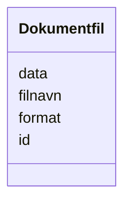

# Class: Dokumentfil 


_Sjølve dokumentfila med data og metadata._


URI: [ark:Dokumentfil](https://schema.fintlabs.no/arkiv/Dokumentfil)





<!-- no inheritance hierarchy -->

## Class Properties

| Property | Value |
| --- | --- |
| Class URI | [ark:Dokumentfil](https://schema.fintlabs.no/arkiv/Dokumentfil) |


## Eigenskapar


  
  

  
  
    
  

  
  

  
  
    
  


### Obligatorisk

| Namn | Kardinalitet og domene | Beskriving |
| --- | --- | --- |
| [data](data.md) | 1 <br/> [String](string.md) | Dokumentfilens data, koda som Base64 |
| [format](format.md) | 1 <br/> [String](string.md) | Format på dokumentfil, som IANA Media Type |


  
  

  
  

  
  

  
  


  
  

  
  

  
  
    
  

  
  


### Valgfri

| Namn | Kardinalitet og domene | Beskriving |
| --- | --- | --- |
| [filnavn](filnavn.md) | 0..1 <br/> [String](string.md) | Dokumentfilens namn |


  
  
  
  
    
  

  
  
  
    
      
    
      
    
      
    
  
  

  
  
  
    
      
    
      
    
      
    
  
  

  
  
  
    
      
    
      
    
      
    
  
  


### Andre

| Namn | Kardinalitet og domene | Beskriving |
| --- | --- | --- |
| [id](id.md) | 1 <br/> [Uriorcurie](uriorcurie.md) | URI-identifikator for ressursen |


## Usages

| used by | used in | type | used |
| ---  | --- | --- | --- |
| [ArkivContainer](arkivcontainer.md) | [dokumentfiler](dokumentfiler.md) | range | [Dokumentfil](dokumentfil.md) |
| [Dokumentobjekt](dokumentobjekt.md) | [referanseDokumentfil](referansedokumentfil.md) | range | [Dokumentfil](dokumentfil.md) |


## Identifier and Mapping Information


### Schema Source


* from schema: https://data.norge.no/linkml/fint-arkiv


## Mappings

| Mapping Type | Mapped Value |
| ---  | ---  |
| self | ark:Dokumentfil |
| native | https://schema.fintlabs.no/arkiv/:Dokumentfil |


## LinkML Source

<!-- TODO: investigate https://stackoverflow.com/questions/37606292/how-to-create-tabbed-code-blocks-in-mkdocs-or-sphinx -->

### Direct

<details>
```yaml
name: Dokumentfil
description: Sjølve dokumentfila med data og metadata.
from_schema: https://data.norge.no/linkml/fint-arkiv
slots:
- id
- data
- filnavn
- format
slot_usage:
  data:
    name: data
    in_subset:
    - Obligatorisk
    required: true
  filnavn:
    name: filnavn
    in_subset:
    - Valgfri
  format:
    name: format
    in_subset:
    - Obligatorisk
    required: true
class_uri: ark:Dokumentfil

```
</details>

### Induced

<details>
```yaml
name: Dokumentfil
description: Sjølve dokumentfila med data og metadata.
from_schema: https://data.norge.no/linkml/fint-arkiv
slot_usage:
  data:
    name: data
    in_subset:
    - Obligatorisk
    required: true
  filnavn:
    name: filnavn
    in_subset:
    - Valgfri
  format:
    name: format
    in_subset:
    - Obligatorisk
    required: true
attributes:
  id:
    name: id
    description: URI-identifikator for ressursen.
    from_schema: https://data.norge.no/linkml/fint-arkiv
    rank: 1000
    identifier: true
    alias: id
    owner: Dokumentfil
    domain_of:
    - Mappe
    - Registrering
    - AdministrativEnhet
    - Arkivdel
    - Arkivressurs
    - Autorisasjon
    - Dokumentfil
    - Klassifikasjonssystem
    - Tilgang
    - Dokumentbeskrivelse
    - DokumentStatus
    - DokumentType
    - Format
    - JournalpostType
    - JournalStatus
    - Klassifikasjonstype
    - KorrespondansepartType
    - Merknadstype
    - PartRolle
    - Rolle
    - Saksmappetype
    - Saksstatus
    - Skjermingshjemmel
    - Tilgangsgruppe
    - Tilgangsrestriksjon
    - TilknyttetRegistreringSom
    - Variantformat
    - Begrep
    - Elev
    - Valuta
    - Person
    - Kontaktperson
    - Virksomhet
    range: uriorcurie
    required: true
  data:
    name: data
    description: Dokumentfilens data, koda som Base64.
    in_subset:
    - Obligatorisk
    from_schema: https://data.norge.no/linkml/fint-arkiv
    rank: 1000
    slot_uri: ark:data
    alias: data
    owner: Dokumentfil
    domain_of:
    - Dokumentfil
    range: string
    required: true
  filnavn:
    name: filnavn
    description: Dokumentfilens namn.
    in_subset:
    - Valgfri
    from_schema: https://data.norge.no/linkml/fint-arkiv
    rank: 1000
    slot_uri: ark:filnavn
    alias: filnavn
    owner: Dokumentfil
    domain_of:
    - Dokumentfil
    range: string
  format:
    name: format
    description: Format på dokumentfil, som IANA Media Type.
    in_subset:
    - Obligatorisk
    from_schema: https://data.norge.no/linkml/fint-arkiv
    rank: 1000
    slot_uri: ark:format
    alias: format
    owner: Dokumentfil
    domain_of:
    - Dokumentfil
    range: string
    required: true
class_uri: ark:Dokumentfil

```
</details>