# Class: Personalmappe 


_Saksmappe med opplysningar om ein arbeidstakars arbeidsforhold._


URI: [ark:Personalmappe](https://schema.fintlabs.no/arkiv/Personalmappe)

```mermaid
 classDiagram
    class Personalmappe
    click Personalmappe href "../Personalmappe/"
      Saksmappe <|-- Personalmappe
        click Saksmappe href "../Saksmappe/"
      
      Personalmappe : administrativEnhet
        
          
    
        
        
        Personalmappe --> "1" AdministrativEnhet : administrativEnhet
        click AdministrativEnhet href "../AdministrativEnhet/"
    

        
      Personalmappe : arbeidssted
        
          
    
        
        
        Personalmappe --> "1" Uriorcurie : arbeidssted
        click Uriorcurie href "../http://www.w3.org/2001/XMLSchema#anyURI/"
    

        
      Personalmappe : arkivdel
        
          
    
        
        
        Personalmappe --> "0..1" Arkivdel : arkivdel
        click Arkivdel href "../Arkivdel/"
    

        
      Personalmappe : avsluttetAv
        
          
    
        
        
        Personalmappe --> "0..1" Arkivressurs : avsluttetAv
        click Arkivressurs href "../Arkivressurs/"
    

        
      Personalmappe : avsluttetDato
        
          
    
        
        
        Personalmappe --> "0..1" Datetime : avsluttetDato
        click Datetime href "../http://www.w3.org/2001/XMLSchema#dateTime/"
    

        
      Personalmappe : beskrivelse
        
          
    
        
        
        Personalmappe --> "0..1" String : beskrivelse
        click String href "../http://www.w3.org/2001/XMLSchema#string/"
    

        
      Personalmappe : id
        
          
    
        
        
        Personalmappe --> "1" Uriorcurie : id
        click Uriorcurie href "../http://www.w3.org/2001/XMLSchema#anyURI/"
    

        
      Personalmappe : journalenhet
        
          
    
        
        
        Personalmappe --> "0..1" AdministrativEnhet : journalenhet
        click AdministrativEnhet href "../AdministrativEnhet/"
    

        
      Personalmappe : journalpost
        
          
    
        
        
        Personalmappe --> "*" Journalpost : journalpost
        click Journalpost href "../Journalpost/"
    

        
      Personalmappe : klasse
        
          
    
        
        
        Personalmappe --> "*" Klasse : klasse
        click Klasse href "../Klasse/"
    

        
      Personalmappe : leder
        
          
    
        
        
        Personalmappe --> "1" Uriorcurie : leder
        click Uriorcurie href "../http://www.w3.org/2001/XMLSchema#anyURI/"
    

        
      Personalmappe : mappeId
        
          
    
        
        
        Personalmappe --> "0..1" Identifikator : mappeId
        click Identifikator href "../Identifikator/"
    

        
      Personalmappe : merknad
        
          
    
        
        
        Personalmappe --> "*" Merknad : merknad
        click Merknad href "../Merknad/"
    

        
      Personalmappe : noekkelord
        
          
    
        
        
        Personalmappe --> "*" String : noekkelord
        click String href "../http://www.w3.org/2001/XMLSchema#string/"
    

        
      Personalmappe : offentligTittel
        
          
    
        
        
        Personalmappe --> "0..1" String : offentligTittel
        click String href "../http://www.w3.org/2001/XMLSchema#string/"
    

        
      Personalmappe : opprettetAv
        
          
    
        
        
        Personalmappe --> "1" Arkivressurs : opprettetAv
        click Arkivressurs href "../Arkivressurs/"
    

        
      Personalmappe : opprettetDato
        
          
    
        
        
        Personalmappe --> "0..1" Datetime : opprettetDato
        click Datetime href "../http://www.w3.org/2001/XMLSchema#dateTime/"
    

        
      Personalmappe : part
        
          
    
        
        
        Personalmappe --> "*" Part : part
        click Part href "../Part/"
    

        
      Personalmappe : person
        
          
    
        
        
        Personalmappe --> "1" Person : person
        click Person href "../Person/"
    

        
      Personalmappe : personalressurs
        
          
    
        
        
        Personalmappe --> "1" Uriorcurie : personalressurs
        click Uriorcurie href "../http://www.w3.org/2001/XMLSchema#anyURI/"
    

        
      Personalmappe : personnavn
        
          
    
        
        
        Personalmappe --> "1" Personnavn : personnavn
        click Personnavn href "../Personnavn/"
    

        
      Personalmappe : saksaar
        
          
    
        
        
        Personalmappe --> "0..1" String : saksaar
        click String href "../http://www.w3.org/2001/XMLSchema#string/"
    

        
      Personalmappe : saksansvarlig
        
          
    
        
        
        Personalmappe --> "1" Arkivressurs : saksansvarlig
        click Arkivressurs href "../Arkivressurs/"
    

        
      Personalmappe : saksdato
        
          
    
        
        
        Personalmappe --> "0..1" Datetime : saksdato
        click Datetime href "../http://www.w3.org/2001/XMLSchema#dateTime/"
    

        
      Personalmappe : saksmappetype
        
          
    
        
        
        Personalmappe --> "0..1" Saksmappetype : saksmappetype
        click Saksmappetype href "../Saksmappetype/"
    

        
      Personalmappe : sakssekvensnummer
        
          
    
        
        
        Personalmappe --> "0..1" String : sakssekvensnummer
        click String href "../http://www.w3.org/2001/XMLSchema#string/"
    

        
      Personalmappe : saksstatus
        
          
    
        
        
        Personalmappe --> "1" Saksstatus : saksstatus
        click Saksstatus href "../Saksstatus/"
    

        
      Personalmappe : skjerming
        
          
    
        
        
        Personalmappe --> "0..1" Skjerming : skjerming
        click Skjerming href "../Skjerming/"
    

        
      Personalmappe : tilgangsgruppe
        
          
    
        
        
        Personalmappe --> "0..1" Tilgangsgruppe : tilgangsgruppe
        click Tilgangsgruppe href "../Tilgangsgruppe/"
    

        
      Personalmappe : tittel
        
          
    
        
        
        Personalmappe --> "0..1" String : tittel
        click String href "../http://www.w3.org/2001/XMLSchema#string/"
    

        
      Personalmappe : utlaantDato
        
          
    
        
        
        Personalmappe --> "0..1" Datetime : utlaantDato
        click Datetime href "../http://www.w3.org/2001/XMLSchema#dateTime/"
    

        
      
```





## Inheritance
* [Mappe](mappe.md)
    * [Saksmappe](saksmappe.md)
        * **Personalmappe**


## Class Properties

| Property | Value |
| --- | --- |
| Class URI | [ark:Personalmappe](https://schema.fintlabs.no/arkiv/Personalmappe) |


## Eigenskapar


  
  
    
  

  
  
    
  

  
  
    
  

  
  
    
  

  
  
    
  


### Obligatorisk

| Namn | Kardinalitet og domene | Beskriving |
| --- | --- | --- |
| [personnavn](personnavn.md) | 1 <br/> [Personnavn](personnavn.md) | Namn på person (Personnavn-objekt) |
| [person](person.md) | 1 <br/> [Person](person.md) | Referanse til Person i Administrasjon-domenet |
| [leder](leder.md) | 1 <br/> [xsd:anyURI](http://www.w3.org/2001/XMLSchema#anyURI) | Referanse til Personalressurs som er arbeidstakarens leiar |
| [arbeidssted](arbeidssted.md) | 1 <br/> [xsd:anyURI](http://www.w3.org/2001/XMLSchema#anyURI) | Referanse til Organisasjonselement som er arbeidstakarens arbeidsstad |
| [personalressurs](personalressurs.md) | 1 <br/> [xsd:anyURI](http://www.w3.org/2001/XMLSchema#anyURI) | Referanse til Personalressurs i Administrasjon-domenet |


  
  

  
  

  
  

  
  

  
  


  
  

  
  

  
  

  
  

  
  


  
  
  
    
      
    
      
    
      
    
  
  

  
  
  
    
      
    
      
    
      
    
  
  

  
  
  
    
      
    
      
    
      
    
  
  

  
  
  
    
      
    
      
    
      
    
  
  

  
  
  
    
      
    
      
    
      
    
  
  


### Arva

| Namn | Kardinalitet og domene | Beskriving | Frå |
| --- | --- | --- | --- || [journalpost](journalpost.md) | * <br/> [Journalpost](journalpost.md) | Journalpostar knytt til saksmappa | [Saksmappe](saksmappe.md) |
| [saksaar](saksaar.md) | 0..1 <br/> [xsd:string](http://www.w3.org/2001/XMLSchema#string) | Inngår i M003 mappeID — viser året saksmappa vart oppretta | [Saksmappe](saksmappe.md) |
| [saksdato](saksdato.md) | 0..1 <br/> [xsd:dateTime](http://www.w3.org/2001/XMLSchema#dateTime) | Datoen saka er oppretta | [Saksmappe](saksmappe.md) |
| [sakssekvensnummer](sakssekvensnummer.md) | 0..1 <br/> [xsd:string](http://www.w3.org/2001/XMLSchema#string) | Inngår i M003 mappeID — viser rekkjefølgja saksmappene vart oppretta | [Saksmappe](saksmappe.md) |
| [utlaantDato](utlaantdato.md) | 0..1 <br/> [xsd:dateTime](http://www.w3.org/2001/XMLSchema#dateTime) | Dato ein fysisk saksmappe eller journalpost vart utlånt | [Saksmappe](saksmappe.md) |
| [saksmappetype](saksmappetype.md) | 0..1 <br/> [Saksmappetype](saksmappetype.md) | Type saksmappe | [Saksmappe](saksmappe.md) |
| [saksstatus](saksstatus.md) | 1 <br/> [Saksstatus](saksstatus.md) | Status til saksmappa | [Saksmappe](saksmappe.md) |
| [tilgangsgruppe](tilgangsgruppe.md) | 0..1 <br/> [Tilgangsgruppe](tilgangsgruppe.md) | Tilgangsgruppe som har tilgang til arkivenheten | [Saksmappe](saksmappe.md) |
| [journalenhet](journalenhet.md) | 0..1 <br/> [AdministrativEnhet](administrativenhet.md) | Eining med arkivmessig ansvar | [Saksmappe](saksmappe.md) |
| [administrativEnhet](administrativenhet.md) | 1 <br/> [AdministrativEnhet](administrativenhet.md) | Administrativ eining som har ansvar for saksbehandlinga | [Saksmappe](saksmappe.md) |
| [saksansvarlig](saksansvarlig.md) | 1 <br/> [Arkivressurs](arkivressurs.md) | Person som er saksansvarleg | [Saksmappe](saksmappe.md) |
| [id](id.md) | 1 <br/> [xsd:anyURI](http://www.w3.org/2001/XMLSchema#anyURI) | URI-identifikator for ressursen | [Mappe](mappe.md) |
| [avsluttetDato](avsluttetdato.md) | 0..1 <br/> [xsd:dateTime](http://www.w3.org/2001/XMLSchema#dateTime) | Dato og klokkeslett når arkivenheten vart avslutta/lukka | [Mappe](mappe.md) |
| [beskrivelse](beskrivelse.md) | 0..1 <br/> [xsd:string](http://www.w3.org/2001/XMLSchema#string) | Beskriven namn eller omtale | [Mappe](mappe.md) |
| [klasse](klasse.md) | * <br/> [Klasse](klasse.md) | Klassifisering av arkivenhet | [Mappe](mappe.md) |
| [mappeId](mappeid.md) | 0..1 <br/> [Identifikator](identifikator.md) | Eintydig identifikasjon av mappa innanfor arkivet | [Mappe](mappe.md) |
| [merknad](merknad.md) | * <br/> [Merknad](merknad.md) | Merknader knytt til arkivenhet | [Mappe](mappe.md) |
| [noekkelord](noekkelord.md) | * <br/> [xsd:string](http://www.w3.org/2001/XMLSchema#string) | Nøkkelord som skildrar innhaldet (Mappe) | [Mappe](mappe.md) |
| [offentligTittel](offentligtittel.md) | 0..1 <br/> [xsd:string](http://www.w3.org/2001/XMLSchema#string) | Offentleg tittel der skjerma ord er fjerna | [Mappe](mappe.md) |
| [opprettetDato](opprettetdato.md) | 0..1 <br/> [xsd:dateTime](http://www.w3.org/2001/XMLSchema#dateTime) | Dato og klokkeslett arkivenheten vart oppretta/registrert | [Mappe](mappe.md) |
| [part](part.md) | * <br/> [Part](part.md) | Partar til arkivenhet | [Mappe](mappe.md) |
| [skjerming](skjerming.md) | 0..1 <br/> [Skjerming](skjerming.md) | Skjerming av arkivenhet | [Mappe](mappe.md) |
| [tittel](tittel.md) | 0..1 <br/> [xsd:string](http://www.w3.org/2001/XMLSchema#string) | Tittel eller namn på arkivenheten | [Mappe](mappe.md) |
| [arkivdel](arkivdel.md) | 0..1 <br/> [Arkivdel](arkivdel.md) | Arkivdel arkivenheten tilhøyrer | [Mappe](mappe.md) |
| [avsluttetAv](avsluttetav.md) | 0..1 <br/> [Arkivressurs](arkivressurs.md) | Person som avslutta/lukka arkivenheten | [Mappe](mappe.md) |
| [opprettetAv](opprettetav.md) | 1 <br/> [Arkivressurs](arkivressurs.md) | Person som oppretta/registrerte arkivenheten | [Mappe](mappe.md) |


## Usages

| used by | used in | type | used |
| ---  | --- | --- | --- |
| [ArkivContainer](arkivcontainer.md) | [personalmappe_liste](personalmappe_liste.md) | range | [Personalmappe](personalmappe.md) |


## Identifier and Mapping Information


### Schema Source


* from schema: https://data.norge.no/linkml/fint-arkiv


## Mappings

| Mapping Type | Mapped Value |
| ---  | ---  |
| self | ark:Personalmappe |
| native | https://schema.fintlabs.no/arkiv/:Personalmappe |


## LinkML Source

<!-- TODO: investigate https://stackoverflow.com/questions/37606292/how-to-create-tabbed-code-blocks-in-mkdocs-or-sphinx -->

### Direct

<details>
```yaml
name: Personalmappe
description: Saksmappe med opplysningar om ein arbeidstakars arbeidsforhold.
from_schema: https://data.norge.no/linkml/fint-arkiv
rank: 1000
is_a: Saksmappe
slots:
- personnavn
- person
- leder
- arbeidssted
- personalressurs
slot_usage:
  personnavn:
    name: personnavn
    in_subset:
    - Obligatorisk
    required: true
  person:
    name: person
    in_subset:
    - Obligatorisk
    required: true
  leder:
    name: leder
    in_subset:
    - Obligatorisk
    required: true
  arbeidssted:
    name: arbeidssted
    in_subset:
    - Obligatorisk
    required: true
  personalressurs:
    name: personalressurs
    in_subset:
    - Obligatorisk
    required: true
class_uri: ark:Personalmappe

```
</details>

### Induced

<details>
```yaml
name: Personalmappe
description: Saksmappe med opplysningar om ein arbeidstakars arbeidsforhold.
from_schema: https://data.norge.no/linkml/fint-arkiv
rank: 1000
is_a: Saksmappe
slot_usage:
  personnavn:
    name: personnavn
    in_subset:
    - Obligatorisk
    required: true
  person:
    name: person
    in_subset:
    - Obligatorisk
    required: true
  leder:
    name: leder
    in_subset:
    - Obligatorisk
    required: true
  arbeidssted:
    name: arbeidssted
    in_subset:
    - Obligatorisk
    required: true
  personalressurs:
    name: personalressurs
    in_subset:
    - Obligatorisk
    required: true
attributes:
  personnavn:
    name: personnavn
    description: Namn på person (Personnavn-objekt).
    in_subset:
    - Obligatorisk
    from_schema: https://data.norge.no/linkml/fint-arkiv
    rank: 1000
    slot_uri: ark:personnavn
    alias: personnavn
    owner: Personalmappe
    domain_of:
    - Personalmappe
    range: Personnavn
    required: true
    inlined: true
  person:
    name: person
    description: Referanse til Person i Administrasjon-domenet.
    in_subset:
    - Obligatorisk
    from_schema: https://data.norge.no/linkml/fint-common
    slot_uri: fint:person
    alias: person
    owner: Personalmappe
    domain_of:
    - Elev
    - Personalmappe
    range: Person
    required: true
  leder:
    name: leder
    description: Referanse til Personalressurs som er arbeidstakarens leiar.
    in_subset:
    - Obligatorisk
    from_schema: https://data.norge.no/linkml/fint-arkiv
    rank: 1000
    slot_uri: ark:leder
    alias: leder
    owner: Personalmappe
    domain_of:
    - Personalmappe
    range: uriorcurie
    required: true
  arbeidssted:
    name: arbeidssted
    description: Referanse til Organisasjonselement som er arbeidstakarens arbeidsstad.
    in_subset:
    - Obligatorisk
    from_schema: https://data.norge.no/linkml/fint-arkiv
    rank: 1000
    slot_uri: ark:arbeidssted
    alias: arbeidssted
    owner: Personalmappe
    domain_of:
    - Personalmappe
    range: uriorcurie
    required: true
  personalressurs:
    name: personalressurs
    description: Referanse til Personalressurs i Administrasjon-domenet.
    in_subset:
    - Obligatorisk
    from_schema: https://data.norge.no/linkml/fint-arkiv
    rank: 1000
    slot_uri: ark:personalressurs
    alias: personalressurs
    owner: Personalmappe
    domain_of:
    - Person
    - Arkivressurs
    - Personalmappe
    range: uriorcurie
    required: true
  journalpost:
    name: journalpost
    description: Journalpostar knytt til saksmappa.
    in_subset:
    - Valgfri
    from_schema: https://data.norge.no/linkml/fint-arkiv
    rank: 1000
    slot_uri: ark:journalpost
    alias: journalpost
    owner: Personalmappe
    domain_of:
    - Saksmappe
    range: Journalpost
    multivalued: true
  saksaar:
    name: saksaar
    description: Inngår i M003 mappeID — viser året saksmappa vart oppretta.
    in_subset:
    - Valgfri
    from_schema: https://data.norge.no/linkml/fint-arkiv
    rank: 1000
    slot_uri: ark:saksaar
    alias: saksaar
    owner: Personalmappe
    domain_of:
    - Saksmappe
    range: string
  saksdato:
    name: saksdato
    description: Datoen saka er oppretta.
    in_subset:
    - Valgfri
    from_schema: https://data.norge.no/linkml/fint-arkiv
    rank: 1000
    slot_uri: ark:saksdato
    alias: saksdato
    owner: Personalmappe
    domain_of:
    - Saksmappe
    range: datetime
  sakssekvensnummer:
    name: sakssekvensnummer
    description: Inngår i M003 mappeID — viser rekkjefølgja saksmappene vart oppretta.
    in_subset:
    - Valgfri
    from_schema: https://data.norge.no/linkml/fint-arkiv
    rank: 1000
    slot_uri: ark:sakssekvensnummer
    alias: sakssekvensnummer
    owner: Personalmappe
    domain_of:
    - Saksmappe
    range: string
  utlaantDato:
    name: utlaantDato
    description: Dato ein fysisk saksmappe eller journalpost vart utlånt.
    in_subset:
    - Valgfri
    from_schema: https://data.norge.no/linkml/fint-arkiv
    rank: 1000
    slot_uri: ark:utlaantDato
    alias: utlaantDato
    owner: Personalmappe
    domain_of:
    - Saksmappe
    range: datetime
  saksmappetype:
    name: saksmappetype
    description: Type saksmappe.
    in_subset:
    - Valgfri
    from_schema: https://data.norge.no/linkml/fint-arkiv
    rank: 1000
    slot_uri: ark:saksmappetype
    alias: saksmappetype
    owner: Personalmappe
    domain_of:
    - Saksmappe
    range: Saksmappetype
  saksstatus:
    name: saksstatus
    description: Status til saksmappa.
    in_subset:
    - Obligatorisk
    from_schema: https://data.norge.no/linkml/fint-arkiv
    rank: 1000
    slot_uri: ark:saksstatus
    alias: saksstatus
    owner: Personalmappe
    domain_of:
    - Saksmappe
    range: Saksstatus
    required: true
  tilgangsgruppe:
    name: tilgangsgruppe
    description: Tilgangsgruppe som har tilgang til arkivenheten.
    in_subset:
    - Valgfri
    from_schema: https://data.norge.no/linkml/fint-arkiv
    rank: 1000
    slot_uri: ark:tilgangsgruppe
    alias: tilgangsgruppe
    owner: Personalmappe
    domain_of:
    - Saksmappe
    - Registrering
    range: Tilgangsgruppe
  journalenhet:
    name: journalenhet
    description: Eining med arkivmessig ansvar.
    in_subset:
    - Valgfri
    from_schema: https://data.norge.no/linkml/fint-arkiv
    rank: 1000
    slot_uri: ark:journalenhet
    alias: journalenhet
    owner: Personalmappe
    domain_of:
    - Saksmappe
    - Journalpost
    range: AdministrativEnhet
  administrativEnhet:
    name: administrativEnhet
    description: Administrativ eining som har ansvar for saksbehandlinga.
    in_subset:
    - Obligatorisk
    from_schema: https://data.norge.no/linkml/fint-arkiv
    rank: 1000
    slot_uri: ark:administrativEnhet
    alias: administrativEnhet
    owner: Personalmappe
    domain_of:
    - Saksmappe
    - Registrering
    - Tilgang
    range: AdministrativEnhet
    required: true
  saksansvarlig:
    name: saksansvarlig
    description: Person som er saksansvarleg.
    in_subset:
    - Obligatorisk
    from_schema: https://data.norge.no/linkml/fint-arkiv
    rank: 1000
    slot_uri: ark:saksansvarlig
    alias: saksansvarlig
    owner: Personalmappe
    domain_of:
    - Saksmappe
    range: Arkivressurs
    required: true
  id:
    name: id
    description: URI-identifikator for ressursen.
    from_schema: https://data.norge.no/linkml/fint-common
    identifier: true
    alias: id
    owner: Personalmappe
    domain_of:
    - Begrep
    - Elev
    - Valuta
    - Person
    - Kontaktperson
    - Virksomhet
    - Mappe
    - Registrering
    - AdministrativEnhet
    - Arkivdel
    - Arkivressurs
    - Autorisasjon
    - Dokumentfil
    - Klassifikasjonssystem
    - Tilgang
    - Dokumentbeskrivelse
    - DokumentStatus
    - DokumentType
    - Format
    - JournalpostType
    - JournalStatus
    - Klassifikasjonstype
    - KorrespondansepartType
    - Merknadstype
    - PartRolle
    - Rolle
    - Saksmappetype
    - Saksstatus
    - Skjermingshjemmel
    - Tilgangsgruppe
    - Tilgangsrestriksjon
    - TilknyttetRegistreringSom
    - Variantformat
    range: uriorcurie
    required: true
  avsluttetDato:
    name: avsluttetDato
    description: Dato og klokkeslett når arkivenheten vart avslutta/lukka.
    in_subset:
    - Valgfri
    from_schema: https://data.norge.no/linkml/fint-arkiv
    rank: 1000
    slot_uri: ark:avsluttetDato
    alias: avsluttetDato
    owner: Personalmappe
    domain_of:
    - Mappe
    - Klassifikasjonssystem
    range: datetime
  beskrivelse:
    name: beskrivelse
    description: Beskriven namn eller omtale.
    in_subset:
    - Valgfri
    from_schema: https://data.norge.no/linkml/fint-common
    slot_uri: fint:beskrivelse
    alias: beskrivelse
    owner: Personalmappe
    domain_of:
    - Periode
    - Mappe
    - Registrering
    - Klassifikasjonssystem
    - Dokumentbeskrivelse
    range: string
  klasse:
    name: klasse
    description: Klassifisering av arkivenhet.
    in_subset:
    - Valgfri
    from_schema: https://data.norge.no/linkml/fint-arkiv
    rank: 1000
    slot_uri: ark:klasse
    alias: klasse
    owner: Personalmappe
    domain_of:
    - Mappe
    - Registrering
    - Klassifikasjonssystem
    range: Klasse
    multivalued: true
    inlined_as_list: true
  mappeId:
    name: mappeId
    description: Eintydig identifikasjon av mappa innanfor arkivet.
    in_subset:
    - Valgfri
    from_schema: https://data.norge.no/linkml/fint-arkiv
    rank: 1000
    slot_uri: ark:mappeId
    alias: mappeId
    owner: Personalmappe
    domain_of:
    - Mappe
    range: Identifikator
    inlined: true
  merknad:
    name: merknad
    description: Merknader knytt til arkivenhet.
    in_subset:
    - Valgfri
    from_schema: https://data.norge.no/linkml/fint-arkiv
    rank: 1000
    slot_uri: ark:merknad
    alias: merknad
    owner: Personalmappe
    domain_of:
    - Mappe
    - Registrering
    range: Merknad
    multivalued: true
    inlined: true
    inlined_as_list: true
  noekkelord:
    name: noekkelord
    description: Nøkkelord som skildrar innhaldet (Mappe).
    in_subset:
    - Valgfri
    from_schema: https://data.norge.no/linkml/fint-arkiv
    rank: 1000
    slot_uri: ark:noekkelord
    alias: noekkelord
    owner: Personalmappe
    domain_of:
    - Mappe
    range: string
    multivalued: true
  offentligTittel:
    name: offentligTittel
    description: Offentleg tittel der skjerma ord er fjerna.
    in_subset:
    - Valgfri
    from_schema: https://data.norge.no/linkml/fint-arkiv
    rank: 1000
    slot_uri: ark:offentligTittel
    alias: offentligTittel
    owner: Personalmappe
    domain_of:
    - Mappe
    - Registrering
    range: string
  opprettetDato:
    name: opprettetDato
    description: Dato og klokkeslett arkivenheten vart oppretta/registrert.
    in_subset:
    - Valgfri
    from_schema: https://data.norge.no/linkml/fint-arkiv
    rank: 1000
    slot_uri: ark:opprettetDato
    alias: opprettetDato
    owner: Personalmappe
    domain_of:
    - Mappe
    - Registrering
    - Klassifikasjonssystem
    - Dokumentbeskrivelse
    range: datetime
  part:
    name: part
    description: Partar til arkivenhet.
    in_subset:
    - Valgfri
    from_schema: https://data.norge.no/linkml/fint-arkiv
    rank: 1000
    slot_uri: ark:part
    alias: part
    owner: Personalmappe
    domain_of:
    - Mappe
    - Registrering
    - Dokumentbeskrivelse
    range: Part
    multivalued: true
    inlined: true
    inlined_as_list: true
  skjerming:
    name: skjerming
    description: Skjerming av arkivenhet.
    in_subset:
    - Valgfri
    from_schema: https://data.norge.no/linkml/fint-arkiv
    rank: 1000
    slot_uri: ark:skjerming
    alias: skjerming
    owner: Personalmappe
    domain_of:
    - Mappe
    - Registrering
    - Dokumentbeskrivelse
    - Klasse
    - Korrespondansepart
    range: Skjerming
    inlined: true
  tittel:
    name: tittel
    description: Tittel eller namn på arkivenheten.
    in_subset:
    - Valgfri
    from_schema: https://data.norge.no/linkml/fint-arkiv
    rank: 1000
    slot_uri: ark:tittel
    alias: tittel
    owner: Personalmappe
    domain_of:
    - Mappe
    - Registrering
    - Arkivdel
    - Klassifikasjonssystem
    - Tilgang
    - Dokumentbeskrivelse
    - Klasse
    range: string
  arkivdel:
    name: arkivdel
    description: Arkivdel arkivenheten tilhøyrer.
    in_subset:
    - Valgfri
    from_schema: https://data.norge.no/linkml/fint-arkiv
    rank: 1000
    slot_uri: ark:arkivdel
    alias: arkivdel
    owner: Personalmappe
    domain_of:
    - Mappe
    - Registrering
    - Klassifikasjonssystem
    - Tilgang
    range: Arkivdel
  avsluttetAv:
    name: avsluttetAv
    description: Person som avslutta/lukka arkivenheten.
    in_subset:
    - Valgfri
    from_schema: https://data.norge.no/linkml/fint-arkiv
    rank: 1000
    slot_uri: ark:avsluttetAv
    alias: avsluttetAv
    owner: Personalmappe
    domain_of:
    - Mappe
    range: Arkivressurs
  opprettetAv:
    name: opprettetAv
    description: Person som oppretta/registrerte arkivenheten.
    in_subset:
    - Obligatorisk
    from_schema: https://data.norge.no/linkml/fint-arkiv
    rank: 1000
    slot_uri: ark:opprettetAv
    alias: opprettetAv
    owner: Personalmappe
    domain_of:
    - Mappe
    - Registrering
    - Dokumentbeskrivelse
    - Dokumentobjekt
    range: Arkivressurs
    required: true
class_uri: ark:Personalmappe

```
</details>