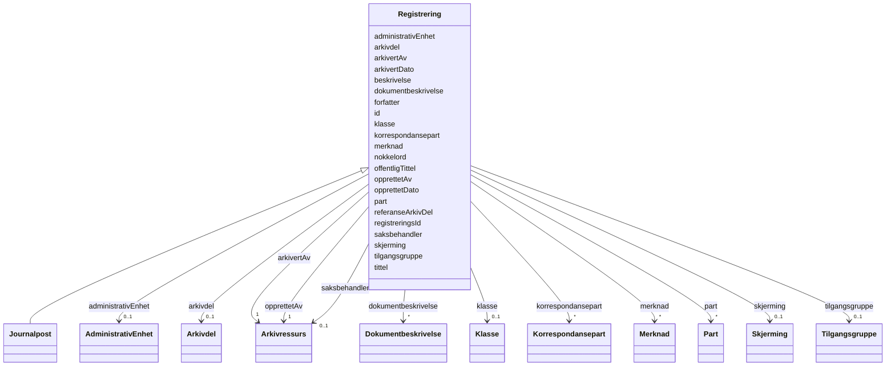

# Class: Registrering 


_Abstrakt basisklasse — arkivets primære byggeklossar._


* __NOTE__: this is an abstract class and should not be instantiated directly


URI: [ark:Registrering](https://schema.fintlabs.no/arkiv/Registrering)





## Inheritance
* **Registrering**
    * [Journalpost](journalpost.md)


## Class Properties

| Property | Value |
| --- | --- |
| Class URI | [ark:Registrering](https://schema.fintlabs.no/arkiv/Registrering) |


## Eigenskapar


  
  

  
  

  
  

  
  

  
  

  
  

  
  

  
  

  
  

  
  

  
  

  
  

  
  

  
  

  
  

  
  
    
  

  
  

  
  

  
  

  
  

  
  
    
  

  
  
    
  


### Obligatorisk

| Namn | Kardinalitet og domene | Beskriving |
| --- | --- | --- |
| [tittel](tittel.md) | 1 <br/> [String](string.md) | Tittel eller namn på arkivenheten |
| [arkivertAv](arkivertav.md) | 1 <br/> [Arkivressurs](arkivressurs.md) | Person som arkiverte arkivenheten |
| [opprettetAv](opprettetav.md) | 1 <br/> [Arkivressurs](arkivressurs.md) | Person som oppretta/registrerte arkivenheten |


  
  

  
  

  
  

  
  

  
  

  
  

  
  

  
  

  
  

  
  

  
  

  
  

  
  

  
  

  
  

  
  

  
  

  
  

  
  

  
  

  
  

  
  


  
  

  
  
    
  

  
  
    
  

  
  
    
  

  
  
    
  

  
  
    
  

  
  
    
  

  
  
    
  

  
  
    
  

  
  
    
  

  
  
    
  

  
  
    
  

  
  
    
  

  
  
    
  

  
  
    
  

  
  

  
  
    
  

  
  
    
  

  
  
    
  

  
  
    
  

  
  

  
  


### Valgfri

| Namn | Kardinalitet og domene | Beskriving |
| --- | --- | --- |
| [arkivertDato](arkivertdato.md) | 0..1 <br/> [Datetime](datetime.md) | Dato og klokkeslett alle dokument knytt til registreringa vart arkivert |
| [beskrivelse](beskrivelse.md) | 0..1 <br/> [String](string.md) | Beskriven namn eller omtale |
| [dokumentbeskrivelse](dokumentbeskrivelse.md) | * <br/> [Dokumentbeskrivelse](dokumentbeskrivelse.md) | Dokumentbeskrivelsar til ei registrering |
| [forfatter](forfatter.md) | * <br/> [String](string.md) | Namn på person eller organisasjon som skapte dokumentet |
| [klasse](klasse.md) | 0..1 <br/> [Klasse](klasse.md) | Klassifisering av arkivenhet |
| [korrespondansepart](korrespondansepart.md) | * <br/> [Korrespondansepart](korrespondansepart.md) | Mottakar eller sendar av arkivdokument |
| [merknad](merknad.md) | * <br/> [Merknad](merknad.md) | Merknader knytt til arkivenhet |
| [nokkelord](nokkelord.md) | * <br/> [String](string.md) | Nøkkelord som skildrar innhaldet (Registrering) |
| [offentligTittel](offentligtittel.md) | 0..1 <br/> [String](string.md) | Offentleg tittel der skjerma ord er fjerna |
| [opprettetDato](opprettetdato.md) | 0..1 <br/> [Datetime](datetime.md) | Dato og klokkeslett arkivenheten vart oppretta/registrert |
| [part](part.md) | * <br/> [Part](part.md) | Partar til arkivenhet |
| [referanseArkivDel](referansearkivdel.md) | * <br/> [String](string.md) | Referanse til arkivdelen denne arkivenheten er tilknytt |
| [registreringsId](registreringsid.md) | 0..1 <br/> [String](string.md) | Inngår i M004 journalpostID |
| [skjerming](skjerming.md) | 0..1 <br/> [Skjerming](skjerming.md) | Skjerming av arkivenhet |
| [tilgangsgruppe](tilgangsgruppe.md) | 0..1 <br/> [Tilgangsgruppe](tilgangsgruppe.md) | Tilgangsgruppe som har tilgang til arkivenheten |
| [administrativEnhet](administrativenhet.md) | 0..1 <br/> [AdministrativEnhet](administrativenhet.md) | Administrativ eining som har ansvar for saksbehandlinga |
| [arkivdel](arkivdel.md) | 0..1 <br/> [Arkivdel](arkivdel.md) | Arkivdel arkivenheten tilhøyrer |
| [saksbehandler](saksbehandler.md) | 0..1 <br/> [Arkivressurs](arkivressurs.md) | Person som er saksbehandlar |


  
  
  
  
    
  

  
  
  
    
      
    
      
    
      
    
  
  

  
  
  
    
      
    
      
    
      
    
  
  

  
  
  
    
      
    
      
    
      
    
  
  

  
  
  
    
      
    
      
    
      
    
  
  

  
  
  
    
      
    
      
    
      
    
  
  

  
  
  
    
      
    
      
    
      
    
  
  

  
  
  
    
      
    
      
    
      
    
  
  

  
  
  
    
      
    
      
    
      
    
  
  

  
  
  
    
      
    
      
    
      
    
  
  

  
  
  
    
      
    
      
    
      
    
  
  

  
  
  
    
      
    
      
    
      
    
  
  

  
  
  
    
      
    
      
    
      
    
  
  

  
  
  
    
      
    
      
    
      
    
  
  

  
  
  
    
      
    
      
    
      
    
  
  

  
  
  
    
      
    
      
    
      
    
  
  

  
  
  
    
      
    
      
    
      
    
  
  

  
  
  
    
      
    
      
    
      
    
  
  

  
  
  
    
      
    
      
    
      
    
  
  

  
  
  
    
      
    
      
    
      
    
  
  

  
  
  
    
      
    
      
    
      
    
  
  

  
  
  
    
      
    
      
    
      
    
  
  


### Andre

| Namn | Kardinalitet og domene | Beskriving |
| --- | --- | --- |
| [id](id.md) | 1 <br/> [Uriorcurie](uriorcurie.md) | URI-identifikator for ressursen |


## Identifier and Mapping Information


### Schema Source


* from schema: https://data.norge.no/linkml/fint-arkiv


## Mappings

| Mapping Type | Mapped Value |
| ---  | ---  |
| self | ark:Registrering |
| native | https://schema.fintlabs.no/arkiv/:Registrering |


## LinkML Source

<!-- TODO: investigate https://stackoverflow.com/questions/37606292/how-to-create-tabbed-code-blocks-in-mkdocs-or-sphinx -->

### Direct

<details>
```yaml
name: Registrering
description: Abstrakt basisklasse — arkivets primære byggeklossar.
from_schema: https://data.norge.no/linkml/fint-arkiv
abstract: true
slots:
- id
- arkivertDato
- beskrivelse
- dokumentbeskrivelse
- forfatter
- klasse
- korrespondansepart
- merknad
- nokkelord
- offentligTittel
- opprettetDato
- part
- referanseArkivDel
- registreringsId
- skjerming
- tittel
- tilgangsgruppe
- administrativEnhet
- arkivdel
- saksbehandler
- arkivertAv
- opprettetAv
slot_usage:
  arkivertDato:
    name: arkivertDato
    in_subset:
    - Valgfri
  beskrivelse:
    name: beskrivelse
    in_subset:
    - Valgfri
  dokumentbeskrivelse:
    name: dokumentbeskrivelse
    in_subset:
    - Valgfri
  forfatter:
    name: forfatter
    in_subset:
    - Valgfri
  klasse:
    name: klasse
    in_subset:
    - Valgfri
    inlined: true
  korrespondansepart:
    name: korrespondansepart
    in_subset:
    - Valgfri
  merknad:
    name: merknad
    in_subset:
    - Valgfri
  nokkelord:
    name: nokkelord
    in_subset:
    - Valgfri
  offentligTittel:
    name: offentligTittel
    in_subset:
    - Valgfri
  opprettetDato:
    name: opprettetDato
    in_subset:
    - Valgfri
  part:
    name: part
    in_subset:
    - Valgfri
  referanseArkivDel:
    name: referanseArkivDel
    in_subset:
    - Valgfri
  registreringsId:
    name: registreringsId
    in_subset:
    - Valgfri
  skjerming:
    name: skjerming
    in_subset:
    - Valgfri
  tittel:
    name: tittel
    in_subset:
    - Obligatorisk
    required: true
  tilgangsgruppe:
    name: tilgangsgruppe
    in_subset:
    - Valgfri
  administrativEnhet:
    name: administrativEnhet
    in_subset:
    - Valgfri
  arkivdel:
    name: arkivdel
    in_subset:
    - Valgfri
  saksbehandler:
    name: saksbehandler
    in_subset:
    - Valgfri
  arkivertAv:
    name: arkivertAv
    in_subset:
    - Obligatorisk
    required: true
  opprettetAv:
    name: opprettetAv
    in_subset:
    - Obligatorisk
    required: true
class_uri: ark:Registrering

```
</details>

### Induced

<details>
```yaml
name: Registrering
description: Abstrakt basisklasse — arkivets primære byggeklossar.
from_schema: https://data.norge.no/linkml/fint-arkiv
abstract: true
slot_usage:
  arkivertDato:
    name: arkivertDato
    in_subset:
    - Valgfri
  beskrivelse:
    name: beskrivelse
    in_subset:
    - Valgfri
  dokumentbeskrivelse:
    name: dokumentbeskrivelse
    in_subset:
    - Valgfri
  forfatter:
    name: forfatter
    in_subset:
    - Valgfri
  klasse:
    name: klasse
    in_subset:
    - Valgfri
    inlined: true
  korrespondansepart:
    name: korrespondansepart
    in_subset:
    - Valgfri
  merknad:
    name: merknad
    in_subset:
    - Valgfri
  nokkelord:
    name: nokkelord
    in_subset:
    - Valgfri
  offentligTittel:
    name: offentligTittel
    in_subset:
    - Valgfri
  opprettetDato:
    name: opprettetDato
    in_subset:
    - Valgfri
  part:
    name: part
    in_subset:
    - Valgfri
  referanseArkivDel:
    name: referanseArkivDel
    in_subset:
    - Valgfri
  registreringsId:
    name: registreringsId
    in_subset:
    - Valgfri
  skjerming:
    name: skjerming
    in_subset:
    - Valgfri
  tittel:
    name: tittel
    in_subset:
    - Obligatorisk
    required: true
  tilgangsgruppe:
    name: tilgangsgruppe
    in_subset:
    - Valgfri
  administrativEnhet:
    name: administrativEnhet
    in_subset:
    - Valgfri
  arkivdel:
    name: arkivdel
    in_subset:
    - Valgfri
  saksbehandler:
    name: saksbehandler
    in_subset:
    - Valgfri
  arkivertAv:
    name: arkivertAv
    in_subset:
    - Obligatorisk
    required: true
  opprettetAv:
    name: opprettetAv
    in_subset:
    - Obligatorisk
    required: true
attributes:
  id:
    name: id
    description: URI-identifikator for ressursen.
    from_schema: https://data.norge.no/linkml/fint-arkiv
    rank: 1000
    identifier: true
    alias: id
    owner: Registrering
    domain_of:
    - Mappe
    - Registrering
    - AdministrativEnhet
    - Arkivdel
    - Arkivressurs
    - Autorisasjon
    - Dokumentfil
    - Klassifikasjonssystem
    - Tilgang
    - Dokumentbeskrivelse
    - DokumentStatus
    - DokumentType
    - Format
    - JournalpostType
    - JournalStatus
    - Klassifikasjonstype
    - KorrespondansepartType
    - Merknadstype
    - PartRolle
    - Rolle
    - Saksmappetype
    - Saksstatus
    - Skjermingshjemmel
    - Tilgangsgruppe
    - Tilgangsrestriksjon
    - TilknyttetRegistreringSom
    - Variantformat
    - Begrep
    - Elev
    - Valuta
    - Person
    - Kontaktperson
    - Virksomhet
    range: uriorcurie
    required: true
  arkivertDato:
    name: arkivertDato
    description: Dato og klokkeslett alle dokument knytt til registreringa vart arkivert.
    in_subset:
    - Valgfri
    from_schema: https://data.norge.no/linkml/fint-arkiv
    rank: 1000
    slot_uri: ark:arkivertDato
    alias: arkivertDato
    owner: Registrering
    domain_of:
    - Registrering
    range: datetime
  beskrivelse:
    name: beskrivelse
    description: Beskriven namn eller omtale.
    in_subset:
    - Valgfri
    from_schema: https://data.norge.no/linkml/fint-arkiv
    rank: 1000
    slot_uri: fint:beskrivelse
    alias: beskrivelse
    owner: Registrering
    domain_of:
    - Mappe
    - Registrering
    - Klassifikasjonssystem
    - Dokumentbeskrivelse
    - Periode
    range: string
  dokumentbeskrivelse:
    name: dokumentbeskrivelse
    description: Dokumentbeskrivelsar til ei registrering.
    in_subset:
    - Valgfri
    from_schema: https://data.norge.no/linkml/fint-arkiv
    rank: 1000
    slot_uri: ark:dokumentbeskrivelse
    alias: dokumentbeskrivelse
    owner: Registrering
    domain_of:
    - Registrering
    range: Dokumentbeskrivelse
    multivalued: true
  forfatter:
    name: forfatter
    description: Namn på person eller organisasjon som skapte dokumentet.
    in_subset:
    - Valgfri
    from_schema: https://data.norge.no/linkml/fint-arkiv
    rank: 1000
    slot_uri: ark:forfatter
    alias: forfatter
    owner: Registrering
    domain_of:
    - Registrering
    - Dokumentbeskrivelse
    range: string
    multivalued: true
  klasse:
    name: klasse
    description: Klassifisering av arkivenhet.
    in_subset:
    - Valgfri
    from_schema: https://data.norge.no/linkml/fint-arkiv
    rank: 1000
    slot_uri: ark:klasse
    alias: klasse
    owner: Registrering
    domain_of:
    - Mappe
    - Registrering
    - Klassifikasjonssystem
    range: Klasse
    inlined: true
  korrespondansepart:
    name: korrespondansepart
    description: Mottakar eller sendar av arkivdokument.
    in_subset:
    - Valgfri
    from_schema: https://data.norge.no/linkml/fint-arkiv
    rank: 1000
    slot_uri: ark:korrespondansepart
    alias: korrespondansepart
    owner: Registrering
    domain_of:
    - Registrering
    range: Korrespondansepart
    multivalued: true
    inlined: true
    inlined_as_list: true
  merknad:
    name: merknad
    description: Merknader knytt til arkivenhet.
    in_subset:
    - Valgfri
    from_schema: https://data.norge.no/linkml/fint-arkiv
    rank: 1000
    slot_uri: ark:merknad
    alias: merknad
    owner: Registrering
    domain_of:
    - Mappe
    - Registrering
    range: Merknad
    multivalued: true
    inlined: true
    inlined_as_list: true
  nokkelord:
    name: nokkelord
    description: Nøkkelord som skildrar innhaldet (Registrering).
    in_subset:
    - Valgfri
    from_schema: https://data.norge.no/linkml/fint-arkiv
    rank: 1000
    slot_uri: ark:nokkelord
    alias: nokkelord
    owner: Registrering
    domain_of:
    - Registrering
    range: string
    multivalued: true
  offentligTittel:
    name: offentligTittel
    description: Offentleg tittel der skjerma ord er fjerna.
    in_subset:
    - Valgfri
    from_schema: https://data.norge.no/linkml/fint-arkiv
    rank: 1000
    slot_uri: ark:offentligTittel
    alias: offentligTittel
    owner: Registrering
    domain_of:
    - Mappe
    - Registrering
    range: string
  opprettetDato:
    name: opprettetDato
    description: Dato og klokkeslett arkivenheten vart oppretta/registrert.
    in_subset:
    - Valgfri
    from_schema: https://data.norge.no/linkml/fint-arkiv
    rank: 1000
    slot_uri: ark:opprettetDato
    alias: opprettetDato
    owner: Registrering
    domain_of:
    - Mappe
    - Registrering
    - Klassifikasjonssystem
    - Dokumentbeskrivelse
    range: datetime
  part:
    name: part
    description: Partar til arkivenhet.
    in_subset:
    - Valgfri
    from_schema: https://data.norge.no/linkml/fint-arkiv
    rank: 1000
    slot_uri: ark:part
    alias: part
    owner: Registrering
    domain_of:
    - Mappe
    - Registrering
    - Dokumentbeskrivelse
    range: Part
    multivalued: true
    inlined: true
    inlined_as_list: true
  referanseArkivDel:
    name: referanseArkivDel
    description: Referanse til arkivdelen denne arkivenheten er tilknytt.
    in_subset:
    - Valgfri
    from_schema: https://data.norge.no/linkml/fint-arkiv
    rank: 1000
    slot_uri: ark:referanseArkivDel
    alias: referanseArkivDel
    owner: Registrering
    domain_of:
    - Registrering
    range: string
    multivalued: true
  registreringsId:
    name: registreringsId
    description: Inngår i M004 journalpostID.
    in_subset:
    - Valgfri
    from_schema: https://data.norge.no/linkml/fint-arkiv
    rank: 1000
    slot_uri: ark:registreringsId
    alias: registreringsId
    owner: Registrering
    domain_of:
    - Registrering
    range: string
  skjerming:
    name: skjerming
    description: Skjerming av arkivenhet.
    in_subset:
    - Valgfri
    from_schema: https://data.norge.no/linkml/fint-arkiv
    rank: 1000
    slot_uri: ark:skjerming
    alias: skjerming
    owner: Registrering
    domain_of:
    - Mappe
    - Registrering
    - Dokumentbeskrivelse
    - Klasse
    - Korrespondansepart
    range: Skjerming
    inlined: true
  tittel:
    name: tittel
    description: Tittel eller namn på arkivenheten.
    in_subset:
    - Obligatorisk
    from_schema: https://data.norge.no/linkml/fint-arkiv
    rank: 1000
    slot_uri: ark:tittel
    alias: tittel
    owner: Registrering
    domain_of:
    - Mappe
    - Registrering
    - Arkivdel
    - Klassifikasjonssystem
    - Tilgang
    - Dokumentbeskrivelse
    - Klasse
    range: string
    required: true
  tilgangsgruppe:
    name: tilgangsgruppe
    description: Tilgangsgruppe som har tilgang til arkivenheten.
    in_subset:
    - Valgfri
    from_schema: https://data.norge.no/linkml/fint-arkiv
    rank: 1000
    slot_uri: ark:tilgangsgruppe
    alias: tilgangsgruppe
    owner: Registrering
    domain_of:
    - Saksmappe
    - Registrering
    range: Tilgangsgruppe
  administrativEnhet:
    name: administrativEnhet
    description: Administrativ eining som har ansvar for saksbehandlinga.
    in_subset:
    - Valgfri
    from_schema: https://data.norge.no/linkml/fint-arkiv
    rank: 1000
    slot_uri: ark:administrativEnhet
    alias: administrativEnhet
    owner: Registrering
    domain_of:
    - Saksmappe
    - Registrering
    - Tilgang
    range: AdministrativEnhet
  arkivdel:
    name: arkivdel
    description: Arkivdel arkivenheten tilhøyrer.
    in_subset:
    - Valgfri
    from_schema: https://data.norge.no/linkml/fint-arkiv
    rank: 1000
    slot_uri: ark:arkivdel
    alias: arkivdel
    owner: Registrering
    domain_of:
    - Mappe
    - Registrering
    - Klassifikasjonssystem
    - Tilgang
    range: Arkivdel
  saksbehandler:
    name: saksbehandler
    description: Person som er saksbehandlar.
    in_subset:
    - Valgfri
    from_schema: https://data.norge.no/linkml/fint-arkiv
    rank: 1000
    slot_uri: ark:saksbehandler
    alias: saksbehandler
    owner: Registrering
    domain_of:
    - Registrering
    range: Arkivressurs
  arkivertAv:
    name: arkivertAv
    description: Person som arkiverte arkivenheten.
    in_subset:
    - Obligatorisk
    from_schema: https://data.norge.no/linkml/fint-arkiv
    rank: 1000
    slot_uri: ark:arkivertAv
    alias: arkivertAv
    owner: Registrering
    domain_of:
    - Registrering
    range: Arkivressurs
    required: true
  opprettetAv:
    name: opprettetAv
    description: Person som oppretta/registrerte arkivenheten.
    in_subset:
    - Obligatorisk
    from_schema: https://data.norge.no/linkml/fint-arkiv
    rank: 1000
    slot_uri: ark:opprettetAv
    alias: opprettetAv
    owner: Registrering
    domain_of:
    - Mappe
    - Registrering
    - Dokumentbeskrivelse
    - Dokumentobjekt
    range: Arkivressurs
    required: true
class_uri: ark:Registrering

```
</details>