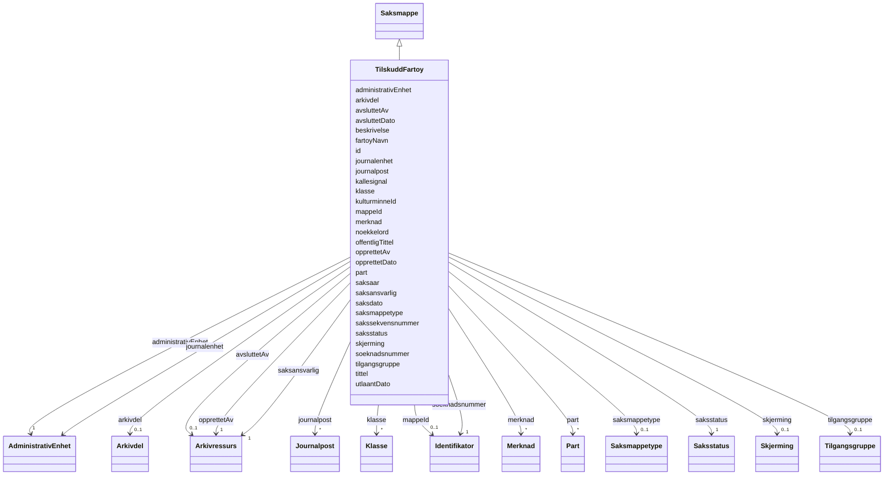

# Class: TilskuddFartoy 


_Sak om søknad om tilskudd til freda fartøy._


URI: [ark:TilskuddFartoy](https://schema.fintlabs.no/arkiv/TilskuddFartoy)





## Inheritance
* [Mappe](mappe.md)
    * [Saksmappe](saksmappe.md)
        * **TilskuddFartoy**


## Class Properties

| Property | Value |
| --- | --- |
| Class URI | [ark:TilskuddFartoy](https://schema.fintlabs.no/arkiv/TilskuddFartoy) |


## Eigenskapar


  
  
    
  

  
  
    
  

  
  
    
  

  
  
    
  


### Obligatorisk

| Namn | Kardinalitet og domene | Beskriving |
| --- | --- | --- |
| [fartoyNavn](fartoynavn.md) | 1 <br/> [String](string.md) | Fartøyets namn |
| [kallesignal](kallesignal.md) | 1 <br/> [String](string.md) | Fartøyets kallesignal |
| [kulturminneId](kulturminneid.md) | 1 <br/> [String](string.md) | Kulturminnets ID i Askeladden |
| [soeknadsnummer](soeknadsnummer.md) | 1 <br/> [Identifikator](identifikator.md) | Søknadsnummer frå Digisak |


  
  

  
  

  
  

  
  


  
  

  
  

  
  

  
  


  
  
  
    
      
    
      
    
      
    
  
  

  
  
  
    
      
    
      
    
      
    
  
  

  
  
  
    
      
    
      
    
      
    
  
  

  
  
  
    
      
    
      
    
      
    
  
  


### Arva

| Namn | Kardinalitet og domene | Beskriving | Frå |
| --- | --- | --- | --- || [journalpost](journalpost.md) | * <br/> [Journalpost](journalpost.md) | Journalpostar knytt til saksmappa | [Saksmappe](saksmappe.md) |
| [saksaar](saksaar.md) | 0..1 <br/> [String](string.md) | Inngår i M003 mappeID — viser året saksmappa vart oppretta | [Saksmappe](saksmappe.md) |
| [saksdato](saksdato.md) | 0..1 <br/> [Datetime](datetime.md) | Datoen saka er oppretta | [Saksmappe](saksmappe.md) |
| [sakssekvensnummer](sakssekvensnummer.md) | 0..1 <br/> [String](string.md) | Inngår i M003 mappeID — viser rekkjefølgja saksmappene vart oppretta | [Saksmappe](saksmappe.md) |
| [utlaantDato](utlaantdato.md) | 0..1 <br/> [Datetime](datetime.md) | Dato ein fysisk saksmappe eller journalpost vart utlånt | [Saksmappe](saksmappe.md) |
| [saksmappetype](saksmappetype.md) | 0..1 <br/> [Saksmappetype](saksmappetype.md) | Type saksmappe | [Saksmappe](saksmappe.md) |
| [saksstatus](saksstatus.md) | 1 <br/> [Saksstatus](saksstatus.md) | Status til saksmappa | [Saksmappe](saksmappe.md) |
| [tilgangsgruppe](tilgangsgruppe.md) | 0..1 <br/> [Tilgangsgruppe](tilgangsgruppe.md) | Tilgangsgruppe som har tilgang til arkivenheten | [Saksmappe](saksmappe.md) |
| [journalenhet](journalenhet.md) | 0..1 <br/> [AdministrativEnhet](administrativenhet.md) | Eining med arkivmessig ansvar | [Saksmappe](saksmappe.md) |
| [administrativEnhet](administrativenhet.md) | 1 <br/> [AdministrativEnhet](administrativenhet.md) | Administrativ eining som har ansvar for saksbehandlinga | [Saksmappe](saksmappe.md) |
| [saksansvarlig](saksansvarlig.md) | 1 <br/> [Arkivressurs](arkivressurs.md) | Person som er saksansvarleg | [Saksmappe](saksmappe.md) |
| [id](id.md) | 1 <br/> [Uriorcurie](uriorcurie.md) | URI-identifikator for ressursen | [Mappe](mappe.md) |
| [avsluttetDato](avsluttetdato.md) | 0..1 <br/> [Datetime](datetime.md) | Dato og klokkeslett når arkivenheten vart avslutta/lukka | [Mappe](mappe.md) |
| [beskrivelse](beskrivelse.md) | 0..1 <br/> [String](string.md) | Beskriven namn eller omtale | [Mappe](mappe.md) |
| [klasse](klasse.md) | * <br/> [Klasse](klasse.md) | Klassifisering av arkivenhet | [Mappe](mappe.md) |
| [mappeId](mappeid.md) | 0..1 <br/> [Identifikator](identifikator.md) | Eintydig identifikasjon av mappa innanfor arkivet | [Mappe](mappe.md) |
| [merknad](merknad.md) | * <br/> [Merknad](merknad.md) | Merknader knytt til arkivenhet | [Mappe](mappe.md) |
| [noekkelord](noekkelord.md) | * <br/> [String](string.md) | Nøkkelord som skildrar innhaldet (Mappe) | [Mappe](mappe.md) |
| [offentligTittel](offentligtittel.md) | 0..1 <br/> [String](string.md) | Offentleg tittel der skjerma ord er fjerna | [Mappe](mappe.md) |
| [opprettetDato](opprettetdato.md) | 0..1 <br/> [Datetime](datetime.md) | Dato og klokkeslett arkivenheten vart oppretta/registrert | [Mappe](mappe.md) |
| [part](part.md) | * <br/> [Part](part.md) | Partar til arkivenhet | [Mappe](mappe.md) |
| [skjerming](skjerming.md) | 0..1 <br/> [Skjerming](skjerming.md) | Skjerming av arkivenhet | [Mappe](mappe.md) |
| [tittel](tittel.md) | 0..1 <br/> [String](string.md) | Tittel eller namn på arkivenheten | [Mappe](mappe.md) |
| [arkivdel](arkivdel.md) | 0..1 <br/> [Arkivdel](arkivdel.md) | Arkivdel arkivenheten tilhøyrer | [Mappe](mappe.md) |
| [avsluttetAv](avsluttetav.md) | 0..1 <br/> [Arkivressurs](arkivressurs.md) | Person som avslutta/lukka arkivenheten | [Mappe](mappe.md) |
| [opprettetAv](opprettetav.md) | 1 <br/> [Arkivressurs](arkivressurs.md) | Person som oppretta/registrerte arkivenheten | [Mappe](mappe.md) |


## Usages

| used by | used in | type | used |
| ---  | --- | --- | --- |
| [ArkivContainer](arkivcontainer.md) | [tilskuddFartoy_liste](tilskuddfartoy_liste.md) | range | [TilskuddFartoy](tilskuddfartoy.md) |


## Identifier and Mapping Information


### Schema Source


* from schema: https://data.norge.no/linkml/fint-arkiv


## Mappings

| Mapping Type | Mapped Value |
| ---  | ---  |
| self | ark:TilskuddFartoy |
| native | https://schema.fintlabs.no/arkiv/:TilskuddFartoy |


## LinkML Source

<!-- TODO: investigate https://stackoverflow.com/questions/37606292/how-to-create-tabbed-code-blocks-in-mkdocs-or-sphinx -->

### Direct

<details>
```yaml
name: TilskuddFartoy
description: Sak om søknad om tilskudd til freda fartøy.
from_schema: https://data.norge.no/linkml/fint-arkiv
is_a: Saksmappe
slots:
- fartoyNavn
- kallesignal
- kulturminneId
- soeknadsnummer
slot_usage:
  fartoyNavn:
    name: fartoyNavn
    in_subset:
    - Obligatorisk
    required: true
  kallesignal:
    name: kallesignal
    in_subset:
    - Obligatorisk
    required: true
  kulturminneId:
    name: kulturminneId
    in_subset:
    - Obligatorisk
    required: true
  soeknadsnummer:
    name: soeknadsnummer
    in_subset:
    - Obligatorisk
    required: true
class_uri: ark:TilskuddFartoy

```
</details>

### Induced

<details>
```yaml
name: TilskuddFartoy
description: Sak om søknad om tilskudd til freda fartøy.
from_schema: https://data.norge.no/linkml/fint-arkiv
is_a: Saksmappe
slot_usage:
  fartoyNavn:
    name: fartoyNavn
    in_subset:
    - Obligatorisk
    required: true
  kallesignal:
    name: kallesignal
    in_subset:
    - Obligatorisk
    required: true
  kulturminneId:
    name: kulturminneId
    in_subset:
    - Obligatorisk
    required: true
  soeknadsnummer:
    name: soeknadsnummer
    in_subset:
    - Obligatorisk
    required: true
attributes:
  fartoyNavn:
    name: fartoyNavn
    description: Fartøyets namn.
    in_subset:
    - Obligatorisk
    from_schema: https://data.norge.no/linkml/fint-arkiv
    rank: 1000
    slot_uri: ark:fartoyNavn
    alias: fartoyNavn
    owner: TilskuddFartoy
    domain_of:
    - TilskuddFartoy
    range: string
    required: true
  kallesignal:
    name: kallesignal
    description: Fartøyets kallesignal.
    in_subset:
    - Obligatorisk
    from_schema: https://data.norge.no/linkml/fint-arkiv
    rank: 1000
    slot_uri: ark:kallesignal
    alias: kallesignal
    owner: TilskuddFartoy
    domain_of:
    - TilskuddFartoy
    range: string
    required: true
  kulturminneId:
    name: kulturminneId
    description: Kulturminnets ID i Askeladden.
    in_subset:
    - Obligatorisk
    from_schema: https://data.norge.no/linkml/fint-arkiv
    rank: 1000
    slot_uri: ark:kulturminneId
    alias: kulturminneId
    owner: TilskuddFartoy
    domain_of:
    - DispensasjonAutomatiskFredaKulturminne
    - TilskuddFartoy
    - TilskuddFredaBygningPrivatEie
    range: string
    required: true
  soeknadsnummer:
    name: soeknadsnummer
    description: Søknadsnummer frå Digisak.
    in_subset:
    - Obligatorisk
    from_schema: https://data.norge.no/linkml/fint-arkiv
    rank: 1000
    slot_uri: ark:soeknadsnummer
    alias: soeknadsnummer
    owner: TilskuddFartoy
    domain_of:
    - DispensasjonAutomatiskFredaKulturminne
    - TilskuddFartoy
    - TilskuddFredaBygningPrivatEie
    range: Identifikator
    required: true
    inlined: true
  journalpost:
    name: journalpost
    description: Journalpostar knytt til saksmappa.
    in_subset:
    - Valgfri
    from_schema: https://data.norge.no/linkml/fint-arkiv
    rank: 1000
    slot_uri: ark:journalpost
    alias: journalpost
    owner: TilskuddFartoy
    domain_of:
    - Saksmappe
    range: Journalpost
    multivalued: true
  saksaar:
    name: saksaar
    description: Inngår i M003 mappeID — viser året saksmappa vart oppretta.
    in_subset:
    - Valgfri
    from_schema: https://data.norge.no/linkml/fint-arkiv
    rank: 1000
    slot_uri: ark:saksaar
    alias: saksaar
    owner: TilskuddFartoy
    domain_of:
    - Saksmappe
    range: string
  saksdato:
    name: saksdato
    description: Datoen saka er oppretta.
    in_subset:
    - Valgfri
    from_schema: https://data.norge.no/linkml/fint-arkiv
    rank: 1000
    slot_uri: ark:saksdato
    alias: saksdato
    owner: TilskuddFartoy
    domain_of:
    - Saksmappe
    range: datetime
  sakssekvensnummer:
    name: sakssekvensnummer
    description: Inngår i M003 mappeID — viser rekkjefølgja saksmappene vart oppretta.
    in_subset:
    - Valgfri
    from_schema: https://data.norge.no/linkml/fint-arkiv
    rank: 1000
    slot_uri: ark:sakssekvensnummer
    alias: sakssekvensnummer
    owner: TilskuddFartoy
    domain_of:
    - Saksmappe
    range: string
  utlaantDato:
    name: utlaantDato
    description: Dato ein fysisk saksmappe eller journalpost vart utlånt.
    in_subset:
    - Valgfri
    from_schema: https://data.norge.no/linkml/fint-arkiv
    rank: 1000
    slot_uri: ark:utlaantDato
    alias: utlaantDato
    owner: TilskuddFartoy
    domain_of:
    - Saksmappe
    range: datetime
  saksmappetype:
    name: saksmappetype
    description: Type saksmappe.
    in_subset:
    - Valgfri
    from_schema: https://data.norge.no/linkml/fint-arkiv
    rank: 1000
    slot_uri: ark:saksmappetype
    alias: saksmappetype
    owner: TilskuddFartoy
    domain_of:
    - Saksmappe
    range: Saksmappetype
  saksstatus:
    name: saksstatus
    description: Status til saksmappa.
    in_subset:
    - Obligatorisk
    from_schema: https://data.norge.no/linkml/fint-arkiv
    rank: 1000
    slot_uri: ark:saksstatus
    alias: saksstatus
    owner: TilskuddFartoy
    domain_of:
    - Saksmappe
    range: Saksstatus
    required: true
  tilgangsgruppe:
    name: tilgangsgruppe
    description: Tilgangsgruppe som har tilgang til arkivenheten.
    in_subset:
    - Valgfri
    from_schema: https://data.norge.no/linkml/fint-arkiv
    rank: 1000
    slot_uri: ark:tilgangsgruppe
    alias: tilgangsgruppe
    owner: TilskuddFartoy
    domain_of:
    - Saksmappe
    - Registrering
    range: Tilgangsgruppe
  journalenhet:
    name: journalenhet
    description: Eining med arkivmessig ansvar.
    in_subset:
    - Valgfri
    from_schema: https://data.norge.no/linkml/fint-arkiv
    rank: 1000
    slot_uri: ark:journalenhet
    alias: journalenhet
    owner: TilskuddFartoy
    domain_of:
    - Saksmappe
    - Journalpost
    range: AdministrativEnhet
  administrativEnhet:
    name: administrativEnhet
    description: Administrativ eining som har ansvar for saksbehandlinga.
    in_subset:
    - Obligatorisk
    from_schema: https://data.norge.no/linkml/fint-arkiv
    rank: 1000
    slot_uri: ark:administrativEnhet
    alias: administrativEnhet
    owner: TilskuddFartoy
    domain_of:
    - Saksmappe
    - Registrering
    - Tilgang
    range: AdministrativEnhet
    required: true
  saksansvarlig:
    name: saksansvarlig
    description: Person som er saksansvarleg.
    in_subset:
    - Obligatorisk
    from_schema: https://data.norge.no/linkml/fint-arkiv
    rank: 1000
    slot_uri: ark:saksansvarlig
    alias: saksansvarlig
    owner: TilskuddFartoy
    domain_of:
    - Saksmappe
    range: Arkivressurs
    required: true
  id:
    name: id
    description: URI-identifikator for ressursen.
    from_schema: https://data.norge.no/linkml/fint-arkiv
    rank: 1000
    identifier: true
    alias: id
    owner: TilskuddFartoy
    domain_of:
    - Mappe
    - Registrering
    - AdministrativEnhet
    - Arkivdel
    - Arkivressurs
    - Autorisasjon
    - Dokumentfil
    - Klassifikasjonssystem
    - Tilgang
    - Dokumentbeskrivelse
    - DokumentStatus
    - DokumentType
    - Format
    - JournalpostType
    - JournalStatus
    - Klassifikasjonstype
    - KorrespondansepartType
    - Merknadstype
    - PartRolle
    - Rolle
    - Saksmappetype
    - Saksstatus
    - Skjermingshjemmel
    - Tilgangsgruppe
    - Tilgangsrestriksjon
    - TilknyttetRegistreringSom
    - Variantformat
    - Begrep
    - Elev
    - Valuta
    - Person
    - Kontaktperson
    - Virksomhet
    range: uriorcurie
    required: true
  avsluttetDato:
    name: avsluttetDato
    description: Dato og klokkeslett når arkivenheten vart avslutta/lukka.
    in_subset:
    - Valgfri
    from_schema: https://data.norge.no/linkml/fint-arkiv
    rank: 1000
    slot_uri: ark:avsluttetDato
    alias: avsluttetDato
    owner: TilskuddFartoy
    domain_of:
    - Mappe
    - Klassifikasjonssystem
    range: datetime
  beskrivelse:
    name: beskrivelse
    description: Beskriven namn eller omtale.
    in_subset:
    - Valgfri
    from_schema: https://data.norge.no/linkml/fint-arkiv
    rank: 1000
    slot_uri: fint:beskrivelse
    alias: beskrivelse
    owner: TilskuddFartoy
    domain_of:
    - Mappe
    - Registrering
    - Klassifikasjonssystem
    - Dokumentbeskrivelse
    - Periode
    range: string
  klasse:
    name: klasse
    description: Klassifisering av arkivenhet.
    in_subset:
    - Valgfri
    from_schema: https://data.norge.no/linkml/fint-arkiv
    rank: 1000
    slot_uri: ark:klasse
    alias: klasse
    owner: TilskuddFartoy
    domain_of:
    - Mappe
    - Registrering
    - Klassifikasjonssystem
    range: Klasse
    multivalued: true
    inlined_as_list: true
  mappeId:
    name: mappeId
    description: Eintydig identifikasjon av mappa innanfor arkivet.
    in_subset:
    - Valgfri
    from_schema: https://data.norge.no/linkml/fint-arkiv
    rank: 1000
    slot_uri: ark:mappeId
    alias: mappeId
    owner: TilskuddFartoy
    domain_of:
    - Mappe
    range: Identifikator
    inlined: true
  merknad:
    name: merknad
    description: Merknader knytt til arkivenhet.
    in_subset:
    - Valgfri
    from_schema: https://data.norge.no/linkml/fint-arkiv
    rank: 1000
    slot_uri: ark:merknad
    alias: merknad
    owner: TilskuddFartoy
    domain_of:
    - Mappe
    - Registrering
    range: Merknad
    multivalued: true
    inlined: true
    inlined_as_list: true
  noekkelord:
    name: noekkelord
    description: Nøkkelord som skildrar innhaldet (Mappe).
    in_subset:
    - Valgfri
    from_schema: https://data.norge.no/linkml/fint-arkiv
    rank: 1000
    slot_uri: ark:noekkelord
    alias: noekkelord
    owner: TilskuddFartoy
    domain_of:
    - Mappe
    range: string
    multivalued: true
  offentligTittel:
    name: offentligTittel
    description: Offentleg tittel der skjerma ord er fjerna.
    in_subset:
    - Valgfri
    from_schema: https://data.norge.no/linkml/fint-arkiv
    rank: 1000
    slot_uri: ark:offentligTittel
    alias: offentligTittel
    owner: TilskuddFartoy
    domain_of:
    - Mappe
    - Registrering
    range: string
  opprettetDato:
    name: opprettetDato
    description: Dato og klokkeslett arkivenheten vart oppretta/registrert.
    in_subset:
    - Valgfri
    from_schema: https://data.norge.no/linkml/fint-arkiv
    rank: 1000
    slot_uri: ark:opprettetDato
    alias: opprettetDato
    owner: TilskuddFartoy
    domain_of:
    - Mappe
    - Registrering
    - Klassifikasjonssystem
    - Dokumentbeskrivelse
    range: datetime
  part:
    name: part
    description: Partar til arkivenhet.
    in_subset:
    - Valgfri
    from_schema: https://data.norge.no/linkml/fint-arkiv
    rank: 1000
    slot_uri: ark:part
    alias: part
    owner: TilskuddFartoy
    domain_of:
    - Mappe
    - Registrering
    - Dokumentbeskrivelse
    range: Part
    multivalued: true
    inlined: true
    inlined_as_list: true
  skjerming:
    name: skjerming
    description: Skjerming av arkivenhet.
    in_subset:
    - Valgfri
    from_schema: https://data.norge.no/linkml/fint-arkiv
    rank: 1000
    slot_uri: ark:skjerming
    alias: skjerming
    owner: TilskuddFartoy
    domain_of:
    - Mappe
    - Registrering
    - Dokumentbeskrivelse
    - Klasse
    - Korrespondansepart
    range: Skjerming
    inlined: true
  tittel:
    name: tittel
    description: Tittel eller namn på arkivenheten.
    in_subset:
    - Valgfri
    from_schema: https://data.norge.no/linkml/fint-arkiv
    rank: 1000
    slot_uri: ark:tittel
    alias: tittel
    owner: TilskuddFartoy
    domain_of:
    - Mappe
    - Registrering
    - Arkivdel
    - Klassifikasjonssystem
    - Tilgang
    - Dokumentbeskrivelse
    - Klasse
    range: string
  arkivdel:
    name: arkivdel
    description: Arkivdel arkivenheten tilhøyrer.
    in_subset:
    - Valgfri
    from_schema: https://data.norge.no/linkml/fint-arkiv
    rank: 1000
    slot_uri: ark:arkivdel
    alias: arkivdel
    owner: TilskuddFartoy
    domain_of:
    - Mappe
    - Registrering
    - Klassifikasjonssystem
    - Tilgang
    range: Arkivdel
  avsluttetAv:
    name: avsluttetAv
    description: Person som avslutta/lukka arkivenheten.
    in_subset:
    - Valgfri
    from_schema: https://data.norge.no/linkml/fint-arkiv
    rank: 1000
    slot_uri: ark:avsluttetAv
    alias: avsluttetAv
    owner: TilskuddFartoy
    domain_of:
    - Mappe
    range: Arkivressurs
  opprettetAv:
    name: opprettetAv
    description: Person som oppretta/registrerte arkivenheten.
    in_subset:
    - Obligatorisk
    from_schema: https://data.norge.no/linkml/fint-arkiv
    rank: 1000
    slot_uri: ark:opprettetAv
    alias: opprettetAv
    owner: TilskuddFartoy
    domain_of:
    - Mappe
    - Registrering
    - Dokumentbeskrivelse
    - Dokumentobjekt
    range: Arkivressurs
    required: true
class_uri: ark:TilskuddFartoy

```
</details>