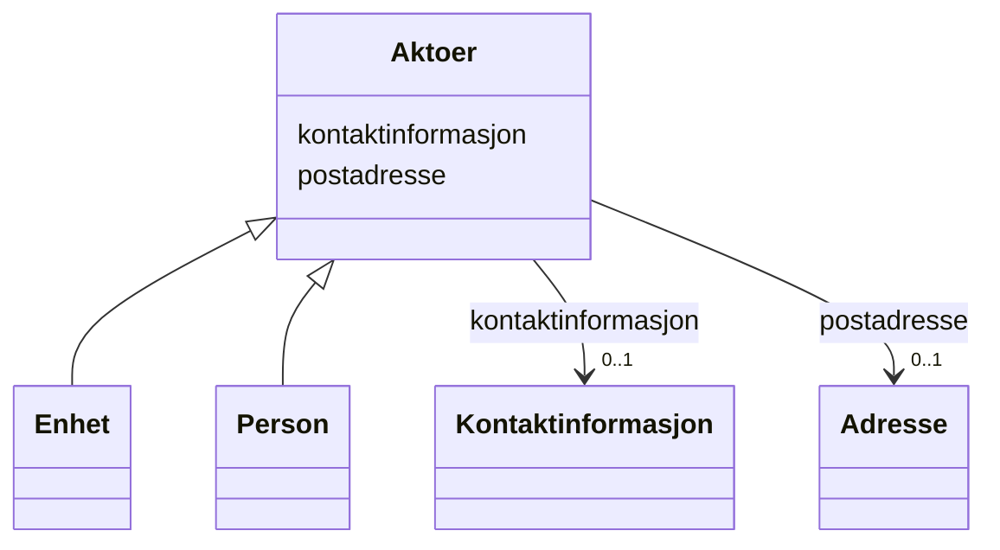

# Class: Aktoer 


_Abstrakt base for person eller eining vi samhandlar med._


* __NOTE__: this is an abstract class and should not be instantiated directly


URI: [fint:Aktoer](https://schema.fintlabs.no/Aktoer)





## Inheritance
* **Aktoer**
    * [Enhet](enhet.md)
    * [Person](person.md)


## Class Properties

| Property | Value |
| --- | --- |
| Class URI | [fint:Aktoer](https://schema.fintlabs.no/Aktoer) |


## Eigenskapar


  
  

  
  


  
  

  
  


  
  
    
  

  
  
    
  


### Valgfri

| Namn | Kardinalitet og domene | Beskriving |
| --- | --- | --- |
| [kontaktinformasjon](kontaktinformasjon.md) | 0..1 <br/> [Kontaktinformasjon](kontaktinformasjon.md) | Den føretrekte måten å kome i kontakt med ein aktør |
| [postadresse](postadresse.md) | 0..1 <br/> [Adresse](adresse.md) | Informasjon om postadresse til ein aktør |


  
  
  
    
      
    
      
    
      
    
  
  

  
  
  
    
      
    
      
    
      
    
  
  


## Identifier and Mapping Information


### Schema Source


* from schema: https://data.norge.no/fint/fint-common


## Mappings

| Mapping Type | Mapped Value |
| ---  | ---  |
| self | fint:Aktoer |
| native | https://schema.fintlabs.no/:Aktoer |


## LinkML Source

<!-- TODO: investigate https://stackoverflow.com/questions/37606292/how-to-create-tabbed-code-blocks-in-mkdocs-or-sphinx -->

### Direct

<details>
```yaml
name: Aktoer
description: Abstrakt base for person eller eining vi samhandlar med.
from_schema: https://data.norge.no/fint/fint-common
abstract: true
slots:
- kontaktinformasjon
- postadresse
slot_usage:
  kontaktinformasjon:
    name: kontaktinformasjon
    in_subset:
    - Valgfri
  postadresse:
    name: postadresse
    in_subset:
    - Valgfri
class_uri: fint:Aktoer

```
</details>

### Induced

<details>
```yaml
name: Aktoer
description: Abstrakt base for person eller eining vi samhandlar med.
from_schema: https://data.norge.no/fint/fint-common
abstract: true
slot_usage:
  kontaktinformasjon:
    name: kontaktinformasjon
    in_subset:
    - Valgfri
  postadresse:
    name: postadresse
    in_subset:
    - Valgfri
attributes:
  kontaktinformasjon:
    name: kontaktinformasjon
    description: Den føretrekte måten å kome i kontakt med ein aktør.
    in_subset:
    - Valgfri
    from_schema: https://data.norge.no/fint/fint-common
    slot_uri: fint:kontaktinformasjon
    owner: Aktoer
    domain_of:
    - Aktoer
    - Kontaktperson
    - Korrespondansepart
    - Part
    range: Kontaktinformasjon
    inlined: true
  postadresse:
    name: postadresse
    description: Informasjon om postadresse til ein aktør.
    in_subset:
    - Valgfri
    from_schema: https://data.norge.no/fint/fint-common
    slot_uri: fint:postadresse
    owner: Aktoer
    domain_of:
    - Aktoer
    range: Adresse
    inlined: true
class_uri: fint:Aktoer

```
</details>