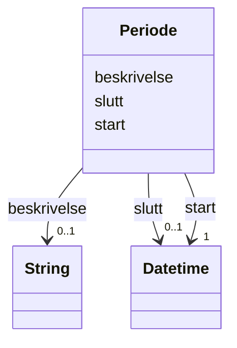

# Class: Periode 


_Tidsperiode med obligatorisk start og valfri slutt._


URI: [fint:Periode](https://schema.fintlabs.no/Periode)





<!-- no inheritance hierarchy -->

## Class Properties

| Property | Value |
| --- | --- |
| Class URI | [fint:Periode](https://schema.fintlabs.no/Periode) |


## Eigenskapar


  
  

  
  

  
  


  
  

  
  

  
  


  
  

  
  

  
  


  
  
  
  
    
  

  
  
  
    
      
    
      
    
      
    
  
  
    
  

  
  
  
  
    
  


### Andre

| Namn | Kardinalitet og domene | Beskriving |
| --- | --- | --- |
| [beskrivelse](beskrivelse.md) | 0..1 <br/> [xsd:string](http://www.w3.org/2001/XMLSchema#string) | Beskriven namn eller omtale |
| [start](start.md) | 1 <br/> [xsd:dateTime](http://www.w3.org/2001/XMLSchema#dateTime) | Frå tidspunkt |
| [slutt](slutt.md) | 0..1 <br/> [xsd:dateTime](http://www.w3.org/2001/XMLSchema#dateTime) | Til tidspunkt |


## Usages

| used by | used in | type | used |
| ---  | --- | --- | --- |
| [Begrep](begrep.md) | [gyldighetsperiode](gyldighetsperiode.md) | range | [Periode](periode.md) |
| [Identifikator](identifikator.md) | [gyldighetsperiode](gyldighetsperiode.md) | range | [Periode](periode.md) |
| [Landkode](landkode.md) | [gyldighetsperiode](gyldighetsperiode.md) | range | [Periode](periode.md) |
| [Kjonn](kjonn.md) | [gyldighetsperiode](gyldighetsperiode.md) | range | [Periode](periode.md) |
| [Fylke](fylke.md) | [gyldighetsperiode](gyldighetsperiode.md) | range | [Periode](periode.md) |
| [Kommune](kommune.md) | [gyldighetsperiode](gyldighetsperiode.md) | range | [Periode](periode.md) |
| [Spraak](spraak.md) | [gyldighetsperiode](gyldighetsperiode.md) | range | [Periode](periode.md) |
| [AdministrativEnhet](administrativenhet.md) | [gyldighetsperiode](gyldighetsperiode.md) | range | [Periode](periode.md) |
| [DokumentStatus](dokumentstatus.md) | [gyldighetsperiode](gyldighetsperiode.md) | range | [Periode](periode.md) |
| [DokumentType](dokumenttype.md) | [gyldighetsperiode](gyldighetsperiode.md) | range | [Periode](periode.md) |
| [Format](format.md) | [gyldighetsperiode](gyldighetsperiode.md) | range | [Periode](periode.md) |
| [JournalpostType](journalposttype.md) | [gyldighetsperiode](gyldighetsperiode.md) | range | [Periode](periode.md) |
| [JournalStatus](journalstatus.md) | [gyldighetsperiode](gyldighetsperiode.md) | range | [Periode](periode.md) |
| [Klassifikasjonstype](klassifikasjonstype.md) | [gyldighetsperiode](gyldighetsperiode.md) | range | [Periode](periode.md) |
| [KorrespondansepartType](korrespondanseparttype.md) | [gyldighetsperiode](gyldighetsperiode.md) | range | [Periode](periode.md) |
| [Merknadstype](merknadstype.md) | [gyldighetsperiode](gyldighetsperiode.md) | range | [Periode](periode.md) |
| [PartRolle](partrolle.md) | [gyldighetsperiode](gyldighetsperiode.md) | range | [Periode](periode.md) |
| [Rolle](rolle.md) | [gyldighetsperiode](gyldighetsperiode.md) | range | [Periode](periode.md) |
| [Saksmappetype](saksmappetype.md) | [gyldighetsperiode](gyldighetsperiode.md) | range | [Periode](periode.md) |
| [Saksstatus](saksstatus.md) | [gyldighetsperiode](gyldighetsperiode.md) | range | [Periode](periode.md) |
| [Skjermingshjemmel](skjermingshjemmel.md) | [gyldighetsperiode](gyldighetsperiode.md) | range | [Periode](periode.md) |
| [Tilgangsgruppe](tilgangsgruppe.md) | [gyldighetsperiode](gyldighetsperiode.md) | range | [Periode](periode.md) |
| [Tilgangsrestriksjon](tilgangsrestriksjon.md) | [gyldighetsperiode](gyldighetsperiode.md) | range | [Periode](periode.md) |
| [TilknyttetRegistreringSom](tilknyttetregistreringsom.md) | [gyldighetsperiode](gyldighetsperiode.md) | range | [Periode](periode.md) |
| [Variantformat](variantformat.md) | [gyldighetsperiode](gyldighetsperiode.md) | range | [Periode](periode.md) |


## Identifier and Mapping Information


### Schema Source


* from schema: https://data.norge.no/fint/fint-common


## Mappings

| Mapping Type | Mapped Value |
| ---  | ---  |
| self | fint:Periode |
| native | https://schema.fintlabs.no/:Periode |


## LinkML Source

<!-- TODO: investigate https://stackoverflow.com/questions/37606292/how-to-create-tabbed-code-blocks-in-mkdocs-or-sphinx -->

### Direct

<details>
```yaml
name: Periode
description: Tidsperiode med obligatorisk start og valfri slutt.
from_schema: https://data.norge.no/fint/fint-common
slots:
- beskrivelse
- start
- slutt
slot_usage:
  start:
    name: start
    required: true
class_uri: fint:Periode

```
</details>

### Induced

<details>
```yaml
name: Periode
description: Tidsperiode med obligatorisk start og valfri slutt.
from_schema: https://data.norge.no/fint/fint-common
slot_usage:
  start:
    name: start
    required: true
attributes:
  beskrivelse:
    name: beskrivelse
    description: Beskriven namn eller omtale.
    from_schema: https://data.norge.no/fint/fint-common
    slot_uri: fint:beskrivelse
    owner: Periode
    domain_of:
    - Periode
    - Mappe
    - Registrering
    - Klassifikasjonssystem
    - Dokumentbeskrivelse
    range: string
  start:
    name: start
    description: Frå tidspunkt.
    from_schema: https://data.norge.no/fint/fint-common
    slot_uri: fint:start
    owner: Periode
    domain_of:
    - Periode
    range: datetime
    required: true
  slutt:
    name: slutt
    description: Til tidspunkt.
    from_schema: https://data.norge.no/fint/fint-common
    slot_uri: fint:slutt
    owner: Periode
    domain_of:
    - Periode
    range: datetime
class_uri: fint:Periode

```
</details>