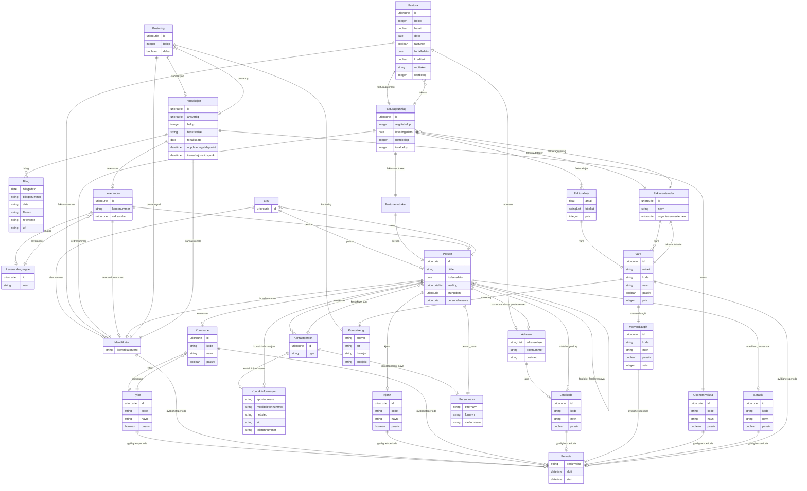

```mermaid
erDiagram
Adresse {
    stringList adresselinje  
    string postnummer  
    string poststed  
}
Bilag {
    date bilagsdato  
    string bilagsnummer  
    string data  
    string filnavn  
    string referanse  
    string url  
}
Elev {
    uriorcurie id  
}
Faktura {
    uriorcurie id  
    integer belop  
    boolean betalt  
    date dato  
    boolean fakturert  
    date forfallsdato  
    boolean kreditert  
    string mottaker  
    integer restbelop  
}
Fakturagrunnlag {
    uriorcurie id  
    integer avgiftsbelop  
    date leveringsdato  
    integer nettobelop  
    integer totalbelop  
}
Fakturalinje {
    float antall  
    stringList fritekst  
    integer pris  
}
Fakturamottaker {

}
Fakturautsteder {
    uriorcurie id  
    string navn  
    uriorcurie organisasjonselement  
}
Fylke {
    uriorcurie id  
    string kode  
    string navn  
    boolean passiv  
}
Identifikator {
    string identifikatorverdi  
}
Kjonn {
    uriorcurie id  
    string kode  
    string navn  
    boolean passiv  
}
Kommune {
    uriorcurie id  
    string kode  
    string navn  
    boolean passiv  
}
Kontaktinformasjon {
    string epostadresse  
    string mobiltelefonnummer  
    string nettsted  
    string sip  
    string telefonnummer  
}
Kontaktperson {
    uriorcurie id  
    string type  
}
Kontostreng {
    string ansvar  
    string art  
    string funksjon  
    string prosjekt  
}
Landkode {
    uriorcurie id  
    string kode  
    string navn  
    boolean passiv  
}
Leverandor {
    uriorcurie id  
    string kontonummer  
    uriorcurie virksomhet  
}
Leverandorgruppe {
    uriorcurie id  
    string navn  
}
Merverdiavgift {
    uriorcurie id  
    string kode  
    string navn  
    boolean passiv  
    integer sats  
}
OkonomiValuta {
    uriorcurie id  
    string kode  
    string navn  
    boolean passiv  
}
Periode {
    string beskrivelse  
    datetime slutt  
    datetime start  
}
Person {
    uriorcurie id  
    string bilde  
    date fodselsdato  
    uriorcurieList laerling  
    uriorcurie otungdom  
    uriorcurie personalressurs  
}
Personnavn {
    string etternavn  
    string fornavn  
    string mellomnavn  
}
Postering {
    uriorcurie id  
    integer belop  
    boolean debet  
}
Spraak {
    uriorcurie id  
    string kode  
    string navn  
    boolean passiv  
}
Transaksjon {
    uriorcurie id  
    uriorcurie ansvarlig  
    integer belop  
    string beskrivelse  
    date forfallsdato  
    datetime oppdateringstidspunkt  
    datetime transaksjonstidspunkt  
}
Vare {
    uriorcurie id  
    string enhet  
    string kode  
    string navn  
    boolean passiv  
    integer pris  
}

Adresse ||--|o Landkode : "land"
Elev ||--|o Identifikator : "elevnummer"
Elev ||--|o Person : "person"
Faktura ||--|o Adresse : "adresse"
Faktura ||--|| Fakturagrunnlag : "fakturagrunnlag"
Faktura ||--|| Identifikator : "fakturanummer"
Fakturagrunnlag ||--|| Fakturamottaker : "fakturamottaker"
Fakturagrunnlag ||--|| Fakturautsteder : "fakturautsteder"
Fakturagrunnlag ||--|| Identifikator : "ordrenummer"
Fakturagrunnlag ||--}o Faktura : "faktura"
Fakturagrunnlag ||--}| Fakturalinje : "fakturalinjer"
Fakturalinje ||--|| Vare : "vare"
Fakturamottaker ||--|| Person : "person"
Fakturautsteder ||--}o Fakturagrunnlag : "fakturagrunnlag"
Fakturautsteder ||--}o Vare : "vare"
Fylke ||--|o Periode : "gyldighetsperiode"
Fylke ||--}o Kommune : "kommune"
Identifikator ||--|o Periode : "gyldighetsperiode"
Kjonn ||--|o Periode : "gyldighetsperiode"
Kommune ||--|o Periode : "gyldighetsperiode"
Kommune ||--|| Fylke : "fylke"
Kontaktperson ||--|o Kontaktinformasjon : "kontaktinformasjon"
Kontaktperson ||--|o Personnavn : "kontaktperson_navn"
Kontaktperson ||--}o Person : "kontaktperson"
Landkode ||--|o Periode : "gyldighetsperiode"
Leverandor ||--|o Identifikator : "leverandornummer"
Leverandor ||--|o Leverandorgruppe : "leverandorgruppe"
Leverandor ||--|o Person : "person"
Leverandorgruppe ||--}o Leverandor : "leverandor"
Merverdiavgift ||--|o Periode : "gyldighetsperiode"
OkonomiValuta ||--|o Periode : "gyldighetsperiode"
Person ||--|o Adresse : "bostedsadresse, postadresse"
Person ||--|o Elev : "elev"
Person ||--|o Kjonn : "kjonn"
Person ||--|o Kommune : "kommune"
Person ||--|o Kontaktinformasjon : "kontaktinformasjon"
Person ||--|o Spraak : "maalform, morsmaal"
Person ||--|| Identifikator : "fodselsnummer"
Person ||--|| Personnavn : "person_navn"
Person ||--}o Kontaktperson : "parorende"
Person ||--}o Landkode : "statsborgerskap"
Person ||--}o Person : "foreldre, foreldreansvar"
Postering ||--|o Transaksjon : "transaksjon"
Postering ||--|| Identifikator : "posteringsId"
Postering ||--|| Kontostreng : "kontering"
Spraak ||--|o Periode : "gyldighetsperiode"
Transaksjon ||--|o Leverandor : "leverandor"
Transaksjon ||--|| Identifikator : "transaksjonsId"
Transaksjon ||--|| OkonomiValuta : "valuta"
Transaksjon ||--}o Bilag : "bilag"
Transaksjon ||--}| Postering : "postering"
Vare ||--|o Kontostreng : "kontering"
Vare ||--|o Periode : "gyldighetsperiode"
Vare ||--|| Fakturautsteder : "fakturautsteder"
Vare ||--|| Merverdiavgift : "merverdiavgift"

```

