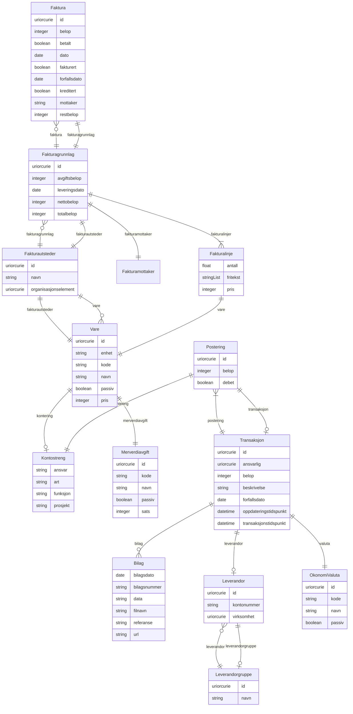

```mermaid
erDiagram
Bilag {
    date bilagsdato  
    string bilagsnummer  
    string data  
    string filnavn  
    string referanse  
    string url  
}
Faktura {
    uriorcurie id  
    integer belop  
    boolean betalt  
    date dato  
    boolean fakturert  
    date forfallsdato  
    boolean kreditert  
    string mottaker  
    integer restbelop  
}
Fakturagrunnlag {
    uriorcurie id  
    integer avgiftsbelop  
    date leveringsdato  
    integer nettobelop  
    integer totalbelop  
}
Fakturalinje {
    float antall  
    stringList fritekst  
    integer pris  
}
Fakturamottaker {

}
Fakturautsteder {
    uriorcurie id  
    string navn  
    uriorcurie organisasjonselement  
}
Kontostreng {
    string ansvar  
    string art  
    string funksjon  
    string prosjekt  
}
Leverandor {
    uriorcurie id  
    string kontonummer  
    uriorcurie virksomhet  
}
Leverandorgruppe {
    uriorcurie id  
    string navn  
}
Merverdiavgift {
    uriorcurie id  
    string kode  
    string navn  
    boolean passiv  
    integer sats  
}
OkonomiValuta {
    uriorcurie id  
    string kode  
    string navn  
    boolean passiv  
}
Postering {
    uriorcurie id  
    integer belop  
    boolean debet  
}
Transaksjon {
    uriorcurie id  
    uriorcurie ansvarlig  
    integer belop  
    string beskrivelse  
    date forfallsdato  
    datetime oppdateringstidspunkt  
    datetime transaksjonstidspunkt  
}
Vare {
    uriorcurie id  
    string enhet  
    string kode  
    string navn  
    boolean passiv  
    integer pris  
}

Faktura ||--|| Fakturagrunnlag : "fakturagrunnlag"
Fakturagrunnlag ||--|| Fakturamottaker : "fakturamottaker"
Fakturagrunnlag ||--|| Fakturautsteder : "fakturautsteder"
Fakturagrunnlag ||--}o Faktura : "faktura"
Fakturagrunnlag ||--}| Fakturalinje : "fakturalinjer"
Fakturalinje ||--|| Vare : "vare"
Fakturautsteder ||--}o Fakturagrunnlag : "fakturagrunnlag"
Fakturautsteder ||--}o Vare : "vare"
Leverandor ||--|o Leverandorgruppe : "leverandorgruppe"
Leverandorgruppe ||--}o Leverandor : "leverandor"
Postering ||--|o Transaksjon : "transaksjon"
Postering ||--|| Kontostreng : "kontering"
Transaksjon ||--|o Leverandor : "leverandor"
Transaksjon ||--|| OkonomiValuta : "valuta"
Transaksjon ||--}o Bilag : "bilag"
Transaksjon ||--}| Postering : "postering"
Vare ||--|o Kontostreng : "kontering"
Vare ||--|| Fakturautsteder : "fakturautsteder"
Vare ||--|| Merverdiavgift : "merverdiavgift"


```
