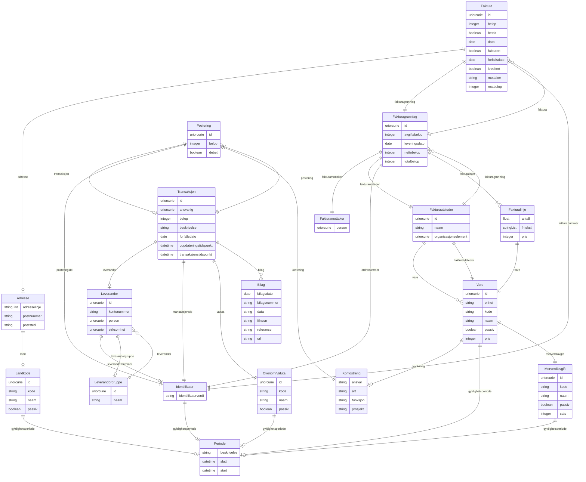

# fint-okonomi

FINT-domenemodell for økonomi. Dekkjer tre sub-pakkar: okonomi.faktura (faktura, fakturagrunnlag, fakturautsteder), okonomi.regnskap (transaksjonar, posteringar, bilag, leverandørar) og okonomi.kodeverk (vare, merverdiavgift, valuta).

URI: https://data.norge.no/linkml/fint-okonomi

Name: fint-okonomi

## Classes

| Class | Description |
| --- | --- |
| [Adresse](klasser/adresse.md) | Fysisk adresse eller postadresse |
| [Aktoer](klasser/aktoer.md) | Abstrakt base for person eller eining vi samhandlar med |
| &nbsp;&nbsp;&nbsp;&nbsp;&nbsp;&nbsp;&nbsp;&nbsp;[Enhet](klasser/enhet.md) | Abstrakt base for alle hovudeiningar, undereiningar og organisasjonsledd iden... |
| &nbsp;&nbsp;&nbsp;&nbsp;&nbsp;&nbsp;&nbsp;&nbsp;&nbsp;&nbsp;&nbsp;&nbsp;&nbsp;&nbsp;&nbsp;&nbsp;[Virksomhet](klasser/virksomhet.md) | Ein juridisk organisasjon som produserer varer eller tenester |
| &nbsp;&nbsp;&nbsp;&nbsp;&nbsp;&nbsp;&nbsp;&nbsp;[Person](klasser/person.md) | Fysiske private personar |
| [Begrep](klasser/begrep.md) | Abstrakt fellesbase for alle FINT-kodeverk |
| &nbsp;&nbsp;&nbsp;&nbsp;&nbsp;&nbsp;&nbsp;&nbsp;[Fylke](klasser/fylke.md) | Liste over Norges fylker |
| &nbsp;&nbsp;&nbsp;&nbsp;&nbsp;&nbsp;&nbsp;&nbsp;[Kjonn](klasser/kjonn.md) | Verdiar for kjønn basert på ISO/IEC 5218 |
| &nbsp;&nbsp;&nbsp;&nbsp;&nbsp;&nbsp;&nbsp;&nbsp;[Kommune](klasser/kommune.md) | Liste over Norges kommunar |
| &nbsp;&nbsp;&nbsp;&nbsp;&nbsp;&nbsp;&nbsp;&nbsp;[Landkode](klasser/landkode.md) | Landskode i ISO 3166-1 alpha-2 format |
| &nbsp;&nbsp;&nbsp;&nbsp;&nbsp;&nbsp;&nbsp;&nbsp;[Spraak](klasser/spraak.md) | Verdiar for språk (2 bokstavar) |
| [Bilag](klasser/bilag.md) | Dokumentasjon til ein transaksjon (kompleks datatype) |
| [Faktura](klasser/faktura.md) | Betalingskrav utforma og oversendt frå fakturautstedar til fakturamottakar |
| [Fakturagrunnlag](klasser/fakturagrunnlag.md) | Grunnlag for fakturering |
| [Fakturalinje](klasser/fakturalinje.md) | Del av Fakturagrunnlag som skildrar ei enkelt vare (kompleks datatype) |
| [Fakturamottaker](klasser/fakturamottaker.md) | Aktør som skal betale faktura (kompleks datatype) |
| [Fakturautsteder](klasser/fakturautsteder.md) | Eining som utformar og oversender faktura og mottar betaling |
| [Identifikator](klasser/identifikator.md) | Unik identifikasjon til eit objekt |
| [Kontaktinformasjon](klasser/kontaktinformasjon.md) | Informasjon som kan brukast for å oppnå kontakt |
| [Kontaktperson](klasser/kontaktperson.md) | Kontaktperson (pårørande) til ein person |
| [Kontostreng](klasser/kontostreng.md) | Kontodimensjonar for ei postering (kompleks datatype) |
| [Leverandor](klasser/leverandor.md) | Person eller verksemd som leverer produkt eller tenester |
| [Leverandorgruppe](klasser/leverandorgruppe.md) | Gruppering av leverandørar |
| [Matrikkelnummer](klasser/matrikkelnummer.md) | Eintydleg identifisering av matrikkeleining innanfor kommune |
| [Merverdiavgift](klasser/merverdiavgift.md) | Kodeverk for merverdiavgifter |
| [OkonomiContainer](klasser/okonomicontainer.md) | Rotcontainer for FINT Økonomi-instansar |
| [OkonomiValuta](klasser/okonomivaluta.md) | Valuta for transaksjonsbeløp |
| [Periode](klasser/periode.md) | Tidsperiode med obligatorisk start og valfri slutt |
| [Personnavn](klasser/personnavn.md) | Namn på ein person |
| [Postering](klasser/postering.md) | Føring på ein konto i rekneskapet |
| [Transaksjon](klasser/transaksjon.md) | Overføring av pengar til eller frå eksterne partar |
| [Valuta](klasser/valuta.md) | Valutakodar for offisielle valutaer |
| [Vare](klasser/vare.md) | Vare eller teneste som kan leverast og fakturerast |

## Slots

| Slot | Description |
| --- | --- |
| [adresse](klasser/adresse.md) | Adresse til matrikkeleining |
| [adresselinje](klasser/adresselinje.md) | Adresseinformasjon |
| [ansvar](klasser/ansvar.md) | Ansvarsomrade |
| [ansvarlig](klasser/ansvarlig.md) | Referanse til Personalressurs (Administrasjon) som er ansvarleg |
| [antall](klasser/antall.md) | Mengd av varen levert |
| [art](klasser/art.md) | Artskonto (type utgift/inntekt) |
| [avgiftsbelop](klasser/avgiftsbelop.md) | Del av totalbeløp som er avgifter, i øre |
| [belop](klasser/belop.md) | Beløp, i øre |
| [beskrivelse](klasser/beskrivelse.md) | Beskriven namn eller omtale |
| [betalt](klasser/betalt.md) | Status på betaling |
| [bilag](klasser/bilag.md) | Bilag til transaksjonen |
| [bilagsdato](klasser/bilagsdato.md) | Dato bilaget er registrert |
| [bilagsnummer](klasser/bilagsnummer.md) | Nummer på bilaget |
| [bilde](klasser/bilde.md) | HTTP(S)-lenkje til eit bilete av personen |
| [bokstavkode](klasser/bokstavkode.md) | Bokstavkode for aktuell valuta |
| [bostedsadresse](klasser/bostedsadresse.md) | Folkeregistrert adresse til personen |
| [bruksnummer](klasser/bruksnummer.md) | Fortløpande nummerering av bruk under gårdsnummer |
| [data](klasser/data.md) | Bilagets fil, koda som Base64 |
| [dato](klasser/dato.md) | Dato for utferding av faktura |
| [debet](klasser/debet.md) | Angir om posteringa er debet eller kredit |
| [elev](klasser/elev.md) | Referanse til Elev (Utdanning) |
| [enhet](klasser/enhet.md) | Namn på mengdeeininga varen leverast i |
| [epostadresse](klasser/epostadresse.md) | Namngitt elektronisk adresse for mottak av e-post |
| [etternavn](klasser/etternavn.md) | Etternamn til personen |
| [faktura](klasser/faktura.md) | Utferdigde fakturaer for fakturagrunnlaget |
| [fakturaer](klasser/fakturaer.md) |  |
| [fakturagrunnlag](klasser/fakturagrunnlag.md) | Grunnlag for fakturering |
| [fakturalinjer](klasser/fakturalinjer.md) | Linjer av varer eller tenester som skal fakturerast |
| [fakturamottaker](klasser/fakturamottaker.md) | Mottakar som skal betale faktura |
| [fakturanummer](klasser/fakturanummer.md) | Identifikator oppretta i fakturaprogrammet |
| [fakturautsteder](klasser/fakturautsteder.md) | Utstedar av faktura og mottakar av betaling |
| [fakturautstederear](klasser/fakturautstederear.md) |  |
| [fakturert](klasser/fakturert.md) | Status på utsending |
| [festenummer](klasser/festenummer.md) | Fortløpande nummerering av festar under gårdsnummer/bruksnummer |
| [filnavn](klasser/filnavn.md) | Namn på bilagets fil |
| [fodselsdato](klasser/fodselsdato.md) | Dato for fødsel |
| [fodselsnummer](klasser/fodselsnummer.md) | Fødselsnummer eller ein av dei fiktive variantane |
| [foreldre](klasser/foreldre.md) | Den/dei som har foreldreansvar til personen |
| [foreldreansvar](klasser/foreldreansvar.md) | Personar denne personen har foreldreansvar for |
| [forfallsdato](klasser/forfallsdato.md) | Frist for betaling eller forfallsdato for transaksjon |
| [fornavn](klasser/fornavn.md) | Fornamn til personen |
| [forretningsadresse](klasser/forretningsadresse.md) | Besøksadresse til ein organisasjonseining |
| [fritekst](klasser/fritekst.md) | Fritekst som skildrar varen slik han er levert |
| [funksjon](klasser/funksjon.md) | Funksjonskode (KOSTRA) |
| [fylke](klasser/fylke.md) | Fylke |
| [gaardsnummer](klasser/gaardsnummer.md) | Nummerering av gårdseiging i matrikkelen, unik innanfor kommune |
| [gyldighetsperiode](klasser/gyldighetsperiode.md) | Periode ressursen er gyldig for |
| [id](klasser/id.md) | URI-identifikator for ressursen |
| [identifikatorverdi](klasser/identifikatorverdi.md) | Ein konkret kombinasjon av teikn og/eller bokstavar som utgjer ein bestemt id... |
| [kjonn](klasser/kjonn.md) | Kjønn |
| [kode](klasser/kode.md) | Verdi som identifiserer omgrepet |
| [kommune](klasser/kommune.md) | Kommune |
| [kommunenummer](klasser/kommunenummer.md) | Nummerering av kommunen i høve til SSB si offisielle liste |
| [kontaktinformasjon](klasser/kontaktinformasjon.md) | Den føretrekte måten å kome i kontakt med ein aktør |
| [kontaktperson](klasser/kontaktperson.md) | Personar kontaktpersonen er pårørande for |
| [kontaktperson_naam](klasser/kontaktperson_naam.md) | Namn på kontaktpersonen |
| [kontering](klasser/kontering.md) | Kontodimensjonar |
| [kontonummer](klasser/kontonummer.md) | Kontonummer til leverandøren |
| [kreditert](klasser/kreditert.md) | Status på kreditering |
| [laerling](klasser/laerling.md) | Referanse til Laerling (Utdanning) |
| [land](klasser/land.md) | Land der adressa befinn seg |
| [leverandor](klasser/leverandor.md) | Leverandør |
| [leverandorar](klasser/leverandorar.md) |  |
| [leverandorgruppe](klasser/leverandorgruppe.md) | Gruppe av leverandørar leverandøren tilhøyrer |
| [leverandorgrupper](klasser/leverandorgrupper.md) |  |
| [leverandornummer](klasser/leverandornummer.md) | Nummer som identifiserer ein leverandør |
| [leveringsdato](klasser/leveringsdato.md) | Dato varer eller tenester vart leverte |
| [maalform](klasser/maalform.md) | Målform personen føretrekkjer |
| [mellomnavn](klasser/mellomnavn.md) | Mellomnamn |
| [merverdiavgift](klasser/merverdiavgift.md) | Varens avgiftsklasse og -sats |
| [merverdiavgifter](klasser/merverdiavgifter.md) |  |
| [mobiltelefonnummer](klasser/mobiltelefonnummer.md) | Mobiltelefonnummer |
| [morsmaal](klasser/morsmaal.md) | Morsmål til personen |
| [mottaker](klasser/mottaker.md) | Namn på mottakar |
| [naam](klasser/naam.md) | Namn på eining eller kodeverk-element |
| [nettobelop](klasser/nettobelop.md) | Del av totalbeløp som utgjer summen av fakturalinjene, i øre |
| [nettsted](klasser/nettsted.md) | Adresse til eit nettstad |
| [nummerkode](klasser/nummerkode.md) | Nummerkode for aktuell valuta |
| [oppdateringstidspunkt](klasser/oppdateringstidspunkt.md) | Tidspunkt for siste endring i transaksjonen |
| [ordrenummer](klasser/ordrenummer.md) | Unik identifikator for ordren det skal utferdigast faktura på |
| [organisasjonselement](klasser/organisasjonselement.md) | Referanse til Organisasjonselement (Administrasjon) |
| [organisasjonsnavn](klasser/organisasjonsnavn.md) | Namn på eining registrert i Einingsregisteret |
| [organisasjonsnummer](klasser/organisasjonsnummer.md) | Niisifra nummer som eintydleg identifiserer einingar i Einingsregisteret |
| [otungdom](klasser/otungdom.md) | Referanse til OtUngdom (Utdanning) |
| [parorende](klasser/parorende.md) | Pårørande kontaktperson til personen |
| [passiv](klasser/passiv.md) | Angir at koden er passiv og ikkje kan veljast |
| [person](klasser/person.md) | Referanse til Person (Administrasjon) |
| [person_naam](klasser/person_naam.md) | Namn på personen |
| [personalressurs](klasser/personalressurs.md) | Referanse til Personalressurs (Administrasjon) |
| [postadresse](klasser/postadresse.md) | Informasjon om postadresse til ein aktør |
| [postering](klasser/postering.md) | Posteringar tilhøyrande transaksjonen |
| [posteringar](klasser/posteringar.md) |  |
| [posteringsId](klasser/posteringsid.md) | Intern unik identifikator i økonomisystemet |
| [postnummer](klasser/postnummer.md) | Postnummer |
| [poststed](klasser/poststed.md) | Poststad |
| [pris](klasser/pris.md) | Pris per eining, i øre |
| [prosjekt](klasser/prosjekt.md) | Prosjektkode |
| [referanse](klasser/referanse.md) | Ekstern referanse, t |
| [restbelop](klasser/restbelop.md) | Gjenståande beløp å betale, i øre |
| [sats](klasser/sats.md) | Sats for merverdiavgift |
| [seksjonsnummer](klasser/seksjonsnummer.md) | Fortløpande nummerering av seksjonar under gårdsnummer/bruksnummer |
| [sip](klasser/sip.md) | SIP-protokoll for VoIP (IP-telefoni) |
| [slutt](klasser/slutt.md) | Til tidspunkt |
| [start](klasser/start.md) | Frå tidspunkt |
| [statsborgerskap](klasser/statsborgerskap.md) | Alle statsborgarskap personen har |
| [telefonnummer](klasser/telefonnummer.md) | Telefonnummer |
| [totalbelop](klasser/totalbelop.md) | Totalt beløp på faktura inkl |
| [transaksjon](klasser/transaksjon.md) | Transaksjonen posteringa tilhøyrer |
| [transaksjonar](klasser/transaksjonar.md) |  |
| [transaksjonsId](klasser/transaksjonsid.md) | Intern unik identifikator i økonomisystemet |
| [transaksjonstidspunkt](klasser/transaksjonstidspunkt.md) | Tidspunkt for registrering av transaksjonen |
| [type](klasser/type.md) | Beskriv kva slags type |
| [url](klasser/url.md) | URL til eksternt dokument |
| [valuta](klasser/valuta.md) | Valuta for oppgjeve beløp |
| [valuta_naam](klasser/valuta_naam.md) | Namn på valuta |
| [valutaer](klasser/valutaer.md) |  |
| [vare](klasser/vare.md) | Vare i vareregisteret |
| [varer](klasser/varer.md) |  |
| [virksomhet](klasser/virksomhet.md) | Referanse til Virksomhet som er leverandør |
| [virksomhetsId](klasser/virksomhetsid.md) | Intern unik identifikator i økonomisystemet |

## Enumerations

| Enumeration | Description |
| --- | --- |

## Types

| Type | Description |
| --- | --- |
| [Boolean](klasser/boolean.md) | A binary (true or false) value |
| [Curie](klasser/curie.md) | a compact URI |
| [Date](klasser/date.md) | a date (year, month and day) in an idealized calendar |
| [DateOrDatetime](klasser/dateordatetime.md) | Either a date or a datetime |
| [Datetime](klasser/datetime.md) | The combination of a date and time |
| [Decimal](klasser/decimal.md) | A real number with arbitrary precision that conforms to the xsd:decimal speci... |
| [Double](klasser/double.md) | A real number that conforms to the xsd:double specification |
| [Float](klasser/float.md) | A real number that conforms to the xsd:float specification |
| [Integer](klasser/integer.md) | An integer |
| [Jsonpath](klasser/jsonpath.md) | A string encoding a JSON Path |
| [Jsonpointer](klasser/jsonpointer.md) | A string encoding a JSON Pointer |
| [Ncname](klasser/ncname.md) | Prefix part of CURIE |
| [Nodeidentifier](klasser/nodeidentifier.md) | A URI, CURIE or BNODE that represents a node in a model |
| [Objectidentifier](klasser/objectidentifier.md) | A URI or CURIE that represents an object in the model |
| [Sparqlpath](klasser/sparqlpath.md) | A string encoding a SPARQL Property Path |
| [String](klasser/string.md) | A character string |
| [Time](klasser/time.md) | A time object represents a (local) time of day, independent of any particular... |
| [Uri](klasser/uri.md) | a complete URI |
| [Uriorcurie](klasser/uriorcurie.md) | a URI or a CURIE |

## Subsets

| Subset | Description |
| --- | --- |
| [Anbefalt](klasser/anbefalt.md) | Anbefalt eigensskap |
| [Obligatorisk](klasser/obligatorisk.md) | Obligatorisk eigensskap |
| [Valgfri](klasser/valgfri.md) | Valfri eigensskap |

## Artifacts

| Artefakt | Fil |
|----------|-----|
| SHACL shapes | [fint-okonomi-shapes.ttl](fint-okonomi-shapes.ttl) |
| JSON-LD kontekst | [fint-okonomi-context.jsonld](fint-okonomi-context.jsonld) |
| JSON Schema | [fint-okonomi-schema.json](fint-okonomi-schema.json) |
| OWL ontologi | [fint-okonomi-ontology.ttl](fint-okonomi-ontology.ttl) |
| Python-klasser | [fint-okonomi-model.py](fint-okonomi-model.py) |
| ER-diagram (Mermaid) | [fint-okonomi-erdiagram.md](fint-okonomi-erdiagram.md) |
| Eksempeldata (Turtle) | [fint-okonomi-eksempel.ttl](fint-okonomi-eksempel.ttl) |
