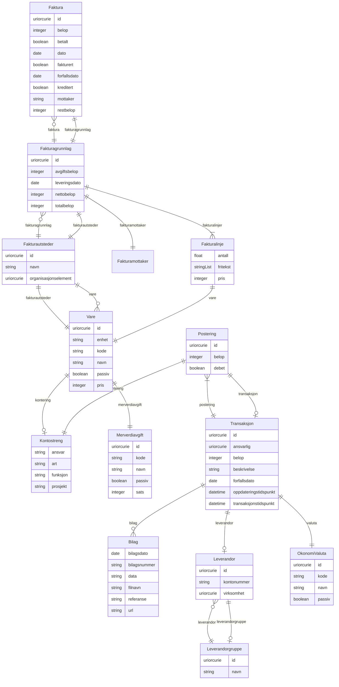

# fint-okonomi

FINT-domenemodell for økonomi. Dekkjer tre sub-pakkar: okonomi.faktura (faktura, fakturagrunnlag, fakturautsteder), okonomi.regnskap (transaksjonar, posteringar, bilag, leverandørar) og okonomi.kodeverk (vare, merverdiavgift, valuta).

URI: https://data.norge.no/linkml/fint-okonomi

Name: fint-okonomi

## Classes

### Obligatorisk

| Class | Description |
| --- | --- |
| [Bilag](klasser/bilag.md) | Dokumentasjon til ein transaksjon (kompleks datatype) |
| [Faktura](klasser/faktura.md) | Betalingskrav utforma og oversendt frå fakturautstedar til fakturamottakar |
| [Fakturagrunnlag](klasser/fakturagrunnlag.md) | Grunnlag for fakturering |
| [Fakturalinje](klasser/fakturalinje.md) | Del av Fakturagrunnlag som skildrar ei enkelt vare (kompleks datatype) |
| [Fakturamottaker](klasser/fakturamottaker.md) | Aktør som skal betale faktura (kompleks datatype) |
| [Fakturautsteder](klasser/fakturautsteder.md) | Eining som utformar og oversender faktura og mottar betaling |
| [Leverandorgruppe](klasser/leverandorgruppe.md) | Gruppering av leverandørar |
| [Merverdiavgift](klasser/merverdiavgift.md) | Kodeverk for merverdiavgifter |
| [OkonomiValuta](klasser/okonomivaluta.md) | Valuta for transaksjonsbeløp |
| [Postering](klasser/postering.md) | Føring på ein konto i rekneskapet |
| [Transaksjon](klasser/transaksjon.md) | Overføring av pengar til eller frå eksterne partar |
| [Vare](klasser/vare.md) | Vare eller teneste som kan leverast og fakturerast |

### Anbefalt

| Class | Description |
| --- | --- |
| [Kontostreng](klasser/kontostreng.md) | Kontodimensjonar for ei postering (kompleks datatype) |

### Valgfri

| Class | Description |
| --- | --- |
| [Leverandor](klasser/leverandor.md) | Person eller verksemd som leverer produkt eller tenester |

### Andre

| Class | Description |
| --- | --- |

## Slots

| Slot | Description |
| --- | --- |
| [ansvar](klasser/ansvar.md) | Ansvarsomrade |
| [ansvarlig](klasser/ansvarlig.md) | Referanse til Personalressurs (Administrasjon) som er ansvarleg |
| [antall](klasser/antall.md) | Mengd av varen levert |
| [art](klasser/art.md) | Artskonto (type utgift/inntekt) |
| [avgiftsbelop](klasser/avgiftsbelop.md) | Del av totalbeløp som er avgifter, i øre |
| [belop](klasser/belop.md) | Beløp, i øre |
| [betalt](klasser/betalt.md) | Status på betaling |
| [bilag](klasser/bilag.md) | Bilag til transaksjonen |
| [bilagsdato](klasser/bilagsdato.md) | Dato bilaget er registrert |
| [bilagsnummer](klasser/bilagsnummer.md) | Nummer på bilaget |
| [data](klasser/data.md) | Bilagets fil, koda som Base64 |
| [dato](klasser/dato.md) | Dato for utferding av faktura |
| [debet](klasser/debet.md) | Angir om posteringa er debet eller kredit |
| [enhet](klasser/enhet.md) | Namn på mengdeeininga varen leverast i |
| [faktura](klasser/faktura.md) | Utferdigde fakturaer for fakturagrunnlaget |
| [fakturaer](klasser/fakturaer.md) |  |
| [fakturagrunnlag](klasser/fakturagrunnlag.md) | Grunnlag for fakturering |
| [fakturalinjer](klasser/fakturalinjer.md) | Linjer av varer eller tenester som skal fakturerast |
| [fakturamottaker](klasser/fakturamottaker.md) | Mottakar som skal betale faktura |
| [fakturanummer](klasser/fakturanummer.md) | Identifikator oppretta i fakturaprogrammet |
| [fakturautsteder](klasser/fakturautsteder.md) | Utstedar av faktura og mottakar av betaling |
| [fakturautstederear](klasser/fakturautstederear.md) |  |
| [fakturert](klasser/fakturert.md) | Status på utsending |
| [filnavn](klasser/filnavn.md) | Namn på bilagets fil |
| [forfallsdato](klasser/forfallsdato.md) | Frist for betaling eller forfallsdato for transaksjon |
| [fritekst](klasser/fritekst.md) | Fritekst som skildrar varen slik han er levert |
| [funksjon](klasser/funksjon.md) | Funksjonskode (KOSTRA) |
| [kontering](klasser/kontering.md) | Kontodimensjonar |
| [kontonummer](klasser/kontonummer.md) | Kontonummer til leverandøren |
| [kreditert](klasser/kreditert.md) | Status på kreditering |
| [leverandor](klasser/leverandor.md) | Leverandør |
| [leverandorar](klasser/leverandorar.md) |  |
| [leverandorgruppe](klasser/leverandorgruppe.md) | Gruppe av leverandørar leverandøren tilhøyrer |
| [leverandorgrupper](klasser/leverandorgrupper.md) |  |
| [leverandornummer](klasser/leverandornummer.md) | Nummer som identifiserer ein leverandør |
| [leveringsdato](klasser/leveringsdato.md) | Dato varer eller tenester vart leverte |
| [merverdiavgift](klasser/merverdiavgift.md) | Varens avgiftsklasse og -sats |
| [merverdiavgifter](klasser/merverdiavgifter.md) |  |
| [mottaker](klasser/mottaker.md) | Namn på mottakar |
| [nettobelop](klasser/nettobelop.md) | Del av totalbeløp som utgjer summen av fakturalinjene, i øre |
| [oppdateringstidspunkt](klasser/oppdateringstidspunkt.md) | Tidspunkt for siste endring i transaksjonen |
| [ordrenummer](klasser/ordrenummer.md) | Unik identifikator for ordren det skal utferdigast faktura på |
| [organisasjonselement](klasser/organisasjonselement.md) | Referanse til Organisasjonselement (Administrasjon) |
| [personalressurs](klasser/personalressurs.md) | Referanse til Personalressurs (Administrasjon) |
| [postering](klasser/postering.md) | Posteringar tilhøyrande transaksjonen |
| [posteringar](klasser/posteringar.md) |  |
| [posteringsId](klasser/posteringsid.md) | Intern unik identifikator i økonomisystemet |
| [pris](klasser/pris.md) | Pris per eining, i øre |
| [prosjekt](klasser/prosjekt.md) | Prosjektkode |
| [referanse](klasser/referanse.md) | Ekstern referanse, t |
| [restbelop](klasser/restbelop.md) | Gjenståande beløp å betale, i øre |
| [sats](klasser/sats.md) | Sats for merverdiavgift |
| [totalbelop](klasser/totalbelop.md) | Totalt beløp på faktura inkl |
| [transaksjon](klasser/transaksjon.md) | Transaksjonen posteringa tilhøyrer |
| [transaksjonar](klasser/transaksjonar.md) |  |
| [transaksjonsId](klasser/transaksjonsid.md) | Intern unik identifikator i økonomisystemet |
| [transaksjonstidspunkt](klasser/transaksjonstidspunkt.md) | Tidspunkt for registrering av transaksjonen |
| [url](klasser/url.md) | URL til eksternt dokument |
| [valuta](klasser/valuta.md) | Valuta for oppgjeve beløp |
| [valutaer](klasser/valutaer.md) |  |
| [vare](klasser/vare.md) | Vare i vareregisteret |
| [varer](klasser/varer.md) |  |
| [virksomhet](klasser/virksomhet.md) | Referanse til Virksomhet som er leverandør |

## Enumerations

| Enumeration | Description |
| --- | --- |

## Types

| Type | Description |
| --- | --- |

## Subsets

| Subset | Description |
| --- | --- |
| [Anbefalt](klasser/anbefalt.md) | Anbefalt eigensskap |
| [Obligatorisk](klasser/obligatorisk.md) | Obligatorisk eigensskap |
| [Valgfri](klasser/valgfri.md) | Valfri eigensskap |

## Generated artifacts

| Artefakt | Fil |
|----------|-----|
| SHACL shapes | [fint-okonomi-shapes.ttl](fint-okonomi-shapes.ttl) |
| JSON-LD kontekst | [fint-okonomi-context.jsonld](fint-okonomi-context.jsonld) |
| JSON Schema | [fint-okonomi-schema.json](fint-okonomi-schema.json) |
| OWL ontologi | [fint-okonomi-ontology.ttl](fint-okonomi-ontology.ttl) |
| RDF/Turtle skjema | [fint-okonomi-schema.ttl](fint-okonomi-schema.ttl) |
| Python-klasser | [fint-okonomi-model.py](fint-okonomi-model.py) |
| ER-diagram (Mermaid) | [fint-okonomi-erdiagram.md](fint-okonomi-erdiagram.md) |
| Eksempeldata (Turtle) | [fint-okonomi-eksempel.ttl](fint-okonomi-eksempel.ttl) |
