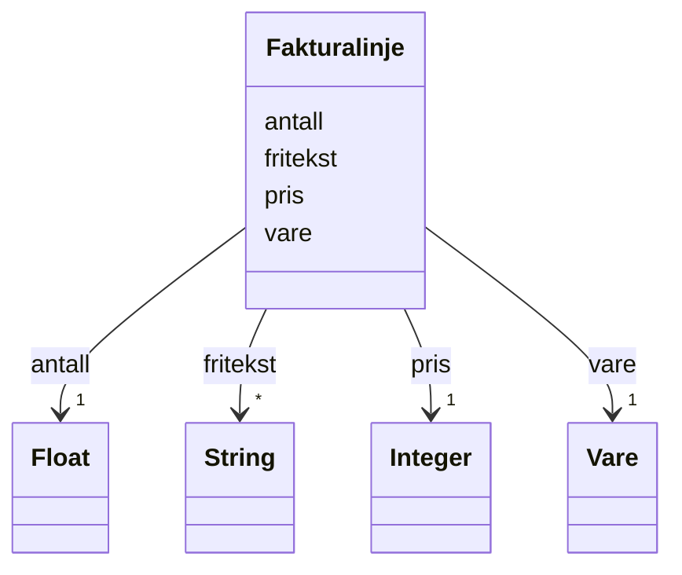

# Class: Fakturalinje 


_Del av Fakturagrunnlag som skildrar ei enkelt vare (kompleks datatype)._


URI: [okn:Fakturalinje](https://schema.fintlabs.no/okonomi/Fakturalinje)





<!-- no inheritance hierarchy -->

## Class Properties

| Property | Value |
| --- | --- |
| Class URI | [okn:Fakturalinje](https://schema.fintlabs.no/okonomi/Fakturalinje) |


## Eigenskapar


  
  
    
  

  
  
    
  

  
  

  
  
    
  


### Obligatorisk

| Namn | Kardinalitet og domene | Beskriving |
| --- | --- | --- |
| [antall](antall.md) | 1 <br/> [xsd:float](http://www.w3.org/2001/XMLSchema#float) | Mengd av varen levert |
| [pris](pris.md) | 1 <br/> [xsd:integer](http://www.w3.org/2001/XMLSchema#integer) | Pris per eining, i øre |
| [vare](vare.md) | 1 <br/> [Vare](vare.md) | Vare i vareregisteret |


  
  

  
  

  
  

  
  


  
  

  
  

  
  
    
  

  
  


### Valgfri

| Namn | Kardinalitet og domene | Beskriving |
| --- | --- | --- |
| [fritekst](fritekst.md) | * <br/> [xsd:string](http://www.w3.org/2001/XMLSchema#string) | Fritekst som skildrar varen slik han er levert |


  
  
  
    
      
    
      
    
      
    
  
  

  
  
  
    
      
    
      
    
      
    
  
  

  
  
  
    
      
    
      
    
      
    
  
  

  
  
  
    
      
    
      
    
      
    
  
  


## Usages

| used by | used in | type | used |
| ---  | --- | --- | --- |
| [Fakturagrunnlag](fakturagrunnlag.md) | [fakturalinjer](fakturalinjer.md) | range | [Fakturalinje](fakturalinje.md) |


## Identifier and Mapping Information


### Schema Source


* from schema: https://data.norge.no/linkml/fint-okonomi


## Mappings

| Mapping Type | Mapped Value |
| ---  | ---  |
| self | okn:Fakturalinje |
| native | https://schema.fintlabs.no/okonomi/:Fakturalinje |


## LinkML Source

<!-- TODO: investigate https://stackoverflow.com/questions/37606292/how-to-create-tabbed-code-blocks-in-mkdocs-or-sphinx -->

### Direct

<details>
```yaml
name: Fakturalinje
description: Del av Fakturagrunnlag som skildrar ei enkelt vare (kompleks datatype).
from_schema: https://data.norge.no/linkml/fint-okonomi
rank: 1000
slots:
- antall
- pris
- fritekst
- vare
slot_usage:
  antall:
    name: antall
    in_subset:
    - Obligatorisk
    required: true
  pris:
    name: pris
    in_subset:
    - Obligatorisk
    required: true
  fritekst:
    name: fritekst
    in_subset:
    - Valgfri
  vare:
    name: vare
    in_subset:
    - Obligatorisk
    required: true
class_uri: okn:Fakturalinje

```
</details>

### Induced

<details>
```yaml
name: Fakturalinje
description: Del av Fakturagrunnlag som skildrar ei enkelt vare (kompleks datatype).
from_schema: https://data.norge.no/linkml/fint-okonomi
rank: 1000
slot_usage:
  antall:
    name: antall
    in_subset:
    - Obligatorisk
    required: true
  pris:
    name: pris
    in_subset:
    - Obligatorisk
    required: true
  fritekst:
    name: fritekst
    in_subset:
    - Valgfri
  vare:
    name: vare
    in_subset:
    - Obligatorisk
    required: true
attributes:
  antall:
    name: antall
    description: Mengd av varen levert.
    in_subset:
    - Obligatorisk
    from_schema: https://data.norge.no/linkml/fint-okonomi
    rank: 1000
    slot_uri: okn:antall
    alias: antall
    owner: Fakturalinje
    domain_of:
    - Fakturalinje
    range: float
    required: true
  pris:
    name: pris
    description: Pris per eining, i øre.
    in_subset:
    - Obligatorisk
    from_schema: https://data.norge.no/linkml/fint-okonomi
    rank: 1000
    slot_uri: okn:pris
    alias: pris
    owner: Fakturalinje
    domain_of:
    - Fakturalinje
    - Vare
    range: integer
    required: true
  fritekst:
    name: fritekst
    description: Fritekst som skildrar varen slik han er levert.
    in_subset:
    - Valgfri
    from_schema: https://data.norge.no/linkml/fint-okonomi
    rank: 1000
    slot_uri: okn:fritekst
    alias: fritekst
    owner: Fakturalinje
    domain_of:
    - Fakturalinje
    range: string
    multivalued: true
  vare:
    name: vare
    description: Vare i vareregisteret.
    in_subset:
    - Obligatorisk
    from_schema: https://data.norge.no/linkml/fint-okonomi
    rank: 1000
    slot_uri: okn:vare
    alias: vare
    owner: Fakturalinje
    domain_of:
    - Fakturautsteder
    - Fakturalinje
    range: Vare
    required: true
class_uri: okn:Fakturalinje

```
</details>