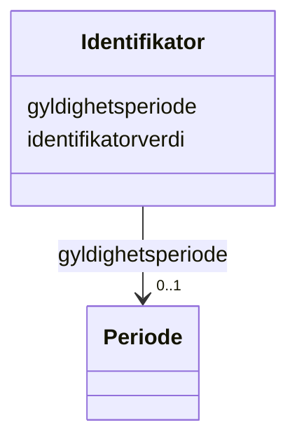

# Class: Identifikator 


_Unik identifikasjon til eit objekt._


URI: [fint:Identifikator](https://schema.fintlabs.no/Identifikator)





<!-- no inheritance hierarchy -->

## Class Properties

| Property | Value |
| --- | --- |
| Class URI | [fint:Identifikator](https://schema.fintlabs.no/Identifikator) |


## Eigenskapar


  
  

  
  


  
  

  
  


  
  

  
  


  
  
  
    
      
    
      
    
      
    
  
  
    
  

  
  
  
  
    
  


### Andre

| Namn | Kardinalitet og domene | Beskriving |
| --- | --- | --- |
| [identifikatorverdi](identifikatorverdi.md) | 1 <br/> [String](string.md) | Ein konkret kombinasjon av teikn og/eller bokstavar som utgjer ein bestemt id... |
| [gyldighetsperiode](gyldighetsperiode.md) | 0..1 <br/> [Periode](periode.md) | Periode ressursen er gyldig for |


## Usages

| used by | used in | type | used |
| ---  | --- | --- | --- |
| [Faktura](faktura.md) | [fakturanummer](fakturanummer.md) | range | [Identifikator](identifikator.md) |
| [Fakturagrunnlag](fakturagrunnlag.md) | [ordrenummer](ordrenummer.md) | range | [Identifikator](identifikator.md) |
| [Transaksjon](transaksjon.md) | [transaksjonsId](transaksjonsid.md) | range | [Identifikator](identifikator.md) |
| [Postering](postering.md) | [posteringsId](posteringsid.md) | range | [Identifikator](identifikator.md) |
| [Leverandor](leverandor.md) | [leverandornummer](leverandornummer.md) | range | [Identifikator](identifikator.md) |
| [Elev](elev.md) | [elevnummer](elevnummer.md) | range | [Identifikator](identifikator.md) |
| [Enhet](enhet.md) | [organisasjonsnummer](organisasjonsnummer.md) | range | [Identifikator](identifikator.md) |
| [Valuta](valuta.md) | [bokstavkode](bokstavkode.md) | range | [Identifikator](identifikator.md) |
| [Valuta](valuta.md) | [nummerkode](nummerkode.md) | range | [Identifikator](identifikator.md) |
| [Person](person.md) | [fodselsnummer](fodselsnummer.md) | range | [Identifikator](identifikator.md) |
| [Virksomhet](virksomhet.md) | [virksomhetsId](virksomhetsid.md) | range | [Identifikator](identifikator.md) |
| [Virksomhet](virksomhet.md) | [organisasjonsnummer](organisasjonsnummer.md) | range | [Identifikator](identifikator.md) |


## Identifier and Mapping Information


### Schema Source


* from schema: https://data.norge.no/linkml/fint-okonomi


## Mappings

| Mapping Type | Mapped Value |
| ---  | ---  |
| self | fint:Identifikator |
| native | https://schema.fintlabs.no/okonomi/:Identifikator |


## LinkML Source

<!-- TODO: investigate https://stackoverflow.com/questions/37606292/how-to-create-tabbed-code-blocks-in-mkdocs-or-sphinx -->

### Direct

<details>
```yaml
name: Identifikator
description: Unik identifikasjon til eit objekt.
from_schema: https://data.norge.no/linkml/fint-okonomi
slots:
- identifikatorverdi
- gyldighetsperiode
slot_usage:
  identifikatorverdi:
    name: identifikatorverdi
    required: true
class_uri: fint:Identifikator

```
</details>

### Induced

<details>
```yaml
name: Identifikator
description: Unik identifikasjon til eit objekt.
from_schema: https://data.norge.no/linkml/fint-okonomi
slot_usage:
  identifikatorverdi:
    name: identifikatorverdi
    required: true
attributes:
  identifikatorverdi:
    name: identifikatorverdi
    description: Ein konkret kombinasjon av teikn og/eller bokstavar som utgjer ein
      bestemt identifikator.
    from_schema: https://data.norge.no/linkml/fint-okonomi
    rank: 1000
    slot_uri: fint:identifikatorverdi
    alias: identifikatorverdi
    owner: Identifikator
    domain_of:
    - Identifikator
    range: string
    required: true
  gyldighetsperiode:
    name: gyldighetsperiode
    description: Periode ressursen er gyldig for.
    from_schema: https://data.norge.no/linkml/fint-okonomi
    rank: 1000
    slot_uri: fint:gyldighetsperiode
    alias: gyldighetsperiode
    owner: Identifikator
    domain_of:
    - Vare
    - Merverdiavgift
    - OkonomiValuta
    - Begrep
    - Identifikator
    range: Periode
    inlined: true
class_uri: fint:Identifikator

```
</details>