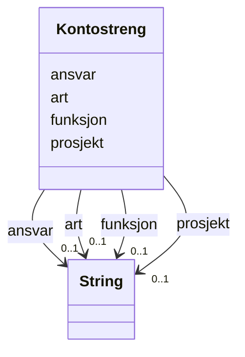

# Class: Kontostreng 


_Kontodimensjonar for ei postering (kompleks datatype)._


URI: [okn:Kontostreng](https://schema.fintlabs.no/okonomi/Kontostreng)





<!-- no inheritance hierarchy -->

## Class Properties

| Property | Value |
| --- | --- |
| Class URI | [okn:Kontostreng](https://schema.fintlabs.no/okonomi/Kontostreng) |


## Eigenskapar


  
  

  
  

  
  

  
  


  
  
    
  

  
  
    
  

  
  

  
  


### Anbefalt

| Namn | Kardinalitet og domene | Beskriving |
| --- | --- | --- |
| [art](art.md) | 0..1 <br/> [xsd:string](http://www.w3.org/2001/XMLSchema#string) | Artskonto (type utgift/inntekt) |
| [funksjon](funksjon.md) | 0..1 <br/> [xsd:string](http://www.w3.org/2001/XMLSchema#string) | Funksjonskode (KOSTRA) |


  
  

  
  

  
  
    
  

  
  
    
  


### Valgfri

| Namn | Kardinalitet og domene | Beskriving |
| --- | --- | --- |
| [ansvar](ansvar.md) | 0..1 <br/> [xsd:string](http://www.w3.org/2001/XMLSchema#string) | Ansvarsomrade |
| [prosjekt](prosjekt.md) | 0..1 <br/> [xsd:string](http://www.w3.org/2001/XMLSchema#string) | Prosjektkode |


  
  
  
    
      
    
      
    
      
    
  
  

  
  
  
    
      
    
      
    
      
    
  
  

  
  
  
    
      
    
      
    
      
    
  
  

  
  
  
    
      
    
      
    
      
    
  
  


## Usages

| used by | used in | type | used |
| ---  | --- | --- | --- |
| [Postering](postering.md) | [kontering](kontering.md) | range | [Kontostreng](kontostreng.md) |
| [Vare](vare.md) | [kontering](kontering.md) | range | [Kontostreng](kontostreng.md) |


## Identifier and Mapping Information


### Schema Source


* from schema: https://data.norge.no/linkml/fint-okonomi


## Mappings

| Mapping Type | Mapped Value |
| ---  | ---  |
| self | okn:Kontostreng |
| native | https://schema.fintlabs.no/okonomi/:Kontostreng |


## LinkML Source

<!-- TODO: investigate https://stackoverflow.com/questions/37606292/how-to-create-tabbed-code-blocks-in-mkdocs-or-sphinx -->

### Direct

<details>
```yaml
name: Kontostreng
description: Kontodimensjonar for ei postering (kompleks datatype).
from_schema: https://data.norge.no/linkml/fint-okonomi
rank: 1000
slots:
- art
- funksjon
- ansvar
- prosjekt
slot_usage:
  art:
    name: art
    in_subset:
    - Anbefalt
  funksjon:
    name: funksjon
    in_subset:
    - Anbefalt
  ansvar:
    name: ansvar
    in_subset:
    - Valgfri
  prosjekt:
    name: prosjekt
    in_subset:
    - Valgfri
class_uri: okn:Kontostreng

```
</details>

### Induced

<details>
```yaml
name: Kontostreng
description: Kontodimensjonar for ei postering (kompleks datatype).
from_schema: https://data.norge.no/linkml/fint-okonomi
rank: 1000
slot_usage:
  art:
    name: art
    in_subset:
    - Anbefalt
  funksjon:
    name: funksjon
    in_subset:
    - Anbefalt
  ansvar:
    name: ansvar
    in_subset:
    - Valgfri
  prosjekt:
    name: prosjekt
    in_subset:
    - Valgfri
attributes:
  art:
    name: art
    description: Artskonto (type utgift/inntekt).
    in_subset:
    - Anbefalt
    from_schema: https://data.norge.no/linkml/fint-okonomi
    rank: 1000
    slot_uri: okn:art
    alias: art
    owner: Kontostreng
    domain_of:
    - Kontostreng
    range: string
  funksjon:
    name: funksjon
    description: Funksjonskode (KOSTRA).
    in_subset:
    - Anbefalt
    from_schema: https://data.norge.no/linkml/fint-okonomi
    rank: 1000
    slot_uri: okn:funksjon
    alias: funksjon
    owner: Kontostreng
    domain_of:
    - Kontostreng
    range: string
  ansvar:
    name: ansvar
    description: Ansvarsomrade.
    in_subset:
    - Valgfri
    from_schema: https://data.norge.no/linkml/fint-okonomi
    rank: 1000
    slot_uri: okn:ansvar
    alias: ansvar
    owner: Kontostreng
    domain_of:
    - Kontostreng
    range: string
  prosjekt:
    name: prosjekt
    description: Prosjektkode.
    in_subset:
    - Valgfri
    from_schema: https://data.norge.no/linkml/fint-okonomi
    rank: 1000
    slot_uri: okn:prosjekt
    alias: prosjekt
    owner: Kontostreng
    domain_of:
    - Kontostreng
    range: string
class_uri: okn:Kontostreng

```
</details>