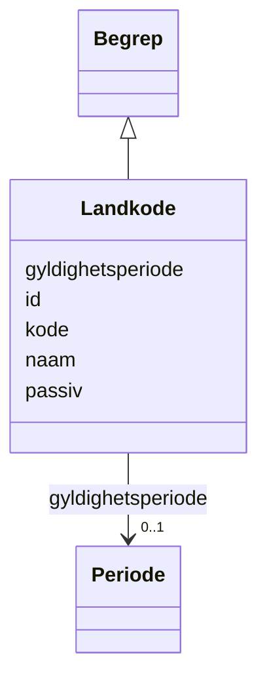

# Class: Landkode 


_Landskode i ISO 3166-1 alpha-2 format._


URI: [fint:Landkode](https://schema.fintlabs.no/Landkode)





## Inheritance
* [Begrep](begrep.md)
    * **Landkode**


## Class Properties

| Property | Value |
| --- | --- |
| Class URI | [fint:Landkode](https://schema.fintlabs.no/Landkode) |


## Eigenskapar


### Arva

| Namn | Kardinalitet og domene | Beskriving | Frå |
| --- | --- | --- | --- || [id](id.md) | 1 <br/> [Uriorcurie](uriorcurie.md) | URI-identifikator for ressursen | [Begrep](begrep.md) |
| [kode](kode.md) | 1 <br/> [String](string.md) | Verdi som identifiserer omgrepet | [Begrep](begrep.md) |
| [naam](naam.md) | 1 <br/> [String](string.md) | Namn på eining eller kodeverk-element | [Begrep](begrep.md) |
| [gyldighetsperiode](gyldighetsperiode.md) | 0..1 <br/> [Periode](periode.md) | Periode ressursen er gyldig for | [Begrep](begrep.md) |
| [passiv](passiv.md) | 0..1 <br/> [Boolean](boolean.md) | Angir at koden er passiv og ikkje kan veljast | [Begrep](begrep.md) |


## Usages

| used by | used in | type | used |
| ---  | --- | --- | --- |
| [Adresse](adresse.md) | [land](land.md) | range | [Landkode](landkode.md) |
| [Person](person.md) | [statsborgerskap](statsborgerskap.md) | range | [Landkode](landkode.md) |


## Identifier and Mapping Information


### Schema Source


* from schema: https://data.norge.no/linkml/fint-okonomi


## Mappings

| Mapping Type | Mapped Value |
| ---  | ---  |
| self | fint:Landkode |
| native | https://schema.fintlabs.no/okonomi/:Landkode |


## LinkML Source

<!-- TODO: investigate https://stackoverflow.com/questions/37606292/how-to-create-tabbed-code-blocks-in-mkdocs-or-sphinx -->

### Direct

<details>
```yaml
name: Landkode
description: Landskode i ISO 3166-1 alpha-2 format.
from_schema: https://data.norge.no/linkml/fint-okonomi
is_a: Begrep
class_uri: fint:Landkode

```
</details>

### Induced

<details>
```yaml
name: Landkode
description: Landskode i ISO 3166-1 alpha-2 format.
from_schema: https://data.norge.no/linkml/fint-okonomi
is_a: Begrep
attributes:
  id:
    name: id
    description: URI-identifikator for ressursen.
    from_schema: https://data.norge.no/linkml/fint-okonomi
    rank: 1000
    identifier: true
    alias: id
    owner: Landkode
    domain_of:
    - Faktura
    - Fakturagrunnlag
    - Fakturautsteder
    - Transaksjon
    - Postering
    - Leverandor
    - Leverandorgruppe
    - Vare
    - Merverdiavgift
    - OkonomiValuta
    - Begrep
    - Valuta
    - Person
    - Kontaktperson
    - Virksomhet
    range: uriorcurie
    required: true
  kode:
    name: kode
    description: Verdi som identifiserer omgrepet.
    in_subset:
    - Obligatorisk
    from_schema: https://data.norge.no/linkml/fint-okonomi
    rank: 1000
    slot_uri: fint:kode
    alias: kode
    owner: Landkode
    domain_of:
    - Vare
    - Merverdiavgift
    - OkonomiValuta
    - Begrep
    range: string
    required: true
  naam:
    name: naam
    description: Namn på eining eller kodeverk-element.
    in_subset:
    - Obligatorisk
    from_schema: https://data.norge.no/linkml/fint-okonomi
    rank: 1000
    slot_uri: okn:naam
    alias: naam
    owner: Landkode
    domain_of:
    - Fakturautsteder
    - Leverandorgruppe
    - Vare
    - Merverdiavgift
    - OkonomiValuta
    - Begrep
    range: string
    required: true
  gyldighetsperiode:
    name: gyldighetsperiode
    description: Periode ressursen er gyldig for.
    in_subset:
    - Valgfri
    from_schema: https://data.norge.no/linkml/fint-okonomi
    rank: 1000
    slot_uri: fint:gyldighetsperiode
    alias: gyldighetsperiode
    owner: Landkode
    domain_of:
    - Vare
    - Merverdiavgift
    - OkonomiValuta
    - Begrep
    - Identifikator
    range: Periode
    inlined: true
  passiv:
    name: passiv
    description: Angir at koden er passiv og ikkje kan veljast.
    in_subset:
    - Valgfri
    from_schema: https://data.norge.no/linkml/fint-okonomi
    rank: 1000
    slot_uri: fint:passiv
    alias: passiv
    owner: Landkode
    domain_of:
    - Vare
    - Merverdiavgift
    - OkonomiValuta
    - Begrep
    range: boolean
class_uri: fint:Landkode

```
</details>