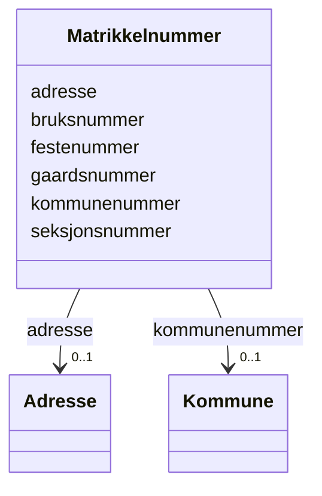

# Class: Matrikkelnummer 


_Eintydleg identifisering av matrikkeleining innanfor kommune._


URI: [fint:Matrikkelnummer](https://schema.fintlabs.no/Matrikkelnummer)





<!-- no inheritance hierarchy -->

## Class Properties

| Property | Value |
| --- | --- |
| Class URI | [fint:Matrikkelnummer](https://schema.fintlabs.no/Matrikkelnummer) |


## Eigenskapar


  
  

  
  

  
  

  
  

  
  

  
  


  
  

  
  

  
  

  
  

  
  

  
  


  
  

  
  

  
  

  
  

  
  

  
  


  
  
  
  
    
  

  
  
  
  
    
  

  
  
  
  
    
  

  
  
  
  
    
  

  
  
  
  
    
  

  
  
  
  
    
  


### Andre

| Namn | Kardinalitet og domene | Beskriving |
| --- | --- | --- |
| [adresse](adresse.md) | 0..1 <br/> [Adresse](adresse.md) | Adresse til matrikkeleining |
| [bruksnummer](bruksnummer.md) | 0..1 <br/> [String](string.md) | Fortløpande nummerering av bruk under gårdsnummer |
| [festenummer](festenummer.md) | 0..1 <br/> [String](string.md) | Fortløpande nummerering av festar under gårdsnummer/bruksnummer |
| [gaardsnummer](gaardsnummer.md) | 0..1 <br/> [String](string.md) | Nummerering av gårdseiging i matrikkelen, unik innanfor kommune |
| [seksjonsnummer](seksjonsnummer.md) | 0..1 <br/> [String](string.md) | Fortløpande nummerering av seksjonar under gårdsnummer/bruksnummer |
| [kommunenummer](kommunenummer.md) | 0..1 <br/> [Kommune](kommune.md) | Nummerering av kommunen i høve til SSB si offisielle liste |


## Identifier and Mapping Information


### Schema Source


* from schema: https://data.norge.no/linkml/fint-okonomi


## Mappings

| Mapping Type | Mapped Value |
| ---  | ---  |
| self | fint:Matrikkelnummer |
| native | https://schema.fintlabs.no/okonomi/:Matrikkelnummer |


## LinkML Source

<!-- TODO: investigate https://stackoverflow.com/questions/37606292/how-to-create-tabbed-code-blocks-in-mkdocs-or-sphinx -->

### Direct

<details>
```yaml
name: Matrikkelnummer
description: Eintydleg identifisering av matrikkeleining innanfor kommune.
from_schema: https://data.norge.no/linkml/fint-okonomi
slots:
- adresse
- bruksnummer
- festenummer
- gaardsnummer
- seksjonsnummer
- kommunenummer
class_uri: fint:Matrikkelnummer

```
</details>

### Induced

<details>
```yaml
name: Matrikkelnummer
description: Eintydleg identifisering av matrikkeleining innanfor kommune.
from_schema: https://data.norge.no/linkml/fint-okonomi
attributes:
  adresse:
    name: adresse
    description: Adresse til matrikkeleining.
    from_schema: https://data.norge.no/linkml/fint-okonomi
    rank: 1000
    slot_uri: fint:adresse
    alias: adresse
    owner: Matrikkelnummer
    domain_of:
    - Faktura
    - Matrikkelnummer
    range: Adresse
    inlined: true
  bruksnummer:
    name: bruksnummer
    description: Fortløpande nummerering av bruk under gårdsnummer.
    from_schema: https://data.norge.no/linkml/fint-okonomi
    rank: 1000
    slot_uri: fint:bruksnummer
    alias: bruksnummer
    owner: Matrikkelnummer
    domain_of:
    - Matrikkelnummer
    range: string
  festenummer:
    name: festenummer
    description: Fortløpande nummerering av festar under gårdsnummer/bruksnummer.
    from_schema: https://data.norge.no/linkml/fint-okonomi
    rank: 1000
    slot_uri: fint:festenummer
    alias: festenummer
    owner: Matrikkelnummer
    domain_of:
    - Matrikkelnummer
    range: string
  gaardsnummer:
    name: gaardsnummer
    description: Nummerering av gårdseiging i matrikkelen, unik innanfor kommune.
    from_schema: https://data.norge.no/linkml/fint-okonomi
    rank: 1000
    slot_uri: fint:gaardsnummer
    alias: gaardsnummer
    owner: Matrikkelnummer
    domain_of:
    - Matrikkelnummer
    range: string
  seksjonsnummer:
    name: seksjonsnummer
    description: Fortløpande nummerering av seksjonar under gårdsnummer/bruksnummer.
    from_schema: https://data.norge.no/linkml/fint-okonomi
    rank: 1000
    slot_uri: fint:seksjonsnummer
    alias: seksjonsnummer
    owner: Matrikkelnummer
    domain_of:
    - Matrikkelnummer
    range: string
  kommunenummer:
    name: kommunenummer
    description: Nummerering av kommunen i høve til SSB si offisielle liste.
    from_schema: https://data.norge.no/linkml/fint-okonomi
    rank: 1000
    slot_uri: fint:kommunenummer
    alias: kommunenummer
    owner: Matrikkelnummer
    domain_of:
    - Matrikkelnummer
    range: Kommune
class_uri: fint:Matrikkelnummer

```
</details>