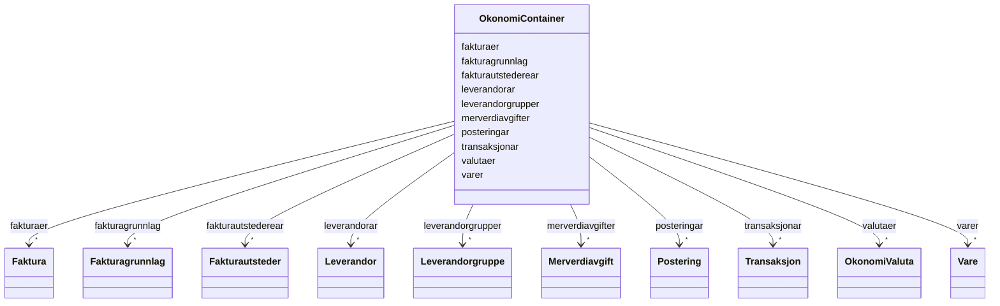

# Class: OkonomiContainer 


_Rotcontainer for FINT Økonomi-instansar._


URI: [https://schema.fintlabs.no/okonomi/:OkonomiContainer](https://schema.fintlabs.no/okonomi/:OkonomiContainer)





<!-- no inheritance hierarchy -->

## Class Properties

| Property | Value |
| --- | --- |
| Tree Root | Yes |


## Eigenskapar


  
  

  
  

  
  

  
  

  
  

  
  

  
  

  
  

  
  

  
  


  
  

  
  

  
  

  
  

  
  

  
  

  
  

  
  

  
  

  
  


  
  

  
  

  
  

  
  

  
  

  
  

  
  

  
  

  
  

  
  


  
  
  
  
    
  

  
  
  
    
      
    
      
    
      
    
  
  
    
  

  
  
  
  
    
  

  
  
  
  
    
  

  
  
  
  
    
  

  
  
  
  
    
  

  
  
  
  
    
  

  
  
  
  
    
  

  
  
  
  
    
  

  
  
  
  
    
  


### Andre

| Namn | Kardinalitet og domene | Beskriving |
| --- | --- | --- |
| [fakturaer](fakturaer.md) | * <br/> [Faktura](faktura.md) |  |
| [fakturagrunnlag](fakturagrunnlag.md) | * <br/> [Fakturagrunnlag](fakturagrunnlag.md) |  |
| [fakturautstederear](fakturautstederear.md) | * <br/> [Fakturautsteder](fakturautsteder.md) |  |
| [transaksjonar](transaksjonar.md) | * <br/> [Transaksjon](transaksjon.md) |  |
| [posteringar](posteringar.md) | * <br/> [Postering](postering.md) |  |
| [leverandorar](leverandorar.md) | * <br/> [Leverandor](leverandor.md) |  |
| [leverandorgrupper](leverandorgrupper.md) | * <br/> [Leverandorgruppe](leverandorgruppe.md) |  |
| [varer](varer.md) | * <br/> [Vare](vare.md) |  |
| [merverdiavgifter](merverdiavgifter.md) | * <br/> [Merverdiavgift](merverdiavgift.md) |  |
| [valutaer](valutaer.md) | * <br/> [OkonomiValuta](okonomivaluta.md) |  |


## Identifier and Mapping Information


### Schema Source


* from schema: https://data.norge.no/fint/fint-okonomi


## Mappings

| Mapping Type | Mapped Value |
| ---  | ---  |
| self | https://schema.fintlabs.no/okonomi/:OkonomiContainer |
| native | https://schema.fintlabs.no/okonomi/:OkonomiContainer |


## LinkML Source

<!-- TODO: investigate https://stackoverflow.com/questions/37606292/how-to-create-tabbed-code-blocks-in-mkdocs-or-sphinx -->

### Direct

<details>
```yaml
name: OkonomiContainer
description: Rotcontainer for FINT Økonomi-instansar.
from_schema: https://data.norge.no/fint/fint-okonomi
rank: 1000
slot_usage:
  fakturagrunnlag:
    name: fakturagrunnlag
    multivalued: true
    inlined_as_list: true
attributes:
  fakturaer:
    name: fakturaer
    from_schema: https://data.norge.no/fint/fint-okonomi
    rank: 1000
    domain_of:
    - OkonomiContainer
    range: Faktura
    multivalued: true
    inlined_as_list: true
  fakturagrunnlag:
    name: fakturagrunnlag
    from_schema: https://data.norge.no/fint/fint-okonomi
    domain_of:
    - OkonomiContainer
    - Faktura
    - Fakturautsteder
    range: Fakturagrunnlag
  fakturautstederear:
    name: fakturautstederear
    from_schema: https://data.norge.no/fint/fint-okonomi
    rank: 1000
    domain_of:
    - OkonomiContainer
    range: Fakturautsteder
    multivalued: true
    inlined_as_list: true
  transaksjonar:
    name: transaksjonar
    from_schema: https://data.norge.no/fint/fint-okonomi
    rank: 1000
    domain_of:
    - OkonomiContainer
    range: Transaksjon
    multivalued: true
    inlined_as_list: true
  posteringar:
    name: posteringar
    from_schema: https://data.norge.no/fint/fint-okonomi
    rank: 1000
    domain_of:
    - OkonomiContainer
    range: Postering
    multivalued: true
    inlined_as_list: true
  leverandorar:
    name: leverandorar
    from_schema: https://data.norge.no/fint/fint-okonomi
    rank: 1000
    domain_of:
    - OkonomiContainer
    range: Leverandor
    multivalued: true
    inlined_as_list: true
  leverandorgrupper:
    name: leverandorgrupper
    from_schema: https://data.norge.no/fint/fint-okonomi
    rank: 1000
    domain_of:
    - OkonomiContainer
    range: Leverandorgruppe
    multivalued: true
    inlined_as_list: true
  varer:
    name: varer
    from_schema: https://data.norge.no/fint/fint-okonomi
    rank: 1000
    domain_of:
    - OkonomiContainer
    range: Vare
    multivalued: true
    inlined_as_list: true
  merverdiavgifter:
    name: merverdiavgifter
    from_schema: https://data.norge.no/fint/fint-okonomi
    rank: 1000
    domain_of:
    - OkonomiContainer
    range: Merverdiavgift
    multivalued: true
    inlined_as_list: true
  valutaer:
    name: valutaer
    from_schema: https://data.norge.no/fint/fint-okonomi
    rank: 1000
    domain_of:
    - OkonomiContainer
    range: OkonomiValuta
    multivalued: true
    inlined_as_list: true
tree_root: true

```
</details>

### Induced

<details>
```yaml
name: OkonomiContainer
description: Rotcontainer for FINT Økonomi-instansar.
from_schema: https://data.norge.no/fint/fint-okonomi
rank: 1000
slot_usage:
  fakturagrunnlag:
    name: fakturagrunnlag
    multivalued: true
    inlined_as_list: true
attributes:
  fakturaer:
    name: fakturaer
    from_schema: https://data.norge.no/fint/fint-okonomi
    rank: 1000
    owner: OkonomiContainer
    domain_of:
    - OkonomiContainer
    range: Faktura
    multivalued: true
    inlined: true
    inlined_as_list: true
  fakturagrunnlag:
    name: fakturagrunnlag
    from_schema: https://data.norge.no/fint/fint-okonomi
    owner: OkonomiContainer
    domain_of:
    - OkonomiContainer
    - Faktura
    - Fakturautsteder
    range: Fakturagrunnlag
    multivalued: true
    inlined: true
    inlined_as_list: true
  fakturautstederear:
    name: fakturautstederear
    from_schema: https://data.norge.no/fint/fint-okonomi
    rank: 1000
    owner: OkonomiContainer
    domain_of:
    - OkonomiContainer
    range: Fakturautsteder
    multivalued: true
    inlined: true
    inlined_as_list: true
  transaksjonar:
    name: transaksjonar
    from_schema: https://data.norge.no/fint/fint-okonomi
    rank: 1000
    owner: OkonomiContainer
    domain_of:
    - OkonomiContainer
    range: Transaksjon
    multivalued: true
    inlined: true
    inlined_as_list: true
  posteringar:
    name: posteringar
    from_schema: https://data.norge.no/fint/fint-okonomi
    rank: 1000
    owner: OkonomiContainer
    domain_of:
    - OkonomiContainer
    range: Postering
    multivalued: true
    inlined: true
    inlined_as_list: true
  leverandorar:
    name: leverandorar
    from_schema: https://data.norge.no/fint/fint-okonomi
    rank: 1000
    owner: OkonomiContainer
    domain_of:
    - OkonomiContainer
    range: Leverandor
    multivalued: true
    inlined: true
    inlined_as_list: true
  leverandorgrupper:
    name: leverandorgrupper
    from_schema: https://data.norge.no/fint/fint-okonomi
    rank: 1000
    owner: OkonomiContainer
    domain_of:
    - OkonomiContainer
    range: Leverandorgruppe
    multivalued: true
    inlined: true
    inlined_as_list: true
  varer:
    name: varer
    from_schema: https://data.norge.no/fint/fint-okonomi
    rank: 1000
    owner: OkonomiContainer
    domain_of:
    - OkonomiContainer
    range: Vare
    multivalued: true
    inlined: true
    inlined_as_list: true
  merverdiavgifter:
    name: merverdiavgifter
    from_schema: https://data.norge.no/fint/fint-okonomi
    rank: 1000
    owner: OkonomiContainer
    domain_of:
    - OkonomiContainer
    range: Merverdiavgift
    multivalued: true
    inlined: true
    inlined_as_list: true
  valutaer:
    name: valutaer
    from_schema: https://data.norge.no/fint/fint-okonomi
    rank: 1000
    owner: OkonomiContainer
    domain_of:
    - OkonomiContainer
    range: OkonomiValuta
    multivalued: true
    inlined: true
    inlined_as_list: true
tree_root: true

```
</details>