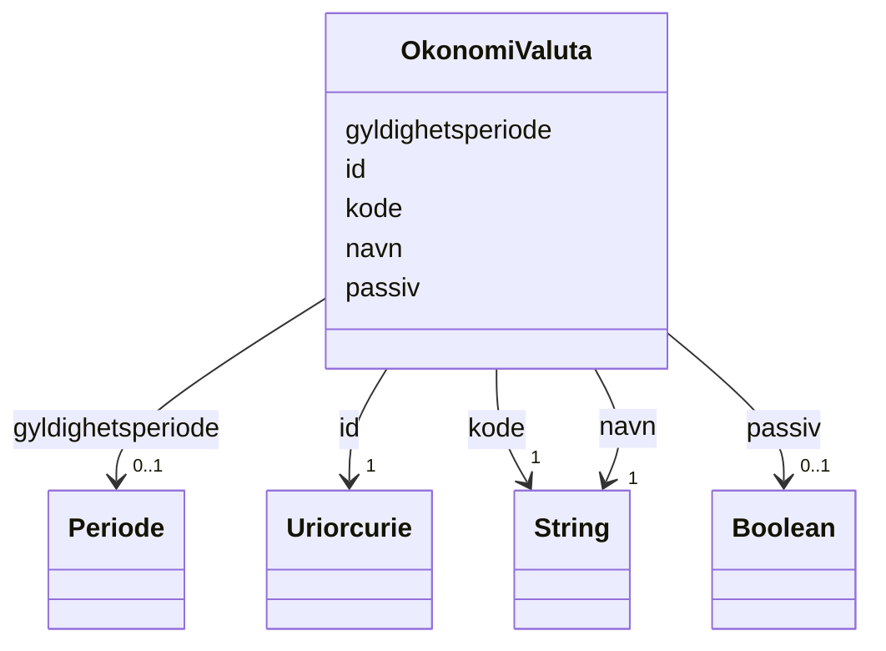

# Class: OkonomiValuta 


_Valuta for transaksjonsbeløp._


URI: [okn:Valuta](https://schema.fintlabs.no/okonomi/Valuta)





<!-- no inheritance hierarchy -->

## Class Properties

| Property | Value |
| --- | --- |
| Class URI | [okn:Valuta](https://schema.fintlabs.no/okonomi/Valuta) |


## Eigenskapar


  
  

  
  
    
  

  
  
    
  

  
  

  
  


### Obligatorisk

| Namn | Kardinalitet og domene | Beskriving |
| --- | --- | --- |
| [kode](kode.md) | 1 <br/> [xsd:string](http://www.w3.org/2001/XMLSchema#string) | Verdi som identifiserer omgrepet |
| [navn](navn.md) | 1 <br/> [xsd:string](http://www.w3.org/2001/XMLSchema#string) | Hovudnamn for ressursen |


  
  

  
  

  
  

  
  

  
  


  
  

  
  

  
  

  
  
    
  

  
  
    
  


### Valgfri

| Namn | Kardinalitet og domene | Beskriving |
| --- | --- | --- |
| [gyldighetsperiode](gyldighetsperiode.md) | 0..1 <br/> [Periode](periode.md) | Periode ressursen er gyldig for |
| [passiv](passiv.md) | 0..1 <br/> [xsd:boolean](http://www.w3.org/2001/XMLSchema#boolean) | Angir at koden er passiv og ikkje kan veljast |


  
  
  
  
    
  

  
  
  
    
      
    
      
    
      
    
  
  

  
  
  
    
      
    
      
    
      
    
  
  

  
  
  
    
      
    
      
    
      
    
  
  

  
  
  
    
      
    
      
    
      
    
  
  


### Andre

| Namn | Kardinalitet og domene | Beskriving |
| --- | --- | --- |
| [id](id.md) | 1 <br/> [xsd:anyURI](http://www.w3.org/2001/XMLSchema#anyURI) | URI-identifikator for ressursen |


## Usages

| used by | used in | type | used |
| ---  | --- | --- | --- |
| [OkonomiContainer](okonomicontainer.md) | [valutaer](valutaer.md) | range | [OkonomiValuta](okonomivaluta.md) |
| [Transaksjon](transaksjon.md) | [valuta](valuta.md) | range | [OkonomiValuta](okonomivaluta.md) |


## Identifier and Mapping Information


### Schema Source


* from schema: https://data.norge.no/fint/fint-okonomi


## Mappings

| Mapping Type | Mapped Value |
| ---  | ---  |
| self | okn:Valuta |
| native | https://schema.fintlabs.no/okonomi/:OkonomiValuta |


## LinkML Source

<!-- TODO: investigate https://stackoverflow.com/questions/37606292/how-to-create-tabbed-code-blocks-in-mkdocs-or-sphinx -->

### Direct

<details>
```yaml
name: OkonomiValuta
description: Valuta for transaksjonsbeløp.
from_schema: https://data.norge.no/fint/fint-okonomi
rank: 1000
slots:
- id
- kode
- navn
- gyldighetsperiode
- passiv
slot_usage:
  kode:
    name: kode
    in_subset:
    - Obligatorisk
    required: true
  navn:
    name: navn
    in_subset:
    - Obligatorisk
    required: true
  gyldighetsperiode:
    name: gyldighetsperiode
    in_subset:
    - Valgfri
  passiv:
    name: passiv
    in_subset:
    - Valgfri
class_uri: okn:Valuta

```
</details>

### Induced

<details>
```yaml
name: OkonomiValuta
description: Valuta for transaksjonsbeløp.
from_schema: https://data.norge.no/fint/fint-okonomi
rank: 1000
slot_usage:
  kode:
    name: kode
    in_subset:
    - Obligatorisk
    required: true
  navn:
    name: navn
    in_subset:
    - Obligatorisk
    required: true
  gyldighetsperiode:
    name: gyldighetsperiode
    in_subset:
    - Valgfri
  passiv:
    name: passiv
    in_subset:
    - Valgfri
attributes:
  id:
    name: id
    description: URI-identifikator for ressursen.
    from_schema: https://data.norge.no/fint/fint-common
    identifier: true
    owner: OkonomiValuta
    domain_of:
    - Begrep
    - Elev
    - Valuta
    - Person
    - Kontaktperson
    - Virksomhet
    - Faktura
    - Fakturagrunnlag
    - Fakturautsteder
    - Transaksjon
    - Postering
    - Leverandor
    - Leverandorgruppe
    - Vare
    - Merverdiavgift
    - OkonomiValuta
    range: uriorcurie
    required: true
  kode:
    name: kode
    description: Verdi som identifiserer omgrepet.
    in_subset:
    - Obligatorisk
    from_schema: https://data.norge.no/fint/fint-common
    slot_uri: fint:kode
    owner: OkonomiValuta
    domain_of:
    - Begrep
    - Vare
    - Merverdiavgift
    - OkonomiValuta
    range: string
    required: true
  navn:
    name: navn
    description: Hovudnamn for ressursen.
    in_subset:
    - Obligatorisk
    from_schema: https://data.norge.no/fint/fint-common
    slot_uri: fint:navn
    owner: OkonomiValuta
    domain_of:
    - Begrep
    - Fakturautsteder
    - Leverandorgruppe
    - Vare
    - Merverdiavgift
    - OkonomiValuta
    range: string
    required: true
  gyldighetsperiode:
    name: gyldighetsperiode
    description: Periode ressursen er gyldig for.
    in_subset:
    - Valgfri
    from_schema: https://data.norge.no/fint/fint-common
    slot_uri: fint:gyldighetsperiode
    owner: OkonomiValuta
    domain_of:
    - Begrep
    - Identifikator
    - Vare
    - Merverdiavgift
    - OkonomiValuta
    range: Periode
    inlined: true
  passiv:
    name: passiv
    description: Angir at koden er passiv og ikkje kan veljast.
    in_subset:
    - Valgfri
    from_schema: https://data.norge.no/fint/fint-common
    slot_uri: fint:passiv
    owner: OkonomiValuta
    domain_of:
    - Begrep
    - Vare
    - Merverdiavgift
    - OkonomiValuta
    range: boolean
class_uri: okn:Valuta

```
</details>