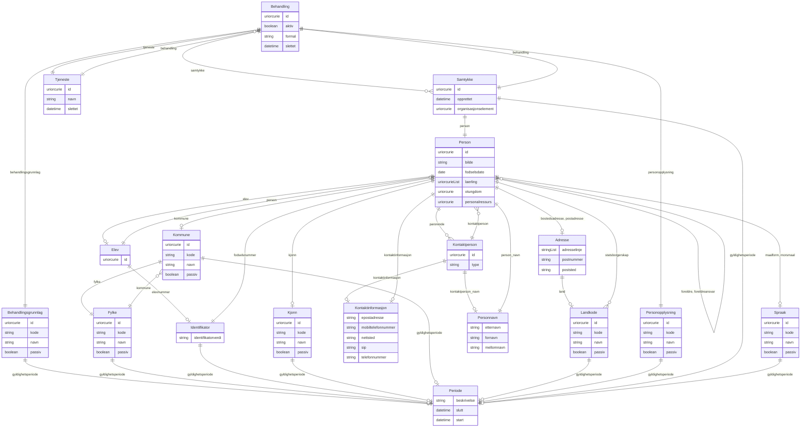

```mermaid
erDiagram
Adresse {
    stringList adresselinje  
    string postnummer  
    string poststed  
}
Behandling {
    uriorcurie id  
    boolean aktiv  
    string formal  
    datetime slettet  
}
Behandlingsgrunnlag {
    uriorcurie id  
    string kode  
    string navn  
    boolean passiv  
}
Elev {
    uriorcurie id  
}
Fylke {
    uriorcurie id  
    string kode  
    string navn  
    boolean passiv  
}
Identifikator {
    string identifikatorverdi  
}
Kjonn {
    uriorcurie id  
    string kode  
    string navn  
    boolean passiv  
}
Kommune {
    uriorcurie id  
    string kode  
    string navn  
    boolean passiv  
}
Kontaktinformasjon {
    string epostadresse  
    string mobiltelefonnummer  
    string nettsted  
    string sip  
    string telefonnummer  
}
Kontaktperson {
    uriorcurie id  
    string type  
}
Landkode {
    uriorcurie id  
    string kode  
    string navn  
    boolean passiv  
}
Periode {
    string beskrivelse  
    datetime slutt  
    datetime start  
}
Person {
    uriorcurie id  
    string bilde  
    date fodselsdato  
    uriorcurieList laerling  
    uriorcurie otungdom  
    uriorcurie personalressurs  
}
Personnavn {
    string etternavn  
    string fornavn  
    string mellomnavn  
}
Personopplysning {
    uriorcurie id  
    string kode  
    string navn  
    boolean passiv  
}
Samtykke {
    uriorcurie id  
    datetime opprettet  
    uriorcurie organisasjonselement  
}
Spraak {
    uriorcurie id  
    string kode  
    string navn  
    boolean passiv  
}
Tjeneste {
    uriorcurie id  
    string navn  
    datetime slettet  
}

Adresse ||--|o Landkode : "land"
Behandling ||--|| Behandlingsgrunnlag : "behandlingsgrunnlag"
Behandling ||--|| Personopplysning : "personopplysning"
Behandling ||--|| Tjeneste : "tjeneste"
Behandling ||--}o Samtykke : "samtykke"
Behandlingsgrunnlag ||--|o Periode : "gyldighetsperiode"
Elev ||--|o Identifikator : "elevnummer"
Elev ||--|o Person : "person"
Fylke ||--|o Periode : "gyldighetsperiode"
Fylke ||--}o Kommune : "kommune"
Identifikator ||--|o Periode : "gyldighetsperiode"
Kjonn ||--|o Periode : "gyldighetsperiode"
Kommune ||--|o Periode : "gyldighetsperiode"
Kommune ||--|| Fylke : "fylke"
Kontaktperson ||--|o Kontaktinformasjon : "kontaktinformasjon"
Kontaktperson ||--|o Personnavn : "kontaktperson_navn"
Kontaktperson ||--}o Person : "kontaktperson"
Landkode ||--|o Periode : "gyldighetsperiode"
Person ||--|o Adresse : "bostedsadresse, postadresse"
Person ||--|o Elev : "elev"
Person ||--|o Kjonn : "kjonn"
Person ||--|o Kommune : "kommune"
Person ||--|o Kontaktinformasjon : "kontaktinformasjon"
Person ||--|o Spraak : "maalform, morsmaal"
Person ||--|| Identifikator : "fodselsnummer"
Person ||--|| Personnavn : "person_navn"
Person ||--}o Kontaktperson : "parorende"
Person ||--}o Landkode : "statsborgerskap"
Person ||--}o Person : "foreldre, foreldreansvar"
Personopplysning ||--|o Periode : "gyldighetsperiode"
Samtykke ||--|| Behandling : "behandling"
Samtykke ||--|| Periode : "gyldighetsperiode"
Samtykke ||--|| Person : "person"
Spraak ||--|o Periode : "gyldighetsperiode"
Tjeneste ||--}o Behandling : "behandling"

```

