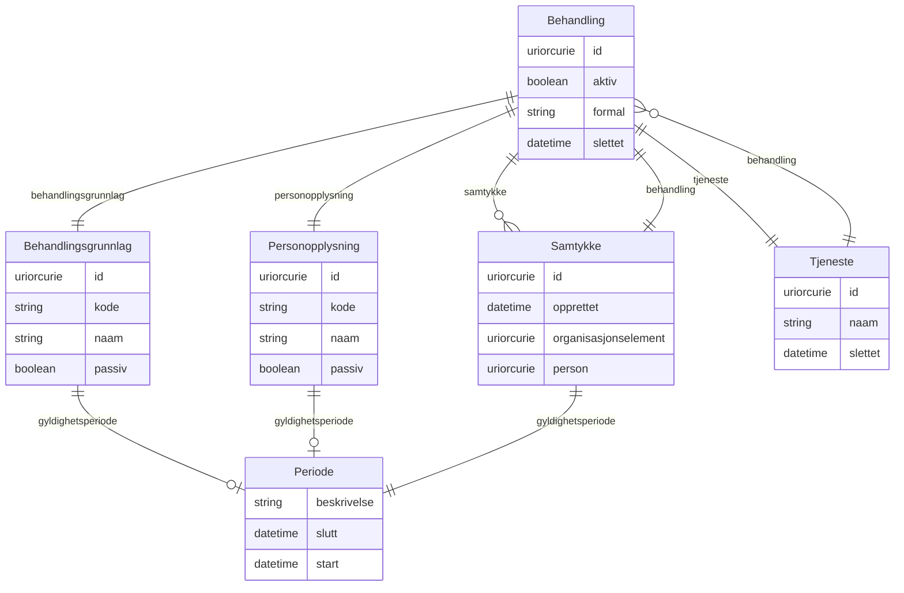

```mermaid
erDiagram
Behandling {
    uriorcurie id  
    boolean aktiv  
    string formal  
    datetime slettet  
}
Behandlingsgrunnlag {
    uriorcurie id  
    string kode  
    string naam  
    boolean passiv  
}
Periode {
    string beskrivelse  
    datetime slutt  
    datetime start  
}
Personopplysning {
    uriorcurie id  
    string kode  
    string naam  
    boolean passiv  
}
Samtykke {
    uriorcurie id  
    datetime opprettet  
    uriorcurie organisasjonselement  
    uriorcurie person  
}
Tjeneste {
    uriorcurie id  
    string naam  
    datetime slettet  
}

Behandling ||--|| Behandlingsgrunnlag : "behandlingsgrunnlag"
Behandling ||--|| Personopplysning : "personopplysning"
Behandling ||--|| Tjeneste : "tjeneste"
Behandling ||--}o Samtykke : "samtykke"
Behandlingsgrunnlag ||--|o Periode : "gyldighetsperiode"
Personopplysning ||--|o Periode : "gyldighetsperiode"
Samtykke ||--|| Behandling : "behandling"
Samtykke ||--|| Periode : "gyldighetsperiode"
Tjeneste ||--}o Behandling : "behandling"

```

