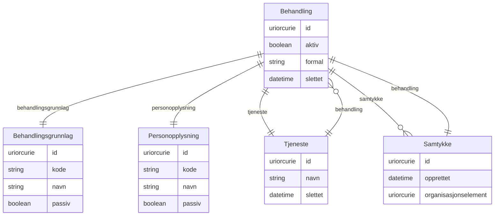

```mermaid
erDiagram
Behandling {
    uriorcurie id  
    boolean aktiv  
    string formal  
    datetime slettet  
}
Behandlingsgrunnlag {
    uriorcurie id  
    string kode  
    string navn  
    boolean passiv  
}
Personopplysning {
    uriorcurie id  
    string kode  
    string navn  
    boolean passiv  
}
Samtykke {
    uriorcurie id  
    datetime opprettet  
    uriorcurie organisasjonselement  
}
Tjeneste {
    uriorcurie id  
    string navn  
    datetime slettet  
}

Behandling ||--|| Behandlingsgrunnlag : "behandlingsgrunnlag"
Behandling ||--|| Personopplysning : "personopplysning"
Behandling ||--|| Tjeneste : "tjeneste"
Behandling ||--}o Samtykke : "samtykke"
Samtykke ||--|| Behandling : "behandling"
Tjeneste ||--}o Behandling : "behandling"


```
